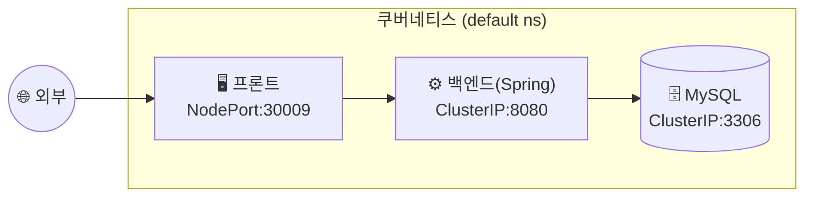

## 📌 들어가며

이번 글에서는 VM 기반 쿠버네티스 클러스터에 **3-tier 웹 애플리케이션**(프론트엔드·백엔드·DB)을 배포한다. **kompose**로 Docker Compose를 쿠버네티스 YAML로 변환하고, 서비스 타입을 계층별로 다르게 주어 외부 노출과 내부 통신을 구분한다.

> **3-tier 구성 전략** — 프론트만 외부에 노출(NodePort)하고, 백엔드·DB는 내부 전용(ClusterIP)으로 감춘다. 외부 → 프론트 → 백엔드 → DB로 이어지는 단방향 계층 구조를 서비스 타입으로 구현한다.

---

## 1. 프로젝트 시나리오



| 계층 | 서비스 타입 | 노출 |
|------|-------------|------|
| **프론트엔드** | NodePort | 외부 접속 |
| **백엔드(Spring Boot)** | ClusterIP | 프론트만 접근 |
| **데이터베이스(MySQL)** | ClusterIP | 백엔드만 접근 |

---

## 2. kompose로 Compose → 쿠버네티스 변환

**kompose**는 Docker Compose 파일을 쿠버네티스 리소스로 변환하는 도구다.

```bash
# 설치
curl -L https://github.com/kubernetes/kompose/releases/download/v1.31.2/kompose-linux-amd64 -o kompose
chmod +x kompose && sudo mv ./kompose /usr/local/bin/kompose

# 변환
cd ~/LABs/3tier
kompose convert
```

변환 결과로 각 계층의 `*-service.yaml`·`*-deployment.yaml`이 생성된다(네트워크 폴리시 파일은 삭제).

> 💡 **kompose는 마이그레이션 출발점**이다. Compose를 완벽하게 옮겨주진 않으므로, 서비스 타입(NodePort 등)·환경 변수 같은 세부 사항은 변환 후 **직접 다듬어야** 한다.

---

## 3. YAML 수정 — 계층별 서비스

### 프론트엔드 (NodePort)

```yaml
apiVersion: v1
kind: Service
metadata:
  name: mydiary-front
spec:
  type: NodePort
  ports:
    - name: "3000"
      port: 3000
      targetPort: 3000
      nodePort: 30009
  selector:
    app: mydiary-front
```

### 백엔드 (ClusterIP + DB 연결)

```yaml
apiVersion: apps/v1
kind: Deployment
metadata:
  name: mydiary-back
spec:
  replicas: 1
  selector:
    matchLabels:
      app: mydiary-back
  template:
    metadata:
      labels:
        app: mydiary-back
    spec:
      containers:
        - name: mydiary-back
          image: dbgurum/mydiary-back:1.0
          env:
            - name: SPRING_DATASOURCE_URL
              value: jdbc:mysql://mydiary-db:3306/paperdb?serverTimezone=Asia/Seoul
            - name: SPRING_DATASOURCE_USERNAME
              value: user
            - name: SPRING_DATASOURCE_PASSWORD
              value: pass123
```

> 💡 백엔드의 DB 접속 주소가 `jdbc:mysql://mydiary-db:3306`인 점이 핵심이다. **`mydiary-db`는 DB 서비스 이름**이고, 쿠버네티스 DNS가 이를 ClusterIP로 해석한다. IP가 아니라 서비스 이름으로 연결하므로 파드가 재생성돼도 안전하다.

### 데이터베이스 (ClusterIP)

```yaml
apiVersion: apps/v1
kind: Deployment
metadata:
  name: mydiary-db
spec:
  replicas: 1
  selector:
    matchLabels:
      app: mydiary-db
  template:
    metadata:
      labels:
        app: mydiary-db
    spec:
      containers:
        - name: mydiary-db
          image: mysql:5.7-debian
          env:
            - name: MYSQL_ROOT_PASSWORD
              value: pass123
            - name: MYSQL_DATABASE
              value: paperdb
```

---

## 4. 배포 & 확인

```bash
# 전체 적용
kubectl apply -f ~/LABs/3tier/

# 상태 확인 (약 1분 후 모두 Running)
kubectl get deploy,po,svc -o wide | grep mydiary

# 백엔드 로그
kubectl logs -f mydiary-back-xxxxx

# 프론트 접속: http://192.168.56.101:30009/

# DB 데이터 확인
kubectl exec -it mydiary-db-xxxxx -- bash
mysql -uroot -p
```

```sql
use paperdb;
select * from paper;
```

> ⚠️ 백엔드(Spring Boot)는 기동에 시간이 걸린다. 배포 직후 `Running`이 아니어도 **약 1분간 기다린 뒤** 상태를 다시 확인하자. DB가 먼저 떠 있어야 백엔드가 정상 연결된다.

---

## 📝 정리

```
3-tier 배포(VM)
├─ 변환   kompose로 Compose → k8s YAML
├─ 계층   프론트(NodePort) / 백엔드·DB(ClusterIP)
├─ 연결   서비스 이름(mydiary-db)으로 DNS 통신
└─ 배포   kubectl apply -f 디렉터리
```

| 개념 | 한 줄 정의 |
|------|------|
| **kompose** | Compose → k8s 변환 도구 |
| **NodePort/ClusterIP** | 외부 노출/내부 전용 |
| **서비스 이름 통신** | DNS로 파드 연결 |

3-tier 배포의 핵심은 **서비스 타입으로 노출 범위를 계층화**하는 것이다. 프론트만 NodePort로 열고 백엔드·DB는 ClusterIP로 숨기며, 계층 간 연결은 서비스 이름(DNS)으로 잇는다.
