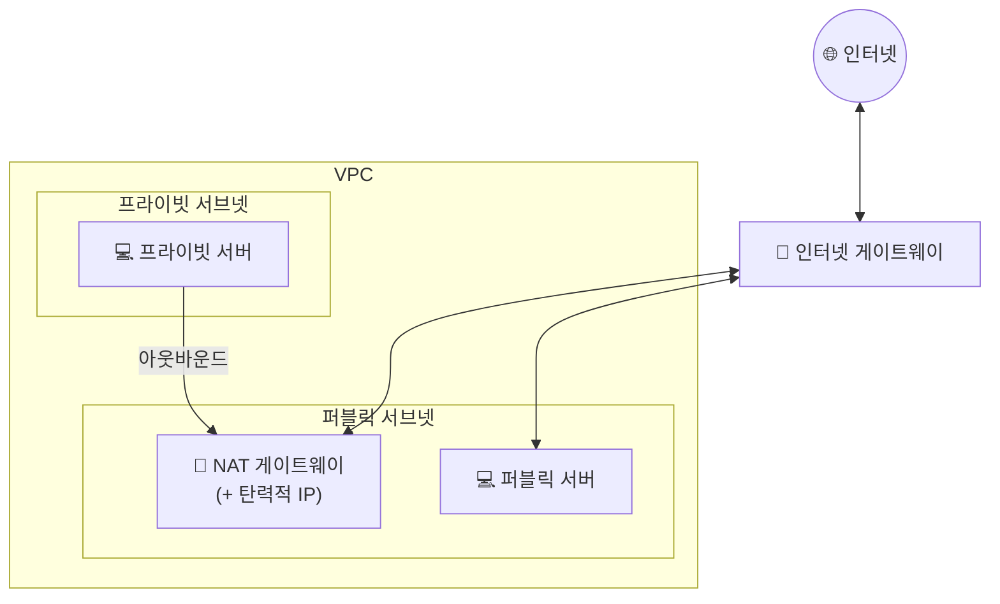

## 📌 들어가며

이번 글에서는 AWS의 **VPC(Virtual Private Cloud)**와 그 구성 요소(서브넷·IGW·NAT GW·EIP)를 정리한다. 퍼블릭/프라이빗 서브넷의 차이, 그리고 프라이빗 서버가 어떻게 외부와 통신하는지가 핵심이다.

> **VPC란?** AWS 클라우드의 **가상 네트워크 서비스**. 다른 VPC와 **완전히 격리된 독립 네트워크**로, 리전마다 독립적으로 운영된다. 필요한 IP 대역을 **CIDR**로 설정한다(예: `10.0.0.0/16` → 65,536개 IP).


> 💡 CIDR 계산이 헷갈릴 땐 [CIDR 계산기](https://www.ipaddressguide.com/cidr)를 쓰면 서브넷 범위를 쉽게 구할 수 있다.

---

## 1. VPC와 가용 영역

VPC는 **단일 리전**에 속하지만, 그 안의 서브넷은 **여러 가용 영역(AZ)**에 걸쳐 배치할 수 있다.


| 특성 | 설명 |
|------|------|
| 격리 | 다른 VPC와 **논리적으로 격리** |
| 소유 | 사용자 AWS 계정 **전용** |
| 범위 | 단일 리전, 여러 AZ에 걸쳐 구현 가능 |

---

## 2. 서브넷 — 퍼블릭 vs 프라이빗

**서브넷**은 VPC의 네트워크를 **서브네팅**해서 나눈 영역이다. 외부 통신 가능 여부로 퍼블릭/프라이빗을 나눈다.

```
10.0.0.0/16 (65,536)
├─ /24 = 256개
└─ /20 = 4,094개
```

| 구분 | **퍼블릭 서브넷** | **프라이빗 서브넷** |
|------|-------------------|---------------------|
| 외부 통신 | **직접 가능** | **직접 불가** |
| 용도 | 외부 접속이 필요한 서버 | 보안이 중요한 내부 서버 |
| 예 | 웹 서버, Bastion | DB, WAS |


---

## 3. IGW·NAT GW — 외부 통신의 두 경로

퍼블릭 서브넷은 **IGW**로, 프라이빗 서브넷은 **NAT GW**를 거쳐 외부와 통신한다.



| 게이트웨이 | 역할 | 대상 |
|------|------|------|
| **IGW(인터넷 게이트웨이)** | VPC ↔ 인터넷 통신 지원 | 퍼블릭 서브넷 |
| **NAT GW** | 프라이빗 IP → 퍼블릭 IP 변환(아웃바운드) | 프라이빗 서브넷 |

- **라우팅 테이블**: 서브넷의 아웃바운드 트래픽을 어디로 보낼지 정한다. **IGW로 향하는 경로가 있어야** 서브넷 서버가 외부 통신을 할 수 있다.
- **NAT GW 동작**: 프라이빗 서버(`10.0.20.40`)는 그대로는 외부와 통신 못 한다. NAT GW를 통과하며 **퍼블릭 IP로 변환**된 뒤 IGW를 거쳐 인터넷에 닿는다.


> ⚠️ **NAT GW는 프리 티어가 아니다.** 2024년 10월 서울 리전 기준 **시간당 $0.059**가 부과된다. 실습 후에는 반드시 삭제하자.


---

## 4. 탄력적 IP(EIP)

**탄력적 IP**는 인터넷에서 연결 가능한 **고정 퍼블릭 IPv4 주소**다. 퍼블릭 서브넷 인스턴스라도 퍼블릭 IP가 없으면 외부 접속이 안 되므로, EIP를 연결해 통신을 활성화한다.

> 💡 **NAT GW에 EIP 할당은 사실상 필수 관례다.** 프라이빗 인스턴스가 외부 서비스와 연결될 때, 상대 쪽은 **NAT GW의 고정 IP를 기준으로 접근 제어**를 한다. 그래서 현업에서는 NAT GW에 탄력적 IP를 기본처럼 붙인다.


> ⚠️ 탄력적 IP도 프리 티어가 아니다(2023년 12월 기준 시간당 $0.005). 미사용 EIP에도 과금되니 주의.

---

## 5. Default VPC vs 사용자 정의 VPC

| 구분 | **Default VPC** | **사용자 정의 VPC** |
|------|-----------------|---------------------|
| CIDR | `172.31.0.0/16` | 직접 지정(예: `10.0.0.0/16`) |
| 서브넷/IGW/라우팅 | **자동 구성** | **모두 직접 생성** |
| 용도 | 빠른 시작 | 서비스 목적에 맞는 설계 |

Default VPC는 서브넷·IGW·라우팅 테이블이 모두 세팅되어 바로 서버를 띄울 수 있다. 반면 사용자 정의 VPC는 네트워크 리소스를 **직접 구성**해야 하지만, 서비스 규모·보안 요구에 맞게 자유롭게 설계할 수 있다.

---

## 📝 정리

```
VPC
├─ 개념   격리된 가상 네트워크(리전당, CIDR 지정)
├─ 서브넷 퍼블릭(외부 O) / 프라이빗(외부 X)
├─ 통신   퍼블릭=IGW, 프라이빗=NAT GW(아웃바운드)
├─ EIP    고정 퍼블릭 IP(NAT GW에 관례적 할당)
└─ 종류   Default(자동) / 사용자 정의(직접 구성)
```

| 개념 | 한 줄 정의 |
|------|------|
| **VPC** | 격리된 가상 네트워크 |
| **IGW / NAT GW** | 퍼블릭 / 프라이빗의 외부 통신 관문 |
| **탄력적 IP** | 고정 퍼블릭 IPv4 |

VPC 설계의 핵심은 **서브넷을 퍼블릭/프라이빗으로 나누고, 외부 통신 경로(IGW·NAT GW)를 올바르게 연결**하는 것이다. 특히 NAT GW와 EIP는 과금 대상이니 실습 후 정리를 잊지 말자.
