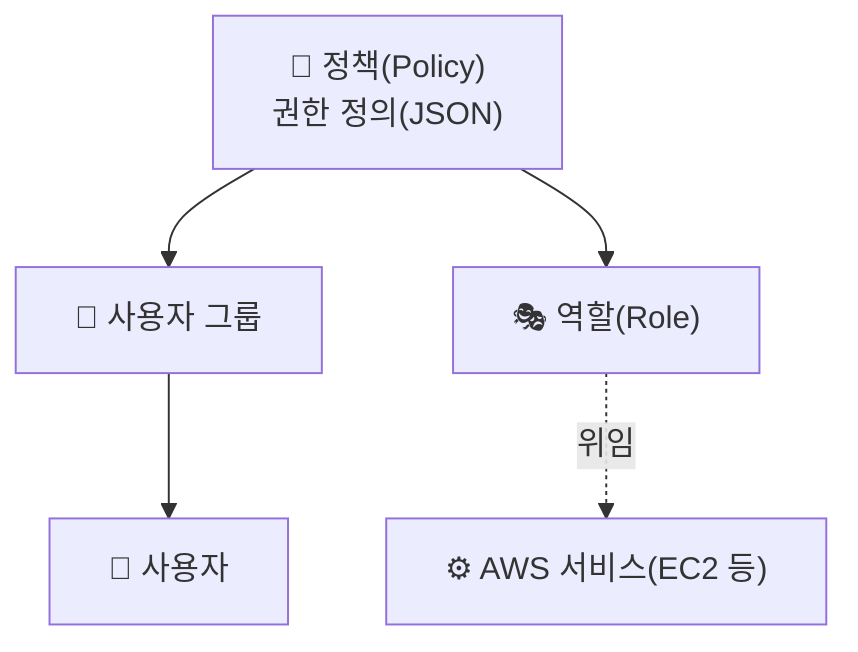

## 📌 들어가며

이번 글에서는 AWS의 **IAM(Identity and Access Management)**을 정리한다. **누가(사용자)** AWS 리소스에 **무엇을(권한)** 할 수 있는지를 관리하는 서비스로, 사용자·그룹·정책·역할의 관계와 실습(Lab)까지 다룬다.

> **IAM이란?** AWS 리소스에 대한 액세스를 **안전하게 제어**하는 웹 서비스. **인증(로그인)**과 **권한 부여(무엇을 할 수 있는가)**를 관리하며, AWS 계정에 **무료로 제공**된다.


---

## 1. 왜 IAM이 필요한가 — root 공유의 위험

모든 담당자가 **root 계정을 공유**하면 심각한 문제가 생긴다.


> ⚠️ **root 계정 공유의 위험**
> - 개발자가 실수로 **운영 플랫폼을 삭제**할 수 있다.
> - QA가 운영 장비에 테스트해 **서비스가 중단**될 수 있다.
> - 문제 발생 시 **누가 무엇을 했는지 추적 불가** → 책임 소재 불명.

그래서 역할에 맞는 **개별 IAM 사용자**를 만들고, 필요한 권한만 부여한다.

---

## 2. IAM 4대 구성 요소

IAM은 **정책(권한)을 그룹/사용자/역할에 연결**하는 구조다.



| 구성 요소 | 설명 |
|------|------|
| **사용자 그룹** | 사용자들의 집합(권한을 한 번에 관리). 한 사용자는 여러 그룹 소속 가능, **그룹은 그룹을 포함 못 함** |
| **사용자** | 서비스 접속 권한을 가진 개별 자격 증명(독립/그룹 종속) |
| **정책(Policy)** | 서비스를 어떻게 조작할지 허가/금지하는 **JSON 정의**(예: `AmazonVPCFullAccess`) |
| **역할(Role)** | **특정 권한이 있는 자격 증명**을 임시로 **위임**(서비스·다른 계정이 수임) |

> 💡 **권한 결정 원칙 — 기본은 암시적 거부(Deny).** 명시적으로 허용(Allow)하지 않은 모든 권한은 거부된다. 그리고 명시적 거부는 어떤 허용보다 우선한다. 항상 **최소 권한 원칙(least privilege)**을 따르는 것이 모범 사례다.


---

## 3. 역할(Role)의 대표 사용 예

> **시나리오** EC2에서 실행되는 애플리케이션이 **S3 버킷 접근 권한**이 필요하다.

액세스 키를 코드에 박는 대신 **역할을 수임**시키는 것이 안전하다.

```
① S3 접근 권한을 부여하는 IAM 정책 정의
② 정책을 역할(Role)에 연결
③ EC2 인스턴스가 이 역할을 수임(assume) 하도록 허용
   → EC2 앱이 키 없이 S3 접근
```


> 출처: [원본 링크](https://img1.daumcdn.net/thumb/R1280x0/?scode=mtistory2&fname=https%3A%2F%2Fblog.kakaocdn.net%2Fdn%2FMcrXT%2FbtrG8QBZNHn%2FYoLyWxw661PXRUksqKPoGk%2Fimg.png)

---

## 4. Lab — 사용자·그룹·권한·역할 실습

사용자(user1, user2)를 만들어 그룹에 소속시키고 권한을 검증한다.


| Task | 내용 |
|------|------|
| **Task1** | 사용자 생성(콘솔 액세스·패스워드) + 그룹(`Data-Support`, `Cloud-Admin`) 생성. `Cloud-Admin`에 EC2 `Describe*`·`StartInstances*`·`StopInstances*` 커스텀 정책(`cloud-admin-policy`) 부여 |
| **Task2** | 테스트 리소스 생성(S3 버킷, EC2 인스턴스) |
| **Task3** | Eli 로그인 → S3 읽기/쓰기, EC2 생성 가능 여부 확인 |
| **Task4** | David → **읽기 전용** EC2 접속 여부 확인 |
| **Task5** | Noah → EC2 **start/stop** 가능 여부 확인 |


> 💡 이 실습의 핵심은 **사용자마다 다른 정책이 실제 동작에 어떻게 반영되는지** 확인하는 것이다. David는 읽기만, Noah는 start/stop만 되는 식으로, 권한에 따라 할 수 있는 작업이 정확히 갈린다. 실습 후에는 S3·EC2 리소스를 삭제해 과금을 막는다.

---

## 📝 정리

```
IAM
├─ 필요성  root 공유 위험(삭제 사고·추적 불가) → 개별 사용자
├─ 구성    그룹 / 사용자 / 정책(JSON) / 역할(위임)
├─ 원칙    기본 암시적 거부 + 최소 권한
└─ 역할    EC2가 역할 수임 → 키 없이 S3 접근
```

| 개념 | 한 줄 정의 |
|------|------|
| **정책(Policy)** | 권한을 정의하는 JSON |
| **그룹** | 권한을 상속시키는 사용자 묶음 |
| **역할(Role)** | 임시로 위임되는 권한 |

IAM의 핵심은 **root를 나눠 개별 사용자에게 최소 권한만 부여**하고, 서비스 간 접근은 **키 대신 역할 위임**으로 처리하는 것이다. 이 구조가 감사(추적)와 보안의 기본을 만든다.
