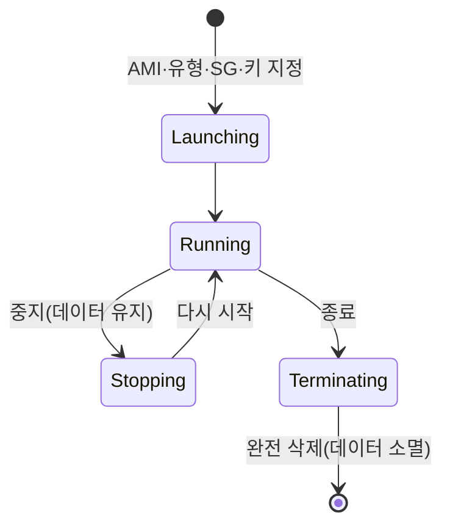

## 📌 들어가며

이번 글에서는 AWS의 **EC2(Elastic Compute Cloud)**를 구성 정보 중심으로 정리한다. 인스턴스 유형·비용 지불 방식·AMI·키페어·스토리지 등 EC2를 만들 때 결정해야 할 요소들을 살펴본 뒤, **EC2를 생성·확장하는 Lab**을 진행한다.

> **EC2란?** 클라우드에서 쓰는 **가상 서버(가상 머신)**. 애플리케이션에 맞는 하드웨어 리소스(CPU·메모리·네트워크·스토리지)를 설정할 수 있고, 필요에 따라 **탄력적(Elastic)으로 크기를 늘리거나 줄일 수** 있다.

---

## 1. 인스턴스 유형 & 표기법

인스턴스 유형에 따라 메모리·CPU·스토리지·네트워크 성능이 결정된다.

| 유형 | 특징 |
|------|------|
| **범용** | 컴퓨팅·메모리·네트워크 균형 |
| **컴퓨팅 최적화** | 고성능 프로세서(연산 집약) |
| **메모리 최적화** | 대규모 데이터 인메모리 처리 |
| **스토리지 최적화** | 대용량 로컬 스토리지 |
| **가속화 컴퓨팅** | GPU/FPGA(그래픽·HPC) |


**표기법 예 — `c7g.large`**: `c`(패밀리, 컴퓨팅 최적화) + `7`(세대) + `g`(프로세서) + `large`(크기).


---

## 2. 버스터블(T계열)과 CPU 크레딧

**T계열(t2/t3)**은 평소 낮은 기준 사용률을 유지하다가, 필요할 때 **CPU 크레딧**을 써서 성능을 순간 확장(burst)한다.

| 상태 | 크레딧 |
|------|------|
| CPU < 기준 | 크레딧 **적립**(획득) |
| CPU = 기준 | 적립 = 소비 |
| CPU > 기준 | 크레딧 **소비** |

| 인스턴스 | 시간당 크레딧 | vCPU | vCPU당 기준 |
|------|:---:|:---:|:---:|
| `t2.nano` | 3 | 1 | 5% |
| `t2.micro` | 6 | 1 | 10% |
| `t2.small` | 12 | 1 | 20% |
| `t3.nano` | 6 | 2 | 5% |

> ⚠️ **현업 운영 환경에서는 T계열을 지양한다.** 크레딧이 소진되면 성능이 급락하거나 최악의 경우 서비스가 멈출 수 있기 때문이다. **개발·검증은 T계열**, **운영은 M/C 계열** 등 크레딧 제약이 없는 타입을 쓴다.

---

## 3. 비용 지불 방식 & 과금 요소

| 방식 | 특징 | 적합 |
|------|------|------|
| **온디맨드** | 초 단위 종량제, 가장 유연 | 단기·불규칙 워크로드 |
| **리저브드** | 1~3년 약정, 최대 **75%** 할인 | 안정적·예측 가능 |
| **스팟** | 입찰 구매, 최대 **90%** 할인 (중단 가능) | 배치·테스트 |

**과금 3요소**: ① Running Hour(사용 시간) ② Data Transfer(전송량) ③ Storage(EBS 볼륨).

---

## 4. EC2 구성 요소

| 요소 | 설명 |
|------|------|
| **AMI** | 인스턴스의 SW 구성 템플릿(Quickstart/내 AMI/Marketplace/커뮤니티) |
| **보안 그룹** | 인바운드·아웃바운드 제어 가상 방화벽 |
| **키 페어** | 패스워드 대신 **공개키/개인키**로 로그인(AWS=공개키, 사용자=개인키) |
| **탄력적 IP** | 고정 퍼블릭 IPv4(자동 할당 퍼블릭 IP는 중지 시 사라짐) |
| **스토리지(EBS)** | 로컬 블록 스토리지(**gp3**가 gp2보다 저렴·고성능) |
| **사용자 데이터** | 부팅 시 root 권한 1회 실행 스크립트 |


> 💡 **커뮤니티 AMI는 신중히** 선택하자. 외부 개인·조직이 만든 공개 AMI라 일부는 보안 위험이 있을 수 있다. 키 페어의 **개인 키(.pem)**는 최초 다운로드 시에만 받을 수 있으니 잘 보관해야 한다.

---

## 5. EC2 인스턴스 생명주기



| 상태 | 데이터 |
|------|------|
| **중지(Stop)** | 유지(다시 시작 가능) |
| **종료(Terminate)** | **영구 삭제** |

---

## 6. Lab — EC2 생성 & 확장

| Task | 내용 |
|------|------|
| **Task1~2** | VPC(`lab-vpc`) + 보안 그룹 `web-sg`(인바운드 SSH 22 ← 내 IP) |
| **Task3** | EC2 `web` 생성 (Amazon Linux 2, t2.micro, 퍼블릭 IP 활성, 종료 방지, 사용자 데이터로 httpd) |
| **Task4** | 접속·모니터링(세부 모니터링=1분 간격, 스크린샷·시스템 로그) |
| **Task5** | 보안 그룹에 **HTTP 80 ← anywhere** 추가 → 브라우저 접속 확인 |
| **Task6** | 인스턴스 유형·EBS 크기 변경(스케일 업) |
| **Task7** | 종료 방지 해제 → 삭제 |

**Task3 사용자 데이터:**

```bash
#!/bin/bash
yum install httpd -y
systemctl enable --now httpd
echo '<html><h1>Hello From Your Web Server!</h1></html>' > /var/www/html/index.html
```


> ⚠️ **프리 티어 주의** — 인스턴스·AMI는 프리 티어 지원 종류가 정해져 있고, EBS·RDS는 무료 용량 한도가 있다. 한도를 넘으면 과금되므로, 실습 후 인스턴스·보안 그룹을 정리하자.

---

## 📝 정리

```
EC2 구성 요소
├─ 유형   범용/컴퓨팅/메모리/스토리지/가속(+표기법)
├─ 비용   온디맨드 / 리저브드(75%↓) / 스팟(90%↓)
├─ 구성   AMI·보안그룹·키페어·EIP·EBS·사용자데이터
├─ 크레딧 T계열은 버스트(운영엔 지양)
└─ 수명   중지(유지) vs 종료(삭제)
```

| 개념 | 한 줄 정의 |
|------|------|
| **EC2** | 클라우드 가상 서버 |
| **CPU 크레딧** | T계열의 버스트 연료 |
| **리저브드/스팟** | 약정/입찰 할인 |

EC2를 잘 쓰려면 **워크로드에 맞는 유형·과금 방식**을 고르는 것이 핵심이다. 특히 **운영 환경에서 T계열을 피하고**, 안정적 워크로드는 리저브드로 비용을 아끼는 판단이 중요하다.
