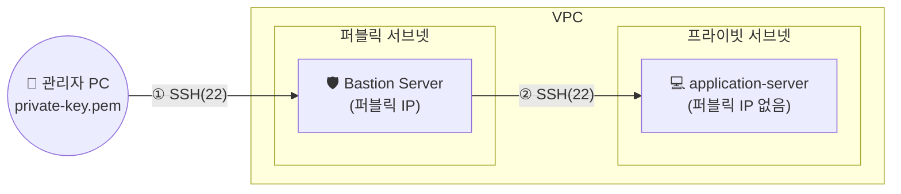

## 📌 들어가며

이번 글에서는 **Bastion(배스천) 서버**의 역할과 동작 방식을 정리한다. 프라이빗 서브넷의 서버는 외부에서 직접 접근할 수 없는데, 그렇다면 관리자는 어떻게 SSH로 접속할까? 그 **유일한 관문**이 바로 Bastion이다.

> **Bastion Server란?** **점프 서버(Jump Server)**라고도 불리며, 공격을 견디도록 특별히 설계된 **특수 목적 인스턴스**. **퍼블릭 서브넷**에 배치되어, 관리자가 **프라이빗 서브넷의 WEB/WAS 서버에 접근하기 위한 게이트웨이** 역할을 한다.


> 출처: [jongroinf.com](https://jongroinf.com/news_Cloud_Docker/30593)

---

## 1. 왜 Bastion이 필요한가

프라이빗 서브넷 서버는 퍼블릭 IP가 없어 인터넷에서 직접 SSH가 불가능하다. Bastion만 외부에 노출하고, **내부 접근은 반드시 Bastion을 거치게** 하면 공격 표면(attack surface)을 하나로 줄일 수 있다.



---

## 2. 보안 그룹 구성 (핵심)

Bastion 구조의 핵심은 **보안 그룹을 계단식으로 연결**하는 것이다. application 서버는 **Bastion의 보안 그룹에서 오는 22번만** 허용한다.

| 서버 | 보안 그룹 | 인바운드 22(SSH) 허용 소스 |
|------|-----------|----------------------------|
| **Bastion** | `Bastion-SG` | **내 IP** (관리자만) |
| **application** | `application-SG` | **`Bastion-SG`** (배스천만) |


> ⚠️ application 서버의 SSH 소스를 IP가 아니라 **`Bastion-SG`(보안 그룹 자체)**로 지정하는 것이 포인트다. 이렇게 하면 오직 Bastion을 통과한 접속만 내부 서버에 닿을 수 있고, 인터넷에서의 직접 접근은 원천 차단된다.

---

## 3. 접속 시나리오

```
[관리자 PC]
  └─ private-key.pem 으로 원격 로그인 ──▶ [Bastion-Server] (퍼블릭 서브넷)
                                              └─ ~/.ssh/ 에 키 복사 (chmod 400)
                                                 └─ 원격 로그인 ──▶ [application-server] (프라이빗 서브넷)
```

| 서버 | 서브넷 | 퍼블릭 IP | 접속 방법 |
|------|--------|:---:|------|
| **Bastion** | public | O | PC에서 `.pem` 키로 직접 로그인 |
| **application** | private | X | Bastion 로그인 후, 키를 복사(400 권한)해 재로그인 |

> 💡 **키 권한(chmod 400)** — SSH는 개인 키 파일의 권한이 너무 열려 있으면(그룹·타인 읽기 가능) 보안상 접속을 거부한다. Bastion에 키를 복사한 뒤 `chmod 400 private-key.pem`으로 **소유자 읽기 전용**으로 만들어야 내부 서버 로그인이 정상 동작한다.

---

## 📝 정리

```
Bastion(점프 서버)
├─ 역할   프라이빗 서버 접근의 유일한 관문
├─ 위치   퍼블릭 서브넷(퍼블릭 IP O)
├─ 보안   Bastion-SG(내 IP) → application-SG(Bastion-SG)
└─ 접속   PC → Bastion → (키 복사·400) → application
```

| 개념 | 한 줄 정의 |
|------|------|
| **Bastion** | 프라이빗 서버로 가는 관문 서버 |
| **SG 참조** | 소스를 IP 대신 보안 그룹으로 지정 |
| **chmod 400** | 키 파일 소유자 읽기 전용 |

Bastion의 핵심은 **외부 접근 경로를 하나로 좁혀 보안을 강화**하는 것이다. 보안 그룹을 IP가 아닌 **그룹 참조**로 계단식 연결하면, 관리자는 Bastion을 거쳐서만 내부 서버에 닿을 수 있다.
