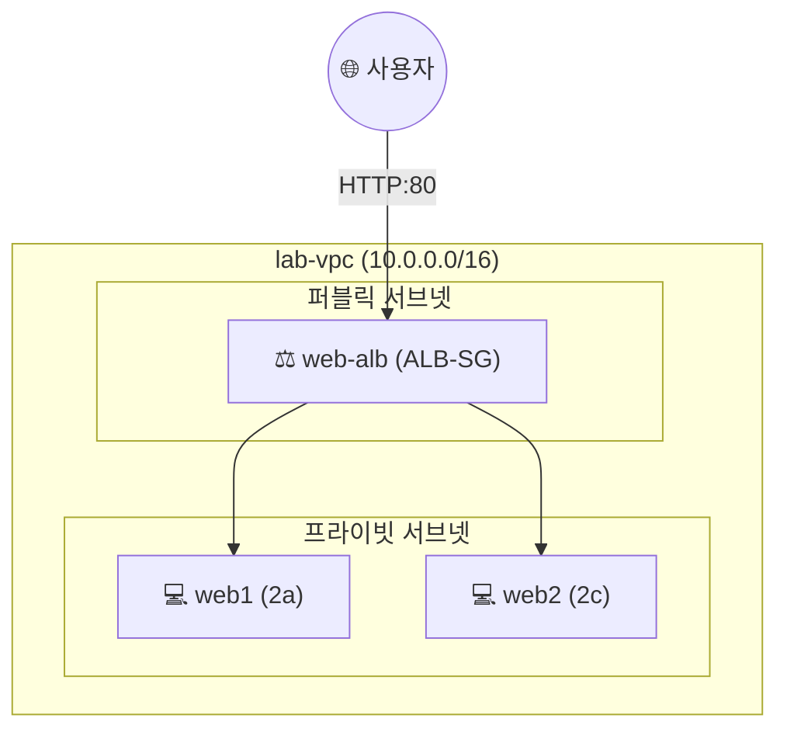

## 📌 들어가며

이번 글에서는 AWS의 **로드밸런서(Load Balancer)**를 정리한다. 여러 가용 영역에 배치한 서버로 트래픽을 **분산**해 고가용성을 확보하는 장비로, 종류(ALB·NLB·GWLB)를 비교한 뒤 **ALB를 직접 구축하는 Lab**을 진행한다.

> **로드밸런서란?** 여러 서버에 **네트워크 트래픽을 분산**시키는 장비. AWS에서는 2개 이상의 가용 영역(AZ)에 동일한 서버를 두고, 로드밸런서로 부하를 나눠 **한 서버·한 AZ에 장애가 나도 서비스가 계속되게** 한다.

---

## 1. 가용 영역과 고가용성

**고가용성(High Availability)**은 동일 목적의 서버를 **서로 다른 AZ에 2개 이상** 두어, 한 AZ에 문제(정전 등)가 생겨도 다른 AZ가 서비스를 이어가는 것이다.


> 💡 서울 리전은 4개, 버지니아 북부는 6개, 오사카는 3개의 AZ를 가진다. 로드밸런서는 이 **여러 AZ에 흩어진 서버들의 앞단**에서 트래픽을 고르게 나눠주는 역할을 한다.


---

## 2. 로드밸런서 종류

동작하는 **OSI 계층**에 따라 나뉜다.

| 종류 | 계층 | 대상 트래픽 | 특징 |
|------|------|------|------|
| **ALB** | **L7** | HTTP/HTTPS | 콘텐츠·호스트·경로 기반 라우팅, MSA에 적합 |
| **NLB** | **L4** | TCP/UDP/TLS | 초고성능·저지연 |
| **GWLB** | **L3** | IP 패킷 | 방화벽·IDS 같은 가상 어플라이언스 배포 |


> 출처: [bespinglobal GWLB 문서](https://support.bespinglobal.com/ko/support/solutions/articles/73000544791)

---

## 3. 로드밸런서 생성의 두 축

| 구성 | 역할 |
|------|------|
| **대상 그룹(Target Group)** | 트래픽을 **어디로** 보낼지(EC2 등 대상)와 프로토콜/포트 지정 |
| **로드밸런서 + 리스너(Listener)** | 지정한 포트/프로토콜로 연결을 받아, **규칙에 따라 대상 그룹으로 라우팅** |


---

## 4. Lab — ALB 구축

프라이빗 서브넷의 web1·web2를 퍼블릭 서브넷의 ALB로 노출하는 구성이다.




### ① VPC & 서브넷

- `lab-vpc` (`10.0.0.0/16`)
- 퍼블릭 2개(`10.0.0.0/24`, `10.0.1.0/24`), 프라이빗 2개(`10.0.2.0/24`, `10.0.3.0/24`)


### ② 보안 그룹 (계단식)

| 그룹 | 인바운드 |
|------|------|
| `ALB-SG` | 80 ← **anywhere** |
| `WEB-SG` | 80 ← **`ALB-SG`** |


> 💡 웹 서버(`WEB-SG`)는 인터넷이 아니라 **ALB(`ALB-SG`)에서 오는 80만** 허용한다. 이렇게 하면 프라이빗 서버로의 직접 접근은 막고, 반드시 ALB를 거치게 된다.

### ③ 웹 서버 (web1·web2)

프라이빗 서브넷에 **퍼블릭 IP 없이** 만들고, 사용자 데이터로 Apache를 설치한다.

```bash
#!/bin/bash
yum install httpd -y
systemctl enable --now httpd
echo "<h1>WEB1</h1>" > /var/www/html/index.html   # web2는 WEB2
```

### ④ ALB 생성

**대상 그룹**(`web-alb-tg`, HTTP/80, 상태 검사 `/`)에 web1·web2를 등록하고, **ALB**(`web-alb`, 인터넷 경계)를 **퍼블릭 서브넷**에 배치한다. 리스너는 HTTP:80 → 대상 그룹.


> ⚠️ **ALB는 반드시 퍼블릭 서브넷**에 두어야 외부에서 접속할 수 있다. 서버(web1·web2)는 프라이빗에 숨기고, 외부에 노출되는 것은 ALB뿐이다.

### ⑤ 동작 확인 & 정리

ALB의 **DNS 이름**으로 접속하면 web1·web2가 번갈아 응답한다. 실습 후 ALB → 대상 그룹 → EC2 → NAT/VPC → 보안 그룹 순으로 삭제한다.


---

## 📝 정리

```
로드밸런서
├─ 목적   여러 AZ 서버에 트래픽 분산 → 고가용성
├─ 종류   ALB(L7) / NLB(L4) / GWLB(L3)
├─ 구성   대상 그룹(어디로) + 리스너(어떻게)
└─ 배치   ALB=퍼블릭 서브넷, 서버=프라이빗
```

| 개념 | 한 줄 정의 |
|------|------|
| **로드밸런서** | 트래픽 분산 장비 |
| **대상 그룹** | 라우팅 대상 묶음 + 상태 검사 |
| **리스너** | 포트/프로토콜 수신 → 규칙 라우팅 |

로드밸런서의 핵심은 **여러 AZ 서버로 부하를 나눠 고가용성을 만드는 것**이다. ALB는 퍼블릭 서브넷에 두고, 서버는 프라이빗에 숨긴 채 보안 그룹을 계단식으로 연결하는 것이 안전한 기본 패턴이다.
