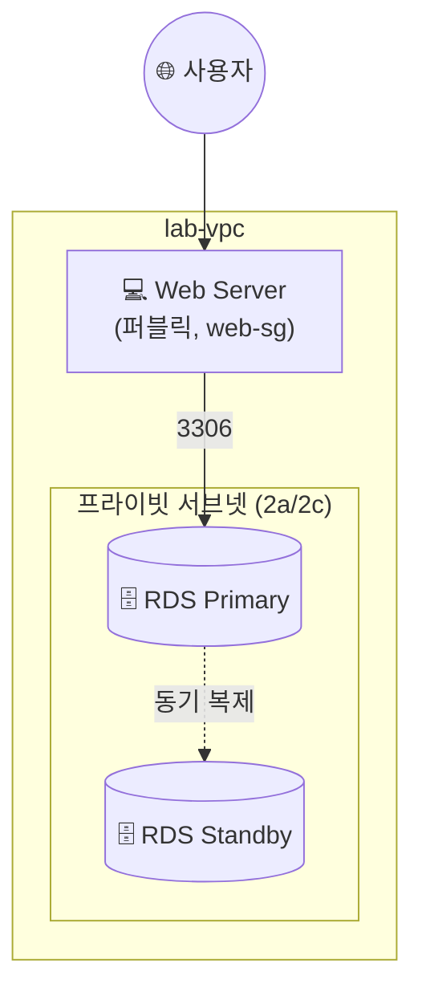

## 📌 들어가며

이번 글에서는 AWS의 **RDS(Relational Database Service)**를 정리한다. 데이터베이스·DBMS 기본 개념부터, RDS가 대신 관리해주는 것들, 지원 엔진, 그리고 **Multi-AZ DB를 만들어 장애 조치(Failover)를 확인하는 Lab**까지 다룬다.

> **RDS란?** 클라우드에서 **관계형 데이터베이스를 쉽게 설정·운영·확장**하도록 AWS가 제공하는 **관리형 서비스(PaaS)**. 하드웨어 프로비저닝, SW 설치·패치, 스토리지 관리, 백업, 고가용성을 AWS가 대신 처리한다.

---

## 1. DB / DBMS / RDS 개념 정리

| 용어 | 정의 |
|------|------|
| **데이터베이스(DB)** | 공유 목적으로 체계화·통합해 관리하는 데이터 집합 |
| **관계형 DB(RDB)** | 데이터를 **행·열의 테이블**로 저장, 사전 정의된 관계로 구성 |
| **DBMS** | 사용자와 DB 사이에서 데이터를 **생성·수정·삭제·검색**하는 관리 SW |
| **RDS** | 관계형 DB를 **관리형으로** 제공하는 AWS 서비스 |

---

## 2. 관리형 서비스의 책임 분담

RDS의 핵심 가치는 **관리 부담을 AWS로 넘기는 것**이다. 사용자는 애플리케이션 최적화에만 집중한다.

| 사용자가 관리 | AWS가 관리 |
|------|------|
| 애플리케이션 최적화 | OS 설치·패치, DB SW 설치·패치 |
| | 백업, 고가용성, 규모 조정 |
| | 전력·서버 랙킹, 서버 유지관리 |


> 💡 온프레미스에서는 OS·DB 설치, 백업, 이중화까지 전부 직접 해야 했다. RDS는 이 **"운영의 무거운 부분"을 AWS가 맡아**, 개발자가 DBA 작업 시간을 줄이고 비즈니스에 집중하게 한다.

---

## 3. RDS 지원 엔진 & 구성 요소

**지원 엔진**: MySQL · PostgreSQL · Oracle · SQL Server · MariaDB · **Amazon Aurora**(AWS 자체 엔진, MySQL/PostgreSQL 호환·고성능).

**구성 정보**:

| 구성 요소 | 역할 |
|------|------|
| **서브넷 그룹** | RDS가 사용할 서브넷·IP 범위 지정 |
| **파라미터 그룹** | DB 작동 방식을 정의하는 매개변수 |
| **옵션 그룹** | 백업·모니터링 등 고급 옵션 |

엔드포인트 형식: `<rds-name>-mysql.<식별자>.<리전>.rds.amazonaws.com`

---

## 4. Lab — Multi-AZ RDS 생성 & Failover

프라이빗 서브넷에 **Multi-AZ RDS**를 두고, 퍼블릭 서브넷 웹 서버가 접속하는 구성이다.




### Task 1 — 보안 그룹

| 그룹 | 인바운드 |
|------|------|
| `web-sg` | HTTP·SSH ← anywhere |
| `rds-sg` | MySQL **3306 ← `web-sg`** |

### Task 2 — 서브넷/파라미터/옵션 그룹

- **서브넷 그룹** `lab-rdb-subnetgroup`: 프라이빗 2a(`10.0.2.0/24`)·2c(`10.0.3.0/24`)
- **파라미터 그룹** `lab-rdb-parm-group`: MySQL Community, `mysql8.0`
- **옵션 그룹** `lab-rdb-options-group`: mysql 8.0

### Task 3 — RDS 인스턴스 생성

**표준 생성**, 엔진 MySQL 8.0.39, 배포는 **다중 AZ DB 인스턴스**로 한다.

| 항목 | 값 |
|------|------|
| 식별자 | `lab-rds` |
| 마스터 사용자 | `master` / `master-password` |
| 인스턴스 클래스 | `t3.micro` |
| 스토리지 | gp3 20GB |
| **퍼블릭 액세스** | **아니오** |
| 보안 그룹 | `rds-sg` (3306) |
| 초기 DB | `labdb` |

**프로덕션 vs 개발/테스트 템플릿:**

| 항목 | 프로덕션 | 개발/테스트 |
|------|----------|-------------|
| Multi-AZ | 권장(자동 장애 조치) | 선택(비용 절감) |
| 백업/모니터링 | 활성화 | 필요 시 |
| 비용 | 상대적 높음 | 절감 가능 |

> ⚠️ **퍼블릭 액세스는 '아니오'**로 두어 DB를 인터넷에 노출하지 않는다. 웹 서버(`web-sg`)에서 오는 3306만 허용해, DB는 프라이빗하게 유지한다.

### Task 4 — 웹 서버 (사용자 데이터)

퍼블릭 서브넷에 웹 서버를 만들고, PHP·MariaDB 클라이언트를 설치해 RDS 연동용 앱을 배포한다.

```bash
#!/bin/bash -ex
dnf update
dnf install httpd php php-mysqlnd php-fpm php-json mariadb105 -y
systemctl enable --now httpd
cd /var/www/html/
wget https://aws-largeobjects.s3.ap-northeast-2.amazonaws.com/AWS-AcademyACF/lab7-app-php7.zip
unzip lab7-app-php7.zip -d /var/www/html/
chown apache:root /var/www/html/rds.conf.php
```

### Task 5 — Failover 확인 (핵심)

웹 페이지에 DB 정보(엔드포인트·`labdb`·`master`)를 입력해 연동한 뒤, **재부팅(장애 조치)**으로 Standby로 넘어가는지 `nslookup`으로 확인한다.


```bash
# 장애 조치 전: Primary IP
$ nslookup <rds_Endpoint>
Address: 10.0.3.XX

# lab-rds → 수정 → 재부팅(장애 조치로 재부팅)

# 장애 조치 후: 엔드포인트는 그대로인데 IP만 바뀜(Standby로 전환)
$ nslookup <rds_Endpoint>
Address: 10.0.2.41
```


> 💡 **Multi-AZ Failover의 마법** — 장애가 나도 **엔드포인트(도메인)는 그대로**이고, 뒤에서 가리키는 **IP만 Standby로 바뀐다.** 그래서 애플리케이션은 접속 주소를 바꿀 필요 없이 자동으로 대기 인스턴스에 연결된다. 이것이 고가용성의 핵심이다.

실습 후 DB → 서브넷/파라미터/옵션 그룹 → 인스턴스 → 보안 그룹 순으로 삭제한다.

---

## 📝 정리

```
RDS
├─ 개념   관리형 관계형 DB(PaaS)
├─ 책임   앱은 사용자, 나머지(OS·패치·백업·HA)는 AWS
├─ 구성   서브넷/파라미터/옵션 그룹 + 인스턴스
└─ HA     Multi-AZ → Failover 시 엔드포인트 유지, IP만 전환
```

| 개념 | 한 줄 정의 |
|------|------|
| **RDS** | 관리형 관계형 데이터베이스 |
| **Multi-AZ** | 대기 인스턴스로 자동 장애 조치 |
| **엔드포인트** | Failover 후에도 유지되는 접속 주소 |

RDS의 핵심은 **DB 운영을 AWS에 맡기고**, **Multi-AZ로 장애에 대비**하는 것이다. Failover 시 엔드포인트가 유지된다는 점 덕분에, 애플리케이션 수정 없이 고가용성을 얻을 수 있다.
