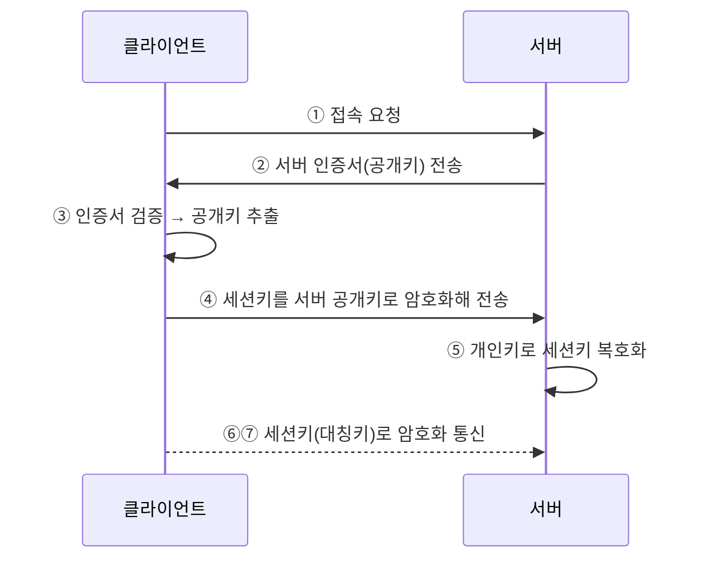

## 📌 들어가며

이번 글에서는 AWS의 **ACM(AWS Certificate Manager)**을 정리한다. SSL/TLS 인증서를 **무료로 발급·관리·자동 갱신**하는 서비스로, HTTP와 HTTPS의 차이부터 SSL 통신 과정, 그리고 **ALB에 인증서를 붙여 HTTPS를 적용하는 Lab**까지 다룬다.

> **ACM이란?** SSL/TLS 인증서를 손쉽게 **프로비저닝·관리·배포**하는 서비스. **무료로 공인 인증서**를 발급하며, ELB·CloudFront·API Gateway 등 AWS 서비스와 통합해 HTTPS를 구현하고 **자동 갱신**까지 처리한다.

---

## 1. HTTP vs HTTPS

**SSL(Secure Socket Layer)**은 인터넷에서 데이터를 안전하게 주고받기 위한 **암호화 통신 프로토콜**이다. HTTP에 SSL을 더한 것이 HTTPS다.


| 기능 | **HTTP** | **HTTPS(HTTP+SSL)** |
|------|----------|---------------------|
| 암호화 | 평문(Plain text) | **인증서 기반 암호화** |
| Port | TCP **80** | TCP **443** |
| 접두사 | `http://` | `https://` |
| 보안 | 민감 정보 노출·변조 위험 | **사이트 신뢰 검증 + 데이터 보호** |


---

## 2. SSL 통신 과정

핵심은 **공개키로 세션키를 안전하게 교환한 뒤, 실제 통신은 빠른 대칭키로** 하는 것이다.




> 출처: [crocus.co.kr/1387](https://www.crocus.co.kr/1387)

> 💡 **왜 공개키 → 대칭키로 바꾸나?** 공개키(비대칭) 암호화는 안전하지만 느리다. 그래서 **처음 세션키를 주고받을 때만 공개키**를 쓰고, 실제 데이터 통신은 빠른 **대칭키(세션키)**로 처리한다. 안전함과 속도를 모두 잡는 방식이다.

---

## 3. ACM을 쓰는 이유 & 설정 순서

| 이유 | 설명 |
|------|------|
| **간소화된 관리** | 인증서 생성·저장·관리의 복잡성 처리 |
| **원활한 통합** | ELB·CloudFront·API Gateway와 통합 |
| **자동 갱신** | 수동 추적·갱신 불필요 |
| **비용 효율** | 적격 AWS 서비스용은 **추가 비용 없음** |

**설정 순서**: ①인증서 요청 → ②유효성 검사(DNS 권장) → ③AWS 서비스에 구성(ALB 등) → ④모니터링 → ⑤자동 갱신.

> 💡 검증은 **DNS 검증**을 권장한다. Route53 도메인에 CNAME 레코드를 더해 검증하므로 간단하고, 레코드를 두면 **갱신 시 자동 재검증**된다.

---

## 4. Lab — ACM 발급 & ALB에 HTTPS 적용

### ① 인증서 생성 (와일드카드)

- 도메인: `weplat.store` + 다른 이름 `*.weplat.store`
- 검증: **DNS 검증(권장)**, 키 알고리즘 **RSA 2048**
- 인증서 선택 → **Route53에서 레코드 생성**으로 CNAME 자동 등록 → 상태가 **발급됨**이 될 때까지 대기


### ② ALB에 인증서 연결 (HTTPS 리스너)

`web-alb`에 **HTTPS(443) 리스너**를 추가하고 인증서를 붙인다.

| 항목 | 값 |
|------|------|
| 프로토콜/포트 | **HTTPS / 443** |
| 라우팅 액션 | 대상 그룹으로 전달(`weplat-ap2-web-alb-tg`) |
| 보안 정책 | `ELBSecurityPolicy-TLS13-1-2-2021-06`(권장) |
| 인증서 소스 | **ACM에서** → `weplat.store` |

### ③ HTTP → HTTPS 리디렉션

`HTTP:80` 리스너를 편집해 **HTTPS(443)로 리디렉션**되게 한다. 이러면 `http://`로 들어와도 자동으로 `https://`로 전환된다.


> ⚠️ **실습 후 리소스 정리** — Route53 레코드 → ALB → ACM → EC2 → VPC 순으로 삭제한다. ALB·NAT 등은 과금 대상이므로 반드시 정리하자.

---

## 📝 정리

```
ACM
├─ 개념   무료 SSL/TLS 인증서 발급·관리·자동 갱신
├─ SSL    공개키로 세션키 교환 → 대칭키로 통신
├─ 검증   DNS 검증(CNAME) 권장 → 자동 재검증
└─ 적용   ALB HTTPS(443) 리스너 + HTTP→HTTPS 리디렉션
```

| 개념 | 한 줄 정의 |
|------|------|
| **ACM** | 무료 관리형 SSL 인증서 |
| **DNS 검증** | CNAME으로 소유권 증명 |
| **HTTPS 리디렉션** | HTTP 접속을 HTTPS로 강제 |

ACM의 핵심은 **무료 인증서를 ALB에 붙여 HTTPS를 구현**하고, **HTTP→HTTPS 리디렉션**으로 모든 접속을 암호화하는 것이다. DNS 검증으로 받아두면 갱신도 자동이라 운영 부담이 없다.
