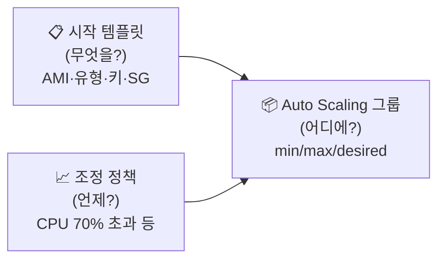

## 📌 들어가며

이번 글에서는 **EC2 Auto Scaling(ASG)**을 정리한다. 부하에 따라 인스턴스 수를 자동으로 늘리고 줄여, **성능은 유지하고 비용은 아끼는** 서비스다. Scale Up/Out 개념부터 구성 요소, 그리고 **ALB와 함께 ASG를 구축하는 Lab**까지 다룬다.

> **Auto Scaling이란?** 애플리케이션을 모니터링하며 **용량을 자동으로 조정**해, 최저 비용으로 안정적인 성능을 유지하는 서비스. 정의한 조건에 따라 EC2를 **추가·제거**하고, 손상된 인스턴스를 **자동 교체**한다.

---

## 1. 확장성 — 수직 vs 수평

| 구분 | **수직 스케일링** | **수평 스케일링** |
|------|-------------------|-------------------|
| 표현 | **Scale Up / Down** | **Scale Out / In** |
| 방식 | 서버 **리소스 크기** 확장/축소 | 서버 **수** 증가/감소 |
| 예 | t2.micro → t2.large | 서버 2대 → 4대 |


> 💡 **고가용성 ≠ 확장성.** 고가용성은 "장애가 나도 서비스가 계속되는 것", 확장성은 "부하에 맞춰 자원을 늘리고 줄이는 것"이다. Auto Scaling은 주로 **수평 확장(Scale Out/In)**으로 이 둘을 함께 달성한다.


---

## 2. 왜 Auto Scaling인가 — Amazon의 사례


> ⚠️ Amazon.com은 블랙 프라이데이·사이버 먼데이에 트래픽이 폭증한다. 이 **최대치에 맞춰 고정 용량을 확보하면, 연중 대부분 리소스의 76%가 유휴 상태**가 된다. 반대로 조정을 안 하면 포화로 서버가 다운되어 신뢰를 잃는다. **동적 조정**이 답이다.

---

## 3. ASG 3대 구성 요소 (무엇을·어디에·언제)



| 요소 | 질문 | 내용 |
|------|------|------|
| **시작 템플릿** | 무엇을? | AMI·인스턴스 유형·키·보안 그룹 등 인스턴스 청사진 |
| **Auto Scaling 그룹** | 어디에? | 인스턴스를 관리하는 논리 단위(min/max/desired) |
| **조정 정책** | 언제? | 예: CPU 70% 이상이면 Scale Out |


---

## 4. Lab — ALB + ASG 구축

**AMI → 시작 템플릿 → ASG(+ALB)** 순으로 구축한다.


### 사전 준비 — VPC·보안 그룹·테스트 웹

- `lab-vpc`(`10.0.0.0/16`), 퍼블릭 2 / 프라이빗 2
- 보안 그룹: `ALB-SG`(80·443 ← anywhere), `WEB-SG`(80 ← `ALB-SG`)
- `test-web`으로 웹 서버 세팅 확인(사용자 데이터로 httpd 설치)

### ① AMI 생성

`test-web` → 작업 → 이미지 생성(`web-ami`, **재부팅 안 함** 활성).


### ② 시작 템플릿

`Web-ASG-LT` 생성. **Auto Scaling 지침 체크**, AMI는 `web-ami`, 유형 t2.micro, **서브넷은 포함하지 않음**(ASG에서 지정), 보안 그룹 `WEB-SG`.


> 💡 시작 템플릿에서 **서브넷을 비워두는 이유**는, 어느 AZ·서브넷에 인스턴스를 띄울지는 **ASG가 결정**하기 때문이다. 템플릿은 "무엇을"만 정하고, "어디에"는 ASG에 맡긴다.

### ③ Auto Scaling 그룹

`Web-ASG` 생성. 시작 템플릿 선택 → **프라이빗 서브넷**(2a·2c) 지정 → 로드밸런서는 새 **ALB**(`Web-ALB`, Internet-facing, **퍼블릭 서브넷**) + 대상 그룹 `web-alb-tg`.


**그룹 크기 & 조정 정책**:

| 항목 | 값 |
|------|------|
| 희망/최소 용량 | **2** |
| 최대 용량 | **4** |
| 정책 | **대상 추적** — 평균 CPU **30%** |


> ⚠️ 실습에선 대상 CPU를 30%로 잡았지만, **현업에서는 보통 60~70%**에서 Scale Out 한다. 너무 낮게 잡으면 불필요하게 인스턴스가 늘어 비용이 커진다. ALB는 퍼블릭, 인스턴스는 프라이빗에 두는 구조도 잊지 말자.

### ④ 리소스 정리

ASG → ALB → 대상 그룹 → 인스턴스 → NAT/VPC → 시작 템플릿·AMI → EIP → 스냅샷 순으로 삭제한다.

---

## 📝 정리

```
Auto Scaling Group(ASG)
├─ 확장   수직(Up/Down) vs 수평(Out/In) — ASG는 수평
├─ 구성   시작 템플릿(무엇) + ASG(어디) + 정책(언제)
├─ 구축   AMI → 시작 템플릿 → ASG(+ALB)
└─ 정책   대상 추적(CPU %) — 실무 60~70%
```

| 개념 | 한 줄 정의 |
|------|------|
| **ASG** | 인스턴스 수 자동 조정 |
| **시작 템플릿** | 인스턴스 생성 청사진 |
| **대상 추적 정책** | CPU 목표 기반 자동 스케일 |

ASG의 핵심은 **시작 템플릿(무엇을)·그룹(어디에)·정책(언제)**의 조합이다. ALB와 함께 쓰면 트래픽 증가에 자동으로 인스턴스를 늘려, 고가용성과 비용 효율을 동시에 잡을 수 있다.
