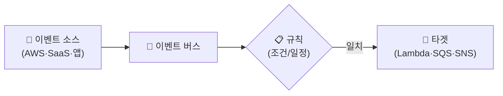
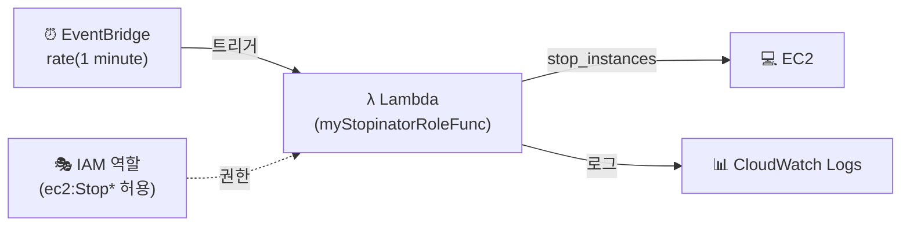

## 📌 들어가며

이번 글에서는 **서버리스(Serverless)**의 대표 서비스 **AWS Lambda**와, 이벤트를 라우팅하는 **EventBridge**를 정리한다. 개념을 살펴본 뒤, **EventBridge로 Lambda를 주기 실행해 EC2를 자동 시작/중지하는 Lab**을 진행한다.

> **서버리스란?** 서버를 **직접 관리·프로비저닝하지 않고** 코드를 실행하는 클라우드 모델. "서버가 없다"가 아니라 **"우리가 서버를 관리하지 않아도 된다"**는 의미다. 서버 관리 부담 제거, 자동 스케일링, **사용한 만큼만 과금**이 핵심 이점이다.

---

## 1. AWS Lambda

> **Lambda란?** 서버를 관리하지 않고 코드를 실행하는 **이벤트 중심 서버리스 컴퓨팅 서비스**. HTTP 요청·DB 업데이트·파일 업로드 같은 **이벤트가 발생하면 트리거**되어 함수를 실행한다(Python·Node.js·Java·Go 등 지원).

| 장점 | 설명 |
|------|------|
| **서버 관리 불필요** | 코드와 이벤트에만 집중 |
| **자동 확장** | 요청에 따라 인스턴스 자동 증감 |
| **비용 효율** | 실행된 시간만 과금(미사용 시 0원) |
| **통합성** | S3·DynamoDB·API Gateway 등과 연동 |

### Lambda의 제한

| 항목 | 제한 |
|------|------|
| **실행 시간** | 최대 **15분** |
| **코드 크기** | zip 50MB / unzip 250MB / 콘솔 3MB |
| **메모리** | 128MB ~ 10,240MB(10GB) |
| **권한** | IAM으로 부여 |

> ⚠️ Lambda는 **최대 15분**만 실행된다. 오래 걸리는 배치 작업에는 부적합하며, 그런 경우 **짧은 작업으로 쪼개거나** ECS/Batch 같은 다른 서비스를 고려해야 한다.

**요금**: 월 100만 건 요청 + 40만 GB-초 실행이 **프리 티어**. 이후 요청 수·실행 시간(1ms 단위)·메모리로 과금된다.

---

## 2. EventBridge

> **EventBridge란?** AWS 서비스·앱에서 발생하는 **이벤트를 감지·라우팅**하는 완전 관리형 **이벤트 버스**. 과거 **CloudWatch Events**로 불렸다. 실시간으로 이벤트를 받아 규칙에 맞으면 특정 대상(Lambda 등)을 트리거한다.



| 구성 요소 | 역할 |
|------|------|
| **이벤트 소스** | 이벤트를 생성하는 주체 |
| **이벤트 버스** | 이벤트 수집·라우팅 경로 |
| **규칙(Rule)** | 조건/일정에 맞는 이벤트만 필터 |
| **타겟(Target)** | 이벤트가 전달될 대상 |

---

## 3. Lab — EventBridge로 EC2 자동 중지

**"1분마다 EC2를 중지"**하는 서버리스 자동화를 만든다. 흐름은 **정책 → 역할 → 함수 → 트리거(규칙) → 코드**다.



### ① 정책 생성 (`AllowStopInstance`)

Lambda가 **CloudWatch에 로그를 남기고, EC2를 중지**할 수 있도록 허용한다.

```json
{
    "Version": "2012-10-17",
    "Statement": [
        {
            "Action": ["logs:CreateLogGroup", "logs:CreateLogStream", "logs:PutLogEvents"],
            "Resource": "arn:aws:logs:*:*:*",
            "Effect": "Allow"
        },
        {
            "Action": ["ec2:Stop*"],
            "Resource": "*",
            "Effect": "Allow"
        }
    ]
}
```

| 필드 | 의미 |
|------|------|
| `Version` | 정책 언어 버전(`2012-10-17` 표준) |
| `Statement` | 권한 부여 명령 묶음 |
| `Action` | 허용할 작업(로그 기록 + `ec2:Stop*`) |
| `Effect` | `Allow`(허용) |

### ② IAM 역할 (`myStopinatorRole`)

신뢰할 엔터티를 **Lambda**로 지정하고, `AllowStopInstance` + `AWSLambdaBasicExecutionRole` 등을 붙인다.


### ③ Lambda 함수 (`myStopinatorRoleFunc`)

**Python 3.12**로 새로 작성하고, 실행 역할을 `myStopinatorRole`로 지정한다.

### ④ 트리거 — EventBridge 규칙 (`everyMinute`)

트리거로 EventBridge를 추가하고, **예약 표현식**으로 `rate(1 minute)`을 넣는다.


**cron vs rate 표현식:**

| 표현식 | 의미 |
|------|------|
| `rate(1 minute)` | 1분마다 |
| `rate(5 hours)` | 5시간마다 |
| `cron(0/30 * * * ? *)` | 30분마다 |
| `cron(15 13 ? * MON *)` | 매주 월요일 13:15 |

> 💡 **cron은 "특정 시각"**(매일 오후 6시 등), **rate는 "일정 간격"**(N분/시간마다)에 쓴다. cron 표현식이 헷갈릴 땐 [crontab.guru](https://crontab.guru/)로 검증하면 편하다.

### ⑤ 실행 코드 (boto3)

기본 "Hello from Lambda"를 지우고, EC2를 중지하는 코드로 교체한 뒤 **[Deploy]**한다.

```python
import boto3
region = '<REGION>'
instances = ['<INSTANCE_ID>']
ec2 = boto3.client('ec2', region_name=region)

def lambda_handler(event, context):
    ec2.stop_instances(InstanceIds=instances)
    print('Stopped your instances:' + str(instances))
```

### ⑥ 로그 확인

`CloudWatch → 로그 그룹 → /aws/lambda/myStopinatorRoleFunc`에서 로그 스트림과 기록을 확인한다.


---

## 4. Lab2 — 설정 수정 (3분마다 / start로 변경)

| 변경 | 방법 |
|------|------|
| **3분마다 중지** | EventBridge `everyMinute` 편집 → `rate(3 minutes)` |
| **1분마다 시작** | 정책에 **`ec2:Start*`** 추가 → 코드를 `start_instances`로 |
| **중단** | Lambda → 구성 → `everyMinute` **비활성화** |

start용 코드:

```python
import boto3
region = '<REGION>'
instances = ['<INSTANCE_ID>']
ec2 = boto3.client('ec2', region_name=region)

def lambda_handler(event, context):
    ec2.start_instances(InstanceIds=instances)
    print('Started your instances:' + str(instances))
```


> ⚠️ 실습 후 **EventBridge → IAM(역할·정책) → Lambda → CloudWatch 로그 그룹 → EC2** 순으로 삭제한다. 이벤트를 끄지 않으면 계속 트리거되니 반드시 비활성화·삭제하자.
>
> **과제**: 매일 저녁 6시(한국시간)에 모든 EC2를 중지하도록 `cron` 표현식으로 구성해보기.

---

## 📝 정리

```
Lambda & EventBridge
├─ 서버리스  관리·프로비저닝 없이 코드 실행(사용한 만큼 과금)
├─ Lambda    이벤트 트리거 함수(최대 15분, IAM 권한)
├─ EventBridge 이벤트 감지·라우팅(구 CloudWatch Events)
└─ 자동화    rate/cron 규칙 → Lambda → EC2 start/stop
```

| 개념 | 한 줄 정의 |
|------|------|
| **Lambda** | 이벤트 기반 서버리스 함수 |
| **EventBridge** | 이벤트 버스(규칙→타겟) |
| **rate/cron** | 간격/특정시각 예약 표현식 |

이 조합의 핵심은 **EventBridge가 일정에 맞춰 Lambda를 트리거하고, Lambda가 IAM 역할 권한으로 EC2를 제어**하는 서버리스 자동화다. 서버 없이도 정기 작업(백업·start/stop)을 코드 몇 줄로 구현할 수 있다.
