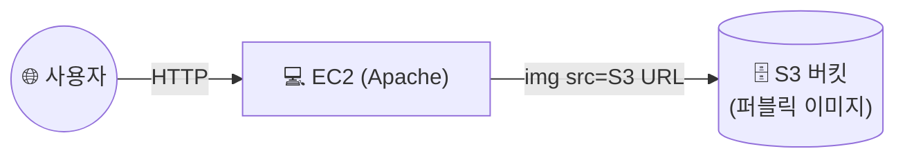

## 📌 들어가며

이번 글에서는 AWS의 **S3(Simple Storage Service)**를 정리한다. EC2와 더불어 가장 오래되고 기본이 되는 **객체 스토리지**로, 개념·스토리지 클래스·특징을 살펴본 뒤 **버킷 이미지를 웹 서버에서 서비스하는 Lab**을 진행한다.

> **S3란?** 데이터를 **객체(Object)** 단위로, **버킷(Bucket)**이라는 저장소에 담는 **객체 스토리지 서비스**. 입출력은 HTTP/REST API로 이루어지며, **99.999999999%(11 9s)**의 내구성으로 설계되어 데이터 손실을 최소화한다.


---

## 1. S3 핵심 특징

| 특징 | 설명 |
|------|------|
| **높은 내구성** | 11 9s 설계. 한 리전 내 **3개 이상 AZ에 복제** 저장 |
| **사실상 무제한** | 용량 제한 없음(단일 객체 최대 **5TB**) |
| **비용 최적화** | 스토리지 클래스로 접근 빈도에 맞춰 비용 절감 |
| **세밀한 접근 제어** | 정책·ACL로 객체별 접근 제어 |
| **OS 불필요** | 객체별 접근이라 서버 OS 없이 저장·검색 |


> 💡 **멀티파트 업로드** — 큰 파일을 여러 조각으로 나눠 병렬 업로드하고 완료 후 병합한다. 대용량 파일(비디오·백업)을 안정적이고 빠르게 올릴 때 유용하다.

---

## 2. S3 스토리지 클래스

접근 빈도와 비용에 따라 클래스를 선택한다. **자주 쓰면 Standard, 거의 안 쓰면 Glacier** 계열이다.

| 클래스 | 용도 | 특징 |
|------|------|------|
| **Standard** | 자주 접근하는 데이터 | 높은 내구성·가용성 |
| **Intelligent-Tiering** | 접근 패턴 불확실 | 자동으로 계층 이동해 비용 최적화 |
| **Standard-IA** | 드물게 접근(빠른 조회 필요) | 낮은 비용 |
| **One Zone-IA** | 단일 AZ 저장 | 더 저렴, 가용성 낮음 |
| **Glacier** | 장기 아카이빙 | 조회에 수 분~수 시간 |
| **Glacier Deep Archive** | 초장기 보관 | 가장 저렴, 복구 수 시간 |


---

## 3. Lab — 버킷 이미지를 웹 서버로 서비스

버킷에 저장한 이미지를 EC2 웹 서버가 불러와 보여주는 구성을 만든다.



### Task 1 — 버킷 생성 & 이미지 업로드

- 버킷 이름: `web-sample-images-seongmi`
- **객체 소유권: ACL 비활성화**, 모든 퍼블릭 액세스 차단(일단)
- `image.png` 업로드 후 **URL 복사**


### Task 2 — 웹 서버(EC2) 구성

보안 그룹 `WEB-SG`(인바운드 80·22)로 EC2를 만들고, **사용자 데이터**로 Apache를 설치하며 S3 이미지를 참조하는 페이지를 생성한다.

```bash
#!/bin/bash
dnf update -y
dnf install httpd -y
systemctl enable --now httpd

cat <<EOL > /var/www/html/index.html
<!DOCTYPE html>
<html lang="ko">
<head><meta charset="UTF-8"><title>성미의 웹페이지</title></head>
<body>
    <h1>성미의 웹페이지</h1>
    <p>성미의 웹페이지에 오신 것을 환영합니다.</p>
    <hr>
    
</body>
</html>
EOL

systemctl restart httpd
```

### Task 3 — 버킷을 퍼블릭으로 공개

기본적으로 S3는 퍼블릭 액세스를 차단한다. 웹 호스팅을 위해 **퍼블릭 액세스 차단을 해제**하고 **버킷 정책**으로 읽기를 허용한다.

```json
{
    "Version": "2012-10-17",
    "Statement": [
        {
            "Sid": "PublicReadGetObject",
            "Effect": "Allow",
            "Principal": "*",
            "Action": "s3:GetObject",
            "Resource": "<버킷ARN>/*"
        }
    ]
}
```

> ⚠️ **버킷 정책 vs ACL** — 여기서는 ACL을 끄고 **버킷 정책(JSON)**으로 공개를 제어한다. `Principal: "*"` + `s3:GetObject`는 "누구나 객체를 읽을 수 있음"을 의미한다. 공개가 목적일 때만 쓰고, 민감 데이터엔 절대 적용하지 말자.

### Task 4 — 웹페이지 확인

EC2 퍼블릭 IP로 접속하면, S3에 저장된 이미지가 포함된 페이지가 정상 표시된다.


---

## 4. S3 사용 사례

| 사례 | 설명 |
|------|------|
| **백업/복구** | 높은 내구성으로 백업 데이터 보관 |
| **데이터 분석** | Athena 연계로 S3에 직접 쿼리 |
| **정적 웹 호스팅** | HTML·이미지·비디오 호스팅 |
| **로그 저장/분석** | AWS 서비스·앱 로그 수집 |

---

## 📝 정리

```
S3
├─ 개념   객체 스토리지(버킷/객체, HTTP·REST)
├─ 내구성 11 9s, 리전 내 3+ AZ 복제
├─ 클래스 Standard ~ Glacier(빈도·비용별)
└─ 공개   퍼블릭 차단 해제 + 버킷 정책(JSON)
```

| 개념 | 한 줄 정의 |
|------|------|
| **S3** | 객체 스토리지 |
| **스토리지 클래스** | 접근 빈도별 비용 계층 |
| **버킷 정책** | JSON으로 접근 제어 |

S3의 핵심은 **무제한에 가까운 객체 저장 + 11 9s 내구성**이며, 공개 여부는 **버킷 정책**으로 정밀하게 제어한다. Lab처럼 이미지·정적 파일 저장소로 두고 웹 서버가 참조하는 패턴이 대표적이다.
