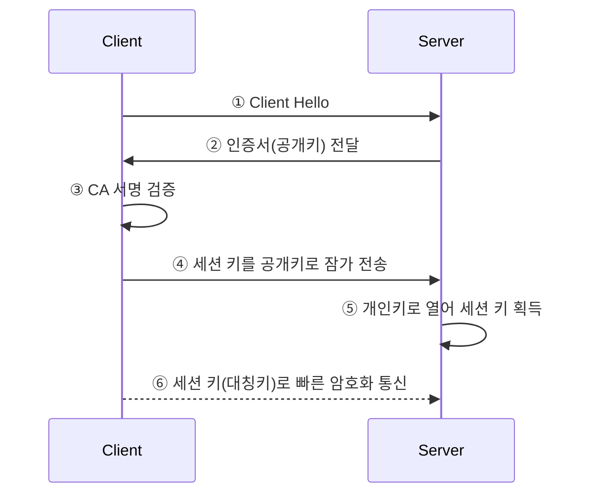
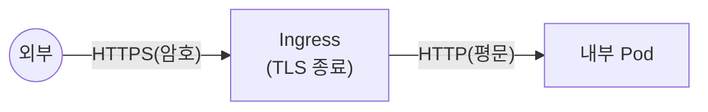

## 📌 들어가며

이번 글에서는 IT 보안의 기초인 **TLS·HTTPS·인증 토큰**을 비유로 정리하고, 나아가 쿠버네티스에서 Kafka(Strimzi)를 운영할 때 마주치는 **복잡한 인증서 구조와 자동 갱신 메커니즘**까지 심화 정리한다.

> **3대 요소 비유** — **TLS(SSL)**=도청 불가한 **방음 터널/금고**, **인증서(Certificate)**=서버임을 증명하는 **신분증/여권**, **CA(인증기관)**=신분증이 진짜임을 보증하는 **구청/발급 기관**. 클라이언트는 서버 신분증을 검사하려면 **CA Bundle(신뢰 기관 목록)**을 반드시 가져야 한다.

---

## 1. TLS 핸드셰이크

TLS는 **"느리지만 안전한 방식(공개키)으로 세션 키를 공유"**한 뒤, **"빠른 방식(대칭키)으로 데이터를 주고받는다."**



| 단계 | 내용 |
|------|------|
| **핸드셰이크** | 인증서 검증 + 세션 키 교환(공개키) |
| **데이터 전송** | 세션 키(대칭키)로 빠른 암호화 통신 |

> 💡 **왜 공개키 → 대칭키인가** — 공개키 암호는 안전하지만 느리다. 그래서 **세션 키를 나눌 때만** 공개키를 쓰고, 실제 데이터는 빠른 대칭키(세션 키)로 처리한다. 안전함과 속도를 모두 잡는 방식이다.

---

## 2. HTTPS & TLS Termination

> **HTTPS = HTTP + TLS** — HTTP라는 '편지 내용'은 그대로, TLS라는 '강철 금고'에 넣어 보내는 것이다.

**TLS Termination(종단)** — 쿠버네티스·클라우드의 표준 패턴이다.



| 구간 | 프로토콜 |
|------|------|
| 외부 ↔ Ingress | **HTTPS**(보안 철저) |
| Ingress ↔ 내부 Pod | **HTTP**(가볍게) |

> 💡 암호화/복호화 부하를 **입구(Ingress)에서 한 번만** 처리하고 내부는 평문으로 가볍게 통신한다. 각 Pod에 인증서를 심을 필요가 없어 관리가 단순해진다.

---

## 3. Bearer Token 인증

안전한 터널(TLS)이 연결된 뒤 **"내가 누구인지"** 증명하는 수단이다.

> **Bearer Token이란?** "이 토큰을 **소지한(Bearer)** 사람에게 권한을 부여한다"는 방식. **현금(지폐)**과 같아서, 잃어버리면 주운 사람이 주인 행세를 한다. 반드시 **TLS 터널 안에서만** 주고받아야 한다.

```http
Authorization: Bearer <토큰문자열>
```

**JWT 검증 원리** — 서버는 DB를 조회하지 않고 **수학적 계산**을 한다: ① 서버만 아는 **비밀키(Secret Key)**로 ② 토큰 서명이 풀리는지 계산 → ③ 맞으면 유효(위조 불가).

### 누가 무엇을 가지는가

| 구분 | 클라이언트 | 서버 |
|------|-----------|------|
| 역할 | 서버를 의심·검사 | 신분 증명 |
| 필요한 것 | **CA Bundle**(검증 도장 목록) | **인증서 + 개인키** |
| 토큰 | **Access Token**(입장권) | **Secret Key**(검증용 비밀키) |

---

## 4. Kafka(Strimzi) 인증서 심화

쿠버네티스에서 Kafka를 운영하면 **여러 시크릿이 복잡하게 얽힌다.** 핵심은 **"검증용(공개)"과 "발급용(기밀)"을 물리적으로 분리**하는 것이다.

### CA 시크릿이 2개인 이유

| 시크릿 | 파일 | 비유 | 역할 | 보안 |
|--------|------|------|------|------|
| `kafka-cluster-ca-cert` | `ca.crt` | **신분증 견본** | 확인용 | **공개**(모두 가짐) |
| `kafka-cluster-ca` | `ca.key` | **인감 도장** | 발급(서명)용 | **1급 기밀**(오퍼레이터만) |

> ⚠️ **브로커(Pod)조차 도장(`ca.key`)을 갖지 않는다.** 오직 오퍼레이터만 금고에 보관한다. 인증서를 검증하는 것(`ca.crt`)과 발급하는 것(`ca.key`)을 분리해, 서명 권한이 유출되지 않게 하는 보안 원칙이다.

### 클라이언트 신뢰 저장소 (`ca.crt` vs `ca.p12`)

| 파일 | 형식 | 주 사용자 |
|------|------|-----------|
| **`ca.crt`** | PEM | Python·Go·Node·curl |
| **`ca.p12`** | PKCS#12(암호) | **Java**(Spring Boot) |
| `ca.password` | 비밀번호 | `ca.p12` 열 때 |

### 최종 사용자 인증서 & 신뢰의 사슬

| 파일 | 비유 | 공개 |
|------|------|------|
| **`tls.crt`** | 내 여권 | 공개 |
| **`tls.key`** | 내 지문 | 절대 비밀 |

```
신뢰의 사슬(Chain of Trust)
① 오퍼레이터가 ca.key(도장)로 tls.crt(여권)를 서명
② 브로커가 tls.crt를 들고 통신 시도
③ 상대방이 ca.crt(견본)로 "진짜 도장이네" 하고 신뢰
```

### 자동 갱신 & 확인

Strimzi는 별도 설정이 없으면 **자동 갱신이 기본값**이다.

```yaml
spec:
  clientsCa:
    generateCertificateAuthority: true
    renewalDays: 30    # 만료 30일 전 갱신
```

```bash
# 만료일 확인
kubectl get secret kafka-clients-ca-cert \
  -o jsonpath="{.data['ca\.crt']}" | base64 -d | openssl x509 -noout -dates
```

> 💡 시크릿의 `managedFields`를 보면 **누가 갱신했는지** 알 수 있다. `manager: strimzi-cluster-operator`면 자동 갱신, `kubectl-client-side-apply`면 사람이 수동 수정한 것이다. 인증서 문제 추적 시 유용하다.

---

## 📝 정리

```
TLS·인증
├─ TLS      핸드셰이크(공개키로 세션키 교환) → 대칭키 통신
├─ HTTPS    HTTP+TLS, Ingress에서 TLS 종료
├─ 토큰      Bearer=현금, TLS 안에서만, JWT는 서명 계산
└─ Kafka CA 검증용(ca.crt·공개) vs 발급용(ca.key·기밀) 분리
```

| 개념 | 한 줄 정의 |
|------|------|
| **TLS** | 암호화 통신 터널 |
| **CA Bundle** | 신뢰 기관 목록(검증용) |
| **Bearer Token** | 소지자에게 권한 부여 |

보안의 핵심은 **TLS로 터널을 만들고(암호화), 인증서로 상대를 검증하며(신원), 토큰으로 권한을 증명**하는 3단 구조다. Kafka 인증서에서 보듯, **검증용(공개)과 발급용(기밀)을 분리**하는 것이 신뢰 체계의 근간이다.
