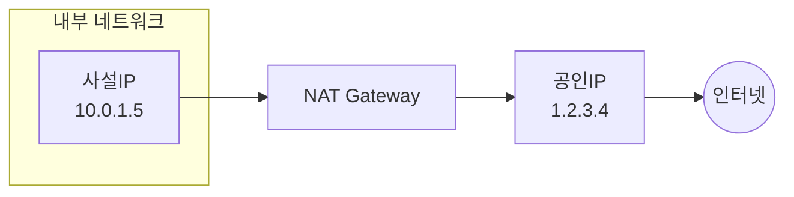
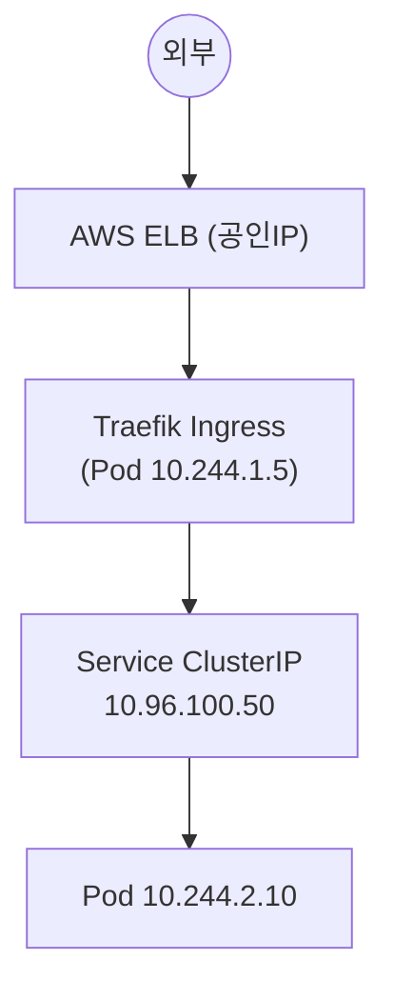

## 📌 들어가며

이번 글에서는 **공인IP와 사설IP**의 차이, 이를 잇는 **NAT**, 그리고 이 개념들이 **AWS VPC·Kubernetes 네트워크**에서 실제로 어떻게 쓰이는지 정리한다. Bastion·NAT Gateway·Service 타입까지 실무 패턴으로 연결한다.

> **한 줄 요약** — **공인IP**는 인터넷에 직접 노출되는 서비스(웹·API)에, **사설IP**는 내부 통신·보안이 필요한 서비스(DB·내부 API)에 쓴다. 둘을 잇는 것이 **NAT(Network Address Translation)**로, 사설IP를 공인IP로 변환해 인터넷에 내보낸다.

---

## 1. 공인IP vs 사설IP vs NAT



| 항목 | 공인IP | 사설IP |
|------|--------|--------|
| 접근 범위 | 인터넷 전체 | 내부 네트워크만 |
| 유일성 | 전 세계 유일 | 네트워크마다 재사용 |
| 할당 | IANA → ISP | 네트워크 관리자 |
| 비용 | 유료 | 무료 |
| 보안 | 직접 노출(위험) | 내부 격리(안전) |
| 예 | 1.2.3.4, 8.8.8.8 | 192.168.1.10, 10.0.1.5 |

**사설IP 대역(RFC 1918):**

| 클래스 | CIDR | IP 수 | 용도 |
|:---:|------|------|------|
| **A** | `10.0.0.0/8` | 약 1,677만 | 대규모·클라우드 VPC |
| **B** | `172.16.0.0/12` | 약 104만 | 중규모 |
| **C** | `192.168.0.0/16` | 65,536 | 가정·소규모 |

특수 대역: `127.0.0.0/8`(Loopback), `169.254.0.0/16`(Link-local, DHCP 실패 시).

> 💡 **NAT의 두 이점** — ① 여러 사설IP가 **하나의 공인IP를 공유**해 IP를 절약하고, ② 내부 구조를 숨겨 **보안**을 높인다. 프라이빗 서버가 인터넷에 나갈 때만 공인IP로 변환되고, 외부에서 먼저 들어오지는 못한다.

---

## 2. 기본 명령어

```bash
hostname -I              # 사설IP 확인
ip addr show eth0        # 인터페이스 IP
curl ifconfig.me         # 공인IP 확인
ip route                 # 라우팅 테이블
ping 8.8.8.8             # 통신 테스트
nc -zv 10.0.1.5 3306     # 포트 연결 테스트
```

```
# hostname -I → 192.168.1.10 10.0.1.5
# curl ifconfig.me → 203.0.113.45
```

---

## 3. AWS VPC — 공인/사설 서브넷 분리

**퍼블릭 서브넷(Bastion·NAT·LB)**과 **프라이빗 서브넷(K8s·DB)**을 나누는 것이 표준 구성이다.

```
VPC: 10.0.0.0/16
├─ Public Subnet (10.0.1.0/24)
│    Bastion·NAT Gateway·LoadBalancer (공인IP) → IGW 연결
└─ Private Subnet (10.0.2.0/24)
     K8s Master/Worker·Database → NAT Gateway 통해 인터넷
```

| 서브넷 | `0.0.0.0/0` 라우팅 |
|------|------|
| Public | 인터넷 게이트웨이(IGW) |
| Private | **NAT Gateway** |

---

## 4. Kubernetes 네트워크 계층

쿠버네티스는 **노드·Pod·Service**가 각기 다른 IP 대역을 쓴다.



| 네트워크 | 대역(예) | 설명 |
|------|------|------|
| 노드 | `10.100.x.x` | Master(퍼블릭)·Worker(프라이빗) |
| **Pod(Calico)** | `10.244.0.0/16` | 사설, Service로 접근 |
| **Service** | `10.96.0.0/12` | ClusterIP·NodePort |

---

## 5. NAT & Bastion 패턴

### NAT Gateway로 외부 API 호출

```bash
kubectl exec -it api-client -- curl https://api.github.com
# 출발: 10.244.1.10(Pod) → NAT Gateway에서 203.0.113.46으로 변환
# GitHub이 보는 IP: 203.0.113.46
```

### Bastion(점프 서버) & SSH 터널링

```bash
ssh -i bastion-key.pem ec2-user@203.0.113.45        # ① Bastion(공인)
ssh -i worker-key.pem ec2-user@10.0.2.11            # ② Private 인스턴스

# 로컬 → Bastion → K8s API 터널링
ssh -i bastion-key.pem -L 6443:10.0.2.10:6443 ec2-user@203.0.113.45
# → localhost:6443 이 K8s API(10.0.2.10:6443)로 연결
```

> 💡 **Private 인스턴스는 VPC 밖에서 라우팅되지 않는다.** 그래서 사설IP만 가진 워커·DB에는 **Bastion(공인IP)을 거쳐** 접속하거나 VPN을 쓴다. SSH 터널링(`-L`)으로 로컬 포트를 프라이빗 서비스에 연결하는 것이 흔한 패턴이다.

---

## 6. Service 타입별 IP

| 타입 | IP | 접근 |
|------|------|------|
| **ClusterIP** | 사설(Service CIDR) | 클러스터 내부만 |
| **NodePort** | 노드IP + 포트 | 노드 IP:포트(사설이면 VPN 필요) |
| **LoadBalancer** | **공인IP 자동 할당** | 인터넷 직접 |

---

## 7. 흔한 실수 & 트러블슈팅

> ⚠️ **흔한 실수** — ① 사설 대역(192.168.x)에 공인IP 할당 시도(불가), ② 사설IP로 외부 직접 접근(라우팅 안 됨 → NAT/VPN 필요), ③ NAT 없이 Private에서 `apt update`(실패), ④ Security Group에서 VPC CIDR 미허용(내부 통신 차단), ⑤ 공인IP 하드코딩(DNS 사용 권장), ⑥ **VPC 피어링 시 IP 대역 중복**(서로 다른 대역 사용).

```bash
# Private Pod에서 외부 API 실패 시 진단
kubectl exec -it api-client -- ping -c3 8.8.8.8   # ① Pod → 인터넷?
ssh worker-node-1 'ping 8.8.8.8'                  # ② 노드는 되나?(→ NAT 문제)
kubectl get networkpolicy -n <ns>                 # ③ Egress 차단?
# ④ AWS: NAT Gateway State·라우팅(0.0.0.0/0→NAT)·SG Outbound 확인
```

---

## 📝 정리

```
공인/사설 IP & K8s 네트워크
├─ 공인   인터넷 노출(웹·API), IANA 할당, 유일
├─ 사설   내부 통신(DB·Pod), RFC1918, 재사용
├─ NAT    사설→공인 변환(IP 절약·보안)
├─ VPC    Public(Bastion·NAT·LB) / Private(K8s·DB)
└─ Service ClusterIP(사설)/NodePort/LoadBalancer(공인)
```

| 개념 | 한 줄 정의 |
|------|------|
| **NAT** | 사설↔공인 IP 변환 |
| **Bastion** | 프라이빗 접근 관문 |
| **Pod/Service CIDR** | 사설 내부 네트워크 |

핵심은 **공인(노출)과 사설(격리)을 나누고, NAT로 잇는** 구조다. VPC에서 퍼블릭/프라이빗 서브넷을 분리하고, 쿠버네티스는 노드·Pod·Service 대역을 계층적으로 두며, 프라이빗 접근은 Bastion으로 좁힌다.

---

## 🔗 참고

- [RFC 1918 (Private IP)](https://datatracker.ietf.org/doc/html/rfc1918)
- [AWS VPC 공식 문서](https://docs.aws.amazon.com/vpc/)
