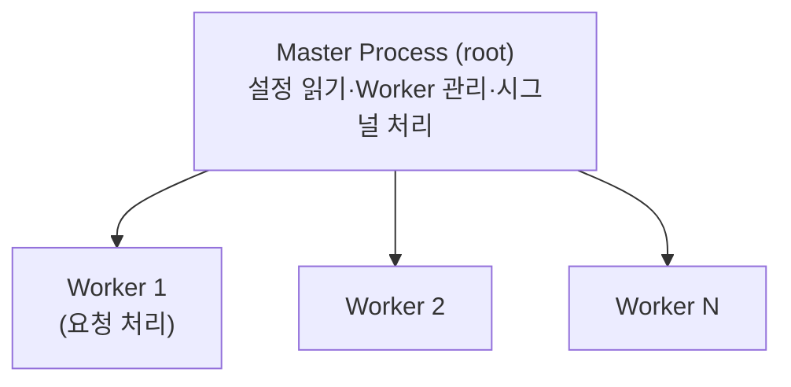
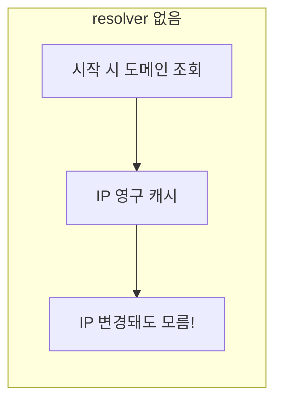

## 📌 들어가며

이번 글에서는 고성능 웹 서버이자 리버스 프록시인 **Nginx**를 정리한다. 아키텍처(Master/Worker)부터 `reload` vs `restart`, 주요 패턴(정적·프록시·LB·SSL), **DNS resolver 함정**, 보안(Rate Limit), 트러블슈팅, 쿠버네티스 연동까지 다룬다.

> **Nginx란?** **Event-driven(비동기)** 구조의 고성능 웹 서버·리버스 프록시. 정적 파일 서빙, 리버스 프록시, 로드밸런서, **SSL/TLS 종료**, 캐싱에 두루 쓰인다.

### Nginx vs Apache

| 항목 | **Nginx** | Apache |
|------|-----------|--------|
| 아키텍처 | Event-driven(비동기) | Process/Thread |
| 동시 접속 | 수만 개 | 수천 개 |
| 메모리 | 적음 | 많음 |
| 정적 파일 | 매우 빠름 | 보통 |
| 동적 처리 | 프록시 필요(PHP-FPM) | 모듈 직접 |

---

## 1. 아키텍처 — Master & Worker



```nginx
worker_processes auto;   # CPU 코어 수만큼 자동
events { worker_connections 1024; }  # Worker당 최대 연결
```

> 💡 **Master는 관리, Worker는 요청 처리**로 역할이 나뉜다. Master가 root로 설정을 읽고 Worker를 띄우며, 실제 트래픽은 Worker가 담당한다. Worker 수를 코어 수에 맞춰야 성능이 나온다.

---

## 2. 주요 명령어 & reload vs restart

```bash
sudo nginx -t                     # 설정 테스트(필수!)
sudo systemctl reload nginx       # 무중단 설정 반영
sudo nginx -T                     # include 포함 전체 설정 출력
sudo tail -f /var/log/nginx/error.log
```

| 상황 | 명령 | 이유 |
|------|------|------|
| 설정 변경 | **`reload`** | 무중단 |
| 모듈 추가·버전 업그레이드 | `restart` | 프로세스/바이너리 교체 |
| **DNS 캐시 초기화** | `restart` | reload는 캐시 유지 |

> 💡 **reload는 다운타임 0**이다. 새 Worker를 만들어 새 설정을 적용하고, 기존 Worker는 **처리 중인 연결을 끝까지 마친 뒤(graceful)** 종료한다. 반면 restart는 모든 연결이 끊긴다. 그래서 **설정 변경은 항상 `reload`**를 쓴다.

---

## 3. 주요 사용 패턴

### 정적 파일 + 캐싱

```nginx
server {
    listen 80;
    root /var/www/html;
    location / { try_files $uri $uri/ =404; }
    location ~* \.(jpg|png|css|js)$ {
        expires 1y;
        add_header Cache-Control "public, immutable";
    }
}
```

### 리버스 프록시

```nginx
location / {
    proxy_pass http://localhost:8080;
    proxy_set_header Host $host;
    proxy_set_header X-Real-IP $remote_addr;
    proxy_set_header X-Forwarded-For $proxy_add_x_forwarded_for;
}
```

### 로드밸런서 & SSL

```nginx
upstream backend_servers {
    server backend1:8080 weight=3;
    server backend2:8080 weight=1;
    server backend3:8080 backup;      # 예비 서버
}
server {
    listen 443 ssl;
    ssl_certificate     /etc/nginx/ssl/example.crt;
    ssl_certificate_key /etc/nginx/ssl/example.key;
    ssl_protocols TLSv1.2 TLSv1.3;
    location / { proxy_pass http://backend_servers; }
}
server {   # HTTP → HTTPS 리다이렉트
    listen 80;
    return 301 https://$host$request_uri;
}
```

---

## 4. DNS resolver 함정 (중요!)

Nginx의 자체 DNS는 OS DNS와 **완전히 별개**다. `proxy_pass`에 도메인을 직접 쓰면, **시작 시 한 번 조회한 IP를 영구 캐시**한다.



> ⚠️ **`proxy_pass http://도메인;`은 IP 변경을 감지 못 한다.** 백엔드 도메인의 IP가 바뀌면 502가 나고, `restart` 전까지 복구되지 않는다. 대표적인 운영 함정이다.

**해결 — resolver + 변수 사용:**

```nginx
http {
    resolver 168.126.63.1 8.8.8.8 valid=60s ipv6=off;
    resolver_timeout 5s;
    server {
        location / {
            set $backend "apis.data.go.kr";   # 변수 사용 필수!
            proxy_pass http://$backend;
        }
    }
}
```

| 패턴 | IP 변경 대응 |
|------|------|
| 도메인 직접(`proxy_pass http://도메인`) | ❌ restart 필요 |
| **변수 + resolver** | ✅ 자동 갱신(valid=60s) |

---

## 5. 보안 — Rate Limit & 헤더

```nginx
http {
    limit_req_zone $binary_remote_addr zone=mylimit:10m rate=10r/s;
    server {
        location /api/ {
            limit_req zone=mylimit burst=20 nodelay;  # 초당 10, 순간 20 허용
        }
    }
}
```

```nginx
add_header X-Frame-Options "SAMEORIGIN";
add_header X-Content-Type-Options "nosniff";
add_header X-XSS-Protection "1; mode=block";
```

IP 차단(`deny 10.0.0.0/8;`), 관리자 경로 화이트리스트(`allow 192.168.1.0/24; deny all;`), Basic Auth(`auth_basic` + `.htpasswd`)도 자주 쓴다.

---

## 6. 트러블슈팅

| 에러 | 원인 | 조치 |
|------|------|------|
| **502 Bad Gateway** | 백엔드 다운·방화벽·잘못된 proxy_pass | 백엔드 `curl`, error.log, SELinux(`httpd_can_network_connect`) |
| **504 Gateway Timeout** | 백엔드 응답 느림 | `proxy_read_timeout` 증가 |
| **413 Too Large** | 업로드 크기 초과 | `client_max_body_size 100M` |

```bash
sudo nginx -t                    # 문법 오류
sudo ss -tlnp | grep nginx       # 포트 확인
sudo nginx -T | grep resolver    # resolver 설정 확인
```

---

## 7. 쿠버네티스 연동

**ConfigMap으로 설정 관리** 시, 클러스터 내부 도메인은 **CoreDNS(10.96.0.10)**를 resolver로 지정한다.

```nginx
resolver 10.96.0.10 valid=30s;   # CoreDNS
set $backend "backend-service.default.svc.cluster.local";
proxy_pass http://$backend;
```

Ingress로는 **Nginx Ingress Controller**를 써서 `ingressClassName: nginx`로 라우팅한다.

---

## 📝 정리

```
Nginx
├─ 구조   Master(관리) + Worker(처리), Event-driven
├─ 반영   reload(무중단) vs restart(DNS 캐시 초기화)
├─ 패턴   정적·리버스 프록시·LB(upstream)·SSL 종료
├─ 함정   proxy_pass 도메인 → IP 캐시 → resolver+변수로 해결
└─ 보안   Rate Limit·보안 헤더·IP 차단
```

| 개념 | 한 줄 정의 |
|------|------|
| **reload** | 무중단 설정 반영 |
| **resolver** | 프록시 DNS 동적 갱신 |
| **upstream** | 백엔드 서버 그룹 |

Nginx 운영의 핵심은 **`nginx -t && reload`로 무중단 반영**하고, **프록시 시 resolver+변수로 DNS 캐시 함정을 피하는 것**이다. 이 두 습관만 지켜도 대부분의 운영 사고를 예방할 수 있다.

---

## 🔗 참고

- [Nginx 공식 문서](https://nginx.org/en/docs/)
