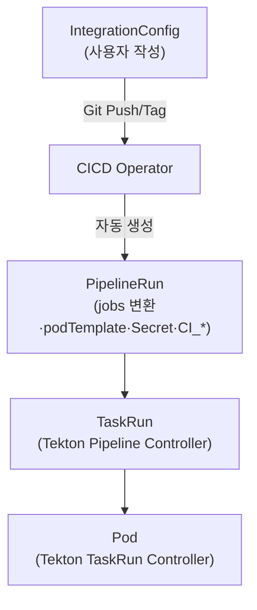

## 📌 들어가며

이번 글에서는 HyperCloud의 **CICD Operator**를 정리한다. **IntegrationConfig(IC)** 리소스를 감시하다가, Git 이벤트가 오면 **Tekton PipelineRun을 자동 생성**하는 쿠버네티스 Operator다. IC → PipelineRun → TaskRun → Pod로 이어지는 자동화 계층을 따라간다.

> **CICD Operator란?** IntegrationConfig를 감시해 **Git 이벤트 발생 시 Tekton PipelineRun을 자동 생성**하는 Operator. GitLab Webhook 등록, Secret·podTemplate 주입, 환경 변수(CI_*) 추가까지 자동으로 처리한다.

> **비유** — IntegrationConfig = **파이프라인 설계도**, CICD Operator = **설계도를 보고 자동으로 공장(PipelineRun)을 가동시키는 관리자**.

---

## 1. 자동 생성 계층 구조

사용자는 **IC와 Task만** 작성하고, 나머지(PipelineRun→TaskRun→Pod)는 컨트롤러들이 자동 생성한다.



**OwnerReference로 cascade 삭제:**

```
IC 삭제 → PipelineRun 삭제 → TaskRun 삭제 → Pod 삭제
```

> 💡 **OwnerReference 덕분에 IC 하나만 지우면 하위 리소스가 전부 정리**된다. 수동으로 만들면 PipelineRun·Pod를 따로 지워야 하지만, Operator가 소유 관계를 걸어두어 최상위(IC)만 관리하면 된다.

---

## 2. 실행 흐름 5단계

### ① IntegrationConfig 작성

```yaml
apiVersion: cicd.tmax.io/v1
kind: IntegrationConfig
metadata:
  name: aic-src-lata-shs-ic05
spec:
  git:
    repository: aic/src/aic-src-lata-shs
    apiUrl: https://gitlab.example.com/api/v4
  jobs:
    postSubmit:                       # Tag Push 이벤트 시
      - name: build-image
        tektonTask: {taskRef: {name: build-image-prd}}
        when:
          branch: (0|1|2|3|4|5|6|7|8|9)*   # 숫자로 시작하는 태그만
  secrets:
    - name: shg-harbor-cicdmgr-sec-aic
  podTemplate:
    nodeSelector: {node: aicmgp}
    tolerations:
      - {key: node, value: aicmgp, effect: NoSchedule}
```

### ② Operator가 Webhook 자동 등록

IC 생성을 감지 → `git.repository` 추출 → GitLab API로 Webhook 등록(`push`·`tag_push`·`merge_request`).

### ③ Git 이벤트 → ④ PipelineRun 자동 생성

`git push origin 1.0.0` → GitLab이 Webhook 전송 → Operator가 **IC의 jobs를 tasks로 변환**하고 podTemplate·Secret·환경 변수를 주입한 PipelineRun 생성.

### ⑤ Tekton이 TaskRun → Pod 생성

PipelineRun의 설정(nodeSelector·tolerations·imagePullSecrets)이 **하위로 상속**되어 최종 Pod에 반영된다.

---

## 3. 주요 자동화 기능

| 기능 | 설명 |
|------|------|
| **Webhook 자동 관리** | IC 생성 시 등록, 삭제 시 해제 |
| **조건부 실행(when)** | 브랜치/태그 패턴 매칭(정규식) |
| **Secret 자동 주입** | `imagePullSecrets` + Volume 마운트 |
| **환경 변수 주입** | `CI_SERVER_URL`·`CI_REPOSITORY`·`CI_HEAD_REF`·`CI_COMMIT_SHA` |

**조건부 실행 예시:**

```yaml
jobs:
  preSubmit:                   # MR 시
    - name: test
      when: {branch: (dev|stg).*}
  postSubmit:                  # Tag Push 시
    - name: deploy
      when: {branch: (0|1|2|3|4|5|6|7|8|9)*}
```

> 💡 **preSubmit(MR 검증) vs postSubmit(머지/태그 후 배포)**로 단계를 나눈다. `when`의 정규식으로 "dev/stg 브랜치는 테스트만", "숫자 태그는 배포"처럼 이벤트별 실행을 정교하게 제어한다.

---

## 4. CICD Operator vs 수동

| 항목 | **CICD Operator** | 수동 PipelineRun |
|------|-------------------|------------------|
| PipelineRun 생성 | 자동(Git 이벤트) | `kubectl apply` |
| Webhook | 자동 등록/해제 | 수동 |
| Secret/환경변수 | 자동 주입 | 수동 작성 |
| 조건부 실행 | when 자동 평가 | 불가 |
| 재사용성 | IC 하나로 무한 | 매번 작성 |

---

## 5. 확인 & 트러블슈팅

```bash
kubectl get ic -n shg-cicd-aic                              # IntegrationConfig
kubectl get pr -n shg-cicd-aic -l cicd.tmax.io/integration-config=<ic>  # PipelineRun
kubectl get tr -n shg-cicd-aic -l tekton.dev/pipelineRun=<pr>          # TaskRun
kubectl logs -n cicd-system deploy/cicd-operator -f        # Operator 로그
```

> ⚠️ **Webhook은 왔는데 PipelineRun이 안 생기면** `when` 조건(브랜치/태그 패턴)이 안 맞을 가능성이 높다. `kubectl get ic <ic> -o yaml | grep -A3 when`으로 패턴을 확인하자. Secret 마운트 실패·노드 오배치는 각각 Secret 존재 여부와 podTemplate 반영을 점검한다.

---

## 📝 정리

```
CICD Operator
├─ 역할   IC 감시 → PipelineRun 자동 생성
├─ 계층   IC → PipelineRun → TaskRun → Pod(OwnerRef cascade)
├─ 자동화 Webhook·Secret·환경변수·podTemplate 주입
└─ 조건   when(정규식)으로 이벤트별 실행 제어
```

| 개념 | 한 줄 정의 |
|------|------|
| **IntegrationConfig** | 파이프라인 설계도 |
| **CICD Operator** | IC → PipelineRun 변환기 |
| **OwnerReference** | 계층 cascade 삭제 |

CICD Operator의 핵심은 **사용자가 IC만 작성하면, Webhook부터 Pod 실행까지 전부 자동화**된다는 것이다. Git 이벤트 → PipelineRun → TaskRun → Pod의 계층을 이해하면, 문제 발생 시 어느 단계를 봐야 할지 명확해진다.

---

## 🔗 참고

- HyperCloud 전용 Operator(Tmax 개발). 오픈소스 대안은 **ArgoCD Events + Tekton Triggers**.
