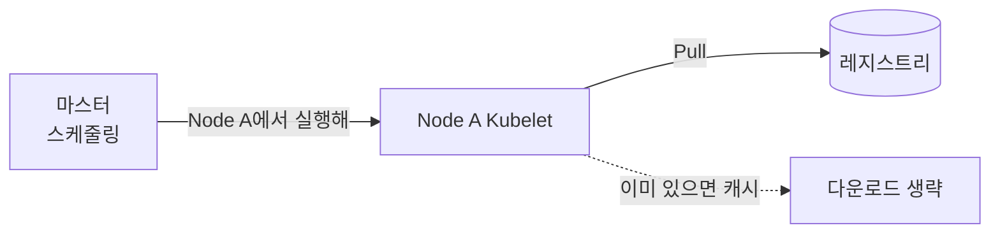
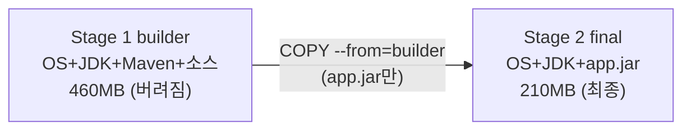

## 📌 들어가며

이번 글에서는 **Dockerfile**의 빌드 원리와, 이미지 크기를 극적으로 줄이는 **멀티스테이지 빌드**를 정리한다. 이미지 레이어 구조, 파드 실행 시 이미지 다운로드 원리, 그리고 실무(HyperCloud/Tekton) 패턴까지 다룬다.

> **Dockerfile이란?** Docker 이미지를 빌드하기 위한 **설계도**. 컨테이너 내부 파일시스템·실행 환경·시작 명령어를 정의한다. **빌드는 Docker(개발자), 실행은 Kubernetes(운영자)**로 역할이 나뉜다.

| 구분 | 주체 | 비유 |
|------|------|------|
| **Build** | Docker | **짐 싸는 사람** — 가방(이미지)에 파일을 넣고 잠금 |
| **Run** | Kubernetes | **이사 업체** — 가방을 노드로 배송·실행(내용물은 안 건드림) |

> 💡 쿠버네티스가 파일을 직접 넣는 경우는 **ConfigMap·Secret·PVC 마운트** 때뿐이다. 실행 파일(`.jar` 등)은 **이미지 빌드 시 포함**된다. 그래서 `/app/chatbot.jar`이 있는 이유는 쿠버네티스가 아니라 **Dockerfile에 그렇게 정의**했기 때문이다.

---

## 1. 파드 실행 시 이미지 다운로드

Deployment를 실행하면 **마스터가 아니라 파드가 스케줄된 워커 노드**가 직접 이미지를 받는다.



| 런타임 | 저장 경로 |
|--------|-----------|
| **containerd**(표준) | `/var/lib/containerd/` |
| Docker(구버전) | `/var/lib/docker/` |
| CRI-O | `/var/lib/containers/` |

---

## 2. 이미지 레이어 구조

이미지는 **읽기 전용 레이어의 집합**이다. 각 명령(`FROM`·`RUN`·`COPY`)이 하나의 레이어를 만든다.

```
┌─────────────────┐
│ Layer 4: APP    │  ← COPY (내 앱)
│ Layer 3: Maven  │  ← RUN (설치)
│ Layer 2: JDK    │  ← Java
│ Layer 1: OS     │  ← FROM (Ubuntu 등)
└─────────────────┘
```

```dockerfile
FROM openjdk:17-jdk                          # 베이스
WORKDIR /app                                 # 작업 디렉터리
COPY ./build/libs/chatbot.jar chatbot.jar    # 빌드 산출물 복사
CMD ["java", "-jar", "chatbot.jar"]          # 시작 명령
```

---

## 3. 단일 스테이지의 문제

빌드 도구까지 최종 이미지에 남아 **불필요하게 커진다.**

```
✅ app.jar (10MB)       ← 실제 필요
❌ Maven (100MB)        ← 빌드 후 불필요
❌ 의존성 jar (200MB)   ← 이미 app.jar에 포함
❌ 소스코드 (50MB)      ← 빌드 후 불필요
→ 결과: 500MB (필요한 건 10MB)
```

> ⚠️ 단일 스테이지는 **빌드 환경과 실행 환경이 뒤섞인다.** Maven·소스코드가 운영 이미지에 남아 크기가 커지고, **공격 표면**(불필요한 도구)도 늘어난다. 멀티스테이지가 이를 해결한다.

---

## 4. 멀티스테이지 빌드

**빌드 스테이지에서 만든 결과물만** 실행 스테이지로 복사하고, 빌드 환경은 통째로 버린다.

```dockerfile
# ===== Stage 1: 빌드 =====
FROM maven:3.8.4-openjdk-11 AS builder
COPY src /app/src
COPY pom.xml /app/
WORKDIR /app
RUN mvn clean package                # → /app/target/app.jar

# ===== Stage 2: 실행 =====
FROM openjdk:17-jdk-slim
COPY --from=builder /app/target/app.jar /app.jar   # jar만 복사
CMD ["java", "-jar", "/app.jar"]
```



**핵심은 `COPY --from`:**

```dockerfile
COPY --from=builder /app/target/app.jar /app.jar
#         │              │                │
#    어느 스테이지     그 스테이지 경로     최종 경로
```

> 💡 처리 순서는 **① Stage 1 빌드 → ② Stage 2가 Stage 1에서 `app.jar`만 복사 → ③ Stage 1 전체는 버림**이다. 그래서 최종 이미지에는 Maven·소스가 없다. `500MB → 210MB`로 줄고 보안도 강화된다.

---

## 5. 실무 패턴

### 다른 이미지에서 바이너리만 추출

JDK 버전이 다른 이미지에서 **Maven만** 가져오기:

```dockerfile
FROM jdk11-maven:3.8.4 AS maven-source
FROM jdk17:latest
COPY --from=maven-source /usr/share/maven /usr/share/maven
ENV MAVEN_HOME=/usr/share/maven
ENV PATH=$MAVEN_HOME/bin:$PATH
```

### HyperCloud CI/CD (Tekton)

```dockerfile
FROM hyperregistry.domain/maven:3.8.4-jdk11 AS builder
COPY . /workspace
WORKDIR /workspace
RUN mvn clean package -DskipTests

FROM hyperregistry.domain/openjdk:17-jre-slim
COPY --from=builder /workspace/target/*.jar /app/app.jar
HEALTHCHECK CMD curl -f http://localhost:8080/health || exit 1
ENTRYPOINT ["java", "-jar", "/app/app.jar"]
```

```
빌드 이미지(builder): 450MB → 버려짐
최종 이미지(myapp):   180MB → HyperRegistry 저장
```

`docker images`로 확인하면 최종 이미지만 작게 남고, 빌드 스테이지 이미지는 최종에 포함되지 않는다.

---

## 6. 멀티스테이지의 장점

| 장점 | 설명 |
|------|------|
| **크기 감소** | 500MB → 210MB(결과물만) |
| **보안 강화** | 빌드 도구·소스 제거 → 공격 표면↓ |
| **시작 속도** | 레이어 최소화 → 컨테이너 기동↑ |

---

## 📝 정리

```
Dockerfile & 멀티스테이지
├─ 개념   이미지 설계도(파일은 빌드 시 포함)
├─ 실행   워커 노드가 이미지 Pull(캐시 활용)
├─ 레이어  FROM/RUN/COPY 각각이 읽기전용 레이어
└─ 멀티스테이지 COPY --from으로 결과물만 → 크기·보안↑
```

| 개념 | 한 줄 정의 |
|------|------|
| **Dockerfile** | 이미지 빌드 설계도 |
| **레이어** | 명령 단위 읽기전용 층 |
| **COPY --from** | 멀티스테이지 핵심 |

멀티스테이지 빌드의 핵심은 **`COPY --from`으로 빌드 결과물만 실행 이미지에 담고 빌드 환경은 버리는 것**이다. 이 한 가지 기법으로 이미지 크기와 보안을 동시에 잡을 수 있어, 실무 CI/CD의 필수 패턴이다.
