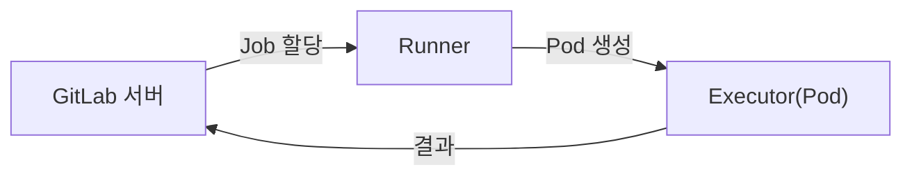
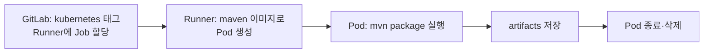

## 📌 들어가며

이번 글에서는 GitLab CI/CD 파이프라인을 실행하는 에이전트 **GitLab Runner**를 정리한다. Executor 종류·Runner 타입부터 **Kubernetes Executor** 설정, `.gitlab-ci.yml` 예시, 그리고 Tekton과의 비교까지 다룬다.

> **GitLab Runner란?** `.gitlab-ci.yml`에 정의된 CI/CD Job을 실제로 실행하는 **에이전트**. 코드 푸시·MR 이벤트가 발생하면 자동으로 빌드·테스트를 수행하며, Kubernetes에서는 **Job마다 Pod를 동적으로 생성**해 실행한다.



---

## 1. Executor & Runner 타입

**Executor**는 Job을 어디서 실행할지, **Runner 타입**은 어느 범위에서 쓸지를 정한다.

| Executor | 설명 | 시점 |
|----------|------|------|
| **Kubernetes** | Job마다 Pod 생성 | 가장 일반적·동적 스케일링 |
| **Docker** | Docker 컨테이너 | 단일 서버 |
| **Shell** | Runner 서버에서 직접 | 간단·레거시 |

| 타입 | 범위 |
|------|------|
| **Shared** | GitLab 인스턴스 전체 |
| **Group** | 특정 그룹 |
| **Specific** | 특정 프로젝트 |

> 💡 **Kubernetes Executor의 강점은 동적 스케일링**이다. Job이 오면 Pod를 만들고, 끝나면 삭제한다. 상시 서버를 띄워둘 필요가 없어 자원 효율적이고, 여러 Job이 동시에 와도 각자 격리된 Pod에서 실행된다.

---

## 2. Kubernetes Executor 설정 (config.toml)

Runner의 ConfigMap에 `executor = "kubernetes"`와 리소스 제한을 정의한다.

```toml
concurrent = 10        # 동시 실행 Job 수
[[runners]]
  name = "k8s-runner"
  url = "https://gitlab.example.com/"
  token = "RUNNER_TOKEN"
  executor = "kubernetes"
  [runners.kubernetes]
    namespace = "gitlab-runner"
    image = "alpine:latest"      # 기본 이미지(.gitlab-ci.yml에서 덮어씀)
    cpu_request = "100m"
    memory_request = "128Mi"
    cpu_limit = "1"
    memory_limit = "1Gi"
    [runners.kubernetes.volumes.pvc]
      name = "gitlab-runner-cache"
      mount_path = "/cache"        # 빌드 캐시
```

| 설정 | 역할 |
|------|------|
| `concurrent` | 동시 실행 Job 수 제한 |
| `image` | Job 기본 이미지(덮어쓰기 가능) |
| 리소스 limit | 클러스터 과부하 방지 |
| `pvc /cache` | 빌드 캐시 저장 |

---

## 3. `.gitlab-ci.yml` & 동작 흐름

```yaml
stages: [build, test]
build-job:
  stage: build
  image: maven:3.8-openjdk-11    # Runner 기본 이미지 덮어씀
  tags: [kubernetes]             # 이 태그의 Runner에서만 실행
  script:
    - mvn clean package -DskipTests
  artifacts:
    paths: [target/*.jar]
    expire_in: 1 hour
  only: [main, merge_requests]
```



> 💡 **태그 기반 할당**이 핵심이다. Job에 `tags: [kubernetes]`를 달면 해당 태그를 가진 Runner만 그 Job을 집는다. 이걸로 "GPU Job은 GPU Runner에", "빌드는 K8s Runner에"처럼 Job을 적절한 실행 환경에 라우팅한다.

---

## 4. GitLab Runner vs Tekton

| 항목 | **GitLab Runner** | **Tekton** |
|------|-------------------|------------|
| 트리거 | GitLab 이벤트(push·MR) | 수동·EventListener |
| 설정 위치 | `.gitlab-ci.yml`(저장소) | Pipeline YAML(클러스터) |
| 의존성 | GitLab 서버 필요 | 독립(K8s만) |
| 재사용 | Job 템플릿(include) | Task(taskRef) |
| 캐싱 | 기본 지원(artifacts) | 별도 구성 |
| 병렬 | `parallel` | DAG |

> 💡 **HyperCloud IC → GitLab Runner 전환 이유** — ① GitLab CI/CD는 **업계 표준**(HyperCloud IC는 Tmax 종속), ② **플랫폼 독립성**(EKS 마이그레이션 대비), ③ 캐싱·병렬에서 **성능** 우수, ④ 풍부한 **커뮤니티·레퍼런스**.

---

## 5. 명령어 & 주의사항

```bash
kubectl get pods -n gitlab-runner              # Runner Pod
kubectl logs -n gitlab-runner -f               # 로그
kubectl get configmap -n gitlab-runner gitlab-runner -o yaml
```

> ⚠️ **버전 호환성** — Runner와 GitLab 버전 차이가 **2 major 이상**이면 문제가 생길 수 있다. K8s 1.21은 Runner 14.x+, GitLab 15.3.2-ce는 Runner 15.x가 궁합이 좋다.

---

## 📝 정리

```
GitLab Runner
├─ 역할   .gitlab-ci.yml Job 실행 에이전트
├─ Executor Kubernetes(Pod 동적 생성)·Docker·Shell
├─ 설정   config.toml(concurrent·image·리소스·캐시)
├─ 할당   태그 기반(tags) Job 라우팅
└─ vs Tekton 이벤트 vs 독립, 캐싱 기본 지원
```

| 개념 | 한 줄 정의 |
|------|------|
| **GitLab Runner** | CI/CD Job 실행 에이전트 |
| **K8s Executor** | Job마다 Pod 생성 |
| **태그 할당** | Job을 특정 Runner로 |

GitLab Runner의 핵심은 **Kubernetes Executor로 Job마다 Pod를 띄우고, 태그로 적절한 Runner에 라우팅**하는 것이다. `.gitlab-ci.yml`에 파이프라인을 코드로 두어, 소스 저장소와 CI를 한곳에서 관리한다.
