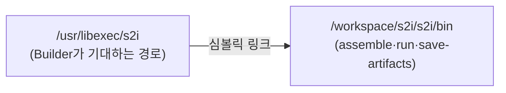
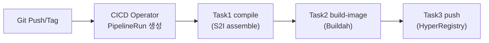

## 📌 들어가며

이번 글에서는 소스 코드를 컴파일하는 스크립트 기반 빌드 도구 **S2I(Source to Image)**를 정리한다. Red Hat/OpenShift가 만든 방식으로, Tekton 파이프라인의 **컴파일 단계**에서 `assemble` 스크립트로 빌드 산출물(JAR/WAR)을 만든다.

> **S2I란?** S2I **Builder Image 내부에서 소스를 컴파일/빌드**하는 스크립트 도구. 핵심은 **이미지를 만들지 않는다**는 점 — 컴파일 도구가 설치된 환경을 제공해 **빌드 산출물만** 생성하고, 이미지 생성은 별도 Task(Buildah 등)가 담당한다.

```
소스 코드 → assemble 스크립트 → 컴파일 산출물(JAR/WAR)
```

---

## 1. assemble 스크립트

S2I Builder Image 내부 **표준 경로**에 존재하는 빌드 스크립트다.

| 항목 | 값 |
|------|------|
| 스크립트 위치 | `/usr/libexec/s2i/assemble` |
| 입력 경로 | `/tmp/src`(소스) |
| 출력 경로 | `/tmp/src/target` 또는 `/dist` |
| 실행 | `sh /usr/libexec/s2i/assemble` |

---

## 2. Tekton Workspace 연결 (심볼릭 링크)

S2I Builder Image가 기대하는 표준 경로(`/usr/libexec/s2i`)와 Tekton Workspace 경로를 **심볼릭 링크**로 잇는다.

```bash
ln -s $(workspaces.s2i.path)/s2i/bin /usr/libexec/s2i
# /usr/libexec/s2i ──링크──→ /workspace/s2i/s2i/bin
```



> 💡 **왜 링크를 거나** — S2I Builder Image는 무조건 `/usr/libexec/s2i/assemble`을 찾는다. 하지만 실제 스크립트는 Tekton Workspace(PVC)에 있다. 그래서 표준 경로를 Workspace로 **링크**해, Builder가 기대하는 위치에서 실제 스크립트가 실행되게 한다.

---

## 3. 실무 — Maven 컴파일 Task

```yaml
apiVersion: tekton.dev/v1beta1
kind: Task
metadata:
  name: maven-build
spec:
  workspaces:
    - name: source
  steps:
    - name: compile
      image: registry.example.com/s2i-java:11   # Maven 포함 Builder
      workingDir: $(workspaces.source.path)
      script: |
        #!/bin/bash
        set -e
        mkdir -p /tmp/src
        cp -R $(workspaces.source.path)/. /tmp/src/      # ① Workspace → /tmp/src
        sh /usr/libexec/s2i/assemble                      # ② assemble 실행
        cp -R /tmp/src/target $(workspaces.source.path)/  # ③ 산출물 → Workspace
        ls -la $(workspaces.source.path)/target/*.jar
```

**assemble 내부(예시):**

```bash
#!/bin/bash -e
cd /tmp/src
mvn clean package -DskipTests
```

---

## 4. 전체 빌드 흐름

S2I는 **컴파일**만 담당하고, 이미지 빌드·푸시는 뒤 Task가 맡는다.



| Task | 도구 | 역할 |
|------|------|------|
| compile | **S2I assemble** | 소스 → JAR |
| build-image | Buildah/Podman | JAR → 컨테이너 이미지 |
| push | - | 레지스트리 푸시 |

---

## 5. 흔한 실수

> ⚠️ **① 산출물 복사 누락** — `assemble` 후 `/tmp/src/target`을 **Workspace로 복사 안 하면** 다음 Task에서 JAR을 못 찾는다.
> **② 소스 경로 혼동** — Workspace에서 바로 assemble하면 `/tmp/src`에 소스가 없어 실패. **반드시 `/tmp/src`로 먼저 복사**.
> **③ `set -e` 누락** — 없으면 Maven 빌드가 실패해도 Task가 성공으로 표시된다. 스크립트 첫 줄에 `set -e`를 둔다.

```bash
# ✅ 올바른 순서
cp -R $(workspaces.source.path)/. /tmp/src/   # 소스 복사
sh /usr/libexec/s2i/assemble                   # 빌드
cp -R /tmp/src/target $(workspaces.source.path)/   # 산출물 회수
```

---

## 📝 정리

```
S2I (Source to Image)
├─ 역할   assemble로 소스 컴파일(이미지 X, 산출물 O)
├─ 경로   /usr/libexec/s2i/assemble ← Workspace 심볼릭 링크
├─ 흐름   compile(S2I) → build-image(Buildah) → push
└─ 실수   산출물 복사·소스 경로·set -e 누락 주의
```

| 개념 | 한 줄 정의 |
|------|------|
| **S2I** | 소스 컴파일 스크립트 도구 |
| **assemble** | 빌드 산출물 생성 스크립트 |
| **역할 분담** | S2I=컴파일, Buildah=이미지 |

S2I의 핵심은 **assemble이 컴파일만 하고 이미지는 안 만든다**는 것이다. 언어별 Builder Image만 교체하면 Java·Node·Python을 **동일한 파이프라인 구조로 표준화**할 수 있는 것이 최대 장점이다.

---

## 🔗 참고

- [Red Hat - 소스 코드에서 이미지 생성(S2I)](https://docs.redhat.com/ko/documentation/openshift_container_platform/4.6/html/images/images-create-s2i_create-images)
