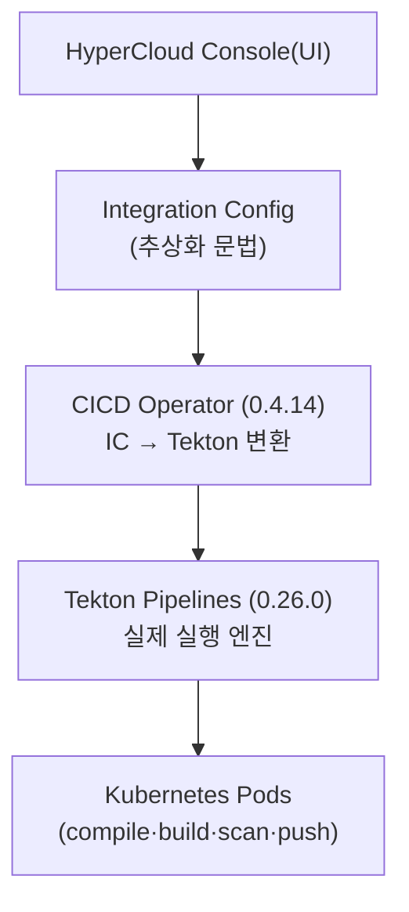
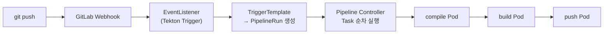

## 📌 들어가며

이번 글에서는 **Tekton**과 **HyperCloud Integration Config(IC)**의 관계를 정리한다. 결론부터 말하면 **IC는 Tekton을 감싼 추상화 레이어(껍데기)**이고, **실제로 일하는 엔진은 Tekton**이다. 각 컴포넌트의 역할과 IC↔Tekton 변환, 그리고 둘의 장단점을 비교한다.

> **핵심 결론** — IC는 "**간단한 설정 문법**", CICD Operator는 "**IC → Tekton 번역기**", Tekton은 "**실제 실행 엔진**"이다. 사용자는 IC만 알면 되고, 그 뒤에서 Operator가 Tekton 리소스로 변환해 실행한다.

---

## 1. 전체 계층 구조



| 컴포넌트 | 역할 | 비유 |
|----------|------|------|
| **Integration Config** | 파이프라인 템플릿(간소화) | 한국어 레시피 |
| **CICD Operator** | IC → Tekton 변환 | 번역기 |
| **Tekton Pipelines** | 실제 실행 엔진 | 주방 장비 |
| **Kubernetes** | Pod 실행 인프라 | 주방 공간 |

---

## 2. Tekton — 실행 엔진

Kubernetes-native CI/CD 프레임워크로, **Task → Pipeline → PipelineRun**의 3계층이 핵심이다.

| 리소스 | 역할 |
|--------|------|
| **Task** | 재사용 가능한 작업 단위(steps) |
| **Pipeline** | Task들의 순서 정의(runAfter) |
| **PipelineRun** | Pipeline 실행 인스턴스 |

```yaml
# Pipeline: Task 순서
kind: Pipeline
spec:
  tasks:
  - name: compile
    taskRef: {name: maven-compile}
  - name: build-image
    taskRef: {name: buildah-build}
    runAfter: [compile]        # compile 완료 후
```

Tekton은 **Pod 생성·실행, Workspace/Results로 Task 간 데이터 전달, 상태 추적, 로그 수집**을 담당한다.

---

## 3. Integration Config — 추상화 레이어

HyperCloud가 Tekton 위에 얹은 **설정 간소화 도구**다. Git 연동·트리거·Webhook을 간단한 문법으로 선언한다.

```yaml
apiVersion: cicd.tmax.io/v1
kind: IntegrationConfig
spec:
  git:
    type: gitlab
    url: https://gitlab.example.com/myapp.git
  jobs:
    preSubmit:                 # MR 시
    - {name: test, image: maven:3.8, script: mvn test}
    postSubmit:                # merge 후
    - {name: compile, image: scr-maven-img-aicd, script: /usr/local/s2i/bin/assemble}
    - name: build-image
      image: buildah:v1.23.3
      script: buildah bud -t myapp:latest
      when: [{key: refs, value: refs/heads/main}]
  triggers:
  - type: gitlab
    gitlab: {push: {branch: main}}
```

> 💡 **IC는 직접 실행하지 않는다.** 간소화된 문법으로 파이프라인을 선언할 뿐, 실제 실행은 Operator가 Tekton으로 변환한 뒤 이뤄진다. IC는 "무엇을 할지", Tekton은 "어떻게 실행할지"를 맡는다.

---

## 4. CICD Operator — 번역기

IC를 감지해 **Tekton 리소스 세트(Task·Pipeline·TriggerTemplate·TriggerBinding·EventListener)**를 자동 생성하고 GitLab Webhook을 등록한다.

```bash
# IC 하나가 만들어내는 Tekton 리소스들
kubectl get task,pipeline,triggertemplate,eventlistener -n shg-cicd-aicd
# → myapp-compile, myapp-build, myapp-pipeline, myapp-trigger, myapp-listener
```

---

## 5. 코드 푸시 실행 흐름



각 Task는 **별도 Pod**에서 실행되고 완료 후 자동 삭제되며, PipelineRun 상태(Succeeded/Failed)가 Console에 표시된다.

---

## 6. IC vs Tekton 직접 사용

| 방식 | 장점 | 단점 |
|------|------|------|
| **IC(HyperCloud)** | 간단한 문법·UI 관리·Webhook 자동·Tekton 몰라도 사용 | **HyperCloud 전용**(이식성↓)·고급 분기 제한 |
| **Tekton 직접** | 완전한 제어·**이식성**·커뮤니티 Task 재사용 | 학습 곡선↑·YAML 많음·Webhook 수동 |

> 💡 **HyperCloud가 IC를 만든 이유** — Tekton은 강력하지만 K8s 전문가용이라 진입 장벽이 높다. IC로 감싸 **개발자도 쉽게** 쓰게 하고, HyperAuth·HyperRegistry·Console과 자동 연동했다. 다만 Tmax 종속이라, **표준화·플랫폼 독립성**을 위해 GitLab Runner로 전환하는 흐름도 있다.

---

## 7. 확인 명령어

```bash
kubectl get tasks,pipelines,pipelineruns -n shg-cicd-aicd   # IC가 만든 리소스
kubectl get ic myapp-ic -n shg-cicd-aicd -o yaml            # IC 원본
tkn pipelinerun logs -f <pr-name> -n shg-cicd-aicd          # 실시간 로그
kubectl logs -n cicd-system -l app=cicd-operator -f         # 변환 과정
```

---

## 📝 정리

```
Tekton vs IC
├─ 관계   IC(껍데기) → Operator(번역) → Tekton(엔진) → Pod
├─ Tekton Task→Pipeline→PipelineRun(실제 실행)
├─ IC     간소화 문법(Git·트리거·Webhook 자동)
└─ 선택   IC(쉬움·종속) vs Tekton(제어·이식성)
```

| 개념 | 한 줄 정의 |
|------|------|
| **IC** | Tekton 추상화 레이어 |
| **CICD Operator** | IC → Tekton 변환기 |
| **Tekton** | 실제 파이프라인 엔진 |

핵심은 **IC는 껍데기, Tekton이 엔진**이라는 것이다. IC로 쉽게 시작하되 내부적으로는 Tekton이 돌아간다는 구조를 이해하면, 트러블슈팅 시 어느 계층(IC 문법 / Operator 변환 / Tekton 실행)을 봐야 할지 명확해진다.

---

## 🔗 참고

- [HyperCloud CICD 공식 문서](https://docs.hypercloud.com/cicd/)
