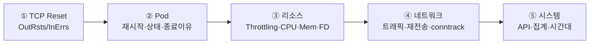

## 📌 들어가며

이번 글에서는 **TCP Reset 분석과 쿠버네티스 트러블슈팅**에서 실제로 쓴 **PromQL 쿼리**를 목적별로 정리한다. TCP·리소스·네트워크·API Server 지표부터, 실제 Traefik CPU Throttling 장애 분석 사례와 단계별 체크리스트까지 다룬다.

> **왜 지표를 목적별로 묶나?** 장애가 나면 "무슨 쿼리를 던져야 할지"가 막막하다. **TCP → Pod → 리소스 → 네트워크 → 시스템** 순으로 정리해두면, 증상에서 원인으로 좁혀가는 진단 경로를 그대로 따라갈 수 있다.

---

## 1. TCP Reset 지표

```promql
rate(node_netstat_Tcp_OutRsts[5m])   # 송신 RST
rate(node_netstat_Tcp_InErrs[5m])    # 수신 에러
node_netstat_Tcp_CurrEstab           # ESTABLISHED 연결 수
rate(node_netstat_Tcp_RetransSegs[5m])   # 재전송
node_nf_conntrack_entries / node_nf_conntrack_entries_limit * 100  # conntrack 사용률
```

| 지표 | 정상 | 주의 | 비정상 |
|------|:---:|:---:|:---:|
| `OutRsts` | 0~1 | 1~10 | 10+ |
| `InErrs` | 0 | 0.01~0.1 | 0.1+ |

> 💡 **OutRsts vs InErrs 패턴 해석** — OutRsts↑ + InErrs↓ = **애플리케이션 문제**, OutRsts↓ + InErrs↑ = **네트워크 문제**, 둘 다↑ = **전체 과부하**. 두 지표의 조합만으로 원인 방향을 잡을 수 있다.

---

## 2. Pod / Container 지표

```promql
# 재시작 (0 정상, 0.01+ 재시작 중)
sum(rate(kube_pod_container_status_restarts_total[5m])) by (namespace, pod)

# Non-Running 상태 (Pending/Failed/Unknown)
kube_pod_status_phase{phase!="Running"}

# 컨테이너 종료 이유 (OOMKilled/Error/Completed)
kube_pod_container_status_last_terminated_reason

# 네트워크 패킷 드롭 (0.1+ 문제)
rate(container_network_receive_packets_dropped_total[5m])
```

---

## 3. 리소스 사용률 (핵심)

### CPU Throttling — 가장 중요한 지표

```promql
rate(container_cpu_cfs_throttled_seconds_total[5m])
topk(10, rate(container_cpu_cfs_throttled_seconds_total[5m]))   # 상위 10개
```

| 수치 | 상태 |
|:---:|------|
| 0 | 정상 |
| 0.01~0.1 | 주의 |
| 0.1~1 | 비정상 |
| 1+ | **심각** |

### Memory / File Descriptor

```promql
container_memory_usage_bytes / container_spec_memory_limit_bytes * 100   # 90%+ 위험
process_open_fds / process_max_fds * 100                                 # 80%+ 위험
```

> ⚠️ **CPU Throttling은 "사용률이 낮아도" 성능 문제를 일으킨다.** CPU limit에 자주 부딪히면 요청이 지연되는데, 이건 사용률(%) 지표에는 잘 안 드러난다. 지연·타임아웃 장애 시 **Throttling을 최우선**으로 확인해야 하는 이유다.

---

## 4. 네트워크 & API Server

```promql
# 트래픽 (bytes/sec)
sum(rate(container_network_receive_bytes_total{pod=~"traefik.*"}[5m]))

# API Server P99 응답 시간 (ms) — <100 정상, >500 비정상
histogram_quantile(0.99, rate(apiserver_request_duration_seconds_bucket[5m])) * 1000

# API 요청 실패율 (5xx) — <1% 정상
rate(apiserver_request_total{code=~"5.."}[5m])
```

**Traefik 전용**(`--metrics.prometheus=true` 필요):

```promql
histogram_quantile(0.99, rate(traefik_service_request_duration_seconds_bucket[5m]))  # P99
rate(traefik_service_requests_total{code=~"5.."}[5m])   # 5xx 에러율
traefik_entrypoint_open_connections                     # 동시 연결
```

---

## 5. 집계 & 시간대 비교

```promql
# 노드별 OutRsts
sum(rate(node_netstat_Tcp_OutRsts[5m])) by (instance)

# 네임스페이스별 CPU Top 10
topk(10, sum by (namespace) (rate(container_cpu_usage_seconds_total{namespace!~"kube-system|monitoring"}[5m])))

# 현재 vs 1시간 전
rate(node_netstat_Tcp_OutRsts[5m]) / rate(node_netstat_Tcp_OutRsts[5m] offset 1h)
```

---

## 6. 실제 사례 — Traefik CPU Throttling

> 2025-12-16 발화 지연 이슈 분석에 사용한 쿼리다.

```promql
# ① Throttling → 결과: 4.xx (매우 심각)
rate(container_cpu_cfs_throttled_seconds_total{pod=~"traefik.*"}[5m])
# ② CPU 사용률 → 87%
# ③ 트래픽 증가 → +10%(소폭)
```

**정상 확인(이상 없음):** Memory·패킷 드롭·FD·재시작 모두 정상.

> 💡 **결론: CPU Throttling이 원인** → limit `300m → 1000m`으로 증가해 해결. 트래픽은 소폭 증가했는데 Throttling이 4를 넘었다는 건, limit이 너무 낮아 정상 부하도 못 견뎠다는 뜻이다. 사용률(87%)만 봤다면 놓쳤을 원인이다.

---

## 7. 트러블슈팅 체크리스트



| 단계 | 핵심 지표 |
|------|------|
| ① TCP | OutRsts / InErrs / 노드별 분포 |
| ② Pod | 재시작 / Non-Running / 종료 이유 / 드롭 |
| ③ 리소스 | **CPU Throttling** / CPU / Mem / FD |
| ④ 네트워크 | 트래픽 / 재전송 / conntrack |
| ⑤ 시스템 | API 응답 / 집계 / 시간대 비교 |

---

## 📝 정리

```
PromQL 트러블슈팅
├─ TCP     OutRsts/InErrs 패턴으로 앱 vs 네트워크 구분
├─ Pod     재시작·종료이유(OOMKilled)·드롭
├─ 리소스   CPU Throttling(핵심!)·Mem·FD
├─ 시스템   API P99·5xx·집계·시간대 비교
└─ 사례     Throttling 4+ → CPU limit 상향으로 해결
```

| 개념 | 한 줄 정의 |
|------|------|
| **CPU Throttling** | limit에 걸린 지연(핵심 지표) |
| **OutRsts/InErrs** | 앱/네트워크 문제 구분 |
| **P99** | 상위 1% 응답 시간 |

PromQL 트러블슈팅의 핵심은 **증상에서 원인으로 좁혀가는 순서(TCP→Pod→리소스→네트워크→시스템)**를 지표로 갖춰두는 것이다. 특히 지연 장애는 사용률이 아니라 **CPU Throttling**을 먼저 의심하자.
