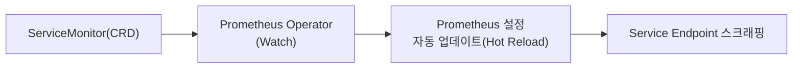
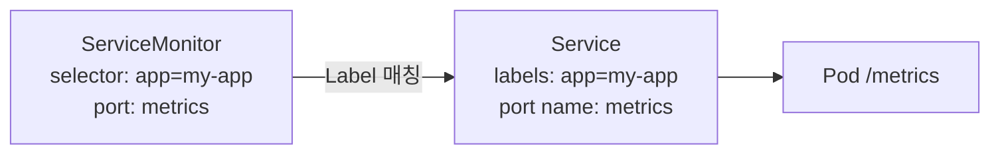

## 📌 들어가며

이번 글에서는 Prometheus가 모니터링 대상을 **자동으로 발견**하게 해주는 **ServiceMonitor**를 정리한다. Prometheus 설정 파일을 직접 고치지 않고, YAML 선언만으로 타겟을 관리하는 방식이다. 기본 구조부터 Relabeling·Spring Boot 연동·트러블슈팅까지 다룬다.

> **ServiceMonitor란?** Prometheus Operator가 **모니터링 대상을 자동 발견·수집**하기 위한 **CRD**. ServiceMonitor를 만들면 Operator가 이를 감지해 **Prometheus 설정을 자동 업데이트(Hot Reload)**하고, Service의 Endpoint를 스크래핑한다.



---

## 1. 핵심 개념

### Operator의 역할

ServiceMonitor·PodMonitor·PrometheusRule 같은 CRD를 Watch하며, **Prometheus Pod 재시작 없이** 설정을 반영한다.

### ServiceMonitor vs PodMonitor

| 항목 | **ServiceMonitor** | **PodMonitor** |
|------|--------------------|----------------|
| 타겟 | Service → Endpoint | Pod 직접 |
| 사용 | Service가 있는 경우(일반) | Service 없이 Pod만 |
| 예 | 웹앱·API 서버 | StatefulSet·DaemonSet |

> 💡 **선언적 설정이 핵심**이다. 예전엔 Prometheus 설정 파일에 타겟을 직접 적었지만, ServiceMonitor는 앱 배포 시 **모니터링도 YAML로 함께 선언**해 자동화한다. 앱이 늘어도 설정을 손댈 필요가 없다.

---

## 2. 기본 구조 — Label로 연결

ServiceMonitor의 `selector`와 Service의 `labels`, `endpoints.port`와 Service의 `ports.name`이 **반드시 일치**해야 한다.

```yaml
apiVersion: monitoring.coreos.com/v1
kind: ServiceMonitor
metadata:
  name: my-app-monitor
  labels:
    prometheus: kube-prometheus   # Prometheus가 선택할 Label
spec:
  selector:
    matchLabels:
      app: my-app                 # ← Service의 label과 일치
  namespaceSelector:
    matchNames: [default]
  endpoints:
  - port: metrics                 # ← Service의 port name과 일치
    interval: 30s
    path: /metrics
```

```yaml
apiVersion: v1
kind: Service
metadata:
  name: my-app-service
  labels:
    app: my-app                   # ← selector와 일치
spec:
  ports:
  - name: metrics                 # ← endpoints.port와 일치
    port: 8080
    targetPort: 8080
```



---

## 3. 주요 패턴

| 패턴 | 방법 |
|------|------|
| **여러 엔드포인트** | `endpoints`에 포트별(app/jvm/custom) 여러 항목 |
| **여러 네임스페이스** | `namespaceSelector.matchNames`에 나열 + Service에 공통 label(`monitoring: "true"`) |
| **HTTPS/인증** | `scheme: https` + `tlsConfig` + `basicAuth`(Secret 참조) |

### Relabeling — Label 가공 & 메트릭 필터

```yaml
endpoints:
- port: metrics
  relabelings:                    # 스크래핑 전 Label 가공
  - sourceLabels: [__meta_kubernetes_pod_label_environment]
    regex: production
    action: keep                  # production만 수집
  metricRelabelings:              # 수집 후 처리
  - sourceLabels: [__name__]
    regex: "(http_requests_total|http_request_duration_seconds.*)"
    action: keep                  # 특정 메트릭만 유지
  - regex: "pod_template_hash"
    action: labeldrop             # 불필요 Label 제거
```

> 💡 **relabelings(수집 전) vs metricRelabelings(수집 후)** — 전자는 어떤 타겟을 스크래핑할지·어떤 Label을 붙일지 결정하고, 후자는 이미 가져온 메트릭 중 무엇을 저장할지 거른다. `metricRelabelings`로 불필요한 메트릭을 버리면 **스토리지가 크게 절약**된다.

### Spring Boot Actuator 연동

```yaml
# ServiceMonitor
endpoints:
- port: actuator
  interval: 15s
  path: /actuator/prometheus      # Actuator 경로
```

```yaml
# application.yml
management:
  endpoints:
    web:
      exposure:
        include: prometheus,health,info
  server:
    port: 8081                     # Actuator 전용 포트
```

---

## 4. 트러블슈팅 — 흔한 실수

> ⚠️ **7대 실수** — ① **ServiceMonitor selector ↔ Service label 불일치**(가장 흔함), ② **포트 이름 불일치**, ③ Prometheus의 `serviceMonitorSelector`가 이 ServiceMonitor를 선택 안 함, ④ 다른 NS 접근 **RBAC 권한 없음**, ⑤ 메트릭 **경로 오류**(/metrics vs /actuator/prometheus), ⑥ **interval 너무 짧음**(과부하), ⑦ **Operator 로그 미확인**.

```bash
# 진단 순서
kubectl get svc -n <ns> --show-labels                     # ① label 확인
kubectl get servicemonitor <name> -o yaml | grep -A5 selector  # ② selector 확인
kubectl get endpoints <svc> -n <ns>                       # ③ Endpoint 생성?
kubectl exec -it <pod> -- curl localhost:8080/metrics     # ④ 메트릭 경로 확인
kubectl logs -n monitoring prometheus-operator-<pod> | grep -i error  # ⑤ Operator 에러
# Prometheus UI: http://<url>/targets 에서 up{job="<svc>"} 확인
```

> 💡 **타겟이 안 보이면 Label 매칭부터** 의심하자. `selector: app=my-app`인데 Service가 `application=my-app`이면 Prometheus는 영영 발견하지 못한다. `--show-labels`로 실제 값을 눈으로 대조하는 것이 가장 빠르다.

---

## 5. 운영 참고

**Grafana 연동 흐름**: `ServiceMonitor → Prometheus(저장) → Grafana(Data Source) → PromQL 대시보드`.

| 항목 | 권장 |
|------|------|
| `interval` | 중요도에 따라 **15s~60s** |
| 메트릭 필터 | `metricRelabelings`로 불필요 제거 |
| 보안(금융권) | 민감정보 노출 금지·내부망만 접근·불필요 Label 제거 |
| API 버전 | `monitoring.coreos.com/v1` |

---

## 📝 정리

```
ServiceMonitor
├─ 개념   Prometheus 타겟 자동 발견 CRD(Hot Reload)
├─ 연결   selector↔label, port명 일치 필수
├─ 가공   relabelings(수집전)·metricRelabelings(수집후)
├─ 연동   Spring Actuator(/actuator/prometheus)
└─ 함정   Label/포트 불일치 → 타겟 안 보임
```

| 개념 | 한 줄 정의 |
|------|------|
| **ServiceMonitor** | 선언적 모니터링 타겟 |
| **Label 매칭** | selector ↔ Service label |
| **Relabeling** | Label·메트릭 가공/필터 |

ServiceMonitor의 핵심은 **YAML 선언만으로 Prometheus 타겟을 자동 관리**하는 것이다. 대부분의 문제는 **Label·포트 이름 불일치**에서 오므로, 타겟이 안 보이면 이 매칭부터 확인하는 것이 정석이다.

---

## 🔗 참고

- [ServiceMonitor 공식 문서](https://prometheus-operator.dev/docs/operator/api/#monitoring.coreos.com/v1.ServiceMonitor)
