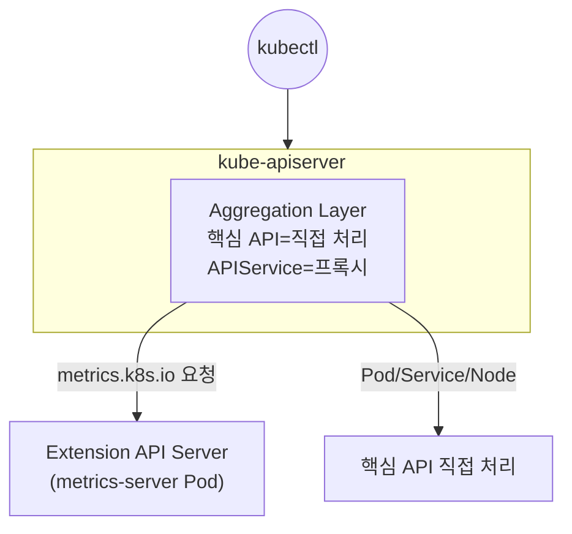

## 📌 들어가며

이번 글에서는 쿠버네티스 API를 확장하는 핵심 리소스 **APIService**를 정리한다. 기본 `kube-apiserver`가 처리하지 않는 API 그룹을 **다른 서버(Extension API Server)로 프록시**하는 메커니즘으로, `kubectl top`을 가능하게 하는 Metrics Server가 대표 사례다.

> **APIService란?** 특정 API 그룹/버전으로 들어오는 요청을 **별도로 구축된 API 서버(Pod)로 라우팅**하는 리소스. 이를 이해하려면 `kube-apiserver` 안의 **API Aggregation Layer(집계 계층)** 개념이 필요하다.

---

## 1. 동작 구조

`kube-apiserver`는 요청이 핵심 API인지, 등록된 APIService인지 판단해 후자면 **Extension API Server로 프록시**한다.



| 구성 요소 | 역할 |
|------|------|
| **Aggregation Layer** | 요청을 직접 처리할지, 프록시할지 판단 |
| **Extension API Server** | 실제 로직 수행 Pod(예: metrics-server) |
| **APIService 리소스** | 그룹/버전 ↔ Extension Server 연결 '등록증' |

---

## 2. 실전 예시 — Metrics Server

`kubectl top`을 가능하게 하는 Metrics Server가 가장 흔한 APIService다.

```yaml
apiVersion: apiregistration.k8s.io/v1
kind: APIService
metadata:
  name: v1beta1.metrics.k8s.io
spec:
  group: metrics.k8s.io          # ① 처리할 API 그룹
  version: v1beta1
  groupPriorityMinimum: 100
  versionPriority: 100
  service:                       # ② 프록시 대상 서비스
    name: metrics-server
    namespace: kube-system
    port: 443
  caBundle: LS0tLS1...           # ③ 확장 서버 신뢰용 CA
  insecureSkipTLSVerify: false
```

**흐름**: 사용자가 `metrics.k8s.io/v1beta1` 호출 → `kube-apiserver`가 `kube-system/metrics-server:443`으로 전달.

---

## 3. APIService vs CRD

쿠버네티스를 확장하는 두 방법이다. **데이터를 저장할지, 실시간 연산할지**로 갈린다.

| 특징 | **CRD** | **APIService** |
|------|---------|----------------|
| 주 목적 | 새 데이터 저장·조회 | **실시간 연산**·별도 저장소 |
| 데이터 저장 | etcd | **자유**(메모리·외부 DB) |
| 난이도 | 쉬움(YAML) | 어려움(API 서버 개발) |
| 대표 예 | Istio VirtualService·ArgoCD | Metrics Server |

> 💡 **CPU 사용량 같은 실시간 지표**는 etcd에 저장할 게 아니라 매번 계산해야 한다. 그래서 Metrics Server는 CRD가 아니라 APIService로 구현된다. 반대로 "설정 데이터를 저장"하는 용도라면 훨씬 쉬운 CRD가 정답이다.

---

## 4. 특정 명령이 쓰는 APIService 추적

### `-v=6`으로 API 경로 확인

`kubectl`에 `-v` 옵션을 붙이면 실제 호출 URL을 볼 수 있다.

```bash
kubectl top nodes -v=6
# GET https://127.0.0.1:6443/apis/metrics.k8s.io/v1beta1/nodes
```

URL에서 **그룹(`metrics.k8s.io`) + 버전(`v1beta1`) = APIService 이름(`v1beta1.metrics.k8s.io`)**을 알 수 있다.

### 추적 과정 요약

```
kubectl top nodes
  → (-v=6) /apis/metrics.k8s.io/v1beta1/nodes
  → APIService: v1beta1.metrics.k8s.io
  → 라우팅: kube-system/metrics-server:443
```

> 💡 **`-v=6`은 만능 디버깅 도구**다. `top`뿐 아니라 어떤 `kubectl` 명령이든 "실제로 어떤 API를 호출하는지" 알고 싶을 때 붙이면 된다.

---

## 5. 확인 명령어

```bash
kubectl get apiservice                              # 전체 목록
kubectl get apiservice v1beta1.metrics.k8s.io -o yaml
kubectl get apiservice | grep -v Local              # 프록시되는 것만
kubectl api-versions                                # 모든 API 그룹
kubectl api-resources --api-group=metrics.k8s.io
```

```
NAME                     SERVICE                      AVAILABLE   AGE
v1.                      Local                        True        100d
v1beta1.metrics.k8s.io   kube-system/metrics-server   True        90d
```

- **`Local`**: 메인 `kube-apiserver`가 직접 처리
- **`kube-system/metrics-server`**: 해당 서비스로 프록시

> ⚠️ **AVAILABLE이 `False`면** 확장 서버(Pod)가 죽었거나 인증서(caBundle) 문제일 가능성이 높다. `kubectl top`이 갑자기 안 되면 이 APIService의 상태부터 확인하자.

---

## 📝 정리

```
APIService
├─ 개념   API 그룹을 Extension Server로 프록시
├─ 구조   Aggregation Layer가 직접처리 vs 프록시 판단
├─ 예시   metrics-server(kubectl top)
├─ vs CRD 실시간 연산=APIService / 데이터 저장=CRD
└─ 추적   kubectl -v=6 으로 API 경로 확인
```

| 개념 | 한 줄 정의 |
|------|------|
| **APIService** | API 확장 프록시 등록증 |
| **Aggregation Layer** | 요청 라우팅 판단 |
| **CRD vs APIService** | 저장 vs 실시간 연산 |

APIService의 핵심은 **API 서버를 확장해 특정 요청을 별도 서버로 넘기는 것**이다. 실시간 지표처럼 etcd에 담기 부적합한 데이터에 쓰이며, `kubectl -v=6`으로 어떤 명령이 어떤 APIService를 타는지 추적할 수 있다.

---

## 🔗 참고

- [API Aggregation 공식 문서](https://kubernetes.io/docs/concepts/extend-kubernetes/api-extension/apiserver-aggregation/)
- [APIService API 레퍼런스](https://kubernetes.io/docs/reference/kubernetes-api/cluster-resources/api-service-v1/)
