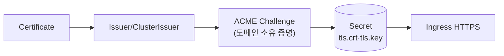

## 📌 들어가며

이번 글에서는 쿠버네티스에서 **TLS 인증서를 자동 발급·갱신·관리**하는 **cert-manager**를 정리한다. Let's Encrypt 무료 인증서부터 와일드카드(DNS-01), 내부 Private CA(폐쇄망)까지, 그리고 만료 걱정 없는 자동 갱신 메커니즘을 다룬다.

> **cert-manager란?** Certificate 리소스를 선언하면 **Issuer를 통해 인증서를 발급하고 Secret에 저장**하는 인증서 관리 시스템. Let's Encrypt로 무료 SSL을 받고, **만료 30일 전 자동 갱신**해 인증서 만료 장애를 원천 차단한다.



---

## 1. 핵심 구성 요소

| 리소스 | 역할 |
|--------|------|
| **Certificate** | "어떤 도메인 인증서가 필요한지" 요청 |
| **Issuer** | 네임스페이스 범위 발급자 |
| **ClusterIssuer** | 클러스터 전체 발급자 |
| **Secret** | 발급된 인증서 저장(`tls.crt`·`tls.key`) |
| **Challenge** | ACME 도메인 소유 증명 |

### ACME Challenge 방식

| 방식 | 증명 | 와일드카드 | 사용 |
|------|------|:---:|------|
| **HTTP-01** | `/.well-known/acme-challenge/` 파일 | ❌ | 단일 도메인(80 포트 필요) |
| **DNS-01** | DNS TXT 레코드 | ✅ | 와일드카드(DNS API 필요) |

> 💡 **와일드카드(`*.example.com`)는 DNS-01만 가능**하다. HTTP-01은 도메인마다 파일을 놓아야 해서 와일드카드를 증명할 수 없다. 반면 DNS-01은 TXT 레코드로 도메인 소유를 증명하므로 80/443 포트도 필요 없다.

---

## 2. 기본 명령어

```bash
kubectl get pods -n cert-manager          # 3개 Pod(controller/webhook/cainjector)
kubectl get clusterissuer                 # 발급자 READY 확인
kubectl get certificate -n <ns>           # 인증서 READY 확인
kubectl describe certificate <cert> -n <ns>   # 실패 시 Events
kubectl get challenge -n <ns>             # 발급 중 Challenge 상태
```

---

## 3. 설치 & Let's Encrypt Issuer

```bash
helm repo add jetstack https://charts.jetstack.io && helm repo update
kubectl apply -f https://github.com/cert-manager/cert-manager/releases/download/v1.13.0/cert-manager.crds.yaml
helm install cert-manager jetstack/cert-manager -n cert-manager --create-namespace --version v1.13.0
```

```yaml
apiVersion: cert-manager.io/v1
kind: ClusterIssuer
metadata:
  name: letsencrypt-prod
spec:
  acme:
    server: https://acme-v02.api.letsencrypt.org/directory
    email: admin@example.com
    privateKeySecretRef:
      name: letsencrypt-prod
    solvers:
    - http01:
        ingress:
          class: traefik
```

> ⚠️ **반드시 Staging으로 먼저 테스트**하자. Production은 **주당 도메인 50개** Rate Limit이 있어, 설정 실수로 반복 요청하면 금방 막힌다. `acme-staging-v02...` 서버로 검증 후 prod로 전환한다.

---

## 4. Ingress 자동 발급 (annotation)

Ingress에 **annotation 한 줄**만 붙이면 cert-manager가 Certificate를 자동 생성한다.

```yaml
apiVersion: networking.k8s.io/v1
kind: Ingress
metadata:
  name: app-ingress
  annotations:
    kubernetes.io/ingress.class: traefik
    cert-manager.io/cluster-issuer: "letsencrypt-prod"   # ← 자동 발급 트리거
spec:
  tls:
  - hosts: [app.example.com]
    secretName: app-tls-secret
  rules:
  - host: app.example.com
    http:
      paths:
      - path: /
        pathType: Prefix
        backend:
          service: {name: app-service, port: {number: 8080}}
```

```
Ingress 생성 → annotation 감지 → Certificate 자동 생성 → Let's Encrypt 요청
→ HTTP-01 Challenge(임시 Ingress) → 발급 → app-tls-secret 저장 → HTTPS 적용
```

> ⚠️ annotation 오타 주의 — **ClusterIssuer면 `cert-manager.io/cluster-issuer`**, Issuer면 `cert-manager.io/issuer`다. 이걸 헷갈리면 "issuer not found"로 발급이 안 된다.

---

## 5. 와일드카드 & Private CA

### 와일드카드 (DNS-01 + Route53)

```yaml
spec:
  acme:
    solvers:
    - dns01:
        route53:
          region: ap-northeast-2
          accessKeyID: AKIA...
          secretAccessKeySecretRef:
            name: route53-credentials
            key: secret-access-key
---
kind: Certificate
spec:
  dnsNames:
  - "*.example.com"    # 와일드카드
  - "example.com"
```

### Private CA (금융권 폐쇄망)

Let's Encrypt를 못 쓰는 폐쇄망에서는 **Self-signed Root CA → CA Issuer → 내부 인증서** 순으로 자체 CA를 구축한다.

```yaml
# ① Self-signed로 Root CA 생성 → ② CA Issuer 등록 → ③ 내부 서비스 인증서 발급
kind: ClusterIssuer
metadata:
  name: my-ca-issuer
spec:
  ca:
    secretName: my-ca-secret
```

> 💡 **Self-signed vs Private CA** — Self-signed는 서비스마다 개별 자체 서명(브라우저 경고), Private CA는 하나의 내부 CA로 여러 인증서를 발급해 **CA만 신뢰하면 하위 인증서가 모두 신뢰**된다. 폐쇄망에서는 Private CA가 정석이다.

---

## 6. 트러블슈팅 & 흔한 실수

```bash
kubectl get certificate <cert> -n <ns>              # READY: False?
kubectl describe certificate <cert> -n <ns>         # Events 에러
kubectl get clusterissuer <issuer>                  # 발급자 READY?
kubectl get challenge -n <ns>                       # pending/valid?
curl -v http://app.example.com/.well-known/acme-challenge/test   # HTTP-01 도달?
```

> ⚠️ **흔한 실수** — ① ClusterIssuer 없이 Certificate 생성(issuer not found), ② HTTP-01인데 **80 포트 차단**(Challenge 실패), ③ Rate Limit 초과(Staging 미사용), ④ annotation `issuer`/`cluster-issuer` 혼동, ⑤ **도메인 DNS가 Ingress를 안 가리킴**, ⑥ TLS Secret이 다른 네임스페이스, ⑦ 여러 Ingress가 같은 도메인 사용(충돌).

---

## 7. 운영 참고

| 항목 | 값/권장 |
|------|------|
| 유효기간(Let's Encrypt) | 90일 |
| 갱신 시점 | 만료 **30일 전**(`renewBefore: 720h`) |
| 갱신 실패 | 매일 재시도 |
| 와일드카드 | DNS-01만 |

```promql
# 7일 내 만료 알림
certmanager_certificate_expiration_timestamp_seconds - time() < 604800
```

HyperCloud는 cert-manager를 기본 포함하지 않아 별도 설치가 필요하며(K8s 1.21은 v1.5+ 권장), 폐쇄망은 Private CA + 만료 알림 + Secret RBAC 최소화를 적용한다.

---

## 📝 정리

```
cert-manager
├─ 개념   TLS 인증서 자동 발급·저장(Secret)·갱신
├─ 발급자 Issuer(NS) / ClusterIssuer(전체)
├─ Challenge HTTP-01(단일) / DNS-01(와일드카드)
├─ 사용   Ingress annotation → 자동 Certificate
└─ 갱신   만료 30일 전 자동(장애 방지)
```

| 개념 | 한 줄 정의 |
|------|------|
| **cert-manager** | TLS 자동 관리 시스템 |
| **ClusterIssuer** | 클러스터 인증서 발급자 |
| **HTTP-01/DNS-01** | 파일/DNS 소유 증명 |

cert-manager의 핵심은 **Ingress에 annotation 한 줄로 HTTPS를 자동화**하고, **만료 전 자동 갱신**으로 인증서 장애를 없애는 것이다. 와일드카드는 DNS-01, 폐쇄망은 Private CA로 대응하며, 반드시 Staging으로 먼저 검증한다.

---

## 🔗 참고

- [cert-manager 공식 문서](https://cert-manager.io/docs/)
- [Let's Encrypt 공식 문서](https://letsencrypt.org/docs/)
