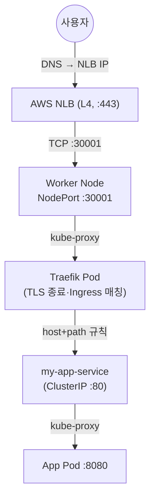

## 📌 들어가며

이번 글에서는 외부 사용자의 요청이 **NLB → Traefik → 애플리케이션 Pod**까지 도달하는 전체 트래픽 흐름을 단계별로 추적한다. 왜 Service가 2개 필요한지, Ingress와 Ingress Controller가 어떻게 협력하는지, 실제 패킷이 어느 IP·포트를 거치는지 정리한다.

> **한 줄 요약** — `NLB → NodePort(traefik) → Traefik Pod → (Ingress 규칙 확인) → ClusterIP Service → Application Pod`. 외부 진입(NodePort)과 내부 연결(ClusterIP), 두 종류의 Service가 각자 역할을 나눠 맡는다.

---

## 1. 전체 아키텍처



---

## 2. Service 2개의 역할

| Service | 타입 | 역할 |
|---------|------|------|
| **traefik** | NodePort | 외부(NLB) → Traefik Pod 진입점 |
| **my-app-service** | ClusterIP | Traefik → 애플리케이션 Pod 내부 연결 |

```yaml
# Service 1 — Traefik (NodePort, 외부 진입)
kind: Service
metadata:
  name: traefik
  namespace: api-gateway-system
spec:
  type: NodePort
  selector: {app: traefik}
  ports:
  - name: websecure
    port: 443
    targetPort: 8443
    nodePort: 31443
---
# Service 2 — App (ClusterIP, 내부 연결)
kind: Service
metadata:
  name: my-app-service
spec:
  type: ClusterIP
  selector: {app: my-app}
  ports:
  - {port: 80, targetPort: 8080}
```

> 💡 **왜 2개인가** — NLB는 클러스터 **외부**에 있으므로 진입점(Traefik)은 NodePort로 노출해야 한다. 반면 앱 Service는 Traefik(내부)만 접근하면 되므로 **ClusterIP로 충분**하고, 외부에 열 이유가 없다. 역할이 다르니 타입도 다르다.

---

## 3. Ingress = 라우팅 지시서

**Ingress는 트래픽을 직접 받지 않는다.** Traefik(Controller)이 읽고 적용하는 **규칙(설정 파일)**일 뿐이다.

| 항목 | Ingress | Ingress Controller |
|------|---------|--------------------|
| 종류 | 쿠버네티스 리소스(설정) | 실제 Pod(프로그램) |
| 역할 | "어디로 보낼지" 규칙 | 규칙 읽고 라우팅 실행 |
| 위치 | etcd 저장 | Worker Node 실행 |

```yaml
kind: Ingress
spec:
  rules:
  - host: myapp.example.com
    http:
      paths:
      - path: /api
        pathType: Prefix
        backend:
          service: {name: my-app-service, port: {number: 80}}
```

```
요청: https://myapp.example.com/api/users
→ Traefik: host=myapp.example.com, path=/api 매칭
→ Ingress 규칙: my-app-service:80으로 보내라
→ 프록시
```

---

## 4. HTTPS 패킷 흐름 (실무 주 사용)

```
[사용자] curl https://myapp.example.com/api/users
  ↓ DNS: myapp.example.com → 52.78.123.45 (NLB)
[NLB] 52.78.123.45:443  → Target Group :30001
  ↓
[Worker Node] 10.0.1.10:30001 (NodePort)
  ↓ kube-proxy(iptables)
[Service: traefik] port:443 → targetPort:websecure
  ↓
[Traefik Pod] 10.244.1.5:8443
  ↓ TLS 종료 + Ingress 규칙 확인(host/path)
[Service: my-app-service] ClusterIP 10.100.50.20:80
  ↓ kube-proxy
[App Pod] 10.244.2.15:8080
  ↓ 응답 역순 반환
```

> 💡 **TLS 종료는 Traefik Pod에서** 이뤄진다. NLB는 L4라서 암호화된 TCP를 그대로 통과시키고, Traefik이 인증서로 복호화한 뒤 Ingress 규칙을 매칭한다. 그래서 NLB에는 인증서가 필요 없다.

---

## 5. NLB vs ALB & Traefik 포트

| 항목 | **NLB(L4)** | **ALB(L7)** |
|------|-------------|-------------|
| 계층 | TCP/UDP | HTTP/HTTPS |
| 성능 | 매우 빠름(백만 RPS) | 상대적 느림 |
| 라우팅 | IP/Port | Host/Path/Header |
| SSL 종료 | Traefik에서 | ALB에서 가능 |

**Traefik Service 포트 구성(HyperCloud):**

| 이름 | NodePort | Port | 역할 |
|------|:---:|:---:|------|
| web | 30000 | 80 | HTTP 진입 |
| websecure | 30001 | 443 | HTTPS 진입 |
| traefik | 30900 | 9000 | Dashboard |
| metrics | 31958 | 9100 | Prometheus |

> 💡 **targetPort를 번호 대신 이름(`websecure`)으로** 지정하면, Traefik 컨테이너 포트 번호가 바뀌어도 Service를 안 고쳐도 된다. 이름 기반 매칭이 유지보수에 유리하다.

---

## 6. 트러블슈팅 — 단계별 추적

문제는 사용자→Pod 경로를 **순서대로** 짚어 나간다.

```bash
nslookup myapp.example.com                          # ① DNS → NLB
# ② AWS 콘솔: Target Group Health
kubectl get svc -n api-gateway-system traefik       # ③ Node → Traefik Service
kubectl describe ingress my-app-ingress -n default  # ④ Traefik → Service(규칙)
kubectl get endpoints my-app-service -n default     # ⑤ Service → Pod(Endpoint)
kubectl logs -n api-gateway-system <traefik-pod> | grep -i ingress  # ⑥ 규칙 인식?
curl -v https://myapp.example.com                   # ⑦ 실제 연결
```

> ⚠️ **Endpoint가 비어 있으면** Service의 selector가 Pod 라벨과 안 맞거나 Pod가 Ready가 아니다. `kubectl get endpoints`가 비었으면 트래픽이 Pod까지 못 가므로, 라벨 매칭과 Readiness부터 확인한다.

---

## 7. 각 구성 요소 역할 정리

| 구성 요소 | 역할 |
|-----------|------|
| **NLB** | 외부→클러스터 진입 L4 로드밸런서 |
| **NodePort Service(traefik)** | NLB ↔ Traefik Pod 연결 |
| **Traefik Pod** | Ingress Controller(L7 라우팅·TLS 종료) |
| **Ingress 리소스** | Traefik에 주는 라우팅 규칙(etcd) |
| **ClusterIP Service** | Traefik ↔ 앱 Pod 내부 연결 |
| **Application Pod** | 실제 애플리케이션 |

---

## 📝 정리

```
트래픽 흐름
├─ 경로   NLB → NodePort(traefik) → Traefik Pod → ClusterIP → App Pod
├─ Service NodePort(외부진입) + ClusterIP(내부연결)
├─ Ingress 규칙(설정) ≠ Controller(Traefik Pod)
├─ TLS    Traefik Pod에서 종료(NLB는 통과)
└─ 진단   DNS→NLB→Node→Traefik→Endpoint→Pod 순
```

| 개념 | 한 줄 정의 |
|------|------|
| **NodePort Service** | 외부 진입점(Traefik) |
| **ClusterIP Service** | 내부 연결(앱) |
| **TLS 종료** | Traefik Pod에서 복호화 |

전체 흐름의 핵심은 **두 종류의 Service(외부 NodePort + 내부 ClusterIP)**가 역할을 나누고, **Traefik이 TLS 종료와 Ingress 규칙 매칭**을 담당한다는 것이다. 문제가 생기면 DNS부터 Pod까지 경로를 순서대로 짚으면 원인을 빠르게 좁힐 수 있다.

---

## 🔗 참고

- [Kubernetes Service 공식 문서](https://kubernetes.io/docs/concepts/services-networking/service/)
- [Kubernetes Ingress 공식 문서](https://kubernetes.io/docs/concepts/services-networking/ingress/)
