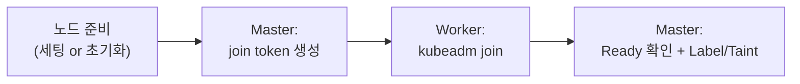

## 📌 들어가며

이번 글에서는 기존 클러스터에 **워커 노드를 추가**하는 두 가지 방법 — **쌩 서버(깡통)**부터 세팅하는 방식과 **AMI 복제** 방식을 정리한다. 각 절차와, 특히 AMI 복제 시 놓치기 쉬운 **machine-id 재생성·kubeadm reset**을 짚는다.

> **두 방식 비교** — 쌩 서버는 깨끗하지만 30~60분 걸리고, AMI 복제는 10~20분으로 빠르지만 **초기화(machine-id·reset)가 필수**다. 운영 중 확장·긴급 대응에는 AMI 복제가 훨씬 실용적이다.

| 항목 | 쌩 서버 | **AMI 복제** |
|------|---------|--------------|
| 소요 시간 | 30~60분 | **10~20분** |
| 장점 | 깨끗·커스터마이징 | 빠름·설정 일관성 |
| 단점 | 시간·실수 | **초기화 필수**(machine-id 충돌) |
| 시기 | 최초 구축 | 운영 확장·긴급 |

**환경**: containerd 1.6.8 · kubelet/kubeadm 1.21.14 · Calico 3.17.4 · Amazon Linux 2.

---

## 1. 공통 흐름



---

## 2. 방법 1 — 쌩 서버 세팅

### Step 1~4: OS·런타임·쿠버네티스·네트워크

```bash
# ① OS 기본 (hostname·swap·SELinux)
sudo hostnamectl set-hostname <new-node-name>
sudo swapoff -a && sudo sed -i '/swap/d' /etc/fstab
sudo setenforce 0

# ② containerd + systemd cgroup
sudo yum install -y containerd.io-1.6.8
sudo containerd config default | sudo tee /etc/containerd/config.toml
sudo sed -i 's/SystemdCgroup = false/SystemdCgroup = true/' /etc/containerd/config.toml
sudo systemctl enable --now containerd

# ③ kubelet, kubeadm (버전 일치 중요!)
sudo yum install -y kubelet-1.21.14 kubeadm-1.21.14
sudo systemctl enable kubelet

# ④ 네트워크 (br_netfilter, iptables 브리지)
sudo modprobe br_netfilter
cat <<EOF | sudo tee /etc/sysctl.d/k8s.conf
net.bridge.bridge-nf-call-iptables = 1
net.ipv4.ip_forward = 1
EOF
sudo sysctl --system
```

> ⚠️ **버전 일치가 핵심.** kubelet/kubeadm은 클러스터 버전(1.21.14)과 **정확히 같아야** 한다. 1.22.x를 깔면 호환되지 않아 Join이 실패하거나 이상 동작한다. `SystemdCgroup = true`도 쿠버네티스 권장 설정이다.

### Step 5~6: Token 생성 & Join

```bash
# Master에서
kubeadm token create --print-join-command

# 새 Worker에서
sudo kubeadm join <MASTER_IP>:6443 \
  --token <token> --discovery-token-ca-cert-hash sha256:<hash>
# → "This node has joined the cluster"
```

Token은 24시간 유효하며, 만료 시 `kubeadm token create`로 재발급한다.

---

## 3. 방법 2 — AMI 복제 (초기화가 핵심)

AMI에는 containerd·kubelet이 이미 포함돼 있어 빠르지만, **기존 노드의 고유 정보·클러스터 정보를 반드시 지워야** 한다.

### Step 1~3: 고유 정보 & 클러스터 정보 초기화

```bash
# ① hostname + machine-id 재생성 (중복 시 노드 충돌!)
sudo hostnamectl set-hostname <new-node-name>
sudo rm -f /etc/machine-id /var/lib/dbus/machine-id
sudo systemd-machine-id-setup

# ② kubelet·Calico 설정 삭제
sudo rm -rf /etc/kubernetes/kubelet.conf /var/lib/kubelet/* /var/lib/calico /etc/cni/net.d/*

# ③ kubeadm reset (핵심!) + iptables 초기화
sudo kubeadm reset -f
sudo iptables -F && sudo iptables -t nat -F && sudo iptables -X
```

> ⚠️ **AMI 복제의 두 함정** — ① **machine-id 재생성 안 함** → 노드 충돌·네트워크 문제, ② **kubeadm reset 없이 Join** → 기존 클러스터 정보가 남아 Join 실패. 이 둘은 반드시 실행해야 한다.

### Step 4~5: Token 생성 & Join (방법 1과 동일)

```bash
kubeadm token create --print-join-command    # Master
sudo kubeadm join <MASTER_IP>:6443 --token <token> --discovery-token-ca-cert-hash sha256:<hash>
```

---

## 4. 검증 & Label/Taint

```bash
kubectl get nodes                            # NotReady → Ready (1~3분)
kubectl get pods -n kube-system -o wide | grep calico | grep <new-node-ip>

# Label/Taint (기존 노드와 동일하게!)
kubectl label node <new-node> node-role.kubernetes.io/worker=worker
kubectl label node <new-node> workload=general
kubectl taint nodes <new-node> node=aicwnd:NoSchedule
```

> 💡 **NotReady가 이어지면 CNI(Calico)를 의심**하자. `journalctl -u kubelet -f`에서 `cni config uninitialized`가 보이면 Calico 미설치·미동작이다. `kubectl get ds -n kube-system calico-node`와 CNI 파일(`/etc/cni/net.d/`)을 확인한다.

---

## 5. 주의사항 요약

| 실수 | 결과 | 조치 |
|------|------|------|
| swap 켠 채 Join | kubelet 시작 실패 | `swapoff -a` + fstab |
| machine-id 미재생성(AMI) | 노드 충돌 | `systemd-machine-id-setup` |
| reset 없이 Join(AMI) | Join 실패 | `kubeadm reset -f` |
| 버전 불일치 | 호환 안 됨 | 클러스터 버전과 일치 |
| Label/Taint 누락 | 의도치 않은 배치 | 기존 노드와 동일 설정 |

---

## 6. 운영계 적용 (백업·절차)

운영계는 반드시 **개발계 테스트 → CSR 승인 → etcd 백업 → 단계별 기록** 순으로 진행한다.

```bash
# 작업 전 백업
kubectl get nodes -o yaml > nodes-backup-$(date +%Y%m%d).yaml
ETCDCTL_API=3 etcdctl snapshot save snapshot-$(date +%Y%m%d).db \
  --endpoints=https://127.0.0.1:2379 \
  --cacert=/etc/kubernetes/pki/etcd/ca.crt \
  --cert=/etc/kubernetes/pki/etcd/server.crt \
  --key=/etc/kubernetes/pki/etcd/server.key
```

> 💡 문제가 생기면 `kubectl delete node <new-node>`로 즉시 롤백할 수 있다. 그래서 노드 추가는 비교적 안전한 작업이지만, **작업 전 etcd 백업**은 원칙으로 지킨다.

---

## 📝 정리

```
워커 노드 추가
├─ 쌩 서버  OS세팅→containerd→kubelet/kubeadm→네트워크→join
├─ AMI복제  machine-id 재생성 + kubeadm reset (핵심!) → join
├─ 공통     Master 토큰 생성 → kubeadm join → Ready 확인
└─ 마무리   Label/Taint를 기존 노드와 동일하게
```

| 개념 | 한 줄 정의 |
|------|------|
| **kubeadm join** | 노드를 클러스터에 합류 |
| **machine-id 재생성** | AMI 복제 충돌 방지 |
| **kubeadm reset** | 기존 클러스터 정보 제거 |

워커 노드 추가의 핵심은 **join 토큰 → kubeadm join → Ready 확인**의 공통 흐름이다. AMI 복제 시에는 **machine-id 재생성과 kubeadm reset**만 빠뜨리지 않으면, 가장 빠르고 안전하게 노드를 늘릴 수 있다.

---

## 🔗 참고

- [kubeadm 클러스터 생성 공식 문서](https://kubernetes.io/docs/setup/production-environment/tools/kubeadm/create-cluster-kubeadm/)
