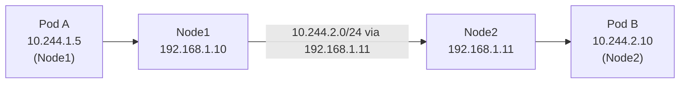

## 📌 들어가며

이번 글에서는 Calico가 **노드 간 Pod 통신**을 어떻게 라우팅하는지, 그 핵심인 **BGP(Border Gateway Protocol)**를 정리한다. BGP 개념부터 Calico에서의 동작, Peering 방식(Mesh vs Route Reflector), calico-node 재시작 영향, 트러블슈팅까지 다룬다.

> **BGP란?** **"어디로 가야 목적지에 도달하는지"를 알려주는 라우팅 프로토콜**. 인터넷에서는 AS(자율 시스템) 간 경로를 교환하고, Calico는 이를 **노드 간 Pod 네트워크 라우팅**에 활용한다.

---

## 1. BGP 직관 — 택배 기사 비유

```
기사 A: "강남 택배는 나한테" / 기사 B: "마포는 나한테" / 기사 C: "송파는 나한테"
→ 각자 담당 구역을 공유 → 택배가 오면 올바른 기사에게 전달
```

인터넷에서는 각 통신사(AS)가 자기 IP 대역을 **BGP로 광고**한다. Calico도 똑같이, 각 노드가 자기 **Pod 대역**을 광고한다.

```
Node1 calico-node: "10.244.1.0/24 담당"
Node2 calico-node: "10.244.2.0/24 담당"
→ BGP로 서로 광고(Peering) → 각 노드 라우팅 테이블에 등록
```

---

## 2. Calico 라우팅 동작

각 노드는 **자기 Pod 대역은 직접 연결**, 남의 Pod 대역은 **해당 노드 IP로 via**한다.



```bash
# Node1 라우팅 테이블
10.244.1.0/24 dev *              # 내 Pod (직접)
10.244.2.0/24 via 192.168.1.11   # Node2로
10.244.3.0/24 via 192.168.1.12   # Node3로
```

---

## 3. BGP Peering 방식

calico-node끼리 정보를 주고받는 연결이 **Peering**이다. 노드 수에 따라 방식이 달라진다.

| 방식 | 구조 | Peering 수 | 권장 규모 |
|------|------|:---:|------|
| **Node-to-Node Mesh**(기본) | 모든 노드 상호 연결 | n(n-1)/2 (O(n²)) | ~50~100노드 |
| **Route Reflector** | 중앙 집중 | n (O(n)) | 100노드+ |

```
Mesh:  노드 100개 → Peering 4,950개 😱
RR:    노드 100개 → Peering 100개만 (RR 경유)
```

```bash
# Peering 상태 확인 (Established면 정상)
kubectl exec -n kube-system <calico-pod> -c calico-node -- calicoctl node status
```

> 💡 **노드가 많아지면 Route Reflector로 전환**한다. Mesh는 모든 노드가 서로 연결되어 노드 100개면 5천 개 세션이 생긴다. RR을 중앙에 두면 각 노드는 RR하고만 연결(O(n))해 오버헤드가 급감한다.

---

## 4. calico-node 재시작 영향

재시작하면 그 노드의 경로가 잠시 사라져, **다른 노드 → 해당 노드 Pod** 통신이 10~30초간 끊긴다.

```
t=1s  Peering 끊김 → 다른 노드가 Node1 경로 삭제
t=3~20s  다른 노드 → Node1 Pod 통신 불가
t=21s  새 calico-node Running → Peering 재연결 → 경로 재광고
t=25s  통신 정상화
```

| 통신 방향 | 영향 |
|-----------|------|
| Node1 → 다른 노드 Pod | ✅ 가능(자기 테이블 유지) |
| 다른 노드 → Node1 Pod | ❌ 10~30초 불가 |
| Service 경유 | ✅ 대부분(iptables 유지) |

> ⚠️ **calico-node는 절대 동시 재시작하지 말 것.** 여러 노드를 한꺼번에 재시작하면 경로가 대량으로 사라져 클러스터 네트워크가 마비된다. `rollout restart`(순차) 또는 30초 간격 순차 삭제로 진행한다.

---

## 5. 트러블슈팅 — 계층별 진단

네트워크 문제는 **상위(App) → 하위(물리)** 순으로 좁힌다.

```
L7 Application (Pod 응답?)
L4 Service/Endpoint (kube-proxy·iptables)
L3 IP 라우팅 (Calico·BGP)   ← Pod/Service 정상인데 통신 실패면 여기!
L2 Node 네트워크 (노드 간 ping)
```

**BGP Peering 실패(STATE가 idle/start):**

```bash
sudo iptables -L -n | grep 179              # ① BGP 포트(179) 차단?
kubectl get pods -n kube-system -l k8s-app=calico-node  # ② calico-node 정상?
ping <target-node-ip>                        # ③ 노드 간 통신?
kubectl rollout restart daemonset -n kube-system calico-node  # 해결
```

> ⚠️ **BGP는 TCP 179 포트**를 쓴다. 방화벽·Security Group에서 179가 막히면 Peering이 절대 안 되므로, Pod/Service가 정상인데 노드 간 통신만 안 되면 179부터 확인한다.

---

## 6. 핵심 명령어 & 운영

```bash
calicoctl node status                        # Peering 상태
calicoctl get bgppeer -o yaml                # Peer 상세
calicoctl get ippool -o wide                 # IP Pool
ip route                                     # 라우팅 테이블

# 순차 재시작 (30초 간격) — 동시 재시작 금지!
kubectl get pods -n kube-system -l k8s-app=calico-node -o name | \
  xargs -I {} sh -c 'kubectl delete -n kube-system {} && sleep 30'
```

**운영 기준**: BGP 포트 TCP 179 허용 필수, Peering keepalive 60초, 50↓ Mesh / 100↑ Route Reflector. 금융권은 BGP Peering 로그 모니터링과 최신 안정 버전 유지가 권장된다.

```yaml
# Prometheus Alert
- alert: CalicoBGPPeeringDown
  expr: calico_bgp_peers_state{state="down"} > 0
  for: 5m
```

---

## 📝 정리

```
Calico BGP
├─ 개념   노드가 자기 Pod 대역을 BGP로 광고
├─ 라우팅 남의 Pod 대역 → 해당 노드 IP via
├─ Peering Mesh(O(n²)) vs Route Reflector(O(n))
├─ 재시작 다른 노드→해당 Pod 10~30초 단절(순차 필수)
└─ 진단   L7→L3 순, 포트 179 확인
```

| 개념 | 한 줄 정의 |
|------|------|
| **BGP** | 경로 광고 프로토콜 |
| **Node-to-Node Mesh** | 전 노드 상호 Peering(기본) |
| **Route Reflector** | 대규모용 중앙 집중 |

Calico BGP의 핵심은 **각 노드가 자기 Pod 대역을 광고해 라우팅 테이블을 채우는 것**이다. 규모가 커지면 Route Reflector로 전환하고, calico-node는 **반드시 순차 재시작**하며, 통신 문제는 **포트 179와 L3 라우팅**을 먼저 확인한다.

---

## 🔗 참고

- [Calico BGP 공식 문서](https://docs.tigera.io/calico/latest/networking/bgp)
