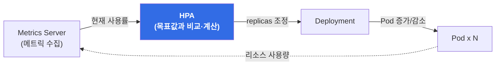

## 📌 들어가며

트래픽은 하루 종일 일정하지 않다. 낮에는 몰리고 밤에는 한산하며, 이벤트가 열리면 순식간에 몇 배로 뛴다. 이때 Pod 개수를 사람이 손으로 늘렸다 줄였다 하는 건 현실적이지 않다. **HPA(Horizontal Pod Autoscaler)**는 이 일을 자동으로 해주는 쿠버네티스의 오토스케일링 컨트롤러다.

> **HPA 한 줄 요약**
> CPU·메모리 등 메트릭을 기준으로 Pod **개수(replicas)**를 자동으로 조정하는 오토스케일링 시스템.

**언제 쓰나:**

- 트래픽 변동이 큰 애플리케이션 (주간/야간, 이벤트 대응)
- 비용 최적화 (사용량에 따라 Pod 수 자동 조정)
- 장애 대응 (부하 급증 시 자동 스케일 아웃)
- SLA 보장 (응답 시간 유지를 위한 리소스 확보)

**관련 기술:** Deployment, ReplicaSet, Metrics Server, Prometheus, Custom Metrics

---

## 1. 핵심 개념

### 1.1 HPA 동작 방식

HPA는 일정 주기로 메트릭을 확인하고, 목표값과 비교해 replicas를 조정하는 **제어 루프(control loop)**로 동작한다.



```
Metrics Server → 메트릭 수집 → HPA 계산 → Deployment replicas 조정 → Pod 증가/감소
```

### 1.2 스케일링 공식

```
desiredReplicas = ceil[currentReplicas × (currentMetricValue / targetMetricValue)]
```

**예시:**

| 항목 | 값 |
|------|------|
| 현재 replicas | 3 |
| 현재 CPU 사용률 | 80% |
| 목표 CPU 사용률 | 50% |
| **계산 결과** | `ceil[3 × (80/50)] = ceil[4.8] = `**`5`** |

### 1.3 스케일링 조건

- **Scale Out**: 현재 메트릭 > 목표값 × (1 + 임계값)
- **Scale In**: 현재 메트릭 < 목표값 × (1 − 임계값)
- **기본 임계값**: 10% (targetValue의 ±10% 범위는 무시하여 불필요한 스케일링 방지)

```
                목표 50%
   ────────┬──────────┼──────────┬────────
        45%(−10%)             55%(+10%)
     Scale In ◄──   유지 구간   ──► Scale Out
```

### 1.4 지원 메트릭 종류

| 메트릭 타입 | 설명 | 예시 | 필요 사항 |
|------------|------|------|-----------|
| **Resource** | CPU, 메모리 | CPU 사용률 50% | Metrics Server |
| **Pods** | Pod 메트릭 | HTTP 요청 수/sec | Custom Metrics API |
| **Object** | 객체 메트릭 | Ingress QPS | Custom Metrics API |
| **External** | 외부 시스템 메트릭 | SQS 큐 길이 | External Metrics API |

### 1.5 주요 특징

| 특징 | 내용 |
|------|------|
| **자동화** | 수동 개입 없이 리소스 자동 조정 |
| **안정성** | Scale In 지연(기본 5분)으로 플래핑 방지 |
| **제한 설정** | `minReplicas`, `maxReplicas`로 범위 제한 |
| **API 버전** | K8s 1.21+ `autoscaling/v2` (CPU + 메모리 + 커스텀 메트릭 지원) |

---

## 2. 기본 명령어

```bash
# HPA 목록 확인
kubectl get hpa -n <namespace>

# HPA 상세 확인
kubectl describe hpa <hpa-name> -n <namespace>

# HPA 실시간 모니터링
kubectl get hpa <hpa-name> -n <namespace> --watch

# HPA 빠른 생성 (kubectl 명령어)
kubectl autoscale deployment <deployment-name> \
  --cpu-percent=50 \
  --min=2 \
  --max=10 \
  -n <namespace>

# HPA 이벤트 확인
kubectl get events -n <namespace> --field-selector involvedObject.name=<hpa-name>

# Metrics Server 동작 확인 (HPA 필수 의존성)
kubectl top nodes
kubectl top pods -n <namespace>
```

**HPA 출력 예시:**

```
NAME      REFERENCE            TARGETS   MINPODS   MAXPODS   REPLICAS   AGE
web-hpa   Deployment/web-app   45%/50%   2         10        3          5d

# TARGETS: 현재값/목표값
# 45%/50% → 현재 CPU 45%, 목표 50% → 스케일링 불필요 상태
```

---

## 3. 실무 패턴

### 3.1 CPU 기반 HPA (가장 일반적)

```yaml
apiVersion: autoscaling/v2
kind: HorizontalPodAutoscaler
metadata:
  name: web-app-hpa
  namespace: default
spec:
  scaleTargetRef:
    apiVersion: apps/v1
    kind: Deployment
    name: web-app
  minReplicas: 2    # 최소 Pod 수
  maxReplicas: 10   # 최대 Pod 수
  metrics:
  - type: Resource
    resource:
      name: cpu
      target:
        type: Utilization
        averageUtilization: 50  # 평균 CPU 50% 목표
  behavior:
    scaleDown:
      stabilizationWindowSeconds: 300  # 5분간 안정화 대기
      policies:
      - type: Percent
        value: 50          # 한 번에 50%까지만 감소
        periodSeconds: 60
      - type: Pods
        value: 2           # 한 번에 최대 2개 감소
        periodSeconds: 60
    scaleUp:
      stabilizationWindowSeconds: 0   # 즉시 스케일 아웃
      policies:
      - type: Percent
        value: 100         # 한 번에 100%까지 증가 가능
        periodSeconds: 15
      - type: Pods
        value: 4           # 한 번에 최대 4개 증가
        periodSeconds: 15
```

**Deployment 리소스 설정 (필수):**

```yaml
apiVersion: apps/v1
kind: Deployment
metadata:
  name: web-app
spec:
  replicas: 2  # HPA가 자동 조정하므로 초기값만 의미
  template:
    spec:
      containers:
      - name: app
        image: nginx:1.21
        resources:
          requests:
            cpu: 100m      # HPA는 requests 기준으로 사용률 계산
            memory: 128Mi
          limits:
            cpu: 200m
            memory: 256Mi
```

> ⚠️ **가장 흔한 실수**: Deployment에 `resources.requests`가 없으면 HPA는 사용률을 계산할 기준이 없어 `<unknown>`을 표시하며 아예 동작하지 않는다. **requests는 HPA의 전제 조건**이다.

**동작 시나리오:**

```
1. 트래픽 증가 → CPU 사용률 70% (목표 50% 초과)
2. HPA 계산: ceil[2 × (70/50)] = 3 → replicas 2→3 증가
3. 트래픽 감소 → CPU 사용률 30% (목표 50% 미만)
4. 5분 대기 후 HPA 계산: ceil[3 × (30/50)] = 2 → replicas 3→2 감소
```

### 3.2 메모리 기반 HPA

```yaml
apiVersion: autoscaling/v2
kind: HorizontalPodAutoscaler
metadata:
  name: memory-hpa
  namespace: default
spec:
  scaleTargetRef:
    apiVersion: apps/v1
    kind: Deployment
    name: memory-app
  minReplicas: 3
  maxReplicas: 15
  metrics:
  - type: Resource
    resource:
      name: memory
      target:
        type: Utilization
        averageUtilization: 70  # 평균 메모리 70% 목표
```

메모리는 CPU보다 느리게 증가/감소하므로 **OOM 발생 전에 스케일 아웃**되도록 목표값을 70% 이하로 설정한다.

### 3.3 CPU + 메모리 복합 메트릭

```yaml
apiVersion: autoscaling/v2
kind: HorizontalPodAutoscaler
metadata:
  name: multi-metric-hpa
  namespace: default
spec:
  scaleTargetRef:
    apiVersion: apps/v1
    kind: Deployment
    name: api-server
  minReplicas: 2
  maxReplicas: 20
  metrics:
  - type: Resource
    resource:
      name: cpu
      target:
        type: Utilization
        averageUtilization: 60
  - type: Resource
    resource:
      name: memory
      target:
        type: Utilization
        averageUtilization: 80
```

여러 메트릭이 설정된 경우 **가장 높은 replicas 값**을 선택한다.

```
CPU 60% 기준    → replicas: 5
메모리 80% 기준 → replicas: 8
───────────────────────────────
결과: replicas 8 적용 (더 많은 리소스 확보)
```

### 3.4 커스텀 메트릭 (HTTP 요청 수)

```yaml
apiVersion: autoscaling/v2
kind: HorizontalPodAutoscaler
metadata:
  name: custom-metric-hpa
  namespace: default
spec:
  scaleTargetRef:
    apiVersion: apps/v1
    kind: Deployment
    name: web-app
  minReplicas: 2
  maxReplicas: 50
  metrics:
  - type: Pods
    pods:
      metric:
        name: http_requests_per_second
      target:
        type: AverageValue
        averageValue: "100"  # Pod당 평균 100 req/s 목표
```

Prometheus Adapter 설치 및 애플리케이션에서 `http_requests_per_second` 메트릭 노출이 필요하다.

### 3.5 외부 메트릭 (AWS SQS 큐 길이)

```yaml
apiVersion: autoscaling/v2
kind: HorizontalPodAutoscaler
metadata:
  name: sqs-hpa
  namespace: default
spec:
  scaleTargetRef:
    apiVersion: apps/v1
    kind: Deployment
    name: worker
  minReplicas: 1
  maxReplicas: 100
  metrics:
  - type: External
    external:
      metric:
        name: sqs_queue_length
        selector:
          matchLabels:
            queue: my-queue
      target:
        type: AverageValue
        averageValue: "30"  # Pod당 처리할 메시지 수
```

```
SQS 큐에 300개 메시지 → 300 / 30 = replicas 10
메시지 소진           → replicas 1로 감소
```

### 3.6 시간대별 최소 replicas 조정 (CronJob 활용)

```yaml
# 주간 시간대 (09:00): minReplicas 증가
apiVersion: batch/v1
kind: CronJob
metadata:
  name: scale-up-morning
  namespace: default
spec:
  schedule: "0 9 * * 1-5"  # 평일 09:00
  jobTemplate:
    spec:
      template:
        spec:
          containers:
          - name: kubectl
            image: bitnami/kubectl:latest
            command:
            - /bin/sh
            - -c
            - |
              kubectl patch hpa web-app-hpa -n default \
                --type=merge -p '{"spec":{"minReplicas":5}}'
          restartPolicy: OnFailure
---
# 야간 시간대 (18:00): minReplicas 감소
apiVersion: batch/v1
kind: CronJob
metadata:
  name: scale-down-evening
  namespace: default
spec:
  schedule: "0 18 * * 1-5"  # 평일 18:00
  jobTemplate:
    spec:
      template:
        spec:
          containers:
          - name: kubectl
            image: bitnami/kubectl:latest
            command:
            - /bin/sh
            - -c
            - |
              kubectl patch hpa web-app-hpa -n default \
                --type=merge -p '{"spec":{"minReplicas":2}}'
          restartPolicy: OnFailure
```

---

## 4. 트러블슈팅

### 4.1 실무 디버깅 순서

```bash
# Step 1: HPA 상태 확인
kubectl get hpa web-app-hpa -n default
# TARGETS: <unknown>/50% → 메트릭 수집 실패

# Step 2: Metrics Server 확인
kubectl top pods -n default
# Error from server → Metrics Server 재시작
kubectl rollout restart deployment metrics-server -n kube-system

# Step 3: Pod resources 확인
kubectl get pod -n default -o yaml | grep -A 5 "resources:"
# requests 없음 → Deployment 수정

# Step 4: HPA 재생성
kubectl delete hpa web-app-hpa -n default
kubectl apply -f hpa.yaml

# Step 5: 실시간 모니터링
kubectl get hpa web-app-hpa -n default --watch
```

### 4.2 추가 디버깅 명령어

```bash
# HPA 이벤트 확인
kubectl describe hpa <hpa-name> -n <namespace>
# Events:
#   Warning  FailedGetResourceMetric  unable to get metrics for resource cpu

# HPA 계산 결과 확인
kubectl get hpa <hpa-name> -n <namespace> -o yaml
# status:
#   currentMetrics: 현재 메트릭 값
#   desiredReplicas: 계산된 목표 replicas

# HPA가 Deployment를 제어하는지 확인
kubectl get deployment <deployment-name> -n <namespace> -o yaml | grep -A 3 replicas

# Metrics Server 로그 확인
kubectl logs -n kube-system deployment/metrics-server -f
```

### 4.3 흔한 실수 7가지

| # | 실수 | 증상 | 올바른 설정 |
|:---:|------|------|------|
| 1 | 리소스 `requests` 미설정 | HPA가 `<unknown>` 표시, 스케일링 안 됨 | `resources.requests.cpu` 반드시 설정 |
| 2 | Metrics Server 미설치 | `kubectl top` 실행 불가 | `metrics-server` 설치 확인 |
| 3 | Deployment replicas 수동 변경 | HPA가 즉시 덮어써서 혼란 | HPA 사용 시 min/maxReplicas만 조정 |
| 4 | 목표값을 너무 낮게 설정 | 항상 maxReplicas까지 증가 | CPU 50~70% 권장 |
| 5 | Scale Down 속도 너무 빠름 | Pod 생성/삭제 반복(플래핑) | `stabilizationWindowSeconds: 300` |
| 6 | minReplicas를 0으로 설정 | Pod 전멸 시 트래픽 처리 불가 | `minReplicas: 1` 이상 |
| 7 | HPA와 VPA 동시 사용 | 충돌, 예측 불가 동작 | 둘 중 하나만 사용(HPA 권장) |

각 실수의 상세 예시는 아래와 같다.

```
❌ CPU target: 20%        → 항상 maxReplicas까지 증가
✅ 50~70% 권장 (버스트 대응 여유 확보)

❌ stabilizationWindowSeconds: 0 (scaleDown)  → 플래핑
✅ 300초 (5분) 권장

❌ minReplicas: 0         → Pod 전멸 시 트래픽 처리 불가
✅ minReplicas: 1 이상 유지
```

---

## 5. 운영 참고사항

### 5.1 권장 설정값

| 설정 | 권장값 | 이유 |
|------|--------|------|
| **minReplicas** | 2 이상 | 가용성 확보 |
| **maxReplicas** | 노드 수 × 3 | 노드당 여유 공간 |
| **CPU target** | 50~70% | 버스트 대응 여유 |
| **메모리 target** | 70~80% | OOM 방지 |
| **scaleDown stabilizationWindowSeconds** | 300 (5분) | 플래핑 방지 |
| **scaleUp stabilizationWindowSeconds** | 0 | 빠른 대응 |

### 5.2 HPA vs VPA vs Cluster Autoscaler

| 도구 | 조정 대상 | 방향 | 권장 조합 |
|------|------|:---:|-----------|
| **HPA** | Pod 개수 | 수평(Horizontal) | ✅ 주 사용 |
| **VPA** | Pod 리소스 크기 | 수직(Vertical) | 실험적, HPA와 병행 불가 |
| **Cluster Autoscaler** | 노드 개수 | 수평(노드) | HPA와 함께 사용 권장 |

```
       ┌── HPA ──────────► Pod 개수 늘림 (2 → 5)
부하 ──┤
       └── Cluster Autoscaler ──► Pod 놓을 노드가 부족하면 노드 추가
```

### 5.3 Prometheus 모니터링 쿼리

```promql
# HPA 현재 replicas 수
kube_horizontalpodautoscaler_status_current_replicas

# HPA 목표 replicas 수
kube_horizontalpodautoscaler_status_desired_replicas

# desired와 current가 10분 이상 다르면 알림
abs(kube_hpa_status_current_replicas - kube_hpa_status_desired_replicas) > 0
```

### 5.4 금융권 환경 고려사항

- **중요 서비스**: `minReplicas: 3` 이상 (다중 AZ 배포 고려)
- **이벤트 대비**: `maxReplicas`를 평소의 3~5배로 설정
- **야간 배치**: HPA 비활성화 또는 `minReplicas` 축소 (CronJob 활용)
- **커스텀 메트릭 활용**: HTTP 요청 수, 큐 길이, DB 연결 수, 비즈니스 메트릭(주문 수, 결제 건수)

### 5.5 HyperCloud 환경 참고

Metrics Server가 기본 설치되어 있어 별도 설치 없이 CPU/메모리 기반 HPA를 바로 사용할 수 있다. 커스텀 메트릭 사용 시에는 Prometheus Adapter 별도 설치가 필요하다.

---

## 📝 정리

```
HPA (Horizontal Pod Autoscaler)
├─ 원리     Metrics Server → 목표값과 비교 → replicas 조정 (제어 루프)
├─ 공식     desiredReplicas = ceil[current × (현재값 / 목표값)]
├─ 메트릭   Resource(CPU/메모리) · Pods · Object · External
├─ 안정성   ±10% 무시 구간, Scale In 5분 지연으로 플래핑 방지
├─ 전제조건 Deployment의 resources.requests + Metrics Server
└─ 권장값   CPU 50~70%, min 2↑, scaleDown 300s / scaleUp 0s
```

| 개념 | 한 줄 정의 |
|------|------|
| **HPA** | 메트릭 기반으로 Pod 개수를 자동 조정하는 컨트롤러 |
| **requests** | HPA가 사용률을 계산하는 기준. 없으면 동작 안 함 |
| **stabilizationWindow** | 스케일 판단을 안정화하는 대기 시간(플래핑 방지) |
| **복합 메트릭** | 여러 메트릭 중 가장 큰 replicas 값을 채택 |
| **HPA vs CA** | HPA는 Pod 수, Cluster Autoscaler는 노드 수를 조정 |

HPA의 핵심은 결국 두 가지다. **① `requests`와 Metrics Server라는 전제 조건을 반드시 갖출 것**, 그리고 **② 목표값·안정화 시간을 적절히 잡아 플래핑을 막을 것**. 이 둘만 지키면 트래픽 변동에 알아서 대응하는 탄력적인 서비스를 만들 수 있다.

---

## 🔗 참고

- Kubernetes HPA 공식 문서: <https://kubernetes.io/docs/tasks/run-application/horizontal-pod-autoscale/>
- HPA Walkthrough: <https://kubernetes.io/docs/tasks/run-application/horizontal-pod-autoscale-walkthrough/>
