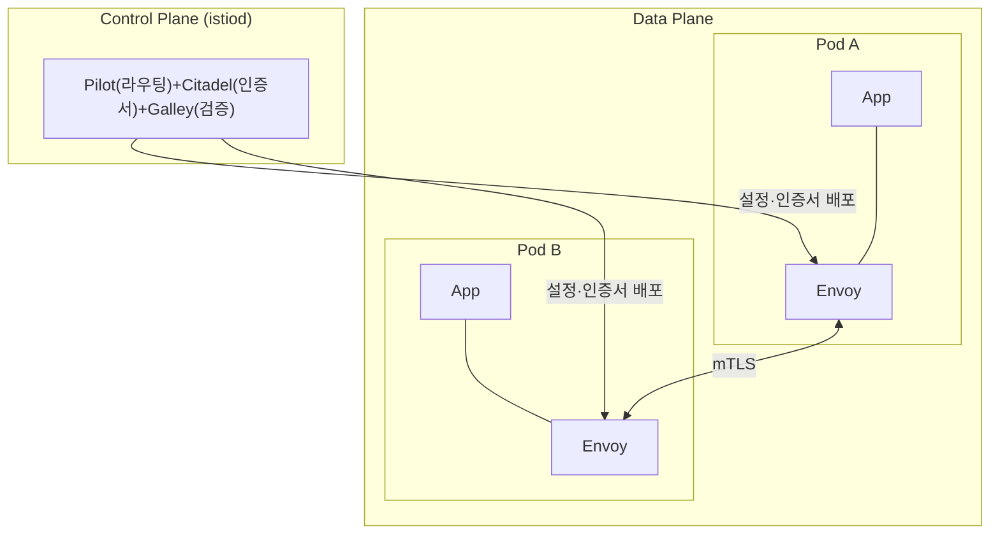

## 📌 들어가며

이번 글에서는 마이크로서비스 간 통신을 관리·보안·모니터링하는 **Istio Service Mesh**를 정리한다. 애플리케이션 코드를 고치지 않고 **Sidecar(Envoy)**로 모든 트래픽을 제어하는 아키텍처부터, 트래픽 관리(Canary·Circuit Breaker)·보안(mTLS)·가시성(Kiali·Jaeger)까지 다룬다.

> **Service Mesh란?** 서비스 간 통신을 담당하는 **전용 인프라 계층**. Istio는 각 Pod에 **Envoy 프록시(Sidecar)**를 붙여 모든 트래픽을 가로채고, 라우팅·mTLS·메트릭을 **앱 코드 수정 없이** 제공한다.

---

## 1. 아키텍처 — Control Plane vs Data Plane



| 컴포넌트 | 역할 |
|---------|------|
| **Pilot** | 서비스 디스커버리·Envoy 설정 배포 |
| **Citadel** | mTLS 인증서 발급/갱신 |
| **Galley** | Istio 리소스 검증 |

> 💡 **Istio 1.5+부터 세 컴포넌트가 `istiod` 하나로 통합**됐다. Data Plane은 각 Pod에 자동 주입되는 `istio-proxy`(Envoy) 컨테이너로, **모든 인바운드/아웃바운드 트래픽을 가로채** 라우팅·암호화·메트릭 생성을 담당한다.

---

## 2. 트래픽 관리 — VirtualService & DestinationRule

Istio 트래픽 관리의 두 축이다. **VirtualService(어디로)** + **DestinationRule(어떻게·subset 정의)**.

```yaml
# VirtualService — 라우팅 규칙(Chrome은 v2, 나머지 v1)
kind: VirtualService
spec:
  hosts: [reviews]
  http:
  - match:
    - headers: {user-agent: {regex: ".*Chrome.*"}}
    route:
    - destination: {host: reviews, subset: v2}
  - route:
    - destination: {host: reviews, subset: v1}
---
# DestinationRule — subset 정의 + 트래픽 정책
kind: DestinationRule
spec:
  host: reviews
  trafficPolicy:
    loadBalancer: {simple: LEAST_CONN}
  subsets:
  - {name: v1, labels: {version: v1}}
  - {name: v2, labels: {version: v2}}
```

| 기능 | 설명 |
|------|------|
| **A/B 테스트** | 헤더 기반 라우팅 |
| **Canary 배포** | 가중치 조정(v1 90% / v2 10%) |
| **Circuit Breaker** | 장애 서비스 격리 |
| **재시도·타임아웃** | 네트워크 장애 대응 |
| **요청 미러링** | 프로덕션 트래픽 복사 |

---

## 3. 보안 — mTLS & AuthorizationPolicy

**PeerAuthentication**으로 서비스 간 통신을 자동 암호화(mTLS)한다.

```yaml
kind: PeerAuthentication
spec:
  mtls:
    mode: STRICT   # STRICT(필수) / PERMISSIVE(둘 다) / DISABLE
```

```yaml
# AuthorizationPolicy — 세밀한 접근 제어
kind: AuthorizationPolicy
spec:
  selector: {matchLabels: {app: reviews}}
  action: ALLOW
  rules:
  - from:
    - source: {principals: ["cluster.local/ns/default/sa/bookinfo-productpage"]}
    to:
    - operation: {methods: ["GET"], paths: ["/reviews/*"]}
```

> 💡 **mTLS가 앱 코드 없이 자동으로** 적용되는 것이 Service Mesh의 핵심 매력이다. Citadel(istiod)이 인증서를 발급·갱신하고 Envoy가 암복호화하므로, 개발자는 서비스 간 통신 암호화를 신경 쓸 필요가 없다. 마이그레이션 중에는 `PERMISSIVE`로 평문·mTLS를 함께 허용하다 `STRICT`로 전환한다.

---

## 4. 가시성 (Observability)

Envoy가 자동으로 메트릭·추적 데이터를 생성한다.

| 도구 | 역할 |
|------|------|
| **Prometheus** | `istio_requests_total` 등 메트릭 수집 |
| **Kiali** | 서비스 토폴로지·트래픽 흐름 시각화 |
| **Jaeger** | 분산 추적(요청 경로·서비스별 지연) |
| **Grafana** | 대시보드 |

```bash
istioctl dashboard kiali      # 서비스 메시 그래프
istioctl dashboard jaeger     # 분산 추적
```

---

## 5. 설치 & Sidecar 주입

```bash
# 설치 (demo 프로파일)
curl -L https://istio.io/downloadIstio | sh -
istioctl install --set profile=demo -y
kubectl get pods -n istio-system     # istiod, ingressgateway 확인

# Sidecar 자동 주입 활성화
kubectl label namespace default istio-injection=enabled
kubectl rollout restart deployment <name>   # 기존 Pod 재배포
```

> ⚠️ Label만 붙인다고 기존 Pod에 Sidecar가 들어가지 않는다. **`rollout restart`로 재배포**해야 주입된다. Sidecar가 안 붙었으면 네임스페이스의 `istio-injection=enabled` Label부터 확인한다.

---

## 6. 실무 패턴

### Canary 배포

```yaml
kind: VirtualService
spec:
  http:
  - route:
    - {destination: {host: reviews, subset: v1}, weight: 90}
    - {destination: {host: reviews, subset: v2}, weight: 10}
```

**프로세스**: v2 10% → 모니터링(에러율·지연) → 10%→30%→50%→100% 단계 증가 → v1 제거.

### 타임아웃·재시도 & Circuit Breaker

```yaml
# VirtualService — 재시도
http:
- route: [{destination: {host: reviews}}]
  timeout: 3s
  retries: {attempts: 3, perTryTimeout: 1s, retryOn: 5xx}
```

```yaml
# DestinationRule — Circuit Breaker
trafficPolicy:
  outlierDetection:
    consecutiveErrors: 5      # 5회 연속 실패 시
    baseEjectionTime: 30s     # 30초 격리
    maxEjectionPercent: 50    # 최대 50%만 격리
```

> 💡 **Circuit Breaker는 장애 전파를 막는 안전장치**다. 특정 Pod가 연속 실패하면 잠시 트래픽에서 제외(격리)해, 죽어가는 서비스에 요청을 계속 보내 전체가 마비되는 것을 방지한다. `maxEjectionPercent`로 한꺼번에 너무 많이 빼지 않게 제한한다.

---

## 7. 트러블슈팅

```bash
istioctl analyze -n default                       # 설정 검증
istioctl proxy-status                             # Proxy 동기화 상태
istioctl proxy-config routes <pod> -n <ns>        # Envoy 라우팅 확인
```

> ⚠️ **흔한 원인** — ① Sidecar 미주입(Label + rollout restart), ② VirtualService `host` 불일치(FQDN `reviews.default.svc.cluster.local` 확인), ③ subset 라벨 불일치, ④ mTLS 503(DestinationRule에 `tls.mode: ISTIO_MUTUAL` 명시).

---

## 8. 운영 참고 — 오버헤드 & 대안

Sidecar는 공짜가 아니다. **Pod당 CPU 50~200m·메모리 128~512Mi·지연 1~3ms**가 추가된다.

| 도구 | 특징 | 적합 |
|------|------|------|
| **Istio** | 풍부한 기능·높은 복잡도 | 대규모 MSA·엄격한 보안 |
| **Linkerd** | 경량·단순(Rust) | 낮은 오버헤드 우선 |
| **AWS App Mesh** | AWS 관리형 | AWS 전용 |

> ⚠️ **마이크로서비스가 10개 미만이면 Istio가 과하다.** 그 경우 **Ingress + cert-manager** 조합이 훨씬 단순하다. Istio는 복잡한 트래픽 제어·전역 mTLS·세밀한 관측이 진짜 필요할 때 도입한다. (HyperCloud K8s 1.21은 Istio 1.5.x~1.10.x 사용)

---

## 📝 정리

```
Istio Service Mesh
├─ 구조   Control Plane(istiod) + Data Plane(Envoy Sidecar)
├─ 트래픽 VirtualService(어디로) + DestinationRule(subset·정책)
├─ 보안   mTLS(PeerAuth) + AuthorizationPolicy (코드 수정 X)
├─ 가시성 Kiali·Jaeger·Prometheus·Grafana
└─ 판단   MSA 10개 미만이면 Ingress+cert-manager가 단순
```

| 개념 | 한 줄 정의 |
|------|------|
| **Service Mesh** | 서비스 통신 전용 인프라 계층 |
| **Envoy Sidecar** | 트래픽 가로채는 프록시 |
| **VirtualService** | 라우팅 규칙 |

Istio의 핵심은 **Sidecar가 모든 트래픽을 가로채, 앱 코드 수정 없이 트래픽 관리·mTLS·관측을 제공**하는 것이다. 강력하지만 오버헤드와 복잡도가 있으니, 규모와 요구사항이 이를 정당화할 때 도입하는 판단이 중요하다.

---

## 🔗 참고

- [Istio 공식 문서](https://istio.io/latest/docs/)
- [Kiali](https://kiali.io/) · [Bookinfo 예제](https://istio.io/latest/docs/examples/bookinfo/)
