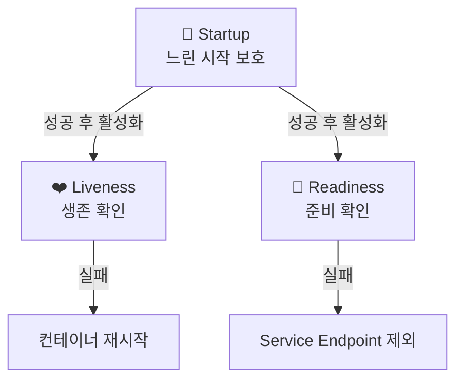

## 📌 들어가며

이번 글에서는 컨테이너 상태를 주기적으로 검사해 **자동 복구와 트래픽 제어**를 수행하는 **Probe(헬스체크)**를 완전 정리한다. Liveness·Readiness·Startup 세 종류의 차이, 검사 방식(http/tcp/exec), Spring Boot 실무 설정, 그리고 흔한 실수까지 다룬다.

> **Probe란?** kubelet이 컨테이너 상태를 주기적으로 검사하는 헬스체크. **Liveness**(살아있나 → 실패 시 재시작), **Readiness**(트래픽 받을 준비됐나 → 실패 시 Endpoint 제외), **Startup**(느린 시작 보호)의 세 종류가 있다.

---

## 1. Probe 3종류



| Probe | 목적 | 실패 시 |
|------|------|------|
| **Liveness** | 컨테이너가 살아있나 | **재시작** |
| **Readiness** | 트래픽 받을 준비됐나 | **Endpoint 제외**(트래픽 차단) |
| **Startup** | 느린 시작 완료됐나 | 재시작(완료 전 다른 Probe 대기) |

> 💡 **Liveness와 Readiness의 결정적 차이** — Liveness 실패는 "죽었으니 **재시작**", Readiness 실패는 "아직 준비 안 됐으니 **트래픽만 끊고 기다림**"이다. 이를 혼동해 Readiness 조건을 Liveness에 넣으면, 초기화 중인 정상 파드를 계속 재시작하게 된다.

---

## 2. 검사 방식 & 파라미터

| 방식 | 설명 | 사용 |
|------|------|------|
| **httpGet** | HTTP GET 상태 확인 | REST·웹앱 |
| **tcpSocket** | 포트 연결 확인 | DB·Redis |
| **exec** | 컨테이너 내 명령 실행 | 커스텀 스크립트 |

| 파라미터 | 설명 | 기본 |
|----------|------|------|
| `initialDelaySeconds` | 첫 검사까지 대기 | 0 |
| `periodSeconds` | 검사 주기 | 10 |
| `timeoutSeconds` | 응답 대기 | 1 |
| `failureThreshold` | 실패 허용 횟수 | 3 |

---

## 3. 실무 패턴

### HTTP Probe (가장 일반적)

```yaml
livenessProbe:
  httpGet:
    path: /healthz
    port: 8080
  initialDelaySeconds: 30   # 앱 시작 시간 고려
  periodSeconds: 10
  failureThreshold: 3
readinessProbe:
  httpGet:
    path: /ready            # 엔드포인트 분리!
    port: 8080
  initialDelaySeconds: 5    # Liveness보다 짧게
  periodSeconds: 5
```

### TCP Probe (DB·Redis)

HTTP 엔드포인트가 없을 때 포트 연결만 확인한다.

```yaml
livenessProbe:
  tcpSocket:
    port: 6379
```

### Exec Probe (커스텀)

```yaml
readinessProbe:
  exec:
    command: ["sh", "-c", "pg_isready -U postgres && psql -U postgres -c 'SELECT 1'"]
```

> 💡 exec는 `&&`로 여러 조건을 한 번에 검사할 수 있지만, **매번 쉘 프로세스를 만들어 httpGet보다 무겁다.** DB는 `pg_isready`·`mysqladmin ping` 같은 가벼운 명령을 쓴다.

### Startup Probe (느린 시작)

```yaml
startupProbe:
  httpGet:
    path: /startup
    port: 8080
  periodSeconds: 10
  failureThreshold: 30    # 최대 300초(5분) 시작 허용
```

Startup이 성공할 때까지 Liveness/Readiness는 실행되지 않는다.

### Spring Boot 실무 권장

```yaml
livenessProbe:
  httpGet:
    path: /actuator/health/liveness
    port: 8080
  initialDelaySeconds: 60   # Spring Boot 시작 시간
readinessProbe:
  httpGet:
    path: /actuator/health/readiness
    port: 8080
  initialDelaySeconds: 30
```

```yaml
# application.yml
management:
  endpoint:
    health:
      probes:
        enabled: true
```

---

## 4. 권장 설정값

| Probe | initialDelay | period | timeout | failureThreshold |
|-------|:---:|:---:|:---:|:---:|
| **Liveness** | 30~60초 | 10초 | 5초 | 3 |
| **Readiness** | 10~30초 | 5초 | 3초 | 3 |
| **Startup** | 0초 | 10초 | 3초 | 30 |

- **경량**(Nginx·Redis): 짧게 / **중량**(Spring·Java): 60초+ / **DB**: Readiness에 실제 쿼리 포함.

---

## 5. 흔한 실수 & 트러블슈팅

> ⚠️ **① Liveness=Readiness 동일 설정** → 초기화 중 Liveness 실패로 무한 재시작. 엔드포인트를 `/healthz`(생존)·`/ready`(준비)로 **분리**한다.
> **② initialDelay 너무 짧음** → 시작 전에 재시작 반복(Spring은 30초+ 필요). Startup Probe 활용.
> **③ failureThreshold: 1** → 일시적 오류로 불필요한 재시작. 3 이상 권장.
> **④ 무거운 헬스체크**(DB 전체 스캔) → Probe마다 부하. `SELECT 1` 수준으로.
> **⑤ Readiness 미설정** → 롤링 업데이트 시 초기화 안 된 파드로 트래픽 유입.

```bash
# 디버깅 순서
kubectl describe pod <pod> -n <ns>                       # ① Events
kubectl logs <pod> -n <ns> --previous                    # ② 직전 로그
kubectl exec -it <pod> -n <ns> -- curl localhost:8080/healthz  # ③ 직접 테스트
kubectl get endpoints <svc> -n <ns>                      # ④ Endpoint 포함 여부
```

> 💡 **Readiness 실패 vs Liveness 실패 구분** — Readiness 실패면 `kubectl get endpoints`에서 파드가 빠지지만 재시작은 안 된다. Liveness 실패면 RESTARTS가 오르지만 Endpoint는 유지된다. 증상으로 어느 Probe 문제인지 알 수 있다.

---

## 6. 운영 참고 (금융권)

- 헬스체크 엔드포인트는 **인증 없이 접근** 가능해야 한다(Probe는 인증 헤더 미포함).
- 응답에 **민감 정보(DB 문자열·버전) 노출 금지**.
- **Liveness는 앱 자체 생존만**, **Readiness는 외부 의존성(DB·Redis) 연결까지** 확인.
- CrashLoopBackOff 방지: Startup Probe + 넉넉한 `initialDelaySeconds`.

Prometheus 알림 예: `KubePodCrashLooping`(5분 2회+ 재시작 → Liveness 검토), `KubePodNotReady`(15분+ Ready 아님 → Readiness 검토).

---

## 📝 정리

```
Probe (헬스체크)
├─ 종류   Liveness(재시작)/Readiness(트래픽차단)/Startup(느린시작)
├─ 방식   httpGet / tcpSocket / exec
├─ 분리   엔드포인트 /healthz vs /ready
├─ 값     Liveness 30~60s·Readiness 10~30s·failureThreshold 3+
└─ 실무   Readiness 필수(무중단 배포), Spring은 Actuator
```

| 개념 | 한 줄 정의 |
|------|------|
| **Liveness** | 생존 확인(실패→재시작) |
| **Readiness** | 준비 확인(실패→트래픽 차단) |
| **Startup** | 느린 시작 보호 |

Probe의 핵심은 **Liveness(재시작)와 Readiness(트래픽 차단)의 역할 분리**다. 특히 **Readiness Probe는 무중단 배포의 필수 요소**이며, 엔드포인트와 지연 값을 애플리케이션 특성에 맞게 설정하는 것이 관건이다.

---

## 🔗 참고

- [Configure Liveness/Readiness/Startup Probes](https://kubernetes.io/docs/tasks/configure-pod-container/configure-liveness-readiness-startup-probes/)
- [Spring Boot Actuator](https://docs.spring.io/spring-boot/docs/current/reference/html/actuator.html)
