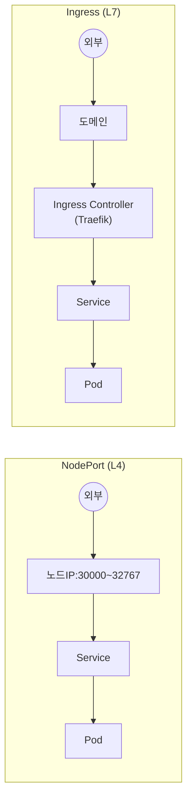
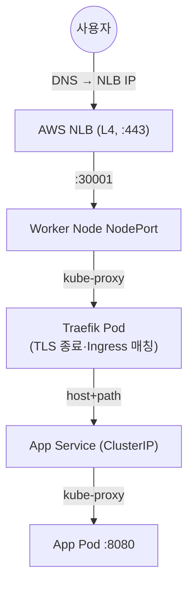

## 📌 들어가며

이번 글에서는 클러스터 내부 서비스를 외부에 노출하는 두 방식 **NodePort vs Ingress**를 비교 정리한다. 계층·프로토콜 차이부터 Path/Host 라우팅, TLS, HyperCloud Traefik 구성, NLB 포함 실무 트래픽 흐름까지 다룬다.

> **한눈에** — **NodePort**는 노드 IP:포트로 여는 L4 방식(개발/테스트), **Ingress**는 도메인 기반 HTTP/HTTPS 라우팅을 하는 L7 방식(프로덕션)이다. Ingress는 하나의 진입점으로 여러 서비스를 도메인·경로로 분기한다.

---

## 1. NodePort vs Ingress



| 항목 | **NodePort** | **Ingress** |
|------|--------------|-------------|
| OSI 계층 | L4 | L7 |
| 프로토콜 | TCP/UDP | HTTP/HTTPS |
| 포트 | 30000~32767 | 80/443 |
| 라우팅 | 불가 | **Path·Host 기반** |
| TLS | 불가 | **지원(종료)** |
| 접근 | `<NodeIP>:<Port>` | `https://domain` |
| 환경 | 개발/테스트 | 프로덕션 |

> 💡 **Ingress ≠ Ingress Controller.** **Ingress**는 "어디로 보낼지"를 적은 **규칙(YAML)**일 뿐, 실제 트래픽은 **Ingress Controller(Traefik·Nginx Pod)**가 그 규칙을 읽어 라우팅한다. Ingress 리소스만 만들고 Controller가 없으면 아무 일도 안 일어난다.

---

## 2. Ingress가 필요한 이유

NodePort만 쓰면 서비스마다 포트가 따로 필요하다. Ingress는 **진입점 하나로 도메인·경로 분기**한다.

```
NodePort:  svc1=31001, svc2=31002, svc3=31003 (포트 난립)
Ingress:   Traefik 하나 →
  app1.example.com       → app1-service
  app3.example.com/api   → app3-service
  app3.example.com/admin → admin-service
```

---

## 3. 실무 패턴

### NodePort Service

```yaml
apiVersion: v1
kind: Service
metadata:
  name: webapp-nodeport
spec:
  type: NodePort
  selector:
    app: webapp
  ports:
    - port: 8080
      targetPort: 8080
      nodePort: 31234    # 생략 시 자동 할당
```

어느 노드 IP로 접근해도 kube-proxy가 적절한 Pod로 전달한다.

### Ingress — Path 기반 라우팅

```yaml
apiVersion: networking.k8s.io/v1
kind: Ingress
metadata:
  name: multi-service-ingress
  annotations:
    kubernetes.io/ingress.class: "traefik"
spec:
  rules:
  - host: app.example.com
    http:
      paths:
      - path: /api
        pathType: Prefix
        backend:
          service: {name: api-service, port: {number: 8080}}
      - path: /admin
        pathType: Prefix
        backend:
          service: {name: admin-service, port: {number: 3000}}
```

`/api` → api-service, `/admin` → admin-service로 분기. **Host 기반**은 `host:`를 여러 개 두어 도메인별로 나눈다.

### Ingress + TLS

```yaml
spec:
  tls:
  - hosts: [app.example.com]
    secretName: tls-secret     # kubernetes.io/tls Secret
  rules:
  - host: app.example.com
    http:
      paths:
      - path: /
        pathType: Prefix
        backend:
          service: {name: webapp-svc, port: {number: 8080}}
```

> 💡 **TLS 종료는 Ingress Controller(Traefik)에서** 이뤄진다. 사용자~Traefik 구간만 HTTPS로 암호화하고, 뒤의 Pod로는 평문으로 전달할 수 있어 각 Pod에 인증서를 심을 필요가 없다. Secret은 **Ingress와 반드시 같은 네임스페이스**에 둔다.

---

## 4. 실무 아키텍처 — NLB + Traefik

프로덕션에서는 **NLB(L4) → Traefik NodePort → Traefik Pod(TLS 종료·Ingress 매칭) → App Service → Pod**로 흐른다.



| Service | 타입 | 역할 |
|---------|------|------|
| **Traefik Service** | NodePort | NLB(외부) → Traefik Pod |
| **Application Service** | ClusterIP | Traefik → 앱 Pod |

> 💡 **Service가 2개인 이유** — 외부 진입용(Traefik=NodePort)과 내부 연결용(앱=ClusterIP)이 역할이 다르다. 앱 Service는 Traefik만 접근하면 되므로 외부에 열 필요가 없어 **ClusterIP로 충분**하다.

---

## 5. 흔한 실수 & 트러블슈팅

> ⚠️ **① NodePort 범위 초과**(30000~32767 밖) → 에러. **② Ingress 뒤 Service를 NodePort로** → 포트 낭비·보안 취약(ClusterIP면 충분). **③ Ingress Controller 미설치** → 규칙만 있고 동작 안 함. **④ Host 헤더 없이 IP 접근** → 404. **⑤ pathType 누락** → 1.18+ 필수. **⑥ TLS Secret 다른 네임스페이스** → 인증서 로드 실패. **⑦ NodePort 방화벽 미개방** → 접근 불가.

```bash
# NodePort 디버깅
kubectl get endpoints <svc> -n <ns>          # Pod 연결 여부
# Ingress 디버깅
kubectl get pods -n traefik-system           # Controller 실행?
kubectl describe ingress <ing> -n <ns>       # 규칙 상태
curl -H "Host: app.example.com" http://<ingress-ip>   # Host 헤더 테스트
```

---

## 6. 의사결정 가이드

| 상황 | 선택 |
|------|------|
| 개발/테스트, TCP/UDP, Controller 없음 | **NodePort** |
| 프로덕션, 다중 서비스, Path/Host, TLS | **Ingress** |

**금융권**: 외부망은 Ingress+TLS 필수, 내부망은 NodePort 가능, DMZ는 Ingress+WAF, Ingress Controller 로그로 감사 추적.

---

## 📝 정리

```
NodePort vs Ingress
├─ NodePort  L4·노드포트(30000~32767)·개발
├─ Ingress   L7·도메인/Path 라우팅·TLS·프로덕션
├─ 구분      Ingress(규칙) ≠ Controller(Traefik Pod)
├─ 아키텍처   NLB → Traefik(NodePort) → App(ClusterIP)
└─ 주의      Controller 설치·Host 헤더·같은 NS Secret
```

| 개념 | 한 줄 정의 |
|------|------|
| **NodePort** | 노드 포트로 L4 노출 |
| **Ingress** | 도메인 기반 L7 라우팅 |
| **Ingress Controller** | 규칙을 실행하는 Pod |

핵심은 **개발은 NodePort, 프로덕션은 Ingress**이며, Ingress는 반드시 **Controller가 있어야** 동작한다는 점이다. 실무에서는 NLB → Traefik(NodePort) → 앱(ClusterIP)의 2단 Service 구조로 외부 트래픽을 받는다.

---

## 🔗 참고

- [Kubernetes Service 공식 문서](https://kubernetes.io/docs/concepts/services-networking/service/)
- [Kubernetes Ingress 공식 문서](https://kubernetes.io/docs/concepts/services-networking/ingress/)
