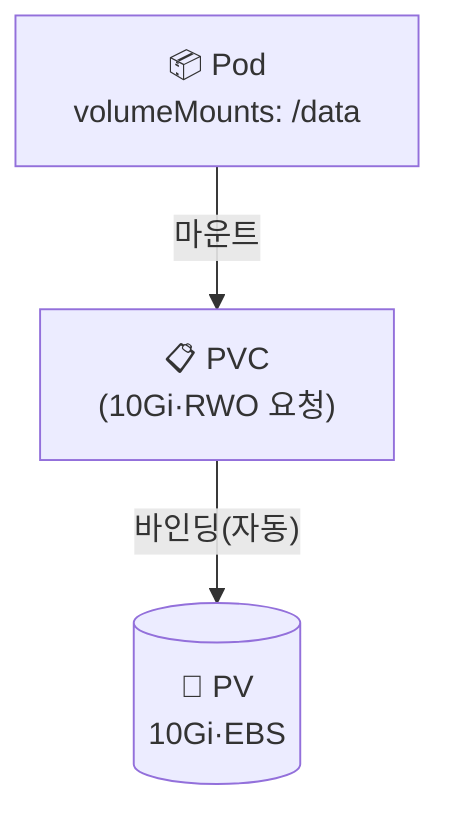

## 📌 들어가며

이번 글에서는 쿠버네티스 영구 스토리지의 두 축인 **PV & PVC**를 완전 정리한다. 개념·생명주기·주요 속성부터 StatefulSet·공유 스토리지·VolumeSnapshot 같은 실무 패턴과 트러블슈팅까지 다룬다.

> **PV & PVC란?** **PV(PersistentVolume)**는 관리자가 프로비저닝한 **실제 스토리지**(디스크·NFS·EBS), **PVC(PersistentVolumeClaim)**는 사용자의 **스토리지 요청서**(크기·접근 모드)다. PVC가 조건에 맞는 PV를 찾아 **1:1로 바인딩**된다.

```
PV  = 아파트(실제 부동산)   PVC = 임대 계약서(요청 조건)   Pod = 입주자
```

---

## 1. 구조와 생명주기



**생명주기**: ① Provisioning(정적=관리자 생성 / 동적=StorageClass 자동) → ② Binding(PVC↔PV 1:1) → ③ Using(Pod 마운트) → ④ Reclaiming(PVC 삭제 시 Retain/Delete).

---

## 2. 주요 속성 3가지

### Access Modes (접근 모드)

| 모드 | 약자 | 설명 | 예 |
|------|------|------|------|
| **ReadWriteOnce** | RWO | 단일 노드 읽기/쓰기 | EBS, Azure Disk |
| **ReadOnlyMany** | ROX | 여러 노드 읽기 전용 | 공유 설정 파일 |
| **ReadWriteMany** | RWX | 여러 노드 읽기/쓰기 | NFS, EFS, CephFS |

### Reclaim Policy (회수 정책)

| 정책 | 동작 | 사용 |
|------|------|------|
| **Retain** | PVC 삭제해도 PV·데이터 유지 | 프로덕션 |
| **Delete** | PV·실제 스토리지 삭제 | 개발/테스트 |
| **Recycle** | (Deprecated) | 사용 안 함 |

### Volume Binding Mode

| 모드 | 동작 | 사용 |
|------|------|------|
| **Immediate** | PVC 생성 즉시 바인딩 | EFS·NFS |
| **WaitForFirstConsumer** | Pod 생성 시점 바인딩 | EBS |

> ⚠️ **블록 스토리지(EBS·Azure Disk)는 RWO만 지원**한다. 여러 파드가 동시에 써야 하면 **NFS·EFS(RWX)**를 써야 한다. RWX를 EBS에 요청하면 PVC가 Pending에 걸린다.

---

## 3. 기본 사용법

### Static Provisioning (수동)

```yaml
# ① PV (관리자)
apiVersion: v1
kind: PersistentVolume
metadata:
  name: my-pv
spec:
  capacity:
    storage: 10Gi
  accessModes: [ReadWriteOnce]
  persistentVolumeReclaimPolicy: Retain
  storageClassName: manual
  hostPath:
    path: /mnt/data
---
# ② PVC (사용자)
apiVersion: v1
kind: PersistentVolumeClaim
metadata:
  name: my-pvc
spec:
  accessModes: [ReadWriteOnce]
  resources:
    requests:
      storage: 10Gi
  storageClassName: manual
```

### Dynamic Provisioning (자동, 실무 권장)

PVC만 만들면 StorageClass가 PV를 자동 생성·바인딩한다.

```yaml
apiVersion: v1
kind: PersistentVolumeClaim
metadata:
  name: dynamic-pvc
spec:
  accessModes: [ReadWriteOnce]
  storageClassName: gp2      # AWS EBS gp2
  resources:
    requests:
      storage: 20Gi
```

```
PVC 생성 → StorageClass(gp2) → EBS 20Gi 자동 생성 → PV 생성·바인딩 → Pod 마운트
```

---

## 4. 기본 명령어

```bash
kubectl get pv                                   # PV 목록
kubectl get pvc -n <ns>                          # PVC 목록
kubectl describe pvc <pvc> -n <ns>               # 바인딩·이벤트
kubectl delete pod <pod> -n <ns>                 # PVC 삭제 전 Pod 먼저
kubectl delete pvc <pvc> -n <ns>
```

**PV STATUS 의미:**

| 상태 | 의미 |
|------|------|
| **Available** | 사용 가능(미바인딩) |
| **Bound** | PVC와 바인딩됨 |
| **Released** | PVC 삭제됐지만 Retain으로 유지 |
| **Failed** | 에러 |

---

## 5. 실무 패턴

### StatefulSet + volumeClaimTemplates

Pod마다 **독립 PVC를 자동 생성**한다.

```yaml
spec:
  volumeClaimTemplates:
  - metadata:
      name: data
    spec:
      accessModes: ["ReadWriteOnce"]
      storageClassName: gp2
      resources:
        requests:
          storage: 50Gi
```

```
data-postgres-0 → postgres-0 전용
data-postgres-1 → postgres-1 전용   (Pod별 독립 저장소)
```

### 공유 스토리지 (RWX)

여러 파드가 같은 파일시스템을 공유하려면 EFS/NFS로 `ReadWriteMany` PVC를 만들고 여러 파드가 **같은 claimName**을 참조한다.

### VolumeSnapshot (백업/복구)

```yaml
apiVersion: snapshot.storage.k8s.io/v1
kind: VolumeSnapshot
metadata:
  name: db-backup-20240104
spec:
  volumeSnapshotClassName: csi-aws-vsc
  source:
    persistentVolumeClaimName: db-pvc
```

복구는 새 PVC의 `dataSource`에 이 스냅샷을 지정하면 된다.

### 동일 PVC를 여러 경로에 마운트

같은 PVC를 한 파드 안 여러 `mountPath`로 마운트하면, **완전히 동일한 데이터**를 가리킨다(디스크는 1배만 사용).

```yaml
volumeMounts:
- name: my-vol
  mountPath: /LOGS          # 경로 1
- name: my-vol
  mountPath: /app/logs      # 경로 2 (같은 volume)
```

> 💡 **레거시 경로 호환**에 유용하다. 옛 경로(`/LOGS`)와 새 경로(`/app/logs`)를 동시에 지원해야 할 때, 심볼릭 링크 대신 volumeMount로 처리한다. 단 **한쪽에서 삭제하면 양쪽 모두 사라진다.**

---

## 6. 트러블슈팅

> ⚠️ **PVC Pending** — `kubectl describe pvc`로 원인 확인. 조건 맞는 PV 없음 / StorageClass 없음 / 용량 부족 / **AccessMode 불일치**가 흔하다.

> ⚠️ **PVC 삭제 안 됨** — 파드가 사용 중이면 못 지운다. **Pod → PVC 순서**로 삭제한다.

> ⚠️ **PV Released 재사용** — Retain으로 남은 PV는 `kubectl edit pv`로 **`spec.claimRef`를 지우면** 다시 Available이 된다.

**흔한 실수:**

```yaml
# ❌ 프로덕션에서 Delete → PVC 삭제 시 실제 데이터 소멸
persistentVolumeReclaimPolicy: Delete
# ✅ 프로덕션은 Retain
persistentVolumeReclaimPolicy: Retain
```

---

## 7. 운영 참고 (금융권·폐쇄망)

| 상황 | 권장 |
|------|------|
| 프로덕션 DB | 동적 프로비저닝 + **Retain** |
| StatefulSet | `volumeClaimTemplates`(Pod별 독립) |
| 공유 파일시스템 | RWX + EFS/NFS |
| 백업 | VolumeSnapshot 주기 실행 |
| 폐쇄망 | 클라우드 CSI 대신 **NFS/Ceph** |
| 용량 모니터링 | `kubelet_volume_stats_used_bytes` 알림 |

---

## 📝 정리

```
PV & PVC
├─ 개념   PV(실제 스토리지) ↔ PVC(요청서), 1:1 바인딩
├─ 속성   AccessMode(RWO/RWX) · Reclaim(Retain/Delete) · BindingMode
├─ 방식   Static(수동) / Dynamic(StorageClass, 권장)
├─ 패턴   StatefulSet templates · RWX 공유 · Snapshot
└─ 안전   프로덕션은 Retain, EBS는 RWO
```

| 개념 | 한 줄 정의 |
|------|------|
| **PV / PVC** | 실제 스토리지 / 요청서 |
| **RWO / RWX** | 단일 / 다중 노드 접근 |
| **Retain** | 데이터 보존 정책 |

PV/PVC의 핵심은 **저장소(PV)와 요청(PVC)의 분리**, 그리고 실무에서는 **동적 프로비저닝 + Retain**이 기본이라는 점이다. 접근 모드(RWO/RWX)를 스토리지 종류에 맞게 고르는 것이 Pending을 피하는 지름길이다.

---

## 🔗 참고

- [Kubernetes PV/PVC 공식 문서](https://kubernetes.io/docs/concepts/storage/persistent-volumes/)
