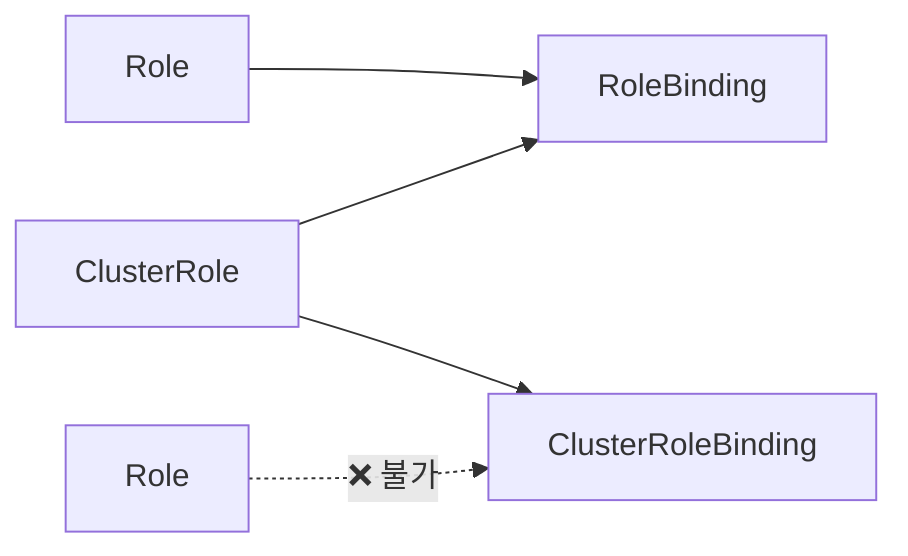

## 📌 들어가며

이번 글에서는 쿠버네티스의 접근 제어 **RBAC**를 완전 정리한다. **누가(Subject)·무엇을(Resource)·어떻게(Verb)** 할 수 있는지를 정의하고 부여하는 구조와, 4가지 바인딩 조합, 권한 합산 원칙, 실무 패턴을 다룬다.

> **RBAC란?** **역할 기반 접근 제어(Role-Based Access Control)**. **Role/ClusterRole**(권한 정의) + **RoleBinding/ClusterRoleBinding**(권한 부여) + **Subject**(사용자·그룹·ServiceAccount)로 구성된다. **허용(Allow)만 있고 거부(Deny)는 없으며**, 여러 바인딩의 권한은 **합집합**으로 누적된다.

---

## 1. Role vs ClusterRole

핵심은 **범위**다. Role은 한 네임스페이스, ClusterRole은 클러스터 전체 + **클러스터 리소스(Node·PV)** 접근이 가능하다.

| 항목 | **Role** | **ClusterRole** |
|------|----------|-----------------|
| 범위 | 특정 네임스페이스 | 클러스터 전체 |
| 클러스터 리소스(Node·PV) | ❌ | ✅ |
| 재사용성 | ❌ | ✅ |
| `metadata.namespace` | 필수 | 없음 |

```yaml
# Role — 네임스페이스 범위
kind: Role
metadata:
  name: pod-reader
  namespace: default
rules:
- apiGroups: [""]
  resources: ["pods"]
  verbs: ["get", "list", "watch"]
```

> 💡 **클러스터 리소스는 ClusterRole만** 다룰 수 있다. `nodes`·`persistentvolumes`·`namespaces`는 네임스페이스에 속하지 않으므로 Role로는 권한을 줄 수 없다. 반면 `pods`·`services` 같은 네임스페이스 리소스는 둘 다 가능하다.

---

## 2. 바인딩 4가지 조합



| 바인딩 | 참조 | 권한 범위 |
|--------|------|-----------|
| RoleBinding | Role ✅ | 해당 NS |
| RoleBinding | ClusterRole ✅ | 해당 NS |
| ClusterRoleBinding | ClusterRole ✅ | 클러스터 전체 |
| ClusterRoleBinding | Role ❌ | **불가능** |

### ⭐ 실무 추천: ClusterRole + RoleBinding

**ClusterRole을 한 번 정의**하고, 여러 네임스페이스의 RoleBinding에서 **재사용**한다.

```yaml
kind: ClusterRole
metadata:
  name: pod-admin
rules:
- apiGroups: [""]
  resources: ["pods"]
  verbs: ["*"]
---
kind: RoleBinding
metadata:
  name: dev-pod-admin
  namespace: dev            # dev에만 적용
subjects:
- kind: User
  name: developer
roleRef:
  kind: ClusterRole         # ClusterRole 재사용
  name: pod-admin
  apiGroup: rbac.authorization.k8s.io
```

> 💡 **왜 이 조합이 최선인가** — ClusterRole은 재사용 가능한 "권한 템플릿"이 되고, RoleBinding은 그것을 **원하는 네임스페이스에만** 적용한다. `dev`·`staging`에는 붙이고 `production`에는 안 붙이면, 같은 권한 정의로 환경별 접근을 깔끔하게 통제할 수 있다.

---

## 3. 권한 합산 — 합집합 원칙

RBAC는 **deny가 없다.** 여러 바인딩의 권한이 **누적(합집합)**되며, 한 번이라도 허용되면 가능하다.

```
ClusterRoleBinding(view, 전체) + RoleBinding(edit, default)
→ default 네임스페이스: 편집 가능(더 강한 권한)
→ 다른 네임스페이스: 읽기만
```

> ⚠️ **deny가 없기 때문에 최소 권한 원칙이 더 중요**하다. 실수로 넓은 권한을 부여하면 다른 곳에서 이를 막을 방법이 없다. 권한은 항상 좁게 시작해 필요한 만큼만 더한다.

---

## 4. 내장 ClusterRole

| ClusterRole | 권한 | 용도 |
|-------------|------|------|
| **view** | 읽기(Secret 제외) | 개발자·모니터링 |
| **edit** | view + 생성/수정/삭제 | 개발자(배포) |
| **admin** | edit + Role/Binding 관리 | 네임스페이스 관리자 |
| **cluster-admin** | 모든 권한 | 클러스터 관리자 ⚠️ |

---

## 5. 권한 확인 명령어

```bash
kubectl auth can-i --list                          # 내 권한 전체
kubectl auth can-i create pods                     # 특정 작업 가능?
kubectl auth can-i delete pods -n production
kubectl auth can-i get pods --as=donghee           # 다른 사용자(관리자용)
kubectl auth can-i get pods --as=system:serviceaccount:default:my-sa
```

**위험 권한 감사:**

```bash
# cluster-admin 보유자 목록
kubectl get clusterrolebindings -o json | \
  jq -r '.items[] | select(.roleRef.name == "cluster-admin") |
  "⚠️  \(.subjects[].name) has cluster-admin"'
```

> 💡 **`kubectl auth can-i`는 RBAC 디버깅의 핵심**이다. `--as`로 다른 사용자/SA를 흉내 내 "이 계정이 이 작업을 할 수 있는가"를 즉시 확인할 수 있다. 권한 문제가 생기면 바인딩 YAML을 뒤지기 전에 이 명령부터 써보자.

---

## 6. 실무 패턴

**개발자 — 환경별 차등:**

| 네임스페이스 | ClusterRole |
|------|------|
| `dev` | **admin**(모든 권한) |
| `staging` | **edit**(배포·조회) |
| `production` | **view**(조회만) |

**CI/CD(GitLab Runner) — ServiceAccount로:**

```yaml
kind: ClusterRole
metadata:
  name: deployer
rules:
- apiGroups: ["apps"]
  resources: ["deployments"]
  verbs: ["get", "list", "create", "update", "patch"]
---
kind: RoleBinding
metadata:
  name: ci-cd-dev-deployer
  namespace: dev
subjects:
- kind: ServiceAccount
  name: gitlab-runner
  namespace: ci-cd
roleRef:
  kind: ClusterRole
  name: deployer
# production에는 RoleBinding 없음 → 배포 불가 ✅
```

> ⚠️ **자동화에는 User 대신 ServiceAccount**를 쓴다. Jenkins·GitLab Runner 같은 시스템은 사람 계정이 아니라 SA로 인증해야 관리·감사·교체가 용이하다.

---

## 7. 트러블슈팅

```bash
# Forbidden 에러 시
kubectl auth can-i list pods --as=donghee -n default   # ① 권한 확인 → no
kubectl get rolebindings -n default -o yaml | grep -A 10 donghee  # ② 바인딩 확인
kubectl create rolebinding donghee-pod-reader \
  --clusterrole=view --user=donghee -n default          # ③ 해결
```

**RoleBinding이 안 먹을 때 체크리스트**: Subject 이름 오타 / Namespace 일치 / RoleRef 존재 / Role의 verb·apiGroup.

---

## 📝 정리

```
RBAC
├─ 정의   Role(NS) / ClusterRole(전체·클러스터 리소스)
├─ 부여   RoleBinding / ClusterRoleBinding (Role은 CRB 참조 불가)
├─ 추천   ⭐ ClusterRole + RoleBinding (재사용)
├─ 합산   합집합·deny 없음 → 최소 권한 필수
└─ 자동화 User 대신 ServiceAccount
```

| 개념 | 한 줄 정의 |
|------|------|
| **Role/ClusterRole** | 권한 정의(NS/전체) |
| **합집합 원칙** | 권한 누적, deny 없음 |
| **can-i** | 권한 확인·디버깅 |

RBAC의 핵심은 **ClusterRole로 권한을 정의하고 RoleBinding으로 원하는 범위에만 부여**하는 것, 그리고 deny가 없으므로 **최소 권한을 철저히** 지키는 것이다. `kubectl auth can-i`로 항상 실제 권한을 검증하자.

---

## 🔗 참고

- [Kubernetes RBAC 공식 문서](https://kubernetes.io/docs/reference/access-authn-authz/rbac/)
