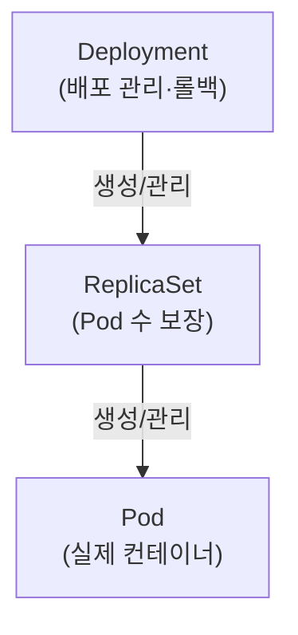
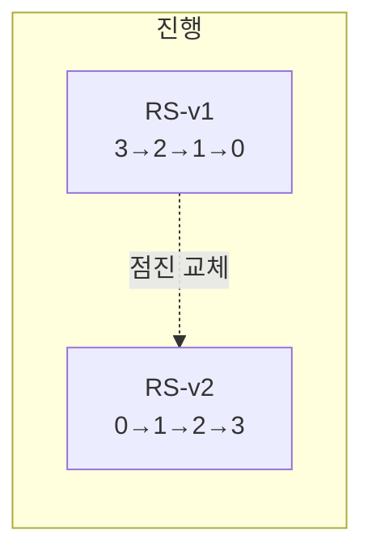

## 📌 들어가며

이번 글에서는 지정한 수의 파드를 항상 유지하는 **ReplicaSet**을 정리한다. 실무에서는 직접 만들지 않고 Deployment를 통해 간접 관리하는데, **롤링 업데이트·롤백**이 어떻게 ReplicaSet 위에서 동작하는지 이해하는 것이 핵심이다.

> **ReplicaSet이란?** **지정한 수(replicas)의 파드가 항상 실행되도록 보장**하는 리소스. 파드가 죽으면 자동으로 새로 만들고, 초과하면 삭제해 개수를 맞춘다. 다만 직접 쓰기보다 **Deployment를 통해 관리**하는 것이 권장된다.

```
replicas: 3 → ReplicaSet이 항상 3개 유지
  · Pod 1개 죽으면 → 자동 생성
  · Pod 1개 초과하면 → 자동 삭제
```

---

## 1. Deployment와의 관계

셋은 **Deployment → ReplicaSet → Pod**의 계층으로 협력한다.



| 기능 | Deployment | ReplicaSet |
|------|:---:|:---:|
| 롤링 업데이트 | ✅ | ❌ |
| 롤백 | ✅ | ❌ |
| Pod 수 보장 | ✅(RS 통해) | ✅ |
| 이력 관리 | ✅ | ❌ |
| 직접 사용 | ✅ 권장 | ❌ 비권장 |

> 💡 ReplicaSet은 "**개수 유지**"만 한다. 롤링 업데이트·롤백·이력 관리는 상위의 Deployment가 담당한다. 그래서 실무에서는 **Deployment만 다루고**, ReplicaSet은 Deployment가 자동 생성·관리하도록 맡긴다.

---

## 2. 새 ReplicaSet이 생기는 조건

**`template.spec`(파드 명세)이 바뀌면** 새 ReplicaSet이 생긴다. 개수·라벨만 바꾸면 기존 것을 재사용한다.

| 변경 | 새 RS | 이유 |
|------|:---:|------|
| 이미지 / 환경변수 / 리소스 / Volume / Command | ✅ | Pod spec 변경 |
| **replicas 변경** | ❌ | 기존 RS 수정 |
| **metadata.labels 변경** | ❌ | Pod spec 무관 |

```bash
# 이미지 변경 → 새 RS 생성
kubectl set image deployment/web-app nginx=nginx:1.22
# 기존: web-app-7d4b5c8f9d (1.21) → 0/3
# 새로: web-app-5f6g7h8i9j (1.22) → 3/3

# replicas 변경 → 기존 RS 유지
kubectl scale deployment web-app --replicas=5
# web-app-7d4b5c8f9d → 5/5 (새 RS 없음)
```

---

## 3. 롤링 업데이트 동작

새 RS의 파드를 하나씩 늘리며 기존 RS를 하나씩 줄인다. **무중단**의 핵심이다.



```
RS-v1(1.21): 3/3 → 2/3 → 1/3 → 0/3 (보존)
RS-v2(1.22): 0/3 → 1/3 → 2/3 → 3/3 (활성)
```

```bash
kubectl rollout status deployment web-app -n default   # 진행 모니터링
watch kubectl get rs -n default                        # RS 변화 확인
```

---

## 4. 기존 ReplicaSet을 보존하는 이유 — 롤백

업데이트 후에도 **기존 RS를 0/3으로 보존**한다. 이게 있어야 **롤백**이 가능하다.

```bash
kubectl rollout history deployment web-app -n default          # 이력 확인
kubectl rollout undo deployment web-app -n default             # 직전으로 롤백
kubectl rollout undo deployment web-app -n default --to-revision=1  # 특정 버전
```

```
롤백(v3 → v2): RS-v2가 0/3 → 3/3으로 다시 활성, RS-v3는 0/3 보존
```

**보존 개수**는 `revisionHistoryLimit`(기본 10)으로 조절한다. 11번째가 생기면 가장 오래된 것부터 자동 삭제된다.

```yaml
spec:
  revisionHistoryLimit: 10   # 3(절약) / 20(롤백 옵션↑) / 0(롤백 불가·비권장)
```

---

## 5. 주의사항

> ⚠️ **활성 ReplicaSet을 직접 삭제하지 말 것.** 활성 RS(3/3)를 지우면 파드가 전부 삭제되고, Deployment가 즉시 새 RS를 만들어 **모든 파드 재생성 → 서비스 중단**이 된다. 구버전(0/3) RS 삭제는 가능하지만 그만큼 롤백 옵션이 줄어든다.

> ⚠️ **ReplicaSet 직접 수정 금지.** `kubectl edit rs ...`로 바꿔도 **Deployment가 다시 덮어쓴다.** 반드시 `kubectl edit deployment`로 상위에서 수정한다.

> ⚠️ **같은 라벨의 파드를 수동 생성하면 삭제된다.** `replicas=3`인데 같은 라벨 파드를 하나 더 만들면 4개가 되어, ReplicaSet이 초과분 1개를 즉시 삭제한다.

---

## 📝 정리

```
ReplicaSet
├─ 역할   지정 수 Pod 유지(자동 재생성)
├─ 계층   Deployment → ReplicaSet → Pod
├─ 새 RS  template.spec 변경 시(개수·라벨은 X)
├─ 롤링   새 RS↑ / 기존 RS↓ (기존 0/3 보존)
└─ 롤백   보존된 RS 활성화(revisionHistoryLimit=10)
```

| 개념 | 한 줄 정의 |
|------|------|
| **ReplicaSet** | Pod 개수 보장 |
| **template.spec 변경** | 새 RS 생성 트리거 |
| **revisionHistoryLimit** | 보존할 RS 개수 |

ReplicaSet의 핵심은 **개수 유지**이고, 롤링 업데이트·롤백은 **여러 RS를 늘리고 줄이며** 이뤄진다. 실무 원칙은 명확하다 — **Deployment로만 다루고, ReplicaSet은 직접 만들거나 수정·삭제하지 않는다.**

---

## 🔗 참고

- [공식 문서 - ReplicaSet](https://kubernetes.io/docs/concepts/workloads/controllers/replicaset/)
