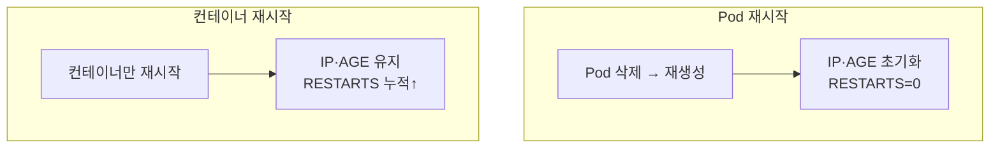

## 📌 들어가며

이번 글에서는 파드를 안전하게 교체하는 **Rollout(롤링 업데이트)** 메커니즘과, **Pod 재시작 vs 컨테이너 재시작**의 차이를 정리한다. RESTARTS·AGE가 왜 바뀌는지, 그리고 OOMKilled 같은 재시작 원인을 어떻게 진단하는지 살펴본다.

> **핵심 구분** — **Pod 재시작**은 파드를 삭제 후 재생성(IP·AGE 초기화)이고, **컨테이너 재시작**은 파드는 유지한 채 컨테이너만 다시 뜨는 것(RESTARTS 증가)이다. 원인과 증상이 완전히 다르다.

---

## 1. Pod 재시작 vs 컨테이너 재시작



| 항목 | Pod 재시작 | 컨테이너 재시작 |
|------|-----------|----------------|
| **AGE** | 초기화 | 유지 |
| **IP** | 변경 | 유지 |
| **RESTARTS** | 0으로 초기화 | 누적 증가 |
| **원인** | `kubectl delete`·노드 장애·rollout | OOMKill·Crash·Probe 실패 |

> 💡 **디버깅 첫 단추**는 `kubectl get pods`의 두 컬럼이다. **AGE가 짧아졌으면 Pod 재시작**, **RESTARTS만 올랐으면 컨테이너 재시작**이다. 이것만 봐도 "파드가 새로 떴는지 vs 컨테이너가 죽다 살았는지"를 구분할 수 있다.

---

## 2. Rollout 메커니즘

`spec` 변경(이미지·annotation 등)을 감지하면 **updateStrategy에 따라 파드를 순차 교체**한다.

```
spec 변경 → 새 Pod 생성 → Running 확인 → 기존 Pod 삭제 → 반복
```

`kubectl rollout restart`는 파드 spec을 직접 안 바꾸고 **annotation에 재시작 시각을 심어** 롤링 업데이트를 트리거한다.

```bash
kubectl rollout restart daemonset calico-node -n kube-system
# annotation: kubectl.kubernetes.io/restartedAt: "..." → Rolling Update 트리거
```

---

## 3. updateStrategy

### Deployment (RollingUpdate)

```yaml
spec:
  replicas: 5
  strategy:
    type: RollingUpdate
    rollingUpdate:
      maxUnavailable: 1   # 동시에 내릴 수 있는 Pod 수
      maxSurge: 1         # 추가로 올릴 수 있는 Pod 수
```

```
새 Pod +1(maxSurge) → 총 6개 → Running 확인 → 기존 -1(maxUnavailable) → 5개 → 반복
```

### DaemonSet (노드당 1개)

```yaml
spec:
  updateStrategy:
    type: RollingUpdate
    rollingUpdate:
      maxUnavailable: 1   # 한 번에 1개 노드씩
      maxSurge: 0         # 노드당 1개라 Surge 불가
```

| type | 동작 | 사용 |
|------|------|------|
| **RollingUpdate** | 순차 교체(기본) | 일반 업데이트 |
| **OnDelete** | 수동 삭제 시만 교체 | 수동 제어 |

> 💡 **DaemonSet은 노드당 파드 1개**라 `maxSurge`가 0이다(추가로 띄울 자리가 없음). 그래서 반드시 `maxUnavailable: 1`로 한 노드씩 교체해야 하며, calico-node 같은 네트워크 DaemonSet은 이 설정을 어기면 클러스터 네트워크가 통째로 흔들린다.

---

## 4. Rollout 명령어

```bash
kubectl rollout restart deployment web-app -n default     # 재시작
kubectl rollout status deployment web-app -n default      # 진행 상황
kubectl rollout pause/resume deployment web-app           # 중지/재개
kubectl rollout history deployment web-app                # 이력
kubectl rollout undo deployment web-app                   # 롤백
kubectl rollout undo deployment web-app --to-revision=1   # 특정 버전
```

---

## 5. 컨테이너 재시작 원인 분석

```bash
# 재시작 원인(Last State)
kubectl describe pod <pod> -n <ns> | grep -A 10 "Last State"
# Reason: OOMKilled / Exit Code: 137 ...

kubectl logs <pod> -n <ns> --previous          # 이전 컨테이너 로그
```

| 원인 | 증상 | 조치 |
|------|------|------|
| **OOMKilled** | Exit Code **137** | Memory Limit 증가 |
| **CrashLoopBackOff** | Exit Code 1 | 로그 확인·코드 수정 |
| **Liveness Probe 실패** | `probe failed` | Probe 설정 점검 |
| **노드 리소스 부족** | 다수 Pod 동시 재시작 | `kubectl top nodes` |

> ⚠️ **Exit Code 137 = OOMKilled**(메모리 초과 강제 종료)다. RESTARTS가 계속 오르면 십중팔구 메모리 부족이니, `kubectl top pod`로 사용량을 보고 `limits.memory`를 올린다.

---

## 6. 안전 설정 주의사항

> ⚠️ **maxUnavailable을 크게 잡지 말 것.** replicas 5에 `maxUnavailable: 5`면 전부 동시에 내려가 **서비스가 중단**된다. `maxUnavailable: 1`로 최소 가용성을 지킨다.

> ⚠️ **readinessProbe는 필수.** Probe가 없으면 새 파드가 준비도 안 된 상태로 트래픽을 받아 롤링 중 에러가 난다. `/health` 같은 준비 상태 경로를 반드시 둔다.

```yaml
readinessProbe:
  httpGet:
    path: /health
    port: 8080
  initialDelaySeconds: 10
  periodSeconds: 5
```

---

## 📝 정리

```
Rollout & 재시작
├─ 구분   Pod 재시작(IP·AGE 초기화) vs 컨테이너 재시작(RESTARTS↑)
├─ 동작   spec 변경 → updateStrategy 순차 교체
├─ 전략   maxUnavailable:1 / DaemonSet은 maxSurge:0
├─ 진단   describe(Last State) · logs --previous
└─ 안전   readinessProbe 필수
```

| 개념 | 한 줄 정의 |
|------|------|
| **Rollout** | 순차 무중단 교체 |
| **RESTARTS 137** | OOMKilled(메모리 초과) |
| **maxUnavailable** | 동시 중단 허용 수 |

Rollout의 핵심은 **새 파드를 확인하며 기존 파드를 하나씩 교체**하는 것이고, 안전의 핵심은 **`maxUnavailable: 1` + readinessProbe**다. 재시작 문제는 AGE/RESTARTS 두 컬럼과 `Last State`로 빠르게 진단할 수 있다.

---

## 🔗 참고

- [공식 문서 - Deployment](https://kubernetes.io/docs/concepts/workloads/controllers/deployment/)
