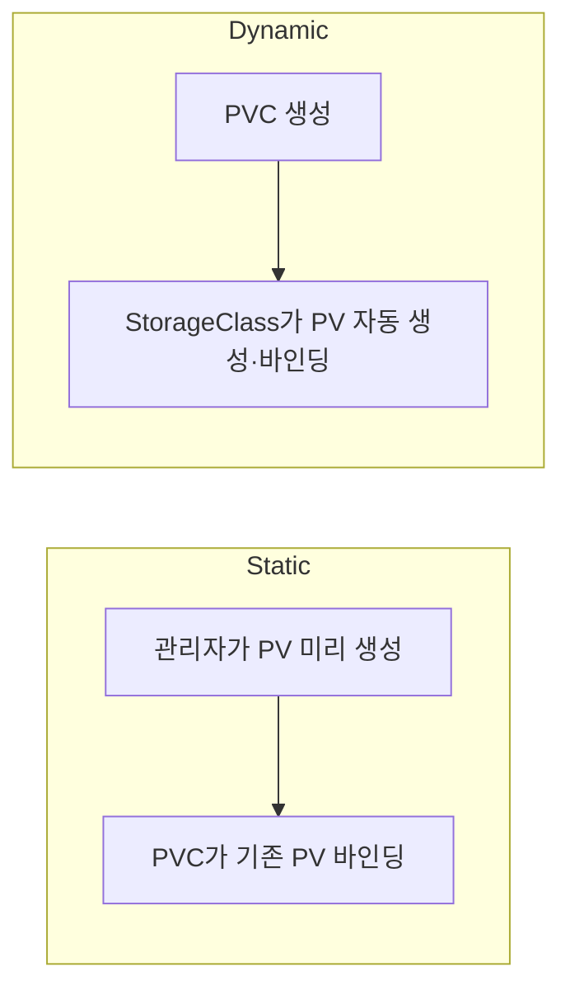

## 📌 들어가며

이번 글에서는 쿠버네티스의 **StorageClass**를 정리한다. PVC를 만들 때마다 관리자가 PV를 손수 만들지 않아도, StorageClass가 **볼륨을 자동으로 생성(동적 프로비저닝)**해준다. Tekton Pipeline의 Workspace 볼륨을 동적으로 만드는 상황까지 함께 살펴본다.

> **StorageClass란?** **동적 볼륨 프로비저닝을 위한 스토리지 템플릿** 리소스. PVC가 생성되면 지정된 **Provisioner**가 실제 스토리지(EBS·EFS·Local 등)를 만들고 PV를 자동으로 바인딩한다.

**언제 쓰나** — PVC 생성 시 PV 자동 생성이 필요할 때, 여러 스토리지 타입을 구분해 쓸 때, Tekton Workspace 볼륨을 동적 생성할 때.

---

## 1. Static vs Dynamic Provisioning

핵심은 **PV를 누가 만드느냐**다. 정적은 관리자가, 동적은 StorageClass가 만든다.



| 항목 | Static | **Dynamic** |
|------|--------|-------------|
| PV 생성 | 관리자 수동 | **StorageClass 자동** |
| 사용 시기 | 레거시·특수 | **클라우드·일반** |
| 장점 | 세밀한 제어 | 자동화·편리 |
| 단점 | 수동 관리 부담 | StorageClass 의존 |

---

## 2. StorageClass의 3대 핵심 필드

### Provisioner — 실제 스토리지 생성 주체

| Provisioner | 스토리지 |
|------------|----------|
| `rancher.io/local-path` | 노드 로컬 디스크 |
| `efs.csi.aws.com` | AWS EFS(공유 파일시스템) |
| `ebs.csi.aws.com` | AWS EBS(블록 스토리지) |

### VolumeBindingMode — PV 생성 시점

| 모드 | 동작 | 사용 |
|------|------|------|
| **Immediate** | PVC 생성 즉시 프로비저닝 | EFS·NFS(노드 위치 무관) |
| **WaitForFirstConsumer** | **Pod 스케줄링 시점**에 생성 | Local·EBS(노드 위치 중요) |

### Reclaim Policy — PVC 삭제 시 처리

| 정책 | 동작 | 사용 |
|------|------|------|
| **Delete** | PV·실제 스토리지 함께 삭제 | 개발/테스트 |
| **Retain** | PV 유지, 데이터 보존 | 프로덕션 |

> ⚠️ **프로덕션에서는 Reclaim Policy를 반드시 확인**하자. 기본 `Delete`로 두면 PVC를 지우는 순간 실제 데이터까지 사라진다. 지켜야 할 데이터는 `Retain`으로 설정해야 안전하다.

---

## 3. 기본 명령어

```bash
kubectl get sc                          # StorageClass 목록
kubectl describe sc <sc-name>           # 상세
kubectl get pvc -A | grep <sc-name>     # 사용하는 PVC 조회
```

```
NAME                PROVISIONER              RECLAIMPOLICY   VOLUMEBINDINGMODE      ALLOWVOLUMEEXPANSION
efs-sc              efs.csi.aws.com          Delete          Immediate              false
local-path(default) rancher.io/local-path    Delete          WaitForFirstConsumer   false
```

---

## 4. 자주 쓰는 패턴

### 패턴 1 — local-path (기본, 단일 노드)

HyperCloud/Rancher 환경의 기본 StorageClass다.

```yaml
apiVersion: storage.k8s.io/v1
kind: StorageClass
metadata:
  name: local-path
  annotations:
    storageclass.kubernetes.io/is-default-class: "true"
provisioner: rancher.io/local-path
reclaimPolicy: Delete
volumeBindingMode: WaitForFirstConsumer
```

```
PVC 생성 → Pending
    ↓ Pod 스케줄링(노드 결정)
해당 노드에 PV 자동 생성 → Bound → Pod 기동
```

`WaitForFirstConsumer`라 **PVC만 만들면 Pending**이고, Pod가 스케줄될 노드가 정해져야 그 노드에 볼륨이 생긴다. 노드 간 공유는 불가하다.

### 패턴 2 — efs-sc (공유 스토리지)

여러 Pod/노드가 동시에 접근할 때 쓴다.

```yaml
apiVersion: storage.k8s.io/v1
kind: StorageClass
metadata:
  name: efs-sc
provisioner: efs.csi.aws.com
reclaimPolicy: Delete
volumeBindingMode: Immediate
```

`Immediate` + `ReadWriteMany`로 다중 접근이 가능해, Tekton Pipeline Workspace 공유에 적합하다.

### 패턴 3 — Tekton Workspace에서 사용

```yaml
apiVersion: tekton.dev/v1beta1
kind: PipelineRun
metadata:
  name: build-pipeline-run
spec:
  pipelineRef:
    name: build-pipeline
  workspaces:
  - name: shared-workspace
    volumeClaimTemplate:
      spec:
        accessModes:
        - ReadWriteOnce
        storageClassName: local-path
        resources:
          requests:
            storage: 1Gi
```

`volumeClaimTemplate`은 PipelineRun마다 **새 PVC를 자동 생성**한다. Workspace 경로는 `$(workspaces.<name>.path)` → `/workspace/<name>`.

---

## 5. 주의사항 (트러블슈팅)

> ⚠️ **volumeBindingMode 혼동** — `local-path`를 `Immediate`로 설정하면 노드 선택 불가로 실패한다. `local-path`는 **`WaitForFirstConsumer`**를 유지해야 Pod 스케줄 후 해당 노드에 볼륨이 생긴다.

> ⚠️ **default StorageClass 중복** — `(default)` 표시가 2개 이상이면 PVC 바인딩이 혼란스러워진다. 하나만 default로 두자.
> ```bash
> kubectl patch sc <sc-name> \
>   -p '{"metadata":{"annotations":{"storageclass.kubernetes.io/is-default-class":"false"}}}'
> ```

**PVC Pending 디버깅** — `kubectl describe pvc <이름> -n <ns>`로 원인 확인. 주요 원인: WaitForFirstConsumer(정상), 조건 맞는 PV 없음, StorageClass 이름 오타, 노드 디스크 부족.

---

## 📝 정리

```
StorageClass
├─ 개념   동적 볼륨 프로비저닝 템플릿
├─ 필드   provisioner(생성주체) / reclaimPolicy(삭제처리) / volumeBindingMode(생성시점)
├─ 선택   local-path(단일노드·빠른IO) / efs-sc(다중노드 공유)
└─ 주의   바인딩모드 혼동, default 중복, Pending 디버깅
```

| 개념 | 한 줄 정의 |
|------|------|
| **StorageClass** | 동적 PV 생성 템플릿 |
| **Provisioner** | 실제 스토리지 생성 주체 |
| **volumeBindingMode** | PV 생성 시점(즉시/스케줄 후) |

StorageClass의 핵심은 **PVC 요청만으로 PV가 자동 생성**되게 하는 것이다. 환경에 맞는 provisioner를 고르고, reclaimPolicy와 volumeBindingMode를 상황에 맞게 설정하는 것이 관건이다.

---

## 🔗 참고

- [공식 문서 - Storage Classes](https://kubernetes.io/docs/concepts/storage/storage-classes/)
