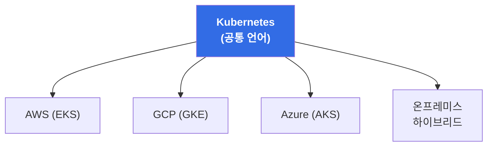
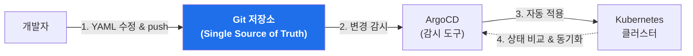
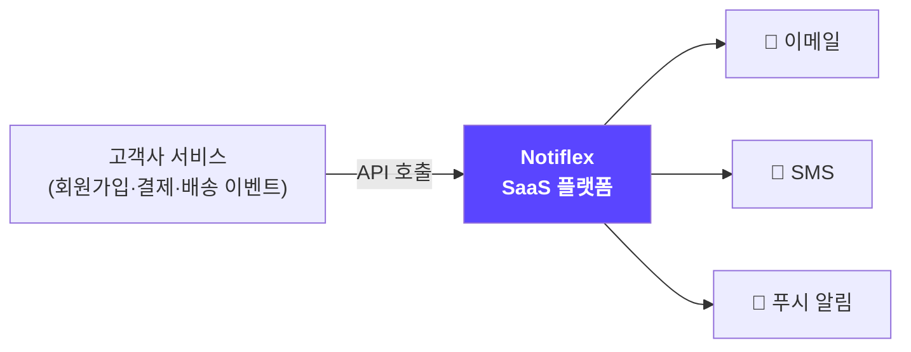
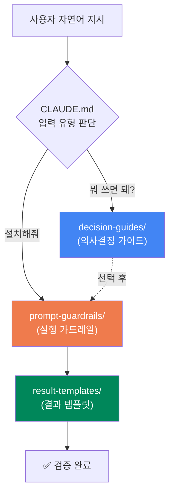
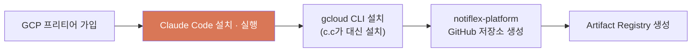
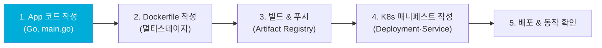

## 📚 들어가며

이번에 「**AI 시대에 개발자가 알아야 할 인프라 구성 배포 with 클로드 코드**」(조훈 저, 길벗)로 책 스터디를 시작했다. 제목 그대로 "AI 에이전트에게 자연어로 지시해서 인프라를 구축하고 배포한다"는, 지금까지의 인프라 학습법과는 결이 다른 책이다.

이 책의 핵심 키워드는 **GitAIOps**다. GitOps에 AI를 결합한 개념인데, 이게 뭔지 그리고 왜 필요한지가 1장의 주제다. 1주차에는 **1장(도입) 전체**와 **2장(환경 구성) 앞부분**을 읽으면서, 개념을 잡고 실제로 GKE 위에 첫 서비스를 올리는 데까지 진행했다.

> **이 책의 실습 구조 한눈에 보기**
>
> | 저장소 | 역할 |
> |--------|------|
> | `_Book_GitAIOps` | 가드레일과 실행 지침이 담긴 **가이드 저장소** |
> | `notiflex-platform` | 독자가 직접 만들어가는 **작업 저장소** |
>
> 가이드 저장소를 clone한 디렉터리에서 Claude Code를 실행하면, 자연어로 지시할 때마다 `CLAUDE.md`가 가드레일을 참조해 안정적으로 작업을 수행한다.

---

## 1장. AI 시대, 개발자의 인프라

### 1.1 개발자에게 인프라가 다가온 시대

> "인프라는 인프라 팀이 하는 거 아닌가요?"

한때는 맞는 말이었다. 하지만 지금은 **자기가 만든 건 자기가 배포할 줄 알아야 하는** 시대가 됐다. 이 변화의 배경에는 두 가지 흐름이 있다.

**1) 인프라가 '코드'가 되었다 (IaC)**

과거처럼 서버에 SSH로 접속해 손으로 패키지를 설치하고 설정 파일을 고치는 방식이 아니라, **Terraform**(IaC), **Helm** 같은 도구로 인프라를 코드로 선언하고 관리한다. 인프라가 코드가 되었다는 건, 인프라가 개발자의 영역으로 들어왔다는 뜻이기도 하다.

**2) '풀스택'의 범위가 넓어졌다**

```
[과거의 풀스택]
프론트엔드  ←→  백엔드

[지금의 풀스택]
프론트엔드  ←→  백엔드  ←→  배포  ←→  운영
                          └─────┬─────┘
                        여기가 새로 추가된 영역
```

이제 풀스택 개발자라고 하면 프론트·백엔드뿐 아니라 **배포와 운영까지** 다룰 수 있어야 한다는 의미로 확장되었다.

| 구분 | 과거 | 현재 |
|------|------|------|
| **서버 세팅** | 수동 (SSH 접속 후 직접 설치) | 코드로 관리 (Terraform, Helm) |
| **배포 주체** | 인프라 팀 / 운영 팀 | 개발자 본인 |
| **풀스택 범위** | 프론트 + 백엔드 | 프론트 + 백엔드 + **배포 + 운영** |
| **핵심 역량** | 애플리케이션 코드 | 애플리케이션 + 인프라 코드 |

### 1.2 쿠버네티스, 클라우드 인프라의 공통 언어

그렇다면 그 넓어진 인프라 영역을 무엇으로 배워야 할까? 이 책은 **쿠버네티스(Kubernetes)**를 출발점으로 삼는다. 이유는 명확하다.

**왜 쿠버네티스인가?**

- **클라우드 종속성이 없다**: AWS, GCP, Azure 어디에 종속되지 않는다. 심지어 온프레미스나 하이브리드 환경에서도 동일하게 동작한다. 말 그대로 클라우드 인프라의 "공통 언어"다.
- **인프라의 복잡성을 추상화한다**: 배포, 네트워킹, 스토리지, 보안 같은 요소들을 표준화된 방식으로 다룰 수 있게 해준다.



**하지만 쿠버네티스에는 함정이 있다**

쿠버네티스는 강력하지만 **학습 곡선이 매우 가파르다.** 알아야 할 개념과 도구 스택이 지나치게 많다. Pod, Service, Deployment, Ingress, ConfigMap, Secret… 여기에 Helm, ArgoCD, Prometheus까지 얹으면 입문자에게는 벽처럼 느껴진다.

> **이 지점에서 책의 핵심 논지가 등장한다.**
> 바로 이 "너무 많은 학습량"이라는 문제를 **AI가 해결한다**는 것이다. 도구 선택, 설치, 설정, 검증에 이르는 지루하고 복잡한 과정을 AI가 빠르게 처리해준다. 사람은 "무엇을, 왜" 하는지에 집중하고, "어떻게"의 반복 작업은 AI에게 위임한다.

```
쿠버네티스의 딜레마

강력함 ────────────────► 높은 학습 곡선 / 방대한 스택
                              │
                              │  AI가 이 간극을 메운다
                              ▼
                    도구 선택·설치·설정·검증을 자동화
```

### 1.3 GitOps에서 GitAIOps로

이 책의 제목이자 핵심 개념인 **GitAIOps**가 등장하는 절이다. 이걸 이해하려면 먼저 **GitOps**를 알아야 한다.

**GitOps란?**

> Git 저장소를 **Single Source of Truth(단일 진실 공급원)**로 삼아, 원하는 인프라의 상태를 **선언적으로** 관리하는 방법론.

동작 방식은 이렇다. 개발자가 매니페스트(YAML) 파일을 작성하거나 수정하면, 이를 주기적으로 감시하는 도구(예: ArgoCD)가 **자동으로 클러스터에 적용**한다. 클러스터의 상태를 항상 Git의 상태와 일치시킨다.



**GitOps의 장점**

| 장점 | 설명 |
|------|------|
| **히스토리 관리** | 모든 변경이 Git 커밋으로 남아 "누가·언제·무엇을" 배포했는지 추적 가능 |
| **롤백 용이** | 이전 커밋으로 되돌리면 인프라도 그 시점으로 복구 |
| **코드 리뷰** | 인프라 변경도 PR로 리뷰 → 사고 예방 |

**그런데 GitOps만으로는 부족하다**

여기가 이 책의 문제의식이다. GitOps는 훌륭하지만, 결국 **사람이 다 해야 하는 것들이 남는다.**

- 각 리소스(Resource)의 YAML 파일을 **일일이 다 작성**해야 한다.
- Helm을 쓰더라도 **환경별로 템플릿을 관리**해야 한다.
- 모니터링 설정도 마찬가지로 사람 손을 탄다.

**GitAIOps = GitOps + AI**

이 빈틈을 **AI가 보완**한다. AI가 매니페스트 작성, 트러블슈팅, 문서화, 검증까지 해줄 수 있다. 사람이 **자연어로 지시**하면 AI가 YAML을 생성하고 수정한다. 이것이 바로 **GitAIOps**다.

```
       GitOps                    GitAIOps
  ┌──────────────┐        ┌──────────────────────┐
  │ Git = 진실    │        │ Git = 진실            │
  │ 자동 배포/롤백 │   +    │ 자동 배포/롤백         │
  │ 히스토리 관리  │  AI    │ + AI가 YAML 작성       │
  │              │        │ + AI가 트러블슈팅       │
  │ ❗ YAML은     │        │ + AI가 문서화/검증      │
  │   사람이 작성  │        │ → 자연어로 지시하면 끝   │
  └──────────────┘        └──────────────────────┘
```

| 항목 | GitOps | GitAIOps |
|------|--------|----------|
| 진실의 원천 | Git 저장소 | Git 저장소 |
| 배포 방식 | 선언적 자동화 | 선언적 자동화 |
| **YAML 작성** | 사람이 직접 | **AI가 생성/수정** |
| **트러블슈팅** | 사람이 직접 | **AI가 지원** |
| **문서화** | 사람이 직접 | **AI가 자동 생성** |
| 인터페이스 | 코드/CLI | **자연어** |

### 1.4~1.5 가상의 서비스 — Notiflex 스타트업 시나리오

책은 개념만 나열하지 않고, **하나의 가상 스타트업을 창업해서 성장시키는 시나리오**로 전체 내용을 엮는다. 그 주인공이 **Notiflex**다.

**Notiflex는 어떤 서비스인가?**

> **B2B 알림 SaaS 플랫폼.** 고객사의 서비스에서 발생하는 이벤트(회원가입, 결제, 배송 등)를 받아서 이메일·SMS·푸시 알림으로 발송해준다. 고객사는 그냥 Notiflex API만 호출하면 된다.



**성장 시나리오 = 책의 목차**

Notiflex가 스타트업에서 엔터프라이즈로 성장하는 단계가 곧 책의 챕터 구성이 된다. 각 단계에서 마주치는 "현실적인 문제"가 새로운 기술을 도입하는 계기가 된다.

| 성장 단계 | 마주친 문제 | 도입하는 기술 | 챕터 |
|:---:|------|------|:---:|
| 🚀 창업 | 일단 서비스를 올려야 함 | GKE에 API 서버 배포 | 2장 |
| 📦 SMB | 배포할 때마다 긴장됨 | GitOps (ArgoCD) + CI 자동화 | 3장 |
| 🔍 SMB | 새벽에 고객이 "안 된다"고 연락 | 관측 가능성 (Observability) 구축 | 4장 |
| ⚡ SMB | 배포할 때마다 서비스가 끊김 | Gateway API + 무중단 배포 | 5장 |
| 🏢 전환기 | 고객 늘며 느려지고 보안도 허술 | 캐시·시크릿 관리·Canary 배포 | 6장 |
| 📈 Enterprise | 대형 고객사가 전용 환경 요청 | 인프라 확장 + 테넌트 분리 | 7장 |
| 🔧 Enterprise | 서비스 간 호출이 꼬임 | 이벤트 드리븐·분산 트레이싱·배치 자동화 | 8장 |
| 📖 종합 | 돌아보니 이 기록들이 곧 표준 | GitAIOps: 살아있는 운영 표준 | 9장 |

이 시나리오 방식이 마음에 든 부분이다. "기술을 위한 기술"이 아니라 **"이런 문제가 생겼으니 이 기술이 필요하다"**는 맥락 위에서 배우게 되니, 각 도구의 존재 이유가 자연스럽게 이해된다.

### 1.6 가드레일: 클로드 코드가 정확하게 동작하는 이유

이 책에서 가장 인상 깊었던 개념이 **가드레일(Guardrail)**이다. AI에게 자연어로 지시하면 편하지만, **매번 결과가 달라지고 엉뚱한 짓을 할 수도 있다**는 불안이 있다. 이 책은 그 불안을 **3종류의 가드레일**로 해결한다.



**3종류의 가드레일**

| 가드레일 | 디렉터리 | 역할 | 언제 참조되나 |
|:---:|:---:|------|------|
| **의사결정 가이드** | `decision-guides/` | 도구 선택의 근거 (추천 + 비교 테이블 + 핵심 개념) | "뭐 쓰면 돼?", "비교해줘" |
| **실행 가드레일** | `prompt-guardrails/` | 실행 지침 (사전 조건 + 단계별 절차 + 트러블슈팅) | "설치해줘", "진행해줘" |
| **결과 템플릿** | `result-templates/` | 검증 체크리스트 (실행 결과가 기대와 일치하는지 확인) | 작업 완료 직후 |

**3단계 흐름: 탐색 → 비교 → 실행**

가드레일은 다음의 흐름을 따라 동작한다.

```
[1. 탐색]  "배포 자동화 뭘 쓰면 돼?"
              ↓  decision-guides/ 참조 → 추천 + 이유
[2. 비교]  "다른 것도 있어? 비교해줘"
              ↓  decision-guides/ 비교 섹션 → 장단점 대조
[3. 실행]  "ArgoCD로 진행해줘"
              ↓  prompt-guardrails/ 참조 → 단계별 실행
              ↓  result-templates/ 참조 → 결과 검증
           ✅ 안정적인 결과
```

> 핵심은, 가드레일이 **자연어 지시만으로도 안정적이고 재현 가능한 결과를 얻기 위해** 존재한다는 점이다. AI의 자유도를 적절히 "제약"함으로써 오히려 신뢰성을 확보하는 설계다. 탐색→비교→실행은 권장 흐름일 뿐 강제는 아니어서, 바로 "설치해줘"라고 하면 곧장 실행 단계로 진입한다.

---

## 2장. 환경 구성과 첫 배포

개념을 잡았으니 이제 손을 움직일 차례다. 2장은 **아무것도 없는 상태에서 GKE 위에 Notiflex를 올리는** 과정이다.

### 2.1 GCP · Claude Code · gcloud CLI 설치 + 저장소 생성

첫 단계는 준비물 세팅이다.



| 순서 | 작업 | 비고 |
|:---:|------|------|
| 1 | GCP 프리티어 가입 | 무료 크레딧으로 실습 |
| 2 | Claude Code 설치 및 실행 | 이후 모든 작업의 인터페이스 |
| 3 | gcloud CLI 설치 | **Claude Code에게 시켜서** 설치 |
| 4 | GitHub `notiflex-platform` 저장소 생성 | 독자의 작업 저장소 |
| 5 | Artifact Registry 생성 | 컨테이너 이미지 저장소 |

재밌는 지점은 3번이다. gcloud CLI 설치조차 내가 직접 하는 게 아니라 **Claude Code에게 "설치해줘"라고 시킨다.** 앞서 배운 가드레일이 여기서부터 동작하기 시작한다.

### 2.2 GKE 클러스터 생성

이제 Claude Code에게 이렇게만 입력한다.

> **`GKE 클러스터 생성해줘.`**

그러면 가드레일(`prompt-guardrails/ch2/2.5-gke-cluster.md`)에 정의된 사양대로 클러스터가 만들어진다. 실제로 생성되는 클러스터의 스펙은 다음과 같다.

| 항목 | 값 | 이유 |
|------|------|------|
| **클러스터 이름** | `notiflex-cluster` | |
| **타입** | GKE Standard (Zonal) | 학습·비용 관점에서 단순함 |
| **존(Zone)** | `asia-northeast3-a` (서울) | 국내 리전 |
| **노드** | `e2-medium` 2개 | 실습에 충분한 최소 사양 |
| **VM 종류** | **Spot VM** | 💰 비용 절감 (실습용) |
| **Gateway API** | **활성화** | ⚠️ 5장 무중단 배포에서 필수 |
| **디스크** | 30GB | |

실제로 생성될 때 쓰이는 명령은 대략 이런 형태다.

```bash
gcloud container clusters create notiflex-cluster \
  --zone=asia-northeast3-a \
  --machine-type=e2-medium \
  --num-nodes=2 \
  --spot \
  --gateway-api=standard \
  --disk-size=30
```

> ⚠️ **가드레일이 잡아주는 함정**: `--gateway-api=standard`를 빠뜨리면 5장에서 Gateway API를 못 쓴다. 나중에 활성화할 수는 있지만 수 분이 걸린다. 이렇게 "지금은 안 중요해 보이지만 나중에 발목 잡는" 설정을 가드레일이 미리 챙겨준다는 게 인상적이었다.

> 💡 **Spot VM 선택**: 실습 비용을 아끼기 위한 선택. 운영 환경이라면 안정성을 위해 일반 VM을 쓰겠지만, 학습 목적이므로 중간에 노드가 회수될 수 있는 Spot VM으로도 충분하다.

### 2.3 Notiflex 앱 빌드와 배포

마지막으로 앱을 만들고 배포한다. 역시 한 줄이다.

> **`Notiflex 앱 만들고 배포해줘`**

이 한마디로 아래의 전체 과정이 순서대로 실행된다.



| 단계 | 작업 | 결과물 |
|:---:|------|------|
| 1 | 앱 코드 작성 | `app/main.go` (Go 표준 라이브러리, `/health`·`/id` 엔드포인트) |
| 2 | Dockerfile 작성 | 멀티스테이지 빌드 (`golang:1.25-alpine` → `scratch`) |
| 3 | 이미지 빌드 & 푸시 | Artifact Registry에 `api:v0.1.0` |
| 4 | K8s 매니페스트 작성 | `namespace.yaml`, `deployment.yaml`, `service.yaml` |
| 5 | 배포 & 확인 | `kubectl apply` 후 `/health`, `/id` 호출 확인 |

앱 자체는 **Go 표준 라이브러리만** 쓴 아주 단순한 서버다. 외부 프레임워크가 없다. 핵심 엔드포인트는 두 개다.

- `GET /health` — 상태 확인용 (readiness/liveness probe가 사용)
- `GET /id` — 인메모리 카운터로 순차 ID를 생성하고, 그걸 처리한 **Pod 이름**을 함께 반환

`/id`가 Pod 이름을 같이 반환하는 게 포인트다. 나중에 무중단 배포나 스케일링을 실습할 때 "지금 어느 Pod가 응답했는지" 눈으로 확인할 수 있게 해주는 장치다.

**Dockerfile — 왜 `scratch` 베이스인가?**

```dockerfile
FROM golang:1.25-alpine AS builder
WORKDIR /app
COPY go.mod go.sum ./
COPY main.go .
RUN CGO_ENABLED=0 GOOS=linux go build -o notiflex-api .

FROM scratch
COPY --from=builder /app/notiflex-api /notiflex-api
EXPOSE 8080
ENTRYPOINT ["/notiflex-api"]
```

멀티스테이지 빌드로 **빌드 단계**(golang 이미지)와 **실행 단계**(scratch 이미지)를 분리했다. `scratch`는 아무것도 없는 빈 이미지라서, `CGO_ENABLED=0`으로 만든 **정적 바이너리 하나만** 덜렁 들어간다.

| 베이스 이미지 | 특징 | 이미지 크기 |
|------|------|:---:|
| `ubuntu` / `debian` | 완전한 OS, 디버깅 편함 | 큼 (수백 MB) |
| `alpine` | 경량 리눅스 | 중간 (~5MB+) |
| `distroless` | 런타임만, 셸 없음 | 작음 |
| **`scratch`** | **완전히 빈 이미지** | **가장 작음 (바이너리 크기)** |

Go처럼 정적 바이너리를 만들 수 있는 언어에서는 scratch가 **가장 가볍고 공격 표면(attack surface)도 최소**라 보안에도 유리하다.

**마무리: 첫 커밋과 `/update-docs` 스킬**

배포가 끝나면 GitHub에 첫 커밋을 하고, `JOURNEY.md`(진행 기록 파일)를 생성한다. 그리고 Claude Code의 커스텀 스킬로 **`/update-docs`**를 만든다. 이 스킬은 앞으로 각 챕터를 끝낼 때마다 진행 상황을 문서에 자동으로 반영해주는 역할을 한다. GitAIOps의 "AI가 문서화한다"는 철학이 여기서부터 실습으로 이어진다.

---

## 📝 1주차 요약

```
1장 — 개념
├─ 1.1 개발자도 배포·운영을 해야 하는 시대 (IaC, 풀스택 확장)
├─ 1.2 쿠버네티스 = 클라우드 공통 언어 (단, 학습 곡선은 AI로 해결)
├─ 1.3 GitOps(Git=진실) → GitAIOps(+ AI가 YAML/문서/검증)
├─ 1.4~1.5 Notiflex 시나리오 = 스타트업 성장 = 책의 목차
└─ 1.6 가드레일 3종 (의사결정·실행·결과) + 탐색→비교→실행

2장 — 첫 배포
├─ 2.1 GCP·Claude Code·gcloud·GitHub·Artifact Registry 세팅
├─ 2.2 "GKE 클러스터 생성해줘" → notiflex-cluster (Spot, Gateway API)
└─ 2.3 "Notiflex 앱 만들고 배포해줘" → Go 앱 → scratch 이미지 → 배포
```

| 핵심 개념 | 한 줄 정의 |
|------|------|
| **IaC** | 인프라를 코드로 선언·관리 (Terraform, Helm) |
| **GitOps** | Git을 단일 진실 공급원으로 삼는 선언적 운영 |
| **GitAIOps** | GitOps + AI가 매니페스트 작성·트러블슈팅·문서화·검증 |
| **가드레일** | 자연어 지시로 안정적 결과를 얻기 위한 3종 제약 장치 |
| **Notiflex** | 실습을 관통하는 가상의 B2B 알림 SaaS |

---

## 💭 느낀 점

**1. "AI에게 시킨다"와 "AI에게 맡긴다"는 다르다.**

이 책을 읽기 전에는 AI로 인프라를 다룬다고 하면 막연히 "바이브 코딩처럼 대충 시키면 알아서 해주는 것" 정도로 생각했다. 그런데 이 책의 **가드레일** 개념을 보고 생각이 바뀌었다. AI에게 자유롭게 맡기는 게 아니라, **의사결정 근거·실행 절차·검증 기준을 미리 문서로 정의**해두고 그 위에서 AI를 움직이게 한다. 결국 신뢰할 수 있는 자동화는 "AI가 똑똑해서"가 아니라 **"사람이 좋은 제약을 설계해서"** 나온다는 걸 알게 됐다. 이건 내가 회사에서 자동화 도구를 다룰 때도 그대로 적용되는 통찰이었다.

**2. 문제 → 기술 순서의 학습이 좋다.**

보통 인프라 책은 "쿠버네티스란 무엇인가" → "Pod란" → "Service란" 식으로 기술을 나열한다. 그런데 이 책은 Notiflex라는 가상 스타트업이 **성장하면서 겪는 문제**를 먼저 던지고, 그걸 해결하려고 기술을 도입한다. "배포할 때마다 서비스가 끊긴다 → 그래서 무중단 배포"처럼. 각 기술이 왜 필요한지가 몸으로 이해되니 훨씬 잘 붙는다.

**3. GitOps → GitAIOps 전환의 논리가 설득력 있다.**

GitOps 자체는 이미 좋은 방법론이지만, 결국 **YAML을 사람이 다 짜야 한다**는 한계가 분명히 있다. 실무에서 매니페스트와 Helm 템플릿을 환경별로 관리하는 게 얼마나 번거로운지 생각하면, 그 부분을 AI가 메운다는 GitAIOps의 방향성은 자연스럽게 납득이 됐다.

**4. 그래도 남는 질문.**

Spot VM, Gateway API 활성화처럼 "지금은 안 중요해 보이지만 나중에 필요한" 설정을 가드레일이 챙겨주는 건 좋았다. 다만 **가드레일이 없는 실제 현업 상황에서는 그 판단을 결국 내가 해야 한다**는 점에서, 가드레일에만 의존하다 보면 정작 "왜 이렇게 설정하는가"에 대한 이해가 얕아지지 않을까 하는 생각도 들었다. 그래서 이번 스터디에서는 가드레일이 시키는 대로 따라가되, **각 설정의 이유를 스스로 한 번씩 되묻는 방식**으로 읽어보려 한다.

---

## 🔗 참고

- 도서: 「AI 시대에 개발자가 알아야 할 인프라 구성 배포 with 클로드 코드」 (조훈, 길벗)
- 가이드 저장소: [sysnet4admin/_Book_GitAIOps](https://github.com/sysnet4admin/_Book_GitAIOps)
- 완성 참조 플랫폼: [sysnet4admin/notiflex-platform](https://github.com/sysnet4admin/notiflex-platform)

> **다음 주차 예고 (3장)**: "배포할 때마다 긴장된다" — GitOps 도구(ArgoCD) 도입과 CI 자동화로 첫 번째 배포 파이프라인을 만든다.
