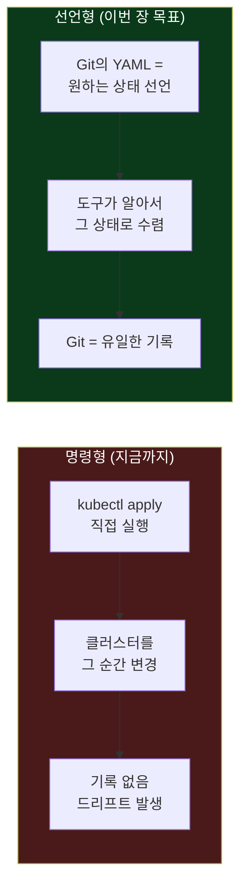
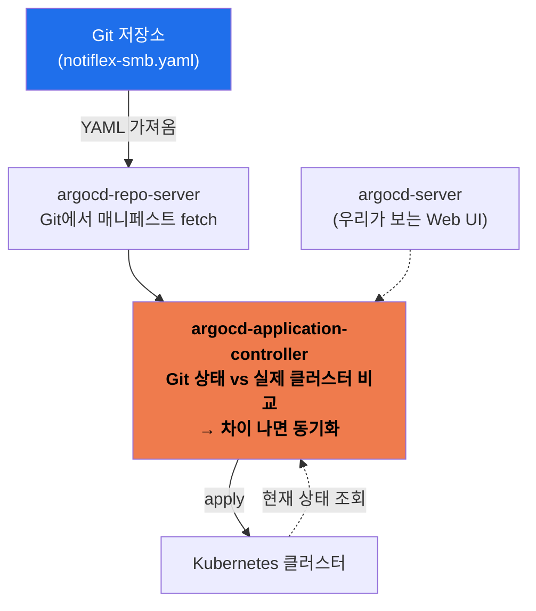
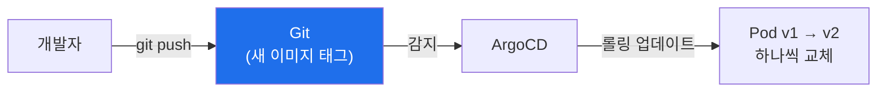
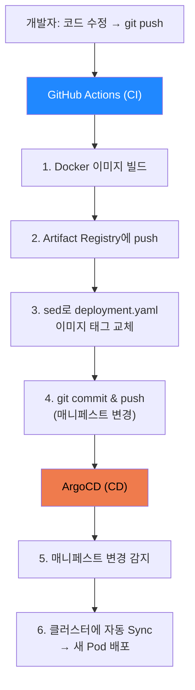
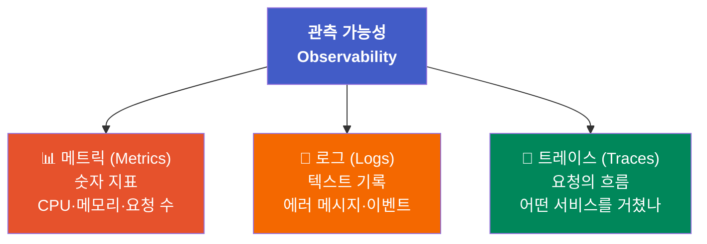
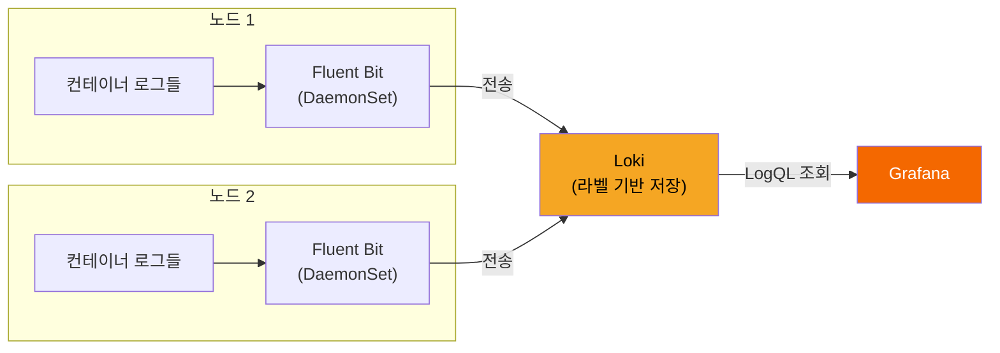

## 📚 들어가며

지난 1주차에는 GitAIOps의 개념을 잡고, GKE 위에 Notiflex를 처음 올려봤다. 그런데 그때의 배포는 사실 **"Claude Code가 알아서 이미지 말아서 push하고 배포까지 해준" 방식**이었다. 편하긴 했지만, 돌아보면 불안한 구석이 많았다.

2주차의 주제는 그 불안을 **파이프라인**과 **관측 가능성**이라는 두 축으로 해소하는 것이다.

- **3장 (SMB): 첫 번째 배포 파이프라인** — "배포할 때마다 긴장된다" → GitOps(ArgoCD) + CI 자동화
- **4장 (SMB): 관측 가능성** — "새벽에 고객이 안 된다고 연락 왔는데 뭐가 문젠지 모른다" → 메트릭·로그·알림 구축

Notiflex가 스타트업에서 조금씩 자리를 잡아가는 SMB(중소 규모) 단계에 해당하는 내용이다.

> **2주차 학습 지도**
>
> ```
> 3장 파이프라인          4장 관측 가능성
> ─────────────          ──────────────
> Push의 한계 인식         관측 가능성 3요소
> → ArgoCD (GitOps)      → Prometheus + Grafana (메트릭)
> → 롤링 업데이트          → Loki + Fluent Bit (로그)
> → GitHub Actions (CI)  → PrometheusRule (알림)
> → CI + CD 연결
> ```

---

## 3장. 첫 번째 배포 파이프라인

### 3.1 Push 기반 배포의 한계

1장·2장에서는 Claude Code가 이미지를 빌드하고, Artifact Registry에 push하고, `kubectl apply`로 배포까지 한 번에 처리해줬다. **명령형(imperative)** 방식이다. "이걸 해라, 저걸 해라"라고 시키면 그 순간의 클러스터를 직접 바꾼다.

편리하지만 세 가지 문제가 있다.

| 문제 | 설명 |
|------|------|
| **히스토리 부재** | 누가·언제·무엇을 배포했는지 자세히 알 수 없다 |
| **설정 드리프트(Drift)** | 클러스터의 실제 상태가 우리가 "의도한 상태"에서 조금씩 벗어난다 |
| **"왜"의 실종** | Deployment가 바뀐 걸 안다 해도, **왜** 바꿨는지는 어디에도 안 남는다 |

**설정 드리프트**가 핵심 키워드다. 누군가 급하게 `kubectl edit`으로 replica를 3개로 바꾸고, 그걸 아무도 기록하지 않으면, "지금 클러스터 상태 = 우리가 관리하는 문서"라는 등식이 깨진다. 시간이 지나면 실제 상태와 코드가 따로 논다.

**해결 방향: 명령형 → 선언형(Declarative)**



이번 장의 목표는 **Git의 YAML을 기준(원하는 상태)으로 삼고, 그 상태를 클러스터에 구현시켜주는 선언형 파이프라인**을 만드는 것이다.

### 3.2 ArgoCD 설치 및 GitOps 연결

선언형 배포를 실제로 구현하는 도구가 **ArgoCD**다. 먼저 GitOps의 원칙을 다시 정리하면:

- **모든 변경은 Git commit으로만** 이루어진다.
- 클러스터는 **Git의 상태를 자동으로 반영**한다.
- Git이 아닌 곳에서 직접 수정하면 → ArgoCD가 **Git 상태로 자동 복원**한다. (Self-Heal)

> **Single Source of Truth(SSOT)** = "모든 정보의 유일한 출처". GitOps에서는 그게 바로 Git 저장소다.

**ArgoCD의 3대 컴포넌트**

ArgoCD가 어떻게 "Git ↔ 클러스터"를 계속 맞춰주는지는, 내부 컴포넌트 3개를 보면 이해가 된다.



| 컴포넌트 | 역할 |
|---------|------|
| **argocd-server** | 우리가 보는 **Web UI**. 배포 상태를 눈으로 확인 |
| **argocd-repo-server** | Git 저장소에서 **YAML 파일을 가져옴** |
| **argocd-application-controller** | Git 상태와 실제 클러스터를 **비교해서 Git과 맞춰줌** (핵심 엔진) |

**CRD란?**

ArgoCD는 `Application`이라는 리소스로 "어떤 Git 경로를 어떤 네임스페이스에 동기화할지"를 선언한다. 이 `Application`은 쿠버네티스 기본 리소스가 아니라 ArgoCD가 추가한 것이다. 이렇게 **사용자(또는 도구)가 정의해서 추가한 리소스 타입**을 **CRD(Custom Resource Definition)**라고 한다. Pod, Service처럼 쓰지만 원래 쿠버네티스에 없던 것을 확장한 것이다.

우리 프로젝트에서는 **`argocd/notiflex-smb.yaml`** 파일이 바로 ArgoCD가 쳐다보는 `Application` 매니페스트다. 이 파일이 "notiflex 앱은 이 Git 경로의 매니페스트를 따른다"고 선언한다.

> **왜 ArgoCD인가?** (탐색→비교 단계 요약)
>
> | 도구 | 장점 | 단점 | 적합도 |
> |------|------|------|:---:|
> | **ArgoCD** | Web UI로 배포 시각화, Application 단위 관리, Self-Heal | 메모리 ~500MB | ★★★ |
> | Flux | 가벼움(~100MB), CLI 중심 | UI 없음(별도 도구 필요) | ★★ |
> | Jenkins X / Spinnaker | 성숙한 생태계 | 매우 무겁고 설치 복잡 | ★ |
>
> 학습 목적에서는 **"지금 무슨 일이 일어나는지 눈으로 보는 것"**이 중요해서 Web UI가 있는 ArgoCD가 최적이었다.

### 3.3 ArgoCD로 롤링 업데이트: Git Push만으로 배포

ArgoCD를 연결했으니, 이제 배포는 **Git에 push하는 것**으로 끝난다. 기본 배포 방식으로는 쿠버네티스의 기본값인 **롤링 업데이트(Rolling Update)**를 쓴다.

**롤링 업데이트란?** 기존 Pod를 한 번에 다 내리지 않고, 새 버전 Pod를 하나씩 띄우면서 옛 버전을 하나씩 내리는 방식이다. 서비스 중단을 최소화한다. (나중에 5장에서 Blue/Green, 6장에서 Canary로 발전시킨다. 일단은 기본값으로 시작.)



**롤백도 Git으로**

배포한 버전에 문제가 있으면? 명령을 다시 칠 필요 없이 **`git revert`** 하면 된다. Git이 이전 상태로 돌아가고, ArgoCD가 그 변경을 감지해서 클러스터도 이전 버전으로 되돌린다. 롤백조차 "Git 이력을 되돌리는 일"이 되는 것이다.

```
배포:  코드 수정 → git push        → ArgoCD 감지 → 새 버전
롤백:  git revert (이전 커밋으로)   → ArgoCD 감지 → 이전 버전
        └── 배포도 롤백도 전부 Git 조작 하나로 통일
```

### 3.4 GitHub Actions CI: 빌드 자동화

3.3까지는 이미지를 여전히 **수동으로 빌드**했다. 코드가 바뀔 때마다 `gcloud builds submit`을 직접 치는 건 반복적이고 실수하기 쉽다. 그래서 **CI(Continuous Integration, 지속적 통합)**를 붙인다.

**CI가 하는 일**: 변경 사항이 생기면 → 이미지 빌드 → 이미지 push → 매니페스트 파일의 이미지 태그 변경까지.

이 책에서는 **GitHub Actions**를 CI로 선택했다.

> **왜 GitHub Actions인가?** (비교 요약)
>
> | 도구 | 장점 | 단점 | 적합도 |
> |------|------|------|:---:|
> | **GitHub Actions** | 저장소에 YAML 하나면 끝, 별도 서버 불필요, 무료 크레딧 | GitHub 종속 | ★★★ |
> | Cloud Build | GCP 네이티브, Artifact Registry 직결 | GitHub 트리거 별도 설정 | ★★ |
> | GitLab CI | 강력한 파이프라인 문법 | 코드를 GitLab으로 이전 필요 | ★ |
> | Jenkins | 플러그인 풍부, 완전 커스터마이징 | 서버 운영 필요, 복잡 | ★ |

**인증: Service Account 토큰을 GitHub Secret에**

GitHub Actions가 GCP의 Artifact Registry에 이미지를 push하려면 인증이 필요하다. 이를 위해 GCP **Service Account**의 자격 증명을 **GitHub Secret**에 저장해서, CI가 안전하게 GCP에 접근하도록 한다. (완성 레포에서는 키 파일 대신 더 안전한 **Workload Identity Federation(WIF)** 방식을 쓴다 — 키를 저장하지 않고 GitHub의 신원을 GCP가 직접 신뢰하는 방식이다.)

**이미지 태그에 Git SHA를 쓰는 이유**

```
❌ notiflex/api:latest      → 어떤 코드인지 알 수 없음
✅ notiflex/api:sha-abc1234 → 이 커밋의 코드라고 특정 가능
```

`latest`는 "가장 최신"이라는 뜻일 뿐, 지금 배포된 게 어떤 커밋인지 추적할 수 없다. 반면 **Git commit SHA**를 태그로 쓰면 각 이미지가 **고유 ID**를 갖게 되어, "지금 돌아가는 Pod = 어떤 커밋" 이 명확히 매칭된다.

### 3.5 CI + ArgoCD 연결: 빌드부터 배포까지

이제 3.4의 CI(빌드)와 3.2의 CD(ArgoCD 배포)를 하나로 잇는다. 핵심 원칙은 **"CI는 클러스터를 직접 건드리지 않는다. 오직 Git을 통해서만 배포가 이루어진다."**

**전체 자동화 흐름**



정리하면: **코드 push → GitHub Actions가 Docker 빌드 → Artifact Registry에 push → `sed`로 `deployment.yaml`의 이미지 태그 교체 → git commit & push → ArgoCD가 감지해서 클러스터에 자동 배포.**

여기서 CI가 `kubectl apply`를 직접 하지 않고 **매니페스트를 Git에 커밋하는 것**이 포인트다. 이렇게 해야 Git이 계속 단일 진실 소스로 유지되고, 모든 배포가 커밋 이력으로 남는다.

실제 완성 레포의 CI 워크플로우에서 매니페스트를 교체하는 부분은 이렇게 생겼다.

```bash
# sha-abc1234 형태로 태그 교체 후 커밋·푸시
sed -i "s|notiflex/api:.*|notiflex/api:sha-${GITHUB_SHA::7}|" k8s/smb/rollout.yaml
git commit -m "ci: update image to sha-${GITHUB_SHA::7}"
git push
```

**더 견고한 대안 2가지**

지금은 `sed`로 텍스트를 직접 치환한다. 단순하고 직관적이지만, 매니페스트 구조가 복잡해지면 취약하다. 책은 두 가지 대안을 언급한다.

| 방법 | 특징 |
|------|------|
| **`sed` 치환** (현재) | 단순·직관적이지만 텍스트 치환이라 깨지기 쉬움 |
| **Kustomize** | `kustomize edit set image`로 이미지 태그를 구조적으로 관리 |
| **ArgoCD Image Updater** | ArgoCD가 레지스트리를 감시하다 새 이미지가 올라오면 자동 반영 |

---

## 4장. 관측 가능성 한번에 구축하기

파이프라인으로 배포는 편해졌다. 그런데 배포한 뒤 **"지금 서비스가 잘 돌고 있나?"**는 여전히 알 수 없다. 4장은 이 문제, 즉 **관측 가능성(Observability)**을 다룬다.

### 4.1 관측 가능성이란

관측 가능성은 흔히 **3요소(three pillars)**로 설명된다.



| 요소 | 무엇인가 | 예시 질문 |
|------|---------|----------|
| **메트릭(Metrics)** | 숫자 지표 | "CPU 사용률이 몇 %야?" |
| **로그(Logs)** | 로그 텍스트 | "그 에러 메시지가 뭐였지?" |
| **트레이스(Traces)** | 하나의 요청이 **어떤 서비스들을 거쳐가는지** 추적 | "이 요청이 어디서 느려졌지?" |

**4장의 범위**: 이번 장에서는 **메트릭과 로그**를 구축하고, 여기에 **알림(alerting)**까지 더한다. (트레이스는 나중에 8장 고도화 단계에서 다룬다.)

### 4.2 메트릭 모니터링: Prometheus + Grafana

메트릭 수집·시각화는 **Prometheus + Grafana** 조합이 사실상 쿠버네티스의 표준이다. (둘 다 CNCF Graduated 프로젝트.)

**Prometheus (수집 엔진)**

- **PromQL**: 시계열 데이터를 검색·집계하는 쿼리 언어. 예: `rate(http_requests_total[5m])`
- **Pull 기반 수집**: Prometheus가 각 Pod의 `/metrics` 엔드포인트를 주기적으로 조회(scrape)한다. 모니터링 대상이 데이터를 "보내는" 게 아니라, Prometheus가 "가져간다".
- **ServiceMonitor CRD**: 어떤 Service를 scrape할지 **선언적으로 정의**하는 CRD.

**Grafana (시각화)**

- Prometheus가 모은 정보를 **대시보드로 시각화**한다.

**주변 수집기 2종**

| 컴포넌트 | 수집 대상 | 배포 방식 |
|---------|----------|----------|
| **kube-state-metrics** | 쿠버네티스 API에서 오브젝트 **상태** (Deployment·Service·Pod 상태 등) | Deployment |
| **node-exporter** | **노드 수준** 정보 (CPU 사용률, 메모리, 디스크 I/O 등) | **DaemonSet** |

> **DaemonSet**은 "노드마다 무조건 1개씩" Pod를 띄우는 배포 방식이다. node-exporter는 각 노드의 시스템 정보를 수집해야 하므로, 모든 노드에 하나씩 존재해야 한다. → DaemonSet이 딱 맞는다.

> 💡 **장기 저장**: Prometheus는 로컬 저장에 한계가 있다. 데이터를 오래 보관하려면 **Thanos**나 **Cortex**를 Prometheus 앞단에 두면 된다. (지금 단계에서는 불필요.)

**설치: kube-prometheus-stack (Helm)**

Claude Code로 Prometheus + Grafana 설치를 진행한다. 흐름은: **Helm values 파일 작성 → `monitoring` 네임스페이스 생성 → 설치 → Pod 상태 확인.** `kube-prometheus-stack` Helm 차트 하나로 6개 컴포넌트가 검증된 버전 조합으로 한 번에 깔린다.

```mermaid
flowchart LR
    App["Notiflex Pod<br>/metrics"] -->|scrape (pull)| Prom["Prometheus<br>(StatefulSet)"]
    Node["노드"] -->|node-exporter<br>(DaemonSet)| Prom
    K8sAPI["K8s API"] -->|kube-state-metrics| Prom
    Prom --> Graf["Grafana<br>대시보드"]
    Prom --> AM["Alertmanager<br>알림 라우팅"]

    style Prom fill:#E6522C,color:#fff
    style Graf fill:#F46800,color:#fff
```

설치되는 주요 Pod와 역할:

| Pod (Helm) | 역할 | 배포 형태 |
|-----------|------|----------|
| `prometheus-kube-prometheus-prometheus-0` | Prometheus 서버 (메트릭 수집 엔진) | StatefulSet |
| `kube-prometheus-grafana` | Grafana (대시보드 UI) | Deployment |
| `alertmanager-kube-prometheus-alertmanager-0` | Alertmanager (알림 라우팅) | StatefulSet |
| `kube-prometheus-kube-prometheus-operator` | Prometheus Operator (PrometheusRule·ServiceMonitor 같은 CRD 관리) | Deployment |
| `kube-prometheus-kube-state-metrics` | 쿠버네티스 오브젝트 상태를 메트릭으로 변환 | Deployment |
| `kube-prometheus-prometheus-node-exporter` | 노드 시스템 메트릭 수집 | **DaemonSet** |

### 4.3 로그 수집: Loki + Fluent Bit

메트릭이 "숫자"라면, 로그는 "텍스트 맥락"이다. 로그 수집은 **Loki + Fluent Bit** 조합을 쓴다.



**Fluent Bit (수집·전송)**

- **DaemonSet**으로 모든 노드에 배치된다.
- 해당 노드의 **모든 컨테이너 로그를 자동 수집**한다.
- 수집한 로그를 **Loki로 전송**한다.

**Loki (저장·조회)**

- 로그를 **라벨 기반으로 저장**한다.
- **LogQL** 쿼리 언어로 검색. 예: `{namespace="notiflex"} |= "error"`
- **Grafana에서 바로 조회** 가능 (메트릭과 같은 화면에서 본다).

**라벨 기반 인덱싱 vs 풀텍스트 인덱싱**

Loki가 Elasticsearch(ELK)와 결정적으로 다른 점이 이 인덱싱 방식이다.

| 구분 | 풀텍스트 인덱싱 (예: Elasticsearch) | 라벨 기반 인덱싱 (Loki) |
|------|-----------------------------------|------------------------|
| **인덱싱 대상** | 로그 **본문의 모든 단어** | **메타데이터(라벨)만** |
| **검색 방식** | 어떤 단어든 바로 검색 | 먼저 **라벨로 범위 좁히고** → 그 다음 본문 검색 |
| **검색 속도** | 빠름 | 상대적으로 느림 |
| **메모리/저장 비용** | 높음 (본문 전체 색인) | **낮음** |

Loki는 "본문을 다 색인하지 않고, `{namespace, pod}` 같은 라벨만 색인한 뒤, 검색할 때 라벨로 범위를 좁히고 그 안에서 grep"하는 방식이다. 풀텍스트보다 검색은 느리지만 **메모리 사용이 훨씬 낮다.**

> **Notiflex 맥락**: e2-medium(4GB) 노드에 이미 Prometheus·Grafana·ArgoCD가 올라가 있다. Elasticsearch(최소 2GB)를 추가할 여유가 없다. Loki는 128Mi로 충분하고, 4.2에서 설치한 Grafana에 데이터소스만 추가하면 끝이다. → 리소스 제약이 도구 선택을 결정한 좋은 예시.

### 4.4 알림 설정: PrometheusRule

메트릭·로그를 다 모아도, **문제가 생겼을 때 자동으로 알려주지 않으면** 결국 사람이 대시보드를 계속 쳐다봐야 한다. 그래서 **PrometheusRule + Alertmanager**로 알림을 건다.

**자주 쓰는 알림 규칙**

| 규칙 | 언제 발동 |
|------|----------|
| **Pod 재시작 과다** | 짧은 시간에 Pod가 반복 재시작될 때 |
| **CPU/메모리 임계치** | 리소스 사용량이 위험 수준일 때 |
| **5xx 에러율** | 서버 에러 비율이 높을 때 |
| **배포 실패** | 롤아웃이 정상 완료되지 않을 때 |

**GitOps 친화적**

알림 규칙도 YAML(`PrometheusRule` CRD)로 정의하니, Git으로 관리되고 코드 리뷰도 된다. 그리고 **Alertmanager는 kube-prometheus-stack에 이미 포함**되어 있어서 따로 설치할 필요가 없다. 실제 규칙은 이런 형태다.

```yaml
apiVersion: monitoring.coreos.com/v1
kind: PrometheusRule
metadata:
  name: pod-restart-alert
  namespace: monitoring
  labels:
    release: kube-prometheus   # ⚠️ 이게 없으면 규칙이 로드 안 됨
spec:
  groups:
    - name: notiflex-alerts
      rules:
        - alert: PodRestartTooMany
          expr: increase(kube_pod_container_status_restarts_total{namespace="notiflex"}[5m]) > 2
          for: 1m
          labels:
            severity: warning
```

> ⚠️ `labels.release: kube-prometheus`가 없으면 Prometheus가 이 규칙을 로드하지 않는다. Helm release 이름과 일치해야 한다는 게 이런 도구의 흔한 함정이다.

마지막으로 **Alertmanager를 Slack과 연동**해서, 규칙이 발동하면 Slack 채널로 알림이 오도록 설정한다. 이제 새벽에 고객이 연락하기 전에, 우리가 먼저 문제를 알 수 있다.

---

## 📝 2주차 요약

```
3장 — 배포 파이프라인 (명령형 → 선언형)
├─ 3.1 Push 방식의 한계: 히스토리 부재, 설정 드리프트, "왜"의 실종
├─ 3.2 ArgoCD (repo-server / app-controller / server) + CRD로 GitOps
├─ 3.3 롤링 업데이트: git push로 배포, git revert로 롤백
├─ 3.4 GitHub Actions CI: 빌드 자동화, SHA 태그로 고유 ID
└─ 3.5 CI + CD 연결: push → 빌드 → sed 태그교체 → commit → ArgoCD 배포

4장 — 관측 가능성 (메트릭 + 로그 + 알림)
├─ 4.1 3요소: 메트릭(숫자) · 로그(텍스트) · 트레이스(흐름)
├─ 4.2 Prometheus(Pull, PromQL) + Grafana + node-exporter(DaemonSet)
├─ 4.3 Loki + Fluent Bit(DaemonSet), 라벨 기반 인덱싱(저비용)
└─ 4.4 PrometheusRule + Alertmanager → Slack 알림
```

| 개념 | 한 줄 정의 |
|------|-----------|
| **설정 드리프트** | 클러스터 실제 상태가 의도한 상태에서 벗어나는 것 |
| **Self-Heal** | Git 아닌 직접 수정을 ArgoCD가 Git 상태로 되돌림 |
| **CRD** | 사용자/도구가 정의해 추가한 커스텀 리소스 타입 |
| **Pull 기반 수집** | Prometheus가 대상의 /metrics를 주기적으로 가져감 |
| **DaemonSet** | 노드마다 1개씩 무조건 띄우는 배포 방식 |
| **라벨 기반 인덱싱** | 본문 대신 메타데이터만 색인 → 저비용 (Loki) |

---

## 💭 느낀 점

**1. "편한 것"과 "옳은 것"은 다르다.**

1주차에 Claude Code가 알아서 배포까지 해줬을 때는 사실 되게 만족스러웠다. 그런데 3.1의 "설정 드리프트"와 "왜의 실종" 이야기를 읽으면서 뜨끔했다. **편하게 배포되는 것과, 그 배포가 추적·재현·롤백 가능한 것은 전혀 다른 문제**였다.

**2. CI가 클러스터를 직접 안 건드린다는 설계가 핵심이었다.**

처음엔 "CI가 그냥 `kubectl apply` 하면 되는 거 아냐?"라고 생각했다. 그런데 그러면 Git과 클러스터가 어긋날 수 있다는 설명을 보고 이해가 됐다. **CI는 Git(매니페스트)만 바꾸고, 실제 배포는 ArgoCD가 Git을 보고 한다.** 이 "한 단계 우회"가 오히려 전체 시스템의 일관성을 지켜준다는 게, 처음엔 돌아가는 것 같아도 결국 더 튼튼한 구조라는 걸 알게 됐다.

**3. 관측 가능성 3요소 프레임이 깔끔하다.**

메트릭·로그·트레이스라는 3분법이 특히 좋았다. 그동안 "모니터링"이라는 말로 뭉뚱그려 생각했는데, **숫자(메트릭)·텍스트(로그)·흐름(트레이스)**로 나눠서 보니 각 도구가 왜 필요한지가 명확해졌다. Prometheus는 숫자, Loki는 텍스트, Tempo(8장 예정)는 흐름. 도구 이름을 외우는 게 아니라 "어떤 질문에 답하는 도구인지"로 정리되니 훨씬 오래 남을 것 같다.

**4. 리소스 제약이 아키텍처를 결정한다.**

Loki를 고른 이유가 "성능이 제일 좋아서"가 아니라 **"e2-medium 노드에 Elasticsearch를 얹을 여유가 없어서"**였다는 점이 현실적이었다. 무조건 좋은 도구가 아니라, **주어진 제약(4GB 노드) 안에서 최선인 도구**를 고르는 것. 실무의 의사결정이 대개 이렇다는 걸 다시 느꼈다. 이번 주도 각 선택의 "이유"를 스스로 되물으며 읽었는데, 대부분의 이유가 결국 비용과 리소스로 수렴한다는 게 흥미로웠다.

---

## 🔗 참고

- 도서: 「AI 시대에 개발자가 알아야 할 인프라 구성 배포 with 클로드 코드」 (조훈, 길벗)
- 가이드 저장소: [sysnet4admin/_Book_GitAIOps](https://github.com/sysnet4admin/_Book_GitAIOps)
- 완성 참조 플랫폼: [sysnet4admin/notiflex-platform](https://github.com/sysnet4admin/notiflex-platform)

> **다음 주차 예고 (5장)**: "배포할 때마다 서비스가 잠깐씩 끊긴다" — Gateway API로 외부 트래픽을 받고, Argo Rollouts로 무중단 배포(Blue/Green)를 구현한다.
