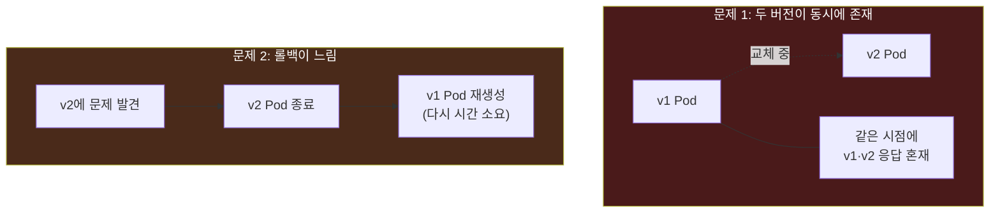
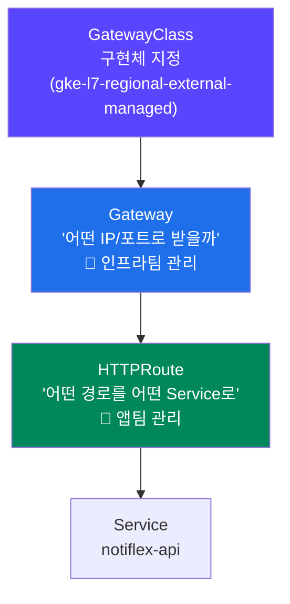
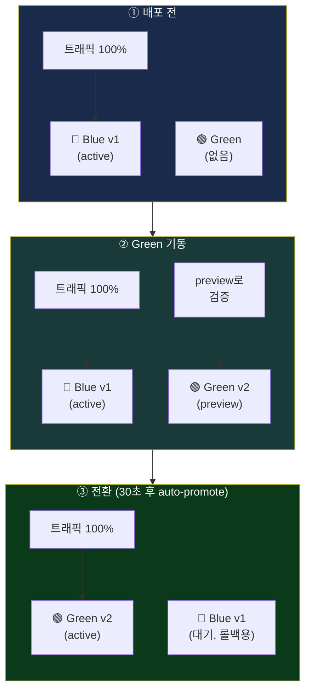
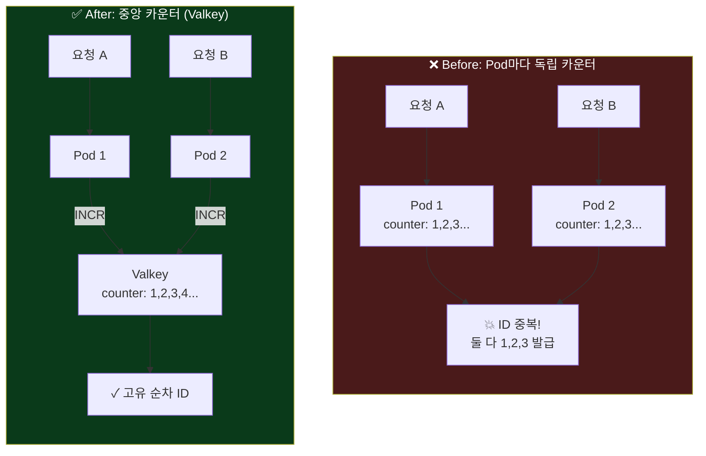
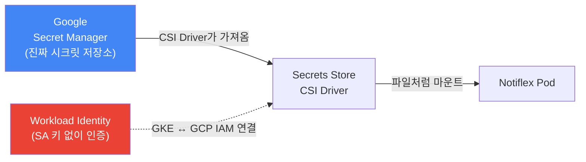
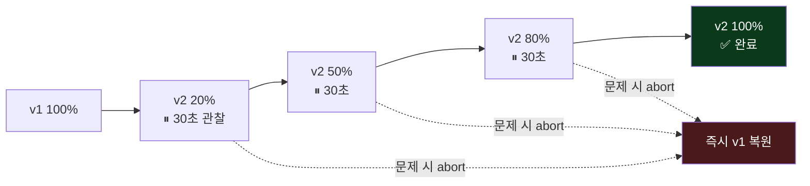

## 📚 들어가며

2주차까지 Notiflex는 **자동 파이프라인(3장)**과 **관측 가능성(4장)**을 갖췄다. 이제 배포는 `git push` 한 번이면 되고, 문제가 생기면 대시보드와 알림으로 알 수 있다. 그런데 아직 두 가지가 남았다.

1. 배포할 때마다 서비스가 **잠깐씩 끊긴다.**
2. 고객이 늘면서 **성능과 보안**에 구멍이 보이기 시작한다.

3주차는 이 두 문제를 해결하는 5장과 6장이다. Notiflex가 **SMB(중소)를 넘어 엔터프라이즈 고객사를 받기 위한 기반을 다지는** 단계다.

- **5장 (SMB): 무중단 배포** — "배포할 때마다 서비스가 끊긴다" → Gateway API + Argo Rollouts(Blue/Green)
- **6장 (전환기): 엔터프라이즈 기반 정비** — "느려지고 보안도 허술하다" → Valkey 캐시 + Secret Manager + Canary

> **3주차 학습 지도**
>
> ```
> 5장 무중단 배포              6장 엔터프라이즈 기반
> ─────────────              ──────────────────
> Rolling Update의 한계        Valkey 캐시 (Pod 간 상태 공유)
> → Gateway API (외부 트래픽)   → Secret Manager (시크릿 관리)
> → Argo Rollouts             → Canary (Blue/Green → 점진적 전환)
> → Blue/Green 배포
> ```

---

## 5장. 무중단 배포

### 5.1 Rolling Update는 왜 서비스가 끊기는가

3장에서 도입한 **롤링 업데이트(Rolling Update)**는 쿠버네티스의 기본 배포 방식이다. 기존 Pod를 하나씩 내리고 새 Pod를 하나씩 올린다. "무중단인 것 같지만" 실제로는 두 가지 문제가 있다.



| 한계 | 설명 |
|------|------|
| **버전 혼재** | 교체 도중에는 v1과 v2 Pod가 **동시에** 트래픽을 받는다. 사용자마다 다른 버전이 응답할 수 있다 |
| **뒤늦은 문제 발견** | 새 버전에 버그가 있어도, **이미 일부 사용자가 에러를 겪은 뒤에야** 알게 된다 |
| **느린 롤백** | 문제가 생기면 Pod를 다시 생성해야 해서 복구가 느리다 |

핵심은 **"롤링 업데이트는 문제를 미리 막지 못하고 사후에 알게 된다"**는 것이다. 더 안전한 방식이 필요하다. 그러려면 먼저 외부 트래픽을 **제어 가능한 형태**로 받아야 한다. 그게 5.2의 Gateway API다.

### 5.2 외부 트래픽 관리: Gateway API

지금까지 Notiflex API는 `ClusterIP` Service라 **클러스터 내부에서만** 접근 가능했다. 외부에서 HTTP 요청을 받으려면 트래픽을 클러스터 안으로 라우팅하는 관문이 필요하다. 여기서 **Gateway API**를 도입한다.

**Gateway API란?** 쿠버네티스의 **차세대 트래픽 관리 표준**이다. 기존 `Ingress`의 한계를 극복하기 위해 설계됐고, 쿠버네티스 1.27부터 GA(정식)가 됐다. GKE는 별도 Controller 설치 없이 네이티브로 지원한다.

> **왜 Ingress가 아니라 Gateway API인가?** (비교 요약)
>
> | 도구 | 장점 | 단점 | 적합도 |
> |------|------|------|:---:|
> | **Gateway API** | GKE 네이티브(설치 불필요), 역할 분리, 확장성 | 비교적 새로움 | ★★★ |
> | Ingress NGINX | 사용례 풍부, 커뮤니티 활발 | 별도 Controller 설치, 단일 리소스에 모든 설정 | ★★ |
> | Istio | mTLS·카나리·서킷브레이커 | 매우 무거움(1GB+) | ★ |
> | Traefik | 설정 간편, 동적 라우팅 | NGINX 대비 생태계 작음 | ★★ |

**Gateway API의 핵심: 역할 분리**

Gateway API의 가장 큰 특징은 **관심사를 리소스별로 분리**한다는 것이다. Ingress는 하나의 리소스에 모든 설정을 욱여넣었지만, Gateway API는 나눈다.



| 리소스 | 정의하는 것 | 관리 주체 |
|--------|-----------|----------|
| **GatewayClass** | Gateway의 구현체 (GKE 로드밸런서 종류) | 플랫폼 |
| **Gateway** | "어떤 IP/포트로 트래픽을 받을 것인가" | 인프라팀 |
| **HTTPRoute** | "어떤 경로의 요청을 어떤 Service로 보낼 것인가" | 앱팀 |

Notiflex는 서울 단일 리전(`asia-northeast3`)에서 운영하므로 GatewayClass는 **`gke-l7-regional-external-managed`**(리전 외부 HTTP)를 쓴다. 이 GatewayClass가 자동으로 GCP 로드밸런서를 만들어준다.

> ⚠️ **1주차의 복선 회수**: 2장에서 GKE 클러스터를 만들 때 `--gateway-api=standard` 옵션을 켰던 것 기억나는가? 그게 바로 지금을 위한 준비였다. 이 옵션이 없으면 `gcloud container clusters update ... --gateway-api=standard`로 나중에 켤 수 있지만 2~3분이 걸린다. "지금은 안 중요해 보이지만 나중에 발목 잡는" 설정을 가드레일이 미리 챙겨준 사례다.

그리고 GKE 전용 CRD인 **HealthCheckPolicy**로, Gateway가 백엔드 Pod의 상태(`/health`)를 어떻게 확인할지 정의한다. 건강하지 않은 Pod로는 트래픽을 보내지 않게 된다.

### 5.3 무중단 전환: Blue/Green 배포

외부 트래픽을 Gateway로 제어할 수 있게 됐으니, 이제 진짜 무중단 배포를 구현한다. 도구는 **Argo Rollouts**다.

**Argo Rollouts란?** 쿠버네티스 `Deployment`를 **대체하는 CRD**로, Blue/Green과 Canary 배포를 선언적으로 구현한다. 이미 쓰고 있는 ArgoCD와 같은 Argo 생태계라 통합이 매끄럽다.

> **왜 Argo Rollouts인가?**
>
> | 도구 | 장점 | 단점 | 적합도 |
> |------|------|------|:---:|
> | **Argo Rollouts** | YAML 선언적, Blue/Green+Canary 모두 지원, ArgoCD 통합 | 별도 CRD 설치 | ★★★ |
> | Flagger | 메트릭 기반 자동 promote | Istio 없이 기능 제한, ArgoCD 통합 약함 | ★★ |
> | K8s 기본 Rolling | 추가 설치 없음 | Blue/Green·Canary 불가, 롤백 느림 | ★ |

**Blue/Green 배포란?**

새 버전(Green)을 **완전히 다 띄운 뒤**, 트래픽을 **한 번에** 전환하는 방식이다. 문제가 생기면 즉시 Blue로 되돌린다.



이걸 위해 Service를 **두 개** 둔다. `notiflex-api`(active, 실제 트래픽)와 `notiflex-api-preview`(preview, 검증용). Rollout의 전략 설정은 이렇게 생겼다.

```yaml
strategy:
  blueGreen:
    activeService: notiflex-api           # 실 트래픽
    previewService: notiflex-api-preview  # 검증용
    autoPromotionEnabled: true
    autoPromotionSeconds: 30              # 30초 후 자동 승격
```

배포 진행 상황은 kubectl 플러그인으로 실시간 확인할 수 있다.

```bash
kubectl argo rollouts get rollout notiflex-api -n notiflex -w
```

30초 뒤 Green이 active로 **auto-promote**되면 전환 완료다.

| 함정 | 내용 |
|------|------|
| ⚠️ **deployment.yaml 중복** | `deployment.yaml`과 `rollout.yaml`이 동시에 있으면 ArgoCD가 **둘 다** 배포한다. 반드시 기존 `deployment.yaml`을 삭제해야 한다 |
| ⚠️ **CI의 sed 대상** | 3.4의 CI는 이미지 태그를 `deployment.yaml`에 교체하고 있었다. 파일을 지웠으니 CI의 sed 대상도 `rollout.yaml`로 바꿔야 한다. 안 바꾸면 `sed: can't read ...deployment.yaml` 에러로 CI 실패 |

두 번째 함정이 특히 인상적이었다. **한 곳(매니페스트)을 바꾸면 연결된 다른 곳(CI 워크플로우)도 같이 바뀌어야 한다**는, 시스템이 서로 얽혀 있다는 걸 체감하는 지점이다.

---

## 6장. 엔터프라이즈를 위한 기반 정비

무중단 배포까지 갖췄지만, 대형 고객사를 받으려면 그 전에 **성능·보안·배포 안전성**을 한 단계 끌어올려야 한다. 6장은 그 정비 작업이다.

### 6.1 Pod 간 상태 공유: Valkey 캐시

**문제 상황**부터 보자. Notiflex API는 `replicas: 2`로 돌고 있다. 그런데 `/id` 엔드포인트는 **각 Pod의 인메모리 카운터**로 ID를 생성한다. Pod가 2개니 카운터도 2개, 결국 **같은 ID가 중복 생성**된다.



해결책은 **Pod 바깥의 중앙 저장소**에서 카운터를 관리하는 것. 그 저장소로 **Valkey**를 쓴다.

**Valkey란?** Redis의 오픈소스 포크다. Redis가 2024년 라이선스를 SSPL로 바꾸자, Linux Foundation 산하에서 **BSD 라이선스**를 유지하는 Valkey가 탄생했다. Redis와 100% 호환된다.

> **왜 Valkey인가?**
>
> | 도구 | 장점 | 단점 | 적합도 |
> |------|------|------|:---:|
> | **Valkey** | Redis 호환, BSD 라이선스(상용 안전), 경량(64Mi) | 커뮤니티 성장 중 | ★★★ |
> | Redis | 가장 성숙한 생태계 | **SSPL 라이선스**(상용 제한) | ★★ |
> | Memcached | 매우 가볍고 멀티스레드 | **영속성 없음, INCR 미지원** | ★ |
> | DragonflyDB | 높은 성능, 메모리 효율 | 아직 성숙하지 않음 | ★ |

핵심은 Valkey의 **`INCR`** 명령이다. `INCR notiflex:id`는 키 값을 원자적으로 1 증가시키고 새 값을 반환한다. **여러 Pod가 동시에 호출해도 중복 없이** 순차 ID가 나온다. Memcached는 영속성이 없고 `INCR`도 지원하지 않아 탈락, Redis는 라이선스 문제로 탈락 → Valkey가 최선이다.

- **SSPL(Server Side Public License)**: 클라우드 서비스로 제공하면 전체 소스 공개를 요구하는 라이선스. OSI 인정 오픈소스가 아니라서 상용 환경에서 부담이 된다.
- 학습 환경에서는 master-replica 없이 **standalone 모드**(CPU 50m, Memory 64Mi)로 충분하다.

### 6.2 시크릿 관리: Google Secret Manager

Valkey를 붙이면서 **비밀번호**가 생겼다. 지금은 이걸 쿠버네티스 `Secret`으로 관리하는데, K8s Secret은 **암호화가 아니라 그냥 base64 인코딩**일 뿐이다. 누구나 디코딩할 수 있어서 **Git에 커밋할 수 없다.** 프로덕션 수준의 시크릿 관리가 필요하다.

해결책은 **Secrets Store CSI Driver + Google Secret Manager** 조합이다.



> **왜 이 방식인가?**
>
> | 방식 | 장점 | 단점 | 적합도 |
> |------|------|------|:---:|
> | **CSI Driver + Secret Manager** | GKE 네이티브, SA 키 불필요, 단일 진실 소스 | 설정 단계 많음 | ★★★ |
> | Sealed Secrets | 암호화 상태로 Git 커밋 가능 | 키 관리 필요, GCP 통합 없음 | ★★ |
> | External Secrets Operator | 다양한 프로바이더, 직관적 | 별도 Operator 설치 | ★★ |
> | `kubectl create secret` | 가장 간단 | **Git 커밋 불가, base64만** | ★ |

**핵심 개념**

- **Workload Identity**: GKE Pod의 K8s ServiceAccount를 GCP IAM ServiceAccount와 연결한다. Pod가 GCP에 접근할 때 **SA 키 파일(JSON) 대신 OIDC 토큰**을 쓴다. → 관리할 키 파일이 없어져서 유출 위험이 사라진다.
- **SecretProviderClass**: CSI Driver의 CRD. "어떤 Secret Manager의 어떤 시크릿을 가져올지" 정의한다.
- **CSI(Container Storage Interface)**: K8s의 스토리지 플러그인 표준. 시크릿을 **파일 시스템처럼 마운트**할 수 있게 해준다.

핵심은 "시크릿의 원본은 오직 Secret Manager에만 있다"는 것. Git에도, 매니페스트에도 실제 비밀번호는 없다. Pod가 뜰 때 CSI가 마운트해서 가져올 뿐이다.

### 6.3 점진적 배포: Canary

5장의 Blue/Green은 잘 동작하지만 한 가지 아쉬움이 있다. **0% → 100% 한 번에** 전환하기 때문에, 새 버전에 문제가 있으면 **전환 순간 전체 사용자가** 영향을 받는다. 더 안전한 **Canary(카나리)** 배포로 진화시킨다.

**Canary 배포란?** 새 버전에 트래픽을 **20% → 50% → 80% → 100%로 조금씩** 흘려보내며, 각 단계에서 관찰 후 다음으로 넘어가는 방식이다. 광부들이 유독가스를 미리 감지하려고 데려간 카나리아 새에서 이름을 따왔다.



**전략 비교 — 3장부터의 진화**

| 전략 | 전환 방식 | 롤백 속도 | 리소스 | 위험도 | 등장 |
|------|---------|---------|--------|-------|:---:|
| **Rolling Update** | Pod 순차 교체 | 느림 (재생성) | 1x | 중간 | 3장 |
| **Blue/Green** | 0%→100% 즉시 | 매우 빠름 (Service 전환) | 2x | 낮음 | 5장 |
| **Canary** | 20%→50%→80%→100% | 빠름 (abort) | 1.2x | **가장 낮음** | 6장 |

인상적인 건, **도구를 바꾸지 않는다**는 점이다. 같은 Argo Rollouts CRD에서 `strategy.blueGreen`을 `strategy.canary`로 **필드만 바꾸면** 된다. 실제 완성 레포의 `rollout.yaml`도 최종적으로 이 Canary 전략을 담고 있다.

```yaml
strategy:
  canary:
    canaryService: notiflex-api-preview
    stableService: notiflex-api
    steps:
    - setWeight: 20
    - pause: {duration: 30s}
    - setWeight: 50
    - pause: {duration: 30s}
    - setWeight: 80
    - pause: {duration: 30s}
```

**핵심 개념**

- **setWeight**: Canary(새 버전)로 보내는 트래픽 비율. `setWeight: 20`이면 20%가 새 버전으로.
- **pause**: 다음 단계 전 대기 시간. `pause: {duration: 30s}`는 30초 관찰 후 진행.
- **abort**: 문제 발견 시 `kubectl argo rollouts abort`로 중단하고 즉시 stable로 복원.
- **AnalysisTemplate** (심화): 시간 기반 pause 대신 **Prometheus 메트릭**으로 자동 판단. 에러율이 높으면 자동 abort. 4장에서 구축한 관측 가능성이 여기서 배포 자동화와 연결된다.

> ⚠️ **전환 시 순서가 중요하다**: ArgoCD가 auto-sync 상태이면, Rollout을 그냥 삭제할 경우 ArgoCD가 **Git의 이전(Blue/Green) 버전으로 즉시 복원**해버린다. 그래서 반드시 **① Canary 변경을 git push 먼저 → ② Rollout 삭제 → ③ ArgoCD가 새 Canary 적용** 순서를 지켜야 한다. GitOps에서는 "Git이 항상 이긴다"는 원칙이 이런 데서 드러난다.

---

## 📝 3주차 요약

```
5장 — 무중단 배포
├─ 5.1 Rolling Update 한계: 버전 혼재, 뒤늦은 문제 발견, 느린 롤백
├─ 5.2 Gateway API: GatewayClass/Gateway/HTTPRoute 역할 분리 + HealthCheckPolicy
└─ 5.3 Argo Rollouts + Blue/Green: active/preview 2개 Service, 30초 auto-promote

6장 — 엔터프라이즈 기반 정비
├─ 6.1 Valkey 캐시: INCR로 Pod 간 상태 공유, BSD 라이선스
├─ 6.2 Secret Manager + CSI Driver: Workload Identity로 SA 키 없이 인증
└─ 6.3 Canary: 20→50→80→100% 점진 전환, 같은 Rollout CRD에서 전략만 변경
```

| 개념 | 한 줄 정의 |
|------|-----------|
| **Gateway API** | Ingress를 대체하는 차세대 트래픽 표준, 역할 분리 |
| **Argo Rollouts** | Deployment를 대체하는 CRD, Blue/Green·Canary 지원 |
| **Blue/Green** | 새 버전 다 띄우고 한 번에 전환, 리소스 2배 |
| **Canary** | 트래픽 점진 전환(20→100%), 리소스 1.2배, 가장 안전 |
| **INCR** | Valkey의 원자적 증가 명령, Pod 간 중복 없는 순차 ID |
| **Workload Identity** | SA 키 없이 GKE↔GCP IAM 연결, OIDC 토큰 인증 |

---

## 💭 느낀 점

**1. "되는 것"과 "안전하게 되는 것"의 차이를 배웠다.**

롤링 업데이트도 배포는 된다. 하지만 5.1을 읽으면서, **"문제를 사후에 아는 것"과 "문제가 퍼지기 전에 막는 것"은 완전히 다른 수준의 안전**이라는 걸 알게 됐다. Blue/Green은 검증 후 전환하고, Canary는 20%에서 먼저 걸러낸다. 배포 전략의 발전사가 곧 "실패의 영향 범위를 어떻게 줄일 것인가"의 역사라는 게 흥미로웠다.

**2. 도구를 바꾸지 않고 전략만 바꾼다는 설계가 좋았다.**

Blue/Green에서 Canary로 넘어갈 때 새 도구를 배우는 게 아니라, **같은 Argo Rollouts에서 `strategy` 필드만 바꾸는 것**이 인상적이었다. 이 책이 강조하는 "점진적 고도화"가 뭔지 체감됐다. 처음부터 완벽한 Canary를 만드는 게 아니라, Rolling → Blue/Green → Canary로 **단계적으로 진화**시킨다. 학습 곡선도 그만큼 완만해진다.

**3. 문제가 먼저, 기술이 나중이라는 흐름이 계속 유효하다.**

6.1의 Valkey도 "캐시를 배우자"가 아니라 **"Pod가 2개라서 ID가 중복된다"**는 구체적 버그에서 출발했다. `/id`가 Pod 이름을 반환하도록 1주차에 설계해둔 게, 여기서 "왜 중복이 생기는지" 눈으로 보게 해주는 복선이었다는 것도 뒤늦게 이해됐다. 기술이 문제 해결의 도구로 등장하니 매번 납득이 된다.

**4. 보안은 "키를 잘 숨기는 것"이 아니라 "키를 없애는 것"이었다.**

6.2에서 가장 인상 깊었던 건 Workload Identity였다. 나는 막연히 "시크릿 관리 = 비밀번호를 어딘가 안전한 곳에 잘 저장하는 것"이라고 생각했는데, **아예 SA 키 파일 자체를 만들지 않는** 접근(OIDC 토큰)이 더 근본적이라는 걸 배웠다. "유출될 수 있는 것을 애초에 만들지 않는다"는 발상이 회사에서 자격 증명을 다룰 때도 그대로 적용될 통찰이었다.

**5. 모든 것이 연결되어 있다.**

이번 3주차에서 가장 크게 느낀 건 **시스템의 상호 연결성**이다. 매니페스트를 `deployment.yaml`에서 `rollout.yaml`로 바꾸니 CI의 sed 대상도 바꿔야 했고, Canary로 전환할 땐 ArgoCD의 auto-sync 때문에 git push 순서까지 신경 써야 했다. 각 조각이 독립적이지 않다는 걸 몸으로 배웠고, 그래서 **JOURNEY.md나 ADR(아키텍처 결정 기록) 같은 문서화**가 왜 중요한지도 자연스럽게 이해됐다. 다음 4주차(7장~)에서는 이 기반 위에서 본격적인 규모 확장이 시작될 텐데, 지금까지 다진 기반이 어떻게 쓰일지 기대된다.

---

## 🔗 참고

- 도서: 「AI 시대에 개발자가 알아야 할 인프라 구성 배포 with 클로드 코드」 (조훈, 길벗)
- 가이드 저장소: [sysnet4admin/_Book_GitAIOps](https://github.com/sysnet4admin/_Book_GitAIOps)
- 완성 참조 플랫폼: [sysnet4admin/notiflex-platform](https://github.com/sysnet4admin/notiflex-platform)

> **다음 주차 예고 (7장~)**: "대형 고객사가 전용 환경을 요청한다" — 인프라 확장과 테넌트 분리로 엔터프라이즈 규모의 멀티테넌시를 다룬다.
