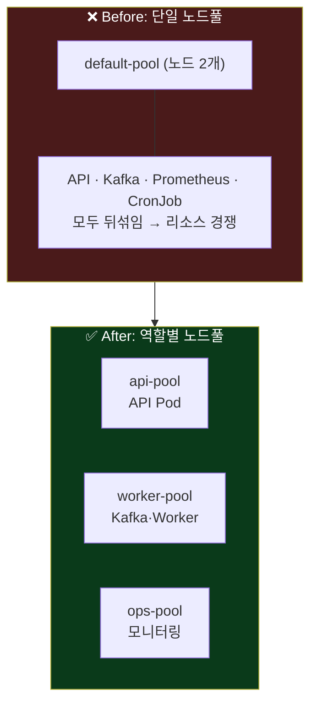
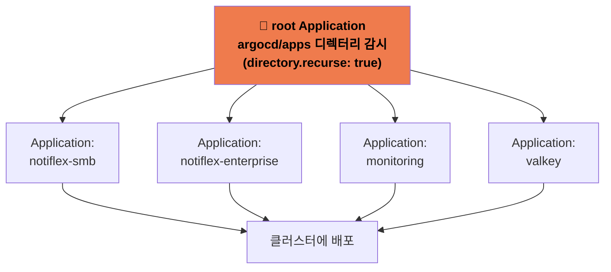
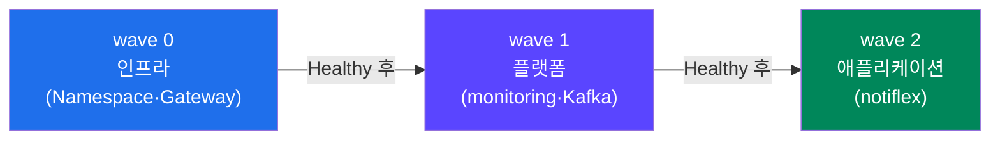
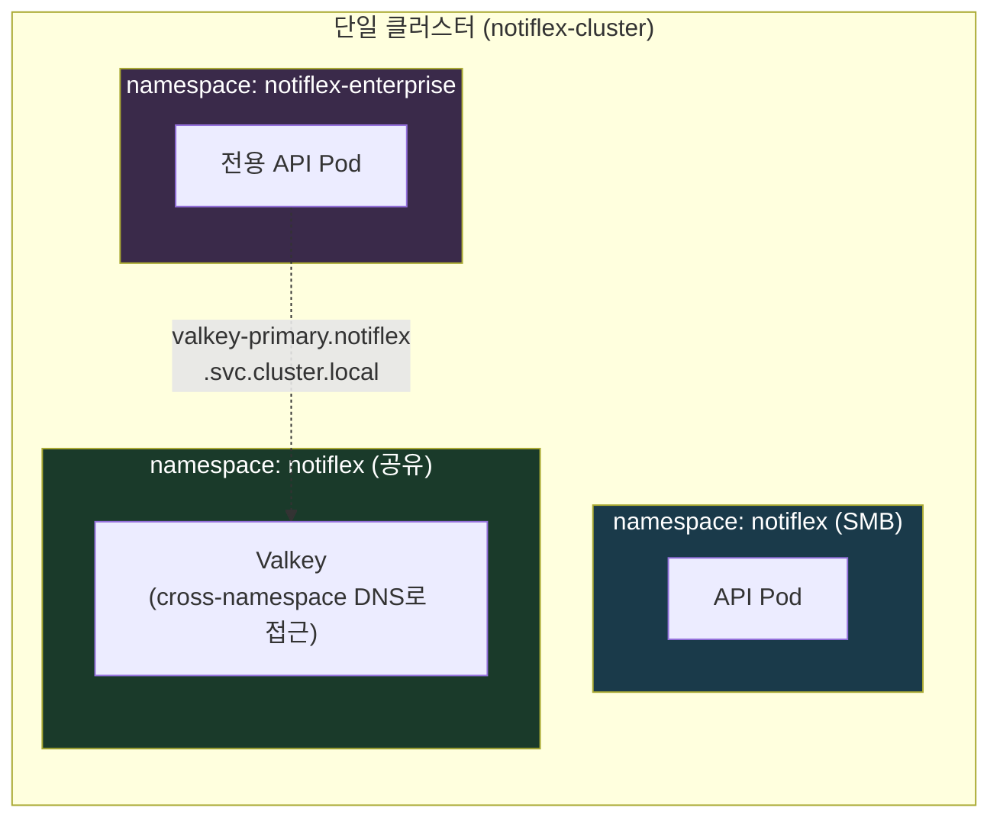
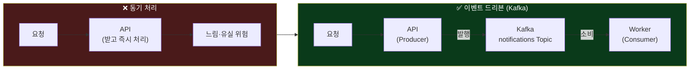
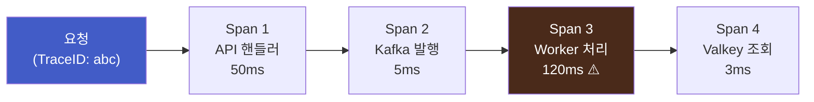
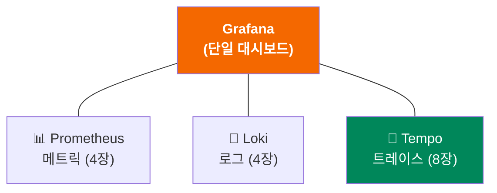
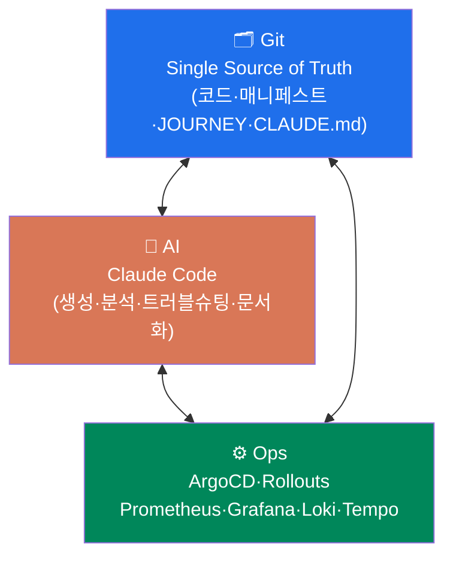
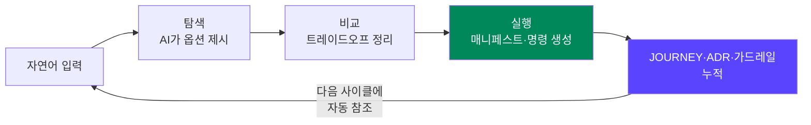

## 📚 들어가며

드디어 마지막 4주차다. 지난 3주 동안 Notiflex는 빈 GKE 클러스터에서 시작해 자동 파이프라인(3장), 관측 가능성(4장), 무중단 배포(5장), 엔터프라이즈 기반 정비(6장)까지 갖췄다. 이번 주는 책의 **마지막 세 장**을 한 번에 다룬다.

- **7장 (Enterprise): 규모 확장** — "대형 고객사가 전용 환경을 요청한다" → 멀티 노드풀 + App of Apps + 멀티테넌시
- **8장 (Enterprise): 고도화** — "서비스 간 호출이 꼬이고 배치가 밀린다" → Kafka + Tempo + CronJob
- **9장 (종합): GitAIOps의 출현** — "돌아보니 이 모든 기록이 운영 표준이 되어 있었다"

7·8장이 마지막 기술 도입이고, 9장은 지금까지의 여정 전체를 **GitAIOps**라는 하나의 개념으로 묶는 회고다.

> **4주차 학습 지도**
>
> ```
> 7장 규모 확장          8장 고도화            9장 종합
> ────────────          ──────────           ──────────
> 멀티 노드풀             Kafka (이벤트)        저장소 분석
> App of Apps           Tempo (트레이싱)       여정 회고
> 멀티테넌시              CronJob (배치)         → GitAIOps
> (nodeSelector)        (관측 3축 완성)         = Git+AI+Ops
> ```

---

## 7장. 규모 확장

### 7.1 성장통: SMB 구조의 한계

대형 고객사와 계약하면서, 지금까지의 구조에 한계가 드러난다. 모든 워크로드(API, Kafka, Prometheus, CronJob)가 **default-pool 노드 2개에 뒤섞여** 올라가 있다. 이러면 Kafka처럼 메모리를 많이 쓰는 워크로드가 API Pod의 리소스를 빼앗을 수 있다. 앱도 여러 개로 늘었고, 이제 다른 기업 고객(테넌트)까지 받아야 한다.

이 세 가지 성장통이 7장의 세 절에 각각 대응된다.

| 성장통 | 해결책 | 절 |
|--------|--------|:---:|
| 워크로드가 노드에서 서로 간섭 | 워크로드별 **멀티 노드풀** 분리 | 7.2 |
| 관리할 앱(Application)이 너무 많음 | **App of Apps** 패턴 | 7.3 |
| 테넌트 간 격리가 필요 | **Namespace 기반 멀티테넌시** | 7.4 |

### 7.2 워크로드별 노드 배치: 멀티 노드풀

첫 번째는 노드를 **역할별로 나누는** 것이다. `api-pool`, `worker-pool`, `ops-pool`처럼 노드풀을 만들고, 각 Pod를 알맞은 노드풀에 배치한다.



배치 방법으로는 여러 선택지가 있는데, 이 책은 가장 단순한 **nodeSelector**를 쓴다.

> **왜 nodeSelector인가?**
>
> | 방식 | 복잡도 | 특징 | 적합도 |
> |------|:---:|------|:---:|
> | **nodeSelector** | 낮음 | 라벨 매칭 한 줄, GKE가 노드풀 라벨 자동 부여 | ★★★ |
> | taint/toleration | 중간 | 노드에 "거부"를 걸어 특정 Pod만 허용 | ★★ |
> | nodeAffinity | 높음 | required/preferred 유연한 규칙 | ★ |
> | topology spread | 높음 | AZ 간 균등 분배 (단일 존엔 불필요) | ★ |

GKE는 노드풀을 만들면 `cloud.google.com/gke-nodepool` 라벨을 **자동으로** 붙여준다. 그래서 Pod spec에 한 줄만 추가하면 배치가 끝난다. 실제 완성 레포의 `rollout.yaml`에도 이렇게 들어가 있다.

```yaml
nodeSelector:
  cloud.google.com/gke-nodepool: api-pool
```

nodeSelector는 "이 라벨의 노드에 배치하라"는 조건일 뿐, **다른 Pod가 그 노드에 오는 걸 막지는 못한다.** 그걸 막으려면 taint를 걸어야 하는데, 학습 환경에서는 과하다는 판단이다. (그리고 **Spot VM**은 GCP 여유 용량을 60~91% 할인가로 쓰는 대신 언제든 회수될 수 있어, 학습·테스트용으로 계속 활용한다.)

### 7.3 다수 앱 관리: App of Apps 패턴 + Sync Wave

ArgoCD Application이 이미 여러 개(notiflex, valkey, monitoring…)다. 지금은 앱을 추가할 때마다 비슷한 Application YAML을 복사해서 만든다. 이걸 체계화하는 게 **App of Apps 패턴**이다.

**App of Apps란?** 하나의 **"루트 Application"**이 `argocd/apps/` 디렉터리를 감시하고, 그 안의 개별 Application YAML들을 자동으로 배포하는 구조다. 폴더에 YAML을 넣으면 새 앱이 자동 등록된다.



> **왜 App of Apps인가?**
>
> | 패턴 | 장점 | 단점 | 적합도 |
> |------|------|------|:---:|
> | **App of Apps** | 직관적("폴더에 넣으면 앱 생성"), 순수 YAML | 앱마다 개별 YAML | ★★★ |
> | ApplicationSet | 템플릿으로 대량 생성, 동적 환경 | 템플릿 문법 학습, 디버깅 어려움 | ★★ |
> | 수동 관리 | 추가 설정 없음 | 앱 누락 가능, 일괄 관리 불가 | ★ |

실제 완성 레포의 루트 앱은 `path: argocd/apps` + `directory.recurse: true`로 그 폴더를 통째로 감시한다. ApplicationSet은 "같은 앱을 dev/staging/prod 10개 환경에 뿌릴 때" 빛나는데, Notiflex는 단일 클러스터라 App of Apps로 충분하다.

**Sync Wave: 설치 순서 제어**

앱을 한꺼번에 배포하면 **의존성 문제**가 생긴다. 예를 들어 애플리케이션이 뜨기 전에 Namespace와 Gateway가 먼저 있어야 한다. 이때 **Sync Wave** 어노테이션으로 순서를 매긴다.



| Wave | 대상 | 이유 |
|:---:|------|------|
| **0** | 인프라 (Namespace, Gateway) | 가장 먼저 있어야 나머지가 올라감 |
| **1** | 플랫폼 (monitoring, Kafka) | 앱이 의존하는 기반 서비스 |
| **2** | 애플리케이션 (notiflex) | 마지막에 배포 |

핵심은 `argocd.argoproj.io/sync-wave: "0"` 처럼 **숫자가 낮은 wave부터** sync되고, **앞 wave가 Healthy가 되어야** 다음 wave가 시작된다는 점이다. 대기 시간을 주는 게 아니라 "준비되면 다음"이라는 의존성 순서를 보장한다.

### 7.4 멀티테넌시: Namespace 격리

이제 진짜 목표, **멀티테넌시(multi-tenancy)**다. B2B SaaS에서 각 기업 고객이 하나의 **테넌트(tenant)**다. 테넌트 간 데이터와 리소스를 격리해야 한다. 이 책은 가장 단순한 **Namespace 분리 + RBAC** 방식을 쓴다.



> **왜 Namespace 분리인가?**
>
> | 방식 | 격리 수준 | 장점 | 단점 | 적합도 |
> |------|:---:|------|------|:---:|
> | **Namespace + RBAC** | 논리적 | 추가 도구 없음, 리소스 효율 | 네트워크 격리 약함 | ★★★ |
> | vCluster | 가상 클러스터 | 강한 격리 | 추가 리소스·복잡성 | ★★ |
> | 클러스터별 분리 | 물리적 | 가장 강한 격리 | 비용 2배+ | ★ |
> | Namespace + NetworkPolicy | 논리+네트워크 | 네트워크 격리 추가 | CNI 의존, 설정 복잡 | ★★ |

**핵심 개념 정리**

- **테넌트**: 같은 인프라를 공유하는 독립적 사용자 그룹. B2B SaaS의 각 기업 고객.
- **RBAC**: 누가(ServiceAccount) 어떤 리소스에 어떤 동작(get/list/create)을 할 수 있는지 정의.
- **cross-namespace DNS**: `<service>.<namespace>.svc.cluster.local` 형식으로 다른 Namespace의 Service에 접근. 테넌트가 공유 Valkey에 붙을 때 쓴다.
- **노이지 네이버(Noisy Neighbor)**: 한 테넌트가 리소스를 과다 사용해 다른 테넌트에 영향을 주는 문제. `ResourceQuota`로 완화.

단일 클러스터(e2-medium 3개)에서 vCluster나 별도 클러스터는 비현실적이다. Namespace 분리로 **멀티테넌시의 핵심 개념(격리·공유 리소스·cross-namespace 통신)을 실제로 경험**하는 것이 이 장의 목표다.

---

## 8장. 고도화

기반은 다 갖췄다. 8장은 아키텍처를 한 단계 **성숙**시키는 세 가지 — 이벤트 드리븐, 분산 트레이싱, 배치 자동화 — 를 도입한다.

### 8.1 이벤트 드리븐: Kafka

**문제**: Notiflex API는 알림 요청을 **동기적으로** 처리한다. 요청이 몰리면 API가 느려지고, 처리 중에 Pod가 죽으면 알림이 **유실**된다. 요청을 "받는 것"과 "처리하는 것"을 분리해야 한다.



**Kafka**는 분산 이벤트 스트리밍 플랫폼이다. **Strimzi Operator**를 쓰면 쿠버네티스에서 Kafka를 CRD로 선언적으로 관리할 수 있다(GitOps 호환).

> **왜 Kafka(Strimzi)인가?**
>
> | 도구 | 장점 | 단점 | 적합도 |
> |------|------|------|:---:|
> | **Kafka (Strimzi)** | 업계 표준, 영속성, GitOps 호환 | 무거움(~512MB), 학습 곡선 | ★★★ |
> | RabbitMQ | 가볍고 성숙 | 대규모 스트리밍 약함 | ★★ |
> | NATS | 매우 가벼움(~50MB) | 생태계 작음, 채택률 낮음 | ★★ |
> | Redis Streams | 이미 Valkey 설치됨 | 전용 브로커 대비 기능 제한 | ★ |

**핵심 개념**

- **Producer / Consumer**: Producer(API)가 메시지를 Topic에 보내고, Consumer(Worker)가 가져간다.
- **Topic**: 메시지가 쌓이는 카테고리. `notifications` Topic에 알림 이벤트가 저장된다.
- **KRaft**: Kafka Raft. **ZooKeeper 없이** Kafka 자체가 메타데이터를 관리하는 모드. Kafka 3.3+ 도입, 4.0부터 기본. 덕분에 단일 노드로도 e2-medium에서 돌릴 수 있다.
- **Consumer Group**: 같은 그룹의 Consumer들이 파티션을 나눠 처리. 하나가 죽으면 다른 Consumer가 이어받는다 → 유실 방지.

NATS가 더 가볍지만, **실무에서 이벤트 드리븐을 다룰 때 Kafka를 만날 확률이 압도적으로 높아** 학습 가치를 우선했다. 완성 레포도 Strimzi의 `KafkaNodePool`을 KRaft(controller+broker 겸용, replicas 1)로 구성해 리소스를 아꼈다.

### 8.2 분산 트레이싱: Tempo

Kafka를 넣으니 요청 흐름이 복잡해졌다: **API → Kafka → Worker → Valkey.** 한 요청이 여러 컴포넌트를 거치는데, **어디서 느린지, 어디서 실패하는지** 알기 어렵다. 이걸 추적하는 게 **분산 트레이싱**이고, 도구는 **Grafana Tempo**다.



위 그림처럼 하나의 **Trace**(전체 여정)가 여러 **Span**(구간)으로 나뉘고, 같은 **TraceID**로 묶인다. Worker 구간이 120ms로 느리다는 걸 한눈에 볼 수 있다.

> **왜 Tempo인가?**
>
> | 도구 | 장점 | 단점 | 적합도 |
> |------|------|------|:---:|
> | **Grafana Tempo** | Grafana 통합(추가 UI 불필요), 경량, OTLP 지원 | Grafana 없으면 UI 없음 | ★★★ |
> | Jaeger | 독립 UI, 성숙한 생태계 | 별도 UI, ES/Cassandra 필요 | ★★ |
> | Zipkin | 간단한 설치 | 기능 제한, 커뮤니티 축소 | ★ |

**관측 가능성 3축의 완성**

이 절의 진짜 의미는 여기 있다. 4장에서 메트릭(Prometheus)과 로그(Loki)를 구축했고, 이제 트레이스(Tempo)가 더해지면서 **관측 가능성 3요소가 Grafana 하나에서 완성**된다.



- **OpenTelemetry(OTel)**: 트레이싱·메트릭·로그를 수집하는 **벤더 중립 표준**. 앱에 OTel SDK만 넣으면 Tempo, Jaeger, Datadog 어디로든 보낼 수 있다.
- **OTLP**: OTel의 표준 전송 프로토콜. gRPC(4317)와 HTTP(4318) 포트를 쓴다.

이미 Grafana를 운영 중인데 Jaeger로 또 다른 UI를 추가하는 건 낭비다. Tempo로 **메트릭 → 로그 → 트레이스를 하나의 화면에서 넘나드는** 경험을 완성한다.

### 8.3 배치 자동화: CronJob

마지막은 주기적 작업이다. "5분마다 헬스체크를 돌려 장애를 빨리 발견하고 싶다"는 요구를, 쿠버네티스 기본 리소스인 **CronJob**으로 해결한다.

```yaml
schedule: "*/5 * * * *"        # 5분마다
successfulJobsHistoryLimit: 3   # 성공 기록 최근 3개만 보관
```

**왜 CronJob인가?** Airflow 같은 외부 스케줄러도 있지만, 헬스체크처럼 단순한 주기 작업엔 과하다. CronJob은 **추가 설치가 없고**(K8s 내장), Linux cron 문법을 그대로 쓰며, YAML 선언이라 **GitOps로 관리**된다.

- **CronJob → Job → Pod**: CronJob이 스케줄마다 Job을 만들고, Job이 Pod를 생성한다. 완료되면 종료.
- **successfulJobsHistoryLimit**: 성공한 Job을 몇 개 보관할지. 오래된 건 자동 삭제.
- **restartPolicy: OnFailure**: 실패(exit ≠ 0) 시 같은 Pod에서 재시작. `Never`는 새 Pod 생성.

완성 레포에도 `*/5 * * * *` 스케줄의 헬스체크 CronJob이 들어가 있다. 관측 가능성(감지)에 이어 **자동 점검(예방)**까지 붙으면서 운영 자동화가 한 바퀴 완성된다.

---

## 9장. GitAIOps: 살아있는 운영 표준의 탄생

마지막 장은 새 기술을 배우지 않는다. 대신 **지금까지의 여정 전체를 돌아본다.** Claude Code에게 저장소를 통째로 분석시키고("저장소 분석해줘"), 그동안 쌓인 코드·설정·문서가 무엇을 만들어냈는지 회고한다.

### 9.1~9.3 쌓인 것들을 돌아보기

돌아보니, 우리는 매 장마다 단순히 기술만 도입한 게 아니었다. 그 과정에서 **의사결정 기록(JOURNEY.md)**, **아키텍처 결정 기록(ADR)**, **가드레일**, **CLAUDE.md**가 자연스럽게 쌓였다. 이 축적물이 "기대하지 않았던 효과"를 만든다.

| 쌓인 것 | 정체 | 효과 |
|---------|------|------|
| `JOURNEY.md` | 매 단계의 의사결정·진행 기록 | 왜 이렇게 했는지 추적 가능 |
| `docs/ADR` | 아키텍처 결정 기록 | 중요한 선택의 근거 보존 |
| 가드레일 | decision/prompt/result 3종 | AI가 안정적으로 동작하는 근거 |
| `CLAUDE.md` | AI 행동 규칙 | 다음 작업이 이전 맥락을 자동 참조 |

### 9.4 GitAIOps의 출현

이 모든 걸 하나로 묶으면 **GitAIOps**다. 1주차에 개념으로만 배웠던 그 단어가, 4주간의 실습을 거쳐 **실체**로 돌아온다.



| 요소 | 역할 |
|------|------|
| **Git** | 코드·인프라·의사결정의 유일한 출처 (Single Source of Truth) |
| **AI** | 지능형 협업 파트너 (생성 + 분석 + 조언 + 문서화) |
| **Ops** | 자동화된 운영 (배포·관측·전략) |

**GitAIOps 루프: 한 바퀴가 다음 바퀴를 강화한다**

가장 인상 깊은 통찰은, GitAIOps가 일회성 결합이 아니라 **반복될수록 빨라지는 루프**라는 점이다.



이게 1주차에 배운 **탐색 → 비교 → 실행** 3단계와 정확히 맞물린다. **첫 사이클**은 탐색·비교에 시간이 걸리지만, 가드레일과 JOURNEY.md가 쌓이면서 **두 번째부터는 AI가 이전 결정을 알고 있으므로 곧장 실행으로** 넘어간다. 루프가 돌수록 탐색·비교가 압축되고 실행만 남는다. 운영 표준이 **대화와 코드를 통해 스스로 형성되고 진화**하는 것 — 이것이 "살아있는 운영 표준"의 의미다.

### 9.5 마무리: GitOps에서 GitAIOps로, 다시 처음으로

1주차의 GitOps vs GitAIOps 비교를, 이제 4주간의 실습을 거쳐 다시 보면 훨씬 선명하다.

| 항목 | GitOps | GitAIOps (이번 책에서 경험한 것) |
|------|--------|-------------------------------|
| 진실의 원천 | Git | Git (+ JOURNEY·ADR·CLAUDE.md) |
| YAML 작성 | 사람이 직접 | AI가 생성 (탐색→비교→실행) |
| 도구 선택 | 사람이 조사 | AI가 옵션·트레이드오프 제시 |
| 트러블슈팅 | 사람이 검색 | AI가 가드레일 기반 진단 |
| 문서화 | 미룸 (자주 누락) | 작업과 동시에 자동 축적 |
| 학습 속도 | 일정 | **루프가 돌수록 가속** |

---

## 📝 4주차 요약

```
7장 — 규모 확장
├─ 7.1 SMB 구조의 한계: 리소스 경쟁, 앱 폭증, 테넌트 격리 필요
├─ 7.2 멀티 노드풀: nodeSelector로 api/worker/ops-pool 분리
├─ 7.3 App of Apps: 루트 앱이 argocd/apps 감시 + Sync Wave 순서 제어
└─ 7.4 멀티테넌시: Namespace + RBAC 격리, cross-namespace DNS

8장 — 고도화
├─ 8.1 Kafka (Strimzi, KRaft): 동기 → 이벤트 드리븐, 유실 방지
├─ 8.2 Tempo: 분산 트레이싱 → 관측 3축(메트릭·로그·트레이스) 완성
└─ 8.3 CronJob: 5분 주기 헬스체크, GitOps로 배치 자동화

9장 — 종합
├─ 9.1~9.3 저장소 분석 + 여정 회고 (JOURNEY·ADR·가드레일 축적)
├─ 9.4 GitAIOps = Git + AI + Ops, 루프가 돌수록 가속
└─ 9.5 GitOps → GitAIOps, 살아있는 운영 표준의 탄생
```

| 개념 | 한 줄 정의 |
|------|-----------|
| **nodeSelector** | Pod를 특정 라벨의 노드풀에 배치하는 조건 |
| **App of Apps** | 루트 앱이 디렉터리를 감시해 하위 앱을 자동 배포 |
| **Sync Wave** | Application 배포 순서를 숫자로 제어 (낮은 것 먼저) |
| **멀티테넌시** | Namespace + RBAC로 테넌트 격리 |
| **KRaft** | ZooKeeper 없이 Kafka가 메타데이터 관리 |
| **Trace / Span** | 요청의 전체 여정 / 그 안의 개별 구간 |
| **GitAIOps** | Git + AI + Ops가 루프로 결합된 살아있는 운영 표준 |

---

## 💭 느낀 점 (그리고 4주간의 회고)

**1. "단순한 것부터"라는 원칙이 7장에서 정점을 찍었다.**

7장은 노드 배치(nodeSelector), 앱 관리(App of Apps), 테넌시(Namespace)까지 전부 **가장 단순한 선택지**를 골랐다. taint, ApplicationSet, vCluster 같은 "더 강력한" 도구들을 알면서도 쓰지 않았다. 처음엔 "이래도 되나" 싶었는데, 각 절의 비교 표를 보며 **"강력함이 아니라 적합함"**이 기준이라는 걸 반복해서 확인했다. 실무에서 나는 자주 "제일 좋은 도구"를 찾으려 했는데, 정작 중요한 건 "지금 이 제약에서 최선인 도구"였다.

**2. 8장에서 지난 장들이 전부 연결되는 순간이 짜릿했다.**

8.2 Tempo를 읽을 때, 4장에서 만든 Prometheus·Loki가 **여기서 Tempo와 합쳐져 관측 3축이 완성된다**는 걸 알고 소름이 돋았다. 각 장이 독립적인 기술 소개가 아니라, 처음부터 이 그림을 향해 쌓여왔던 거였다. Kafka로 흐름이 복잡해지니(8.1) → 트레이싱이 필요해지고(8.2) → 관측 3축이 완성되는(4장+8.2) 이 인과의 사슬이, 책 전체가 하나의 설계였음을 보여줬다.

**3. 9장에서 1주차가 회수됐다.**

1주차에 GitAIOps를 "GitOps + AI"라는 정의로만 배웠을 때는 솔직히 좀 추상적이었다. 그런데 4주간 직접 탐색→비교→실행을 반복하고, JOURNEY.md와 가드레일이 쌓이는 걸 겪은 뒤 9장에서 다시 그 개념을 만나니 **완전히 다른 무게**로 다가왔다. 특히 "루프가 돌수록 빨라진다"는 부분 — 첫 배포는 오래 걸렸지만 뒤로 갈수록 AI가 맥락을 알고 곧장 실행하던 경험이 정확히 그거였다.

**4. 문서화가 부산물이 아니라 자산이라는 것.**

가장 크게 바뀐 생각이다. 나는 늘 문서화를 "일 끝나고 하는 귀찮은 것"으로 여겼다. 그런데 이 책에서는 JOURNEY.md·ADR·CLAUDE.md가 **작업과 동시에 쌓이고, 그게 다음 작업을 빠르게 만드는 연료**가 됐다. 문서화가 비용이 아니라 투자라는 걸, 미루면 사라지는 게 아니라 복리로 돌아온다는 걸 체감했다.

**5. 4주간의 전체 회고.**

빈 클러스터에서 시작해(1주차) → 파이프라인과 관측을 붙이고(2주차) → 무중단 배포와 기반을 정비하고(3주차) → 규모를 확장하고 GitAIOps로 완성하기까지(4주차). 돌아보면 이 책의 진짜 주제는 쿠버네티스도, ArgoCD도, Kafka도 아니었다. **"AI와 함께, 문제에서 출발해, 단순한 것부터, 기록을 쌓으며 진화하는 방식"** 그 자체였다. 도구는 언젠가 바뀌겠지만 이 태도는 오래 남을 것 같다. 스터디는 여기서 끝나지만, 이제 내 프로젝트에 이 방식을 적용해볼 차례다.

---

## 🔗 참고

- 도서: 「AI 시대에 개발자가 알아야 할 인프라 구성 배포 with 클로드 코드」 (조훈, 길벗)
- 가이드 저장소: [sysnet4admin/_Book_GitAIOps](https://github.com/sysnet4admin/_Book_GitAIOps)
- 완성 참조 플랫폼: [sysnet4admin/notiflex-platform](https://github.com/sysnet4admin/notiflex-platform)

> **스터디 완결**. 1주차부터 4주차까지, 개념 → 파이프라인 → 무중단 배포 → 규모 확장의 여정을 모두 마쳤다. Notiflex는 이제 엔터프라이즈 규모의 살아있는 운영 표준을 갖춘 플랫폼이 되었다. 🎉
