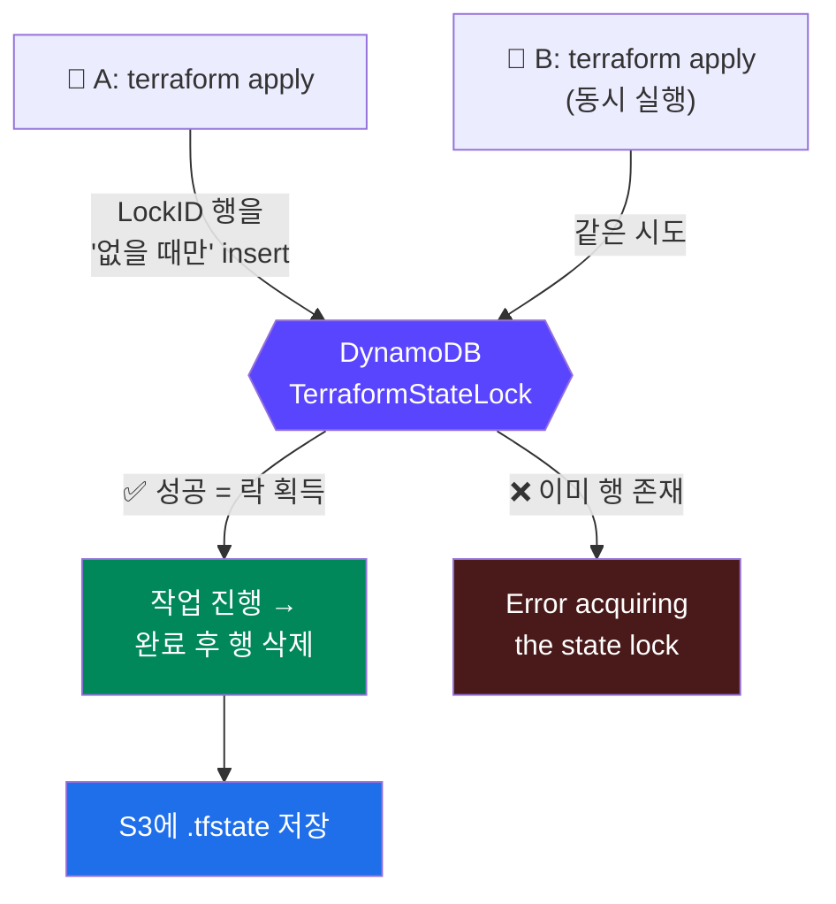
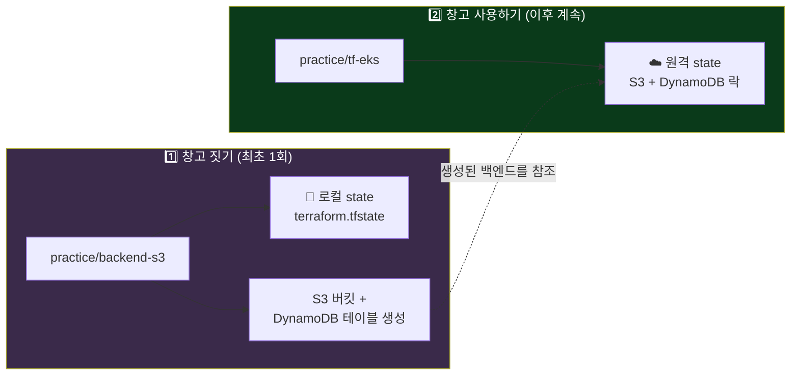
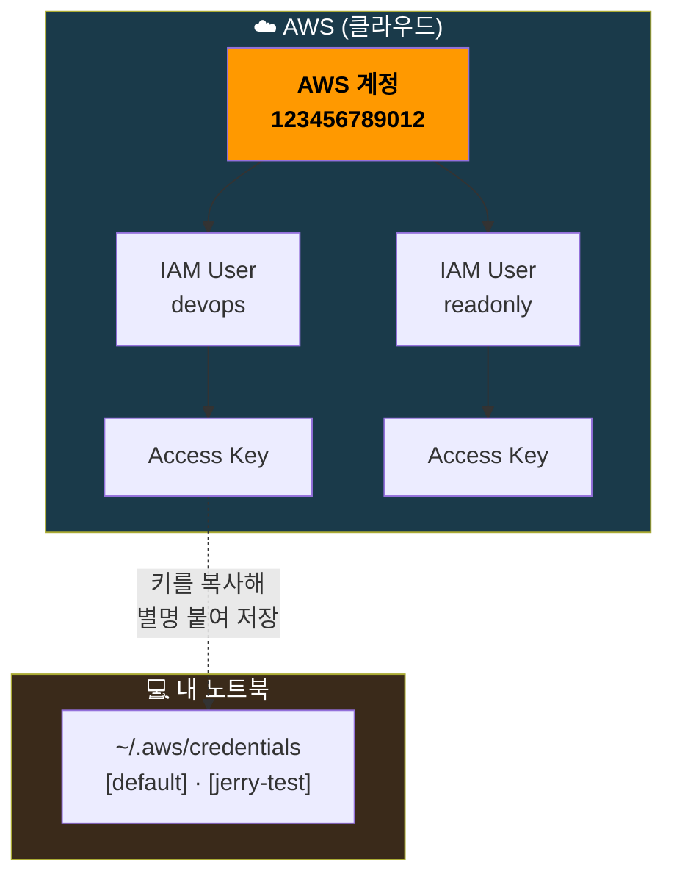

## 📚 들어가며

강의를 들으면서 EKS 환경을 직접 구축하고 있다. 다만 강의 레포를 그대로 복사하지 않기로 했다. 강의 자료는 **EKS 1.28~1.30, Terraform AWS provider 5.31 등 2024년 초 기준**이라, 지금 그대로 따라 하면 이미 바뀐 것들이 꽤 있다. 그래서 **현재 권장 버전으로 재구축**하면서, 강의와 갈리는 지점을 하나씩 짚어보려 한다. 이 시리즈의 포인트가 거기에 있다.

- 실습 환경: macOS, Terraform v1.15.8, AWS CLI 2.35.13, 리전 `ap-northeast-2`(서울)
- 이번 편 범위: `terraform init/apply`를 하기 **전에** 반드시 짚어야 하는 것들
- 디렉터리 구조: `ref/`(강의 레포) / `practice/`(내가 재구축하는 곳)

**그런데 시작부터 의문이 하나 생겼다.**

> 강의에서는 그냥 `tf-eks/`에서 `terraform init`부터 시작하던데, 그 앞에 있는 `backend-s3/`는 꼭 해야 하는 걸까?

결론부터 말하면 **해야 한다.** `tf-eks/providers.tf`를 열어보면 답이 나온다.

```hcl
backend "s3" {
  bucket         = "jerry-test-tfstate"     # 강의 자료 기준값(강사 개인 값)
  key            = "eks/jerry-dev.tfstate"
  dynamodb_table = "TerraformStateLock"
  ...
}
```

S3 백엔드는 **Terraform이 알아서 만들어주지 않는다.** 버킷과 DynamoDB 테이블이 **미리 존재해야** `terraform init`이 성공한다. 강의 화면에 안 나왔을 뿐, 강사는 이미 만들어둔 상태였던 것이다.

> **이번 편 학습 지도**
>
> ```
> 개념 잡기                실습                   주변 정리
> ──────────              ──────                 ──────────
> 디렉터리 단위 동작        backend-s3 작성         계정/IAM/프로파일
> .tfstate란 무엇인가       S3 + DynamoDB 생성      Git 커밋 대상
> S3 vs DynamoDB 역할       부트스트랩 순서          VS Code 세팅
> ```

---

## 1. Terraform은 "파일"이 아니라 "디렉터리" 단위로 동작한다

`main.tf`가 있는 곳에서 `terraform apply`를 하면 정확히 무슨 일이 일어나는가? 처음에 가장 헷갈렸던 부분이다.

### 1-1. 파일명은 아무 의미가 없다

`main.tf`, `vpc.tf`, `variables.tf`, `outputs.tf`, `providers.tf`처럼 파일을 쪼개는 건 **순전히 사람이 보기 편하라고 만든 관례**다. Terraform 입장에서는 **같은 디렉터리 안의 모든 `.tf` 파일을 읽어서 하나의 설정으로 합친다.**

파일 6개로 쪼개든 하나에 다 몰아넣든 **결과는 완전히 동일하다.**

### 1-2. 하위 디렉터리는 자동으로 포함되지 않는다

`terraform apply`는 **현재 디렉터리의 `.tf` 파일만** 본다. 하위 폴더를 알아서 뒤지지 않는다. 다른 디렉터리의 코드를 쓰려면 `module` 블록으로 **명시적으로 선언**해야 한다.

```hcl
module "eks" {
  source  = "terraform-aws-modules/eks/aws"  # 외부 레지스트리
  version = "20.16.0"
}

module "network" {
  source = "../network"   # 로컬 디렉터리
}
```

### 1-3. "실행"이 아니라 "선언한 상태로 맞추는 것"

셸 스크립트처럼 위에서 아래로 순차 실행되는 게 **아니다.**

1. 디렉터리 내 모든 `.tf`를 읽어서 리소스 정의를 수집
2. 리소스 간 **의존성 그래프**를 만듦 (A가 B를 참조하면 B를 먼저 생성)
3. 현재 **state**(실제 인프라의 스냅샷)와 비교
4. **차이 나는 부분만** 생성/수정/삭제

그래서 코드 순서를 바꿔도 결과가 같고, 이미 원하는 상태라면 `apply`해도 아무 일도 일어나지 않는다.

> 참고로 강의 레포의 `eks-addon.tf`, `irsa-role.tf`는 내용이 **전부 주석 처리**되어 있다. "최초 설치 시엔 포함하지 말 것"을 의도한 것으로, 그대로 `apply`해도 아무 영향이 없다.

---

## 2. 실습 코드: 원격 백엔드 만들기

`practice/backend-s3/main.tf` — 학습용이라 주석을 최대한 달아둔 버전이다.

```hcl
# [주의] 이 파일은 앞으로 만들 tf-eks 등에서 쓸 "S3 backend"라는
# 원격 저장소 인프라를 만드는 코드다. 즉, backend가 아직 존재하지 않는
# 상태에서 그 backend를 만드는 것이므로, 여기서는 remote backend를 쓸 수
# 없고(닭이 먼저냐 달걀이 먼저냐 문제) 로컬 state로 실행한다.

# AWS provider: Terraform이 AWS API를 호출할 때 쓸 리전과 자격증명 지정
provider "aws" {
  region = "ap-northeast-2"   # 서울 리전
  # profile 을 지정하지 않으면 ~/.aws/credentials 의 [default] 를 사용한다.
}

# S3 버킷: Terraform state 파일(.tfstate)을 저장할 원격 저장소
resource "aws_s3_bucket" "tfstate" {
  # S3 버킷 이름은 전 세계 모든 AWS 계정을 통틀어 유일해야 한다.
  bucket = "mydev-tfstate"
}

# 버저닝: state가 실수로 덮어써지거나 손상돼도 이전 버전으로 복구 가능
resource "aws_s3_bucket_versioning" "tfstate" {
  bucket = aws_s3_bucket.tfstate.id   # 위에서 만든 버킷을 참조

  versioning_configuration {
    status = "Enabled"
  }
}

# DynamoDB 테이블: state에 대한 "락(lock)" 관리용
resource "aws_dynamodb_table" "terraform_state_lock" {
  name         = "TerraformStateLock"
  hash_key     = "LockID"           # 기본 키(파티션 키) 이름
  billing_mode = "PAY_PER_REQUEST"  # 온디맨드 과금. 트래픽이 극히 적어 저렴

  attribute {
    name = "LockID"   # hash_key와 이름이 일치해야 함
    type = "S"        # S = String
  }
}
```

**따라 할 때 반드시 바꿔야 하는 값**

| 값 | 왜 바꿔야 하나 |
|---|---|
| `bucket` | S3 버킷 이름은 **전 세계에서 유일**해야 한다. 강의 값(`jerry-test-tfstate`)을 그대로 쓰면 충돌 난다 |
| `profile` | 강의 코드엔 `profile = "jerry-test"`가 있는데 이건 **강사 로컬의 프로파일명**이다. 본인 것으로 바꾸거나, `default`를 쓸 거면 그 줄을 지우면 된다 |

---

## 3. S3와 DynamoDB는 완전히 다른 서비스인데, 왜 같이 쓸까?

이번 편에서 가장 설명할 가치가 있는 부분이다. 둘은 **서로 다른 문제**를 푼다.

### 3-1. 그전에, `.tfstate`가 대체 뭔데?

Terraform이 **"내가 만든 리소스가 무엇이고 현재 어떤 상태인지"** 를 기록해두는 JSON 파일이다. Terraform은 매번 AWS 전체를 스캔하는 게 아니라, 이 state와 코드를 비교해서 차이를 계산한다. **state가 없으면 Terraform은 자기가 뭘 만들었는지 모른다.**

기본값은 로컬 파일(`terraform.tfstate`)인데, 이러면 문제가 생긴다.

- 다른 PC에서 작업하면 state가 없어서 **같은 리소스를 또 만들려고** 함
- 팀원과 공유 불가
- 노트북 날아가면 인프라 추적 불가

→ 그래서 **원격(S3)** 에 둔다.

### 3-2. 역할 분리: 저장소 vs 교통정리

| 서비스 | 푸는 문제 | 역할 |
|---|---|---|
| **S3** | state 파일을 **어디에 저장**할 것인가 | `.tfstate`를 안전하게, 버전 이력과 함께 보관하는 **저장소** |
| **DynamoDB** | **동시에 두 명이 apply**하면? | 한 번에 한 명만 작업하게 하는 **락(lock)** |

두 사람이 동시에 `terraform apply`를 실행하면 state를 서로 덮어쓰면서 꼬인다. 최악의 경우 실제 인프라와 state가 어긋나 복구가 어려워진다.

그럼 S3만으로 락을 못 걸까? **S3는 원래 "파일 저장"이 본업이지, "이 파일 지금 나만 쓰고 있다"를 보장하는 원자적(atomic) 락을 위해 설계된 서비스가 아니다.** 반면 DynamoDB는 **conditional write** — "이 항목이 존재하지 않을 때만 넣어라" — 를 지원한다. 이게 분산 락(distributed lock) 구현에 딱 필요한 연산이다.



즉 **S3 = 저장소, DynamoDB = 교통정리.** 역할이 겹치지 않는다.

### 3-3. ⚠️ 그런데 지금은 DynamoDB가 필수가 아니다

강의를 따라가다 확인해보니 여기가 이미 바뀐 지점이었다. **Terraform 1.10부터 S3 백엔드가 자체 락을 지원한다.** S3에 conditional write 기능이 생기면서 가능해진 것으로, backend 설정에 `use_lockfile = true`만 넣으면 DynamoDB 테이블 자체가 필요 없다.

```hcl
backend "s3" {
  bucket       = "mydev-tfstate"
  key          = "eks/dev.tfstate"
  region       = "ap-northeast-2"
  use_lockfile = true   # DynamoDB 불필요
}
```

공식 문서 기준으로 정리하면 이렇다.

| 시점 | 내용 |
|---|---|
| Terraform **1.10** | S3 네이티브 락(`use_lockfile`) 도입 |
| Terraform **1.11** | `dynamodb_table`, `dynamodb_endpoint`, `endpoints.dynamodb` **deprecated** |
| 현재 | 문서에 *"DynamoDB-based locking is deprecated and will be removed in a future minor version"* — 아직 **제거되지는 않음** |

마이그레이션을 위해 S3 락과 DynamoDB 인자를 **동시에 설정하는 것도 허용**된다. 내 환경(1.15.8)은 이미 deprecated 구간에 들어와 있지만, 동작 자체는 아직 한다.

**그럼에도 나는 강의와 동일하게 DynamoDB를 유지하기로 했다.** 대부분의 기존 문서와 예제가 이 구성이고, 실무 레거시 환경에서도 여전히 이 조합을 많이 쓰기 때문이다. "왜 락이 따로 필요한가"를 이해하는 데도 두 서비스가 분리된 구조가 오히려 낫다고 봤다.

---

## 4. 닭이 먼저냐 달걀이 먼저냐 — 부트스트랩 문제

여기서 자주 혼동되는 지점이 있다.

### `backend-s3/` 자기 자신은 S3를 쓰지 않는다

당연한 얘기지만 놓치기 쉽다. **S3 버킷을 "만드는" 코드가, 아직 존재하지도 않는 그 S3를 자기 state 저장소로 쓸 수는 없다.** 그래서 `backend-s3/`에는 `backend` 블록이 없고, **로컬 state**로 실행된다.



```bash
# [최초 1회만] 창고를 짓는 단계 — 로컬 state 사용
cd practice/backend-s3
terraform init
terraform plan     # 뭘 만들지 미리보기 (실제 생성 X)
terraform apply    # S3 버킷 + DynamoDB 테이블 생성

# [이후 모든 작업] 그 창고를 사용하는 단계 — S3 원격 state 사용
cd practice/tf-eks
terraform init     # 이 시점에 S3의 state를 자동으로 가져옴
terraform apply
```

### 다른 사람이 이 레포를 pull 받으면?

`backend-s3/`는 **건드릴 필요 없다.** 바로 `tf-eks/`에서 `terraform init`만 하면 된다. `tf-eks/` 코드 안에 backend 블록이 **이미 커밋되어 있어서**, 버킷 이름을 어디 따로 입력할 필요 없이 코드에 박힌 값을 그대로 참조하기 때문이다.

단, **코드가 공개돼 있다고 아무나 state를 볼 수 있는 건 아니다.** 실제로 state를 읽으려면 **AWS 자격증명 + 해당 S3/DynamoDB에 대한 IAM 권한**이 필요하다.

### `key`가 중요한 이유

```hcl
key = "eks/dev.tfstate"
```

버킷 하나에 `.tfstate`를 여러 개 넣을 수 있다. `key`로 경로를 나누면 EKS용 state와 네트워크용 state 등을 **같은 버킷, 다른 경로**로 분리 관리할 수 있다.

```
mydev-tfstate/
├── eks/dev.tfstate
├── network/vpc.tfstate
└── ecr/ecr.tfstate
```

---

## 5. AWS 계정 vs IAM 사용자 vs 프로파일 — 3개는 다 다르다

`aws configure`를 하다 보면 반드시 헷갈리는 개념. **계층이 다르다.**

| 개념 | 정체 | 예시 |
|---|---|---|
| **AWS 계정 (Account)** | 클라우드에 실제 존재하는 최상위 컨테이너. 12자리 숫자. 과금·리소스가 전부 이 단위 | `123456789012` |
| **IAM 사용자 (User)** | 계정 **안에** 존재하는 개별 신원. 한 계정에 여러 명 생성 가능 | `arn:aws:iam::123456789012:user/devops` |
| **프로파일 (Profile)** | **AWS 개념이 아님.** 내 컴퓨터 `~/.aws/credentials`에 액세스 키를 이름 붙여 저장한 로컬 서랍일 뿐 | `[default]`, `[jerry-test]` |



**계정 1개 ⊃ IAM 사용자 여러 명 ⊃ 각자의 액세스 키**, 그리고 **프로파일 = 그 키를 로컬에서 부르는 별명.**

### 여기서 파생되는 실전 질문

> `devops`라는 IAM 사용자로 Terraform을 돌려 리소스를 만들면, 콘솔에서 그 리소스를 보려면 반드시 `devops`로 로그인해야 하나?

**아니다.** 콘솔에서 리소스가 보이는 기준은 **"누가 만들었나"가 아니라 "같은 AWS 계정인가 + 보는 사람에게 권한이 있는가"** 다.

- `devops`로 만든 리소스도 **소유자는 AWS 계정**이지 그 사용자 개인이 아니다
- 같은 계정의 root든 다른 IAM 사용자든, **조회 권한(`ec2:Describe*` 등)만 있으면** 다 보인다
- 반대로 권한이 없으면 같은 계정이어도 안 보인다. 이건 **만든 사람이 달라서가 아니라 보는 사람 권한 문제**다

### ⚠️ 단, EKS는 예외

**AWS 콘솔에서 "EKS 클러스터가 존재한다"는 건 계정 단위로 보이지만, `kubectl`로 클러스터 내부(파드·네임스페이스 등)에 접근하는 권한은 기본적으로 클러스터를 생성한 IAM 주체에게만 부여된다.**

- 예전 방식: `aws-auth` ConfigMap 편집
- 최신 방식: **EKS Access Entry** (`terraform-aws-modules/eks` v20+의 `authentication_mode` / `access_entries`)

이것도 강의(구버전, `aws-auth` 방식)와 현재 권장 방식이 갈리는 대표적 지점이다. 다음 편에서 제대로 다룬다.

---

## 6. Git에 뭘 올리고 뭘 무시할까

`.terraform.lock.hcl`을 gitignore 하는 걸로 오해하기 쉬운데, **정반대다.**

| 파일/디렉터리 | 커밋? | 이유 |
|---|:---:|---|
| `.terraform.lock.hcl` | ✅ **커밋** | provider 버전 고정. 팀원/CI가 나와 다른 버전을 받는 걸 방지. **npm의 `package-lock.json`과 같은 역할.** HashiCorp 공식 권장 |
| `.terraform/` | ❌ 무시 | provider 실행 바이너리 캐시. 용량 크고 `terraform init`으로 언제든 재생성 |
| `*.tfstate`, `*.tfstate.*` | ❌ 무시 | 실제 인프라 상태. **민감정보가 담길 수 있음.** 원격 백엔드로 관리 |
| `*.tfvars` | ❌ 무시 | 비밀번호·키 등이 들어가기 쉬움 |

### 강의 레포를 복사할 때의 함정

강의 레포에는 `.terraform.lock.hcl`이 이미 들어있다. 안을 열어보면 이렇다.

```hcl
provider "registry.terraform.io/hashicorp/aws" {
  version     = "5.31.0"
  constraints = ">= 4.0.0, >= 4.21.0, ..."
```

파일 상단에는 **"This file is maintained automatically by terraform init. Manual edits may be lost"** 라고 적혀 있다. 즉 **자동 생성 파일이라 남의 것을 복사할 이유가 전혀 없다.**

특히 나처럼 **최신 버전으로 재구축**하려는 경우, 옛날 버전에 고정된 lock 파일을 그대로 가져오면 새 provider 버전 제약과 충돌하거나, 오히려 구버전으로 눌러앉게 된다.

> **정리**: 복사할 땐 `.tf` 파일만 가져오고, lock 파일은 지운 뒤 `terraform init`으로 새로 생성한다. 그리고 새로 생긴 내 lock 파일은 커밋한다.

---

## 7. 사전 환경 세팅 체크리스트

```bash
# 1) Terraform 설치 (macOS / Homebrew)
brew tap hashicorp/tap
brew install hashicorp/tap/terraform
terraform -version

# 2) AWS CLI 자격증명 등록
aws configure
#   AWS Access Key ID     : (IAM 사용자에서 발급)
#   AWS Secret Access Key : (발급 화면에서 한 번만 보여줌 — 즉시 복사)
#   Default region name   : ap-northeast-2
#   Default output format : json

# 3) 연결 확인 — 이게 성공해야 Terraform도 성공한다
aws sts get-caller-identity
# {
#   "Account": "123456789012",
#   "Arn": "arn:aws:iam::123456789012:user/devops"
# }

# 4) (선택) 타이핑 줄이기 — Terraform 설정이 아니라 zsh alias
echo 'alias tf=terraform' >> ~/.zshrc
source ~/.zshrc
```

**IAM 사용자 생성 팁**

- IAM → Users → Create user → Attach policies directly
- 개인 학습용이면 `AdministratorAccess`가 현실적이다 (EKS/EC2/VPC/IAM/S3/DynamoDB/ECR을 전부 건드린다). 익숙해진 뒤 최소 권한으로 좁히는 걸 권장
- Security credentials → Create access key → **CLI 용도** 선택
- Secret Access Key는 **발급 시 딱 한 번만** 표시된다

### 곁다리: VS Code 가독성 세팅

`.tf`와 `.yaml`을 계속 보게 되므로 초반에 잡아두면 편하다.

| 확장 | 용도 |
|---|---|
| `hashicorp.terraform` | `.tf` 문법·자동완성·포매팅 |
| `redhat.vscode-yaml` | YAML 스키마 검증 |
| `ms-kubernetes-tools.vscode-kubernetes-tools` | 쿠버네티스 리소스 지원 |
| `tim-koehler.helm-intellisense` | Helm values ↔ 템플릿 참조 |
| `oderwat.indent-rainbow` | **YAML은 공백으로 계층이 결정되므로 체감 효과가 가장 큼** |

```json
{
  "editor.tabSize": 2,
  "editor.renderWhitespace": "boundary",
  "files.trimTrailingWhitespace": true,
  "[terraform]": {
    "editor.defaultFormatter": "hashicorp.terraform",
    "editor.formatOnSave": true
  },
  "[yaml]": {
    "editor.defaultFormatter": "redhat.vscode-yaml"
  }
}
```

`formatOnSave`를 켜두면 저장할 때마다 `terraform fmt`가 자동으로 돌아 `=` 정렬과 들여쓰기가 정리된다. 손으로 맞출 필요가 없어진다.

---

## 📝 이번 편 요약

```
terraform init 전에 알아야 할 것
├─ 1. Terraform은 디렉터리 단위로 .tf를 전부 합쳐 읽는다
│     └─ 파일명은 사람 편의일 뿐, 하위 디렉터리는 module로 명시
├─ 2. .tfstate = Terraform의 기억 → 로컬은 공유·복구 불가 → S3로
├─ 3. S3(저장) + DynamoDB(락) 역할 분리
│     └─ 단, TF 1.10+ use_lockfile 로 DynamoDB는 선택 사항이 됨
├─ 4. 백엔드를 만드는 코드는 자기 자신이 그 백엔드를 못 쓴다
│     └─ backend-s3/ 만 로컬 state로 최초 1회 실행
├─ 5. 계정 ⊃ IAM 사용자 ⊃ 액세스 키, 프로파일은 로컬 별명
│     └─ 리소스 소유는 계정 단위 (단 EKS kubectl 접근은 예외)
└─ 6. .terraform.lock.hcl 은 커밋, .terraform/ 과 *.tfstate 는 무시
```

| 개념 | 한 줄 정의 |
|---|---|
| **`.tfstate`** | Terraform이 만든 리소스의 현재 상태를 기록한 JSON. 없으면 뭘 만들었는지 모른다 |
| **원격 백엔드** | state를 로컬이 아닌 공유 저장소(S3)에 두는 설정 |
| **State Lock** | 동시 `apply`로 state가 꼬이는 걸 막는 잠금. DynamoDB 또는 `use_lockfile` |
| **`use_lockfile`** | Terraform 1.10+ S3 네이티브 락. DynamoDB 없이 락 가능 |
| **부트스트랩 문제** | 백엔드를 만드는 코드는 그 백엔드를 쓸 수 없어 로컬 state로 시작 |
| **프로파일** | AWS 개념이 아니라 `~/.aws/credentials`의 로컬 별명 |
| **`.terraform.lock.hcl`** | provider 버전 고정 파일. `package-lock.json`과 같은 역할 → 커밋 |

---

## 💭 느낀 점

**1. "일단 따라 하기"가 안 되는 지점이 첫 명령어부터 나왔다.**

`terraform init`을 치기도 전에 `backend-s3`가 왜 필요한지 막혔다. 그런데 오히려 그 덕에 `.tfstate`가 뭔지, 왜 원격에 둬야 하는지를 처음부터 파고들게 됐다. 강의 영상이 생략한 부분이 사실은 개념의 핵심이었던 셈이다.

**2. 재구축을 택하길 잘했다.**

DynamoDB 락이 대표적이다. 강의대로만 했다면 "S3 백엔드엔 DynamoDB가 세트"라고 외웠을 텐데, 확인해보니 이미 1.10에서 `use_lockfile`이 나왔고 1.11부터 `dynamodb_table`은 deprecated였다. **강의 자료의 시점을 의심하는 습관**이 이 시리즈에서 가장 얻고 싶은 것 같다. 그렇다고 무조건 최신을 따라가는 것도 답은 아니어서, 이번엔 학습 목적상 일부러 구성을 유지했다.

**3. lock 파일을 그대로 복사할 뻔했다.**

`.terraform.lock.hcl`이 강의 레포에 커밋돼 있길래 당연히 필요한 파일인 줄 알고 그대로 가져올 뻔했다. 파일 첫 줄의 "자동 생성, 수동 편집 시 유실될 수 있음" 경고를 읽고서야 **남의 버전 고정을 그대로 물려받는 짓**이라는 걸 알았다. 최신 버전으로 올리겠다면서 구버전 lock을 들고 오면 앞뒤가 안 맞는다.

---

## 🔗 다음 편 예고

`tf-eks/`로 넘어가 실제 EKS 클러스터를 만든다. 강의(EKS module 19.x + k8s 1.28 + AL2 + `aws-auth`)와 최신 권장 구성이 크게 갈리는 구간이라 다룰 거리가 많다.

- `terraform-aws-modules/eks` **v20+** 로 올리면서 생기는 breaking change
- **`aws-auth` ConfigMap → EKS Access Entry** 전환
- **IRSA → EKS Pod Identity**
- **AL2 → AL2023** (AL2는 지원 종료, `bootstrap.sh` → `nodeadm`)
- Karpenter **v1beta1 → v1** API 변경

---

## 📚 참고

- [Terraform S3 Backend 공식 문서](https://developer.hashicorp.com/terraform/language/backend/s3) — `use_lockfile`, `dynamodb_table` deprecation
- [Deprecation of dynamodb_table in Terraform S3 Backend (HashiCorp Discuss)](https://discuss.hashicorp.com/t/deprecation-of-dynamodb-table-in-terraform-s3-backend/77060)

> 이 글의 계정 ID·버킷명은 예시 값으로 치환했다. `jerry-*` 로 시작하는 값은 강의 자료 기준값(강사 개인 값)이므로 따라 할 때는 반드시 본인 값으로 바꿔야 한다.
