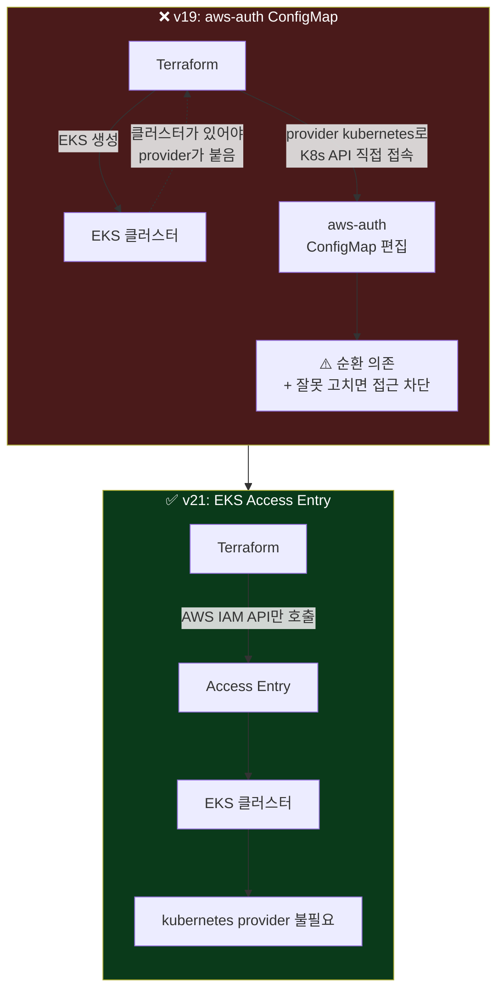
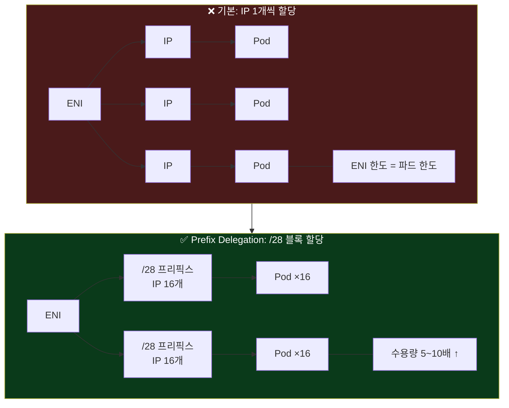
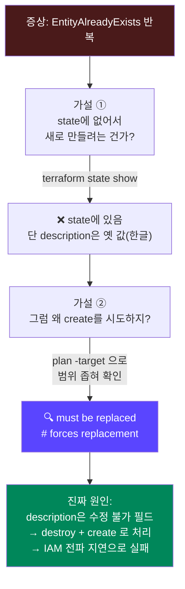
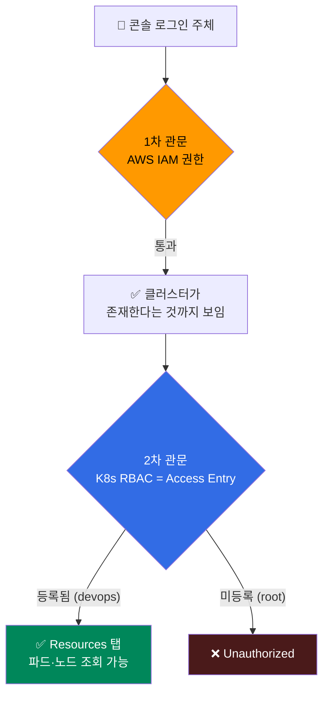

## 📚 들어가며

[1편](/posts/EKS-Rebuild-01-Terraform-S3-Backend/)에서 S3 원격 백엔드를 만들었으니, 이제 그 위에 실제 EKS 클러스터를 올릴 차례다. `ref/tf-eks`(강의 원본)를 `practice/tf-eks`로 복사한 뒤 **현재 시점 최신 버전으로 다시 짰고**, `terraform apply`를 돌리다 에러를 네 번 만났다.

이번 편은 그 두 가지 — **v19 → v21 업그레이드에서 뭐가 바뀌었나**, 그리고 **실제로 손으로 돌려야만 만나는 에러들** — 이 내용이다. 특히 뒤쪽 트러블슈팅이 이 글의 알맹이다.

### 강의 원본은 어떤 조합이었나

`ref/tf-eks`는 강의 녹화 시점(2023~2024년 초 추정) 기준이다.

- `terraform-aws-modules/eks/aws` **v19.21.0**
- `terraform-aws-modules/vpc/aws` **~> 4.0**
- Kubernetes **1.28**
- AWS provider **버전 미지정**
- Amazon Linux 2(AL2) 노드
- `aws-auth` ConfigMap 기반 인증

이걸 그대로 복사하면 학습 목적에 안 맞는다. Terraform Registry와 GitHub Releases API로 **직접 조회한 최신 버전** 위에서 다시 짰다.

| 구성요소 | ref (강의) | 조회한 최신 (2026-08 기준) | practice 적용값 |
|---|---|---|---|
| EKS 모듈 | 19.21.0 | **21.25.0** | `~> 21.0` |
| VPC 모듈 | ~> 4.0 | **6.7.1** | `~> 6.0` |
| AWS provider | 미지정 | **6.62.0** | `~> 6.62` |
| Kubernetes | 1.28 (EOL) | 표준 지원 1.34 / 1.35 / 1.36 | `1.34` |
| Terraform | >= 1.4 | 1.16.0 (로컬은 1.15.8) | `>= 1.10` |

**메이저 버전이 19 → 21로 두 단계나 뛰었다.** 그만큼 변경점이 많았다.

> **이번 편 학습 지도**
>
> ```
> v19 → v21 변경점          개념 정리              트러블슈팅 (핵심)
> ────────────────         ──────────             ─────────────────
> 변수명 정리               init/validate 관계      ① DNS 조회 실패
> aws-auth → Access Entry   local.xxx 출처         ② IAM description 한글
> AL2 → AL2023              Prefix Delegation      ③ already exists 반복
> 부속 리소스 3종 삭제       state ↔ AWS 비교        ④ 콘솔 Unauthorized
> ```

---

## 1. EKS 모듈 v19 → v21, 뭐가 바뀌었나

### 1-1. 변수 이름이 대거 바뀜 (`cluster_` 접두사 제거)

v20~v21을 거치며 이름이 정리됐다. 복붙하면 바로 `Unsupported argument`가 난다.

| ref (v19) | practice (v21) |
|---|---|
| `cluster_name` | `name` |
| `cluster_version` | `kubernetes_version` |
| `cluster_endpoint_public_access` | `endpoint_public_access` |
| `cluster_addons` | `addons` |

```hcl
# Before (ref, v19)
module "eks" {
  source  = "terraform-aws-modules/eks/aws"
  version = "19.21.0"

  cluster_name                   = local.name
  cluster_version                = local.cluster_version
  cluster_endpoint_public_access = true

  cluster_addons = {
    coredns = { most_recent = true }
    ...
  }
}
```

```hcl
# After (practice, v21)
module "eks" {
  source  = "terraform-aws-modules/eks/aws"
  version = "~> 21.0"   # 21.x 안에서만 올라가고 22.0으로는 안 넘어감

  name                   = local.name
  kubernetes_version     = local.kubernetes_version
  endpoint_public_access = true

  addons = {
    coredns                = {}
    kube-proxy             = {}
    vpc-cni                = { before_compute = true, configuration_values = ... }
    eks-pod-identity-agent = { before_compute = true }  # v19엔 없던 애드온
  }
}
```

### 1-2. 인증 방식: `aws-auth` ConfigMap → **EKS Access Entry**

이번 업그레이드에서 개념적으로 가장 중요한 변화다.

**v19 방식**은 클러스터에 kubectl 접근 권한을 주려면 쿠버네티스 안의 `aws-auth`라는 특수 ConfigMap을 직접 편집해서 "이 IAM 역할 = 이 쿠버네티스 그룹"을 매핑해야 했다. 문제가 둘 있었다.

- ConfigMap을 잘못 고치면 **클러스터 접근이 통째로 막힌다.** 자기 자신도 못 들어간다
- Terraform이 이 작업을 하려면 `provider "kubernetes"`가 필요한데, **클러스터가 있어야 provider가 붙고, 그 클러스터를 만드는 것도 Terraform**이라는 순환 의존이 생긴다



**v21에서는 `aws-auth` 서브모듈이 아예 삭제**됐고, AWS IAM API로 관리하는 **EKS Access Entry**가 표준이 됐다.

```hcl
# [삭제] ref에 있던 provider "kubernetes" 블록 전체 제거
#        v21은 쿠버네티스 API에 직접 붙을 일이 없다.

authentication_mode = "API"
# "API" = aws-auth ConfigMap을 완전히 버리고 Access Entry만 쓰겠다는 의미

enable_cluster_creator_admin_permissions = true
# 클러스터를 만든 IAM 주체(= 지금 terraform apply를 실행하는 나)에게
# 자동으로 클러스터 관리자 권한을 부여한다.
# 이게 false면 클러스터를 만들고도 kubectl이 "Unauthorized"로 막힌다.
```

> 이 설정이 나중에 **에러 ④(콘솔 Unauthorized)** 로 그대로 돌아온다. 기억해두자.

### 1-3. `eks_managed_node_group_defaults` 변수 자체가 삭제됨

ref는 여러 노드 그룹에 공통 기본값을 주려고 이 변수를 썼다.

```hcl
# ref (v19) — v21에는 더 이상 존재하지 않는 변수
eks_managed_node_group_defaults = {
  ami_type                   = "AL2_x86_64"
  iam_role_attach_cni_policy = true
}
```

v21의 `variables.tf`를 직접 grep해서 확인해보니 이 변수는 **완전히 삭제**됐다. 공통값이 필요하면 이제 `locals` + `merge()`로 직접 처리해야 한다. 내 경우엔 노드 그룹이 하나뿐이라 그냥 노드 그룹 블록 안에 직접 썼다.

### 1-4. Amazon Linux 2 → Amazon Linux 2023

```hcl
# Before (ref) — AL2 AMI를 직접 조회
eks_managed_node_group_defaults = {
  ami_type = "AL2_x86_64"
}
ami_id = data.aws_ami.eks_default.image_id

data "aws_ami" "eks_default" {
  most_recent = true
  owners      = ["amazon"]
  filter {
    name   = "name"
    values = ["amazon-eks-node-${local.cluster_version}-v*"]
  }
}
```

```hcl
# After (practice)
ami_type = "AL2023_x86_64_STANDARD"
# ami_id 지정 안 함 → EKS가 알아서 최신 패치 AMI 선택
```

AWS 공식 문서로 확인한 사실: **AWS는 EKS 1.34부터 AL2 최적화 AMI 자체를 배포하지 않는다.** 즉 ref 코드를 최신 k8s 버전과 조합하면 `data.aws_ami.eks_default`가 **아무 결과도 못 찾아서 실패**한다. AL2023은 1.30부터 관리형 노드 그룹의 기본 AMI 타입이다.

AMI ID를 직접 박지 않는 것도 의도적이다. 박아두면 EKS가 관리하는 최신 패치 AMI를 못 받는다.

### 1-5. 부속 리소스 3종 삭제 — "확인해보니 안 써도 됨"

ref에는 있었지만 뺀 것들이다. 전부 **실제로는 아무 데도 안 쓰이던** 리소스였다.

| 리소스 | 삭제 이유 |
|---|---|
| `module "vpc_cni_irsa"` | v21 모듈이 `iam_role_attach_cni_policy` 기본값을 `true`로 둬서, 노드 IAM 역할에 `AmazonEKS_CNI_Policy`가 자동으로 붙는다. 별도 IRSA 역할이 불필요 (모듈 소스로 직접 확인) |
| `module "ebs_kms_key"` | ref에서도 **주석 처리된** `block_device_mappings` 안에서만 참조되던, 사실상 안 쓰이는 리소스. KMS 키는 존재만으로 월 $1이 청구된다 |
| `module "key_pair"` | `remote_access`에 연결되지 않아 어디에도 안 쓰이는 SSH 키페어. 대신 노드 IAM 역할에 `AmazonSSMManagedInstanceCore`를 추가해 **SSM Session Manager**로 접속하게 했다 (22번 포트 개방 불필요) |

### 1-6. VPC 모듈 4.x → 6.x

EKS 모듈 v21이 AWS provider 6.x를 요구하는데 **VPC 모듈 4.x는 provider 6.x와 호환되지 않아서** 같이 올려야 했다. 주요 변경은 둘.

- `create_egress_only_igw = true` **제거** — 이건 **IPv6 전용** 아웃바운드 게이트웨이라, IPv4만 쓰는 이 클러스터엔 애초에 안 쓰이는 리소스였다
- `enable_dns_hostnames = true` **추가** — ref엔 없었는데, 일부 쿠버네티스 컴포넌트가 노드 호스트네임 기준으로 동작해서 켜두는 게 안전하다

---

## 2. 1편에서 예고한 `use_lockfile`, 실제로 적용하기

1편에서 "DynamoDB를 유지할 수도, `use_lockfile`로 갈 수도 있다"고 옵션만 소개했는데, 실제로는 **두 방식을 병행**하는 걸로 정리했다.

```hcl
terraform {
  required_version = ">= 1.10"  # use_lockfile을 쓰려면 최소 요구 버전

  required_providers {
    aws = {
      source  = "hashicorp/aws"
      version = "~> 6.62"
    }
  }

  backend "s3" {
    bucket = "mydev-tfstate"
    key    = "eks/dev.tfstate"
    region = "ap-northeast-2"

    use_lockfile   = true                  # [신규] S3 네이티브 락
    dynamodb_table = "TerraformStateLock"  # [유지] deprecated지만 여전히 동작
  }
}
```

HashiCorp 공식 문서 기준으로 `dynamodb_table`은 **"deprecated, 향후 마이너 버전에서 제거 예정"** 상태이고, 마이그레이션 기간 동안 **두 인자를 동시에 설정하는 것이 공식 안내 경로**다. 나중에 `dynamodb_table` 줄만 지우면 S3 단독 락으로 자연스럽게 넘어간다.

`required_providers`를 추가한 것도 이번에 바뀐 점이다. ref엔 아예 없었는데, 버전을 명시하지 않으면 최신 메이저를 무작정 받아버려서 나중에 provider 7.x가 나오면 코드가 깨진다. `~> 6.62`로 6.x 안에서만 올라가게 상한을 걸었다.

---

## 3. 알아두면 좋은 Terraform 개념 몇 가지

### 3-1. `validate`는 `init`이 선행되어야 한다

`terraform validate`는 provider의 **스키마**(어떤 인자를 받는지, 타입이 뭔지)를 알아야 검사할 수 있다. 그래서 provider/module이 로컬에 설치돼 있어야(= init 완료) 동작한다. init이 채 끝나기 전에 validate를 돌렸더니 이런 에러가 났다.

```
Error: Missing required provider
This configuration requires provider registry.terraform.io/hashicorp/null,
but that provider isn't available.
```

반대로 `validate`는 AWS 자격증명이나 네트워크 호출이 전혀 필요 없는 **순수 로컬 검사**다.

| 명령어 | init 필요? | AWS API 호출? |
|---|:---:|:---:|
| `validate` | ✅ | ❌ |
| `plan` | ✅ | ✅ |
| `apply` | ✅ | ✅ |

### 3-2. 코드가 바뀌면 항상 다시 init 해야 하나?

**아니다.** 뭘 바꿨느냐에 따라 다르다.

| 상황 | 다시 init? |
|---|---|
| 리소스/모듈 안의 **값**만 변경 (인스턴스 타입, 디스크 크기, 태그 등) | ❌ 불필요 |
| `module`의 `source`/`version` 변경 | ✅ `terraform init -upgrade` |
| 새 `module` 블록 추가 | ✅ `terraform init` |
| `required_providers` 버전 제약 변경 | ✅ `terraform init -upgrade` |
| `backend` 블록 설정 변경 | ✅ `-reconfigure` (state 이전 X) 또는 `-migrate-state` (이전 O) |

헷갈리면 그냥 다시 `init` 해도 무해하다. **idempotent**(반복 실행 안전)해서, 이미 다 되어 있으면 몇 초 만에 "Terraform has been successfully initialized!"로 끝난다.

### 3-3. `local.xxx`는 어디서 오는가

VS Code Terraform 확장이 `local.kubernetes_version`에 빨간 줄로 `No declaration found`를 띄운 적이 있다. 그런데 실제로는 `providers.tf`에 정상적으로 선언돼 있었고 `terraform validate`도 Success였다. 원인은 **언어 서버가 파일 변경을 아직 못 읽은 캐시 문제**였고, 창 리로드로 해결됐다.

> **정답은 항상 CLI의 `terraform validate`다.** 에디터의 빨간 줄은 참고 자료일 뿐이다.

개념적으로 `local.name`, `local.kubernetes_version`은 AWS나 모듈이 주는 값이 아니라 **내가 `locals {}` 블록에 직접 정의한 값**이다. 1편에서 다룬 "Terraform은 디렉터리 안의 모든 `.tf`를 하나로 합쳐서 읽는다"는 원칙 덕분에, `providers.tf`에 정의한 `locals`를 `main.tf`에서 바로 참조할 수 있다.

---

## 4. VPC CNI 딥다이브: Prefix Delegation이 실제로 하는 일

`vpc-cni` 애드온에 아래 설정을 넣었는데, 그냥 복붙하지 않고 원리를 짚어봤다.

```hcl
vpc-cni = {
  before_compute = true   # 노드 생성 "전에" 설치 (CNI 없으면 노드가 조인 실패)

  configuration_values = jsonencode({
    env = {
      ENABLE_PREFIX_DELEGATION = "true"
      WARM_PREFIX_TARGET       = "1"
    }
  })
}
```

`configuration_values`는 실제로는 `aws-node`라는 DaemonSet 파드에 **환경변수를 주입**하는 것과 같다. JSON 문자열을 요구해서 `jsonencode()`로 감쌌다.

**Prefix Delegation이 뭘 바꾸나?** 기본 동작은 ENI(네트워크 카드) 하나에 보조 IP를 **1개씩** 붙여서 IP 하나당 파드 하나를 매칭한다. 인스턴스 타입마다 "ENI 개수 × ENI당 IP 개수"가 정해져 있어서, **이게 곧 그 노드의 최대 파드 수**를 결정해버린다.



- **`ENABLE_PREFIX_DELEGATION=true`**: IP를 1개씩이 아니라 **`/28` 블록(연속 IP 16개)을 통째로** 할당한다. 같은 인스턴스 타입인데도 파드 수용량이 **5~10배** 늘어난다
- **`WARM_PREFIX_TARGET=1`**: 파드가 스케줄될 때마다 EC2 API를 호출해 IP를 받아오면 응답 대기 때문에 파드 시작이 느려진다. "여분 프리픽스 1개(= IP 16개)를 미리 당겨서 대기시켜둬라"는 뜻이라, 갑자기 파드가 늘어도 예비분에서 바로 꺼내 쓴다
- **트레이드오프**: 프리픽스 하나가 IP 16개를 통째로 예약하기 때문에, **VPC 서브넷 IP가 넉넉지 않으면 오히려 더 빨리 소진**될 수 있다. 이번 구성에서 private 서브넷을 `/20`(약 4096개)으로 넉넉히 잡은 것도 이와 무관하지 않다

---

## 5. 실전 트러블슈팅 — `terraform apply` 4연발 에러

여기부터가 이번 편의 진짜 알맹이다. **강의 자료엔 안 나오는, 실제로 손으로 돌려야만 만나는 문제들.**

### 5-1. 에러 ① — DNS 조회 실패

```
Error: fetching Availability Zones: ... dial tcp: lookup
ec2.ap-northeast-2.amazonaws.com: no such host
```

**진단**: `nslookup`, `dig`로 확인해보니 DNS는 멀쩡히 응답했고 `aws ec2 describe-availability-zones`도 정상 동작했다. 즉 **코드 문제가 아니라 apply 시점의 일시적 네트워크/DNS 장애**였다. 그냥 재시도로 해결됐다.

**교훈**: Terraform 에러가 나왔다고 무조건 "코드가 틀렸다"고 단정하면 안 된다. 이 경우 에러 메시지 자체가 `dial tcp: lookup ... no such host`로 **이건 네트워크 계층 문제라고 이미 말해주고 있었다.** 에러 메시지가 가리키는 계층부터 확인하는 게 순서다.

### 5-2. 에러 ② — IAM Role description에 한글을 못 씀

```
Error: creating IAM Role (mydev-managed-node-group): ... ValidationError:
1 validation error detected: Value at 'description' failed to satisfy
constraint: Member must satisfy regular expression pattern: [ -~¡-ÿ]*
```

**원인**: AWS IAM의 `CreateRole` API는 `description` 필드에 **기본 아스키 + 서유럽 문자만** 허용한다. 정규식 `[ -~¡-ÿ]`에 한글(`U+AC00`~`U+D7A3`)이 포함되지 않는다. 코드에 이렇게 써둔 게 문제였다.

```hcl
iam_role_description = "EKS 관리형 노드 그룹용 IAM 역할"  # ← 한글 → 거부됨
```

**중요한 구분**: 이건 HCL 코드 안의 `#` 주석과는 **완전히 다른 문제**다. 주석은 로컬에만 남는 텍스트라 한글을 마음껏 써도 되지만, `description` / `iam_role_description`처럼 **실제로 AWS API에 값으로 전송되는 속성**은 이 제약을 받는다.

```hcl
iam_role_description = "IAM role for EKS managed node group"  # 영어로 수정
```

여기까진 간단했다. 문제는 다음이었다.

### 5-3. 에러 ③ — "already exists"인데 재시도해도 계속 같은 에러

**제일 배울 게 많았던 케이스**다. 에러 ②를 고치면서 "혹시 몰라서" IAM **Policy**의 description도 같이 영어로 바꿨다.

```hcl
resource "aws_iam_policy" "node_additional" {
  description = "Example additional policy attached to node group"  # 한글 → 영어
}
```

그런데 재적용하니 이 에러가 반복됐다.

```
Error: creating IAM Policy (mydev-additional): ... EntityAlreadyExists:
A policy called mydev-additional already exists. Duplicate names are not allowed.
```

#### 먼저 든 의문: 실패하면 롤백되는 거 아니야?

> **Q. apply가 실패하면 지금까지 만든 것도 다 원상복구되나?**
>
> **A. 아니다.** Terraform은 **DB 트랜잭션이 아니다.** 의존성 그래프를 따라 리소스를 하나씩 만들면서 **성공한 것마다 즉시 state에 기록**한다. 중간에 하나가 실패해도 그 전까지 성공한 건 AWS에도, state에도 그대로 남는다. 그래서 재실행하면 "이미 된 건 건너뛰고 안 된 것만" 자동으로 이어서 진행된다 — 이게 **중간부터 재시작이 저절로 되는 이유**다.

확인해보려고 `terraform state list`를 찍어봤더니, 실제로 VPC, EKS 클러스터, 보안그룹, OIDC 공급자, 애드온까지 이미 state에 정상적으로 쌓여 있었다. 여러 번의 실패에도 불구하고 계속 누적되고 있었던 것.

**그런데 이 에러 자체는 그 원칙과 안 맞아 보였다.** `node_additional` 정책이 state에도 AWS에도 이미 있는데, 왜 자꾸 "새로 만들려다 실패"하지?

#### 디버깅 과정



```bash
# 1) state에 있는지 확인
terraform state show aws_iam_policy.node_additional
# → 있음. 근데 description이 아직 한글 그대로 (변경 전 값)

# 2) 이 리소스만 좁혀서 plan (전체 plan은 리소스가 많아 노이즈가 커서)
terraform plan -target=aws_iam_policy.node_additional -refresh=true
```

plan 결과에 답이 있었다.

```
# aws_iam_policy.node_additional must be replaced
-/+ resource "aws_iam_policy" "node_additional" {
      ~ description = "노드 그룹에 추가 정책을 붙이는 예시" -> "Example ..." # forces replacement
    }
Plan: 1 to add, 0 to change, 1 to destroy.
```

#### 진짜 원인

`aws_iam_policy`의 `description`은 **AWS IAM API 자체가 생성 후 수정을 지원하지 않는다** (`UpdatePolicy` API에 description을 바꾸는 기능이 없다). 그래서 이 필드를 조금이라도 바꾸면 Terraform은 "업데이트"가 아니라 **destroy → create(교체)** 로 처리해야 한다.

그런데 **IAM은 삭제 직후 같은 이름으로 즉시 재생성하면 전파 지연(eventual consistency) 때문에 잠깐 "이미 존재함" 에러가 나는 경우**가 있다. 그래서 재시도해도 같은 에러가 반복됐던 것이다.

#### 그리고 핵심 반전 — 자책골이었다

`aws_iam_role`의 description은 한글이 아예 거부되지만(에러 ②), **`aws_iam_policy`의 description은 애초부터 한글이 허용됐다.** state에 한글이 그대로 저장돼 있던 게 그 증거다. **"같은 문제겠지"라고 넘겨짚고 안 바꿔도 될 걸 미리 바꿔버린 게 오히려 새 문제를 만든 셈**이다.

**해결**: description을 원래 한글 값으로 되돌려서 diff 자체를 없앴다.

```hcl
description = "노드 그룹에 추가 정책을 붙이는 예시"  # 원상복구 → replace 필요 없어짐
```

```bash
terraform plan -target=aws_iam_policy.node_additional
# → No changes. Your infrastructure matches the configuration.
```

> **여기서 얻은 두 가지 교훈**
>
> 1. AWS 리소스마다 어떤 속성이 **"생성 후 수정 불가(ForceNew)"** 인지가 다르다. 이건 문서보다 **실제 plan 결과의 `# forces replacement` 표시**로 확인하는 게 제일 정확하다.
> 2. **한 필드에서 겪은 제약이 다른 리소스에도 똑같이 적용될 거라고 짐작하지 말 것.** AWS API는 서비스/리소스마다 검증 규칙이 다르다.

### 5-4. 곁가지: state ↔ 실제 AWS 비교하는 법

에러 ③을 디버깅하면서 정리하게 된 내용이다.

| 방법 | AWS 호출? | 용도 |
|---|:---:|---|
| `terraform state show <리소스>` | ❌ | state에 뭐가 **기록**돼 있는지만 봄 (로컬 조회) |
| `terraform plan` | ✅ | state를 refresh(= AWS 실제 상태로 갱신)한 뒤 코드와 비교 |
| `terraform plan -target=<리소스>` | ✅ | 특정 리소스만 좁혀서 확인 (디버깅·복구용, 일상적으로 쓰는 옵션은 아님) |
| `terraform plan -refresh-only` | ✅ | 변경 계획 없이 **drift**(수동 변경 여부)만 확인 |

**state는 어디 저장되나?** 이 프로젝트는 `backend "s3"`로 설정했으니 S3 버킷의 `key` 경로에 JSON 파일로 저장된다(`backend` 블록이 없으면 기본값은 로컬 `terraform.tfstate`). apply 중 리소스가 하나씩 성공할 때마다 이 파일이 **즉시** 갱신된다.

### 5-5. 에러 ④ — apply는 성공했는데 콘솔에서 "Unauthorized"

`terraform apply`가 최종 성공한 뒤, **root 계정**으로 AWS 콘솔에 로그인해 EKS 클러스터의 Resources 탭(노드/워크로드 등)을 열었더니:

```
리소스 로드 중 오류 발생
Unauthorized
```

**원인**: 1-2에서 다룬 **Access Entry** 개념에 그대로 부딪힌 케이스다. EKS 콘솔의 Resources 탭은 내부적으로 **쿠버네티스 API**를 호출하는데, 이건 일반 AWS 리소스 조회와 달리 **쿠버네티스 자체 RBAC 권한**이 필요하다.



`enable_cluster_creator_admin_permissions = true` 덕분에 **클러스터를 만든 IAM 주체(`devops` 사용자)에게만** 자동으로 관리자 권한이 생겼다. `root`는 완전히 다른 IAM 주체라 Access Entry가 없다 → Unauthorized.

```bash
aws eks list-access-entries --cluster-name mydev
# {
#   "accessEntries": [
#     ".../role/aws-service-role/eks.amazonaws.com/AWSServiceRoleForAmazonEKS",
#     ".../role/mydev-managed-node-group",
#     ".../user/devops"          ← 이것만 있고 root는 없음
#   ]
# }
```

**해결 옵션은 둘이다.**

1. **(선택한 방법)** root 대신 `devops` IAM 사용자로 콘솔 로그인 — 클러스터 생성자라 이미 권한이 있다
2. Terraform으로 root에게도 명시적으로 Access Entry 부여

```hcl
access_entries = {
  root = {
    principal_arn = "arn:aws:iam::${data.aws_caller_identity.current.account_id}:root"
    policy_associations = {
      admin = {
        policy_arn   = "arn:aws:eks::aws:cluster-access-policy/AmazonEKSClusterAdminPolicy"
        access_scope = { type = "cluster" }
      }
    }
  }
}
```

> **1편에서 다룬 개념의 실전 확인**: 일반 AWS 리소스(EC2, S3 등)는 "같은 계정 + 조회 권한만 있으면" 누가 만들었든 다 보인다. 근데 **EKS는 예외**다. 콘솔에 클러스터 존재 자체는 계정 단위로 보이지만, 클러스터 **내부**(파드, 노드 등)를 보려면 쿠버네티스 RBAC이 별도로 필요하고, 이건 계정이 아니라 **Access Entry에 등록된 IAM 주체 단위**로 결정된다.

---

## 6. 다음 학습 전까지 리소스 정리 (비용 절약)

전체 확인이 끝난 뒤, 다음 세션까지 비용을 아끼려고 리소스를 내렸다.

```bash
cd practice/tf-eks
terraform plan -destroy   # 뭐가 지워질지 미리보기 (선택)
terraform destroy         # 실제 삭제, "yes" 입력 필요
```

**주의사항**

- **`backend-s3/`는 절대 건드리지 않는다.** 거기서 destroy하면 S3 버킷 + DynamoDB까지 지워지는데, 이건 다음에 또 써야 하는 **state 저장 창고**다. `tf-eks/`에서만 destroy하면 버킷과 테이블은 그대로 살아있고 그 안의 state 파일만 빈 상태로 남는다 — 이게 정상이다
- EKS 클러스터 삭제만 10분 안팎, NAT 게이트웨이와 노드 종료까지 전체 15~20분 예상
- KMS 키는 즉시 삭제되지 않고 **삭제 대기(기본 30일)** 상태로 예약된다. 이 기간 월 $1 수준이 계속 청구되지만 무시할 만한 금액
- **미래에 주의할 함정**: 지금은 클러스터에 순수 인프라만 있어서 깔끔하게 지워졌다. 하지만 나중에 AWS Load Balancer Controller로 실제 ALB/NLB를 띄운 뒤라면, **Terraform이 모르는 리소스**(kubectl로 만든 로드밸런서의 ENI)가 VPC에 남아 서브넷 삭제가 막히는 경우가 흔하다. 그럴 땐 `kubectl delete`로 해당 Service/Ingress부터 지운 다음 `terraform destroy`를 해야 한다

---

## 📝 이번 편 요약

```
v19 → v21 업그레이드
├─ 변수명 정리 (cluster_ 접두사 제거)
├─ aws-auth ConfigMap → EKS Access Entry (kubernetes provider 불필요)
├─ eks_managed_node_group_defaults 변수 삭제
├─ AL2 → AL2023 (1.34부터 AL2 AMI 미배포)
├─ 부속 리소스 3종 삭제 (IRSA·KMS·키페어 — 전부 미사용)
└─ VPC 모듈 4.x → 6.x (provider 6.x 호환 위해 동반 상향)

트러블슈팅 4연발
├─ ① DNS 조회 실패 → 코드 아닌 네트워크 계층. 재시도로 해결
├─ ② IAM Role description 한글 → AWS API 검증 규칙 위반. 영어로
├─ ③ EntityAlreadyExists 반복 → description은 ForceNew 필드
│     └─ 안 바꿔도 될 걸 넘겨짚고 바꾼 자책골
└─ ④ 콘솔 Unauthorized → root엔 Access Entry가 없음
```

| 개념 | 한 줄 정의 |
|---|---|
| **EKS Access Entry** | AWS IAM API로 관리하는 클러스터 접근 제어. `aws-auth` ConfigMap의 후계 |
| **`authentication_mode = "API"`** | ConfigMap을 완전히 버리고 Access Entry만 쓰겠다는 선언 |
| **Prefix Delegation** | ENI에 IP를 1개씩이 아니라 `/28` 블록으로 할당해 파드 수용량을 늘리는 CNI 설정 |
| **ForceNew 속성** | 생성 후 수정이 불가해, 값을 바꾸면 destroy+create로 교체되는 필드 |
| **`# forces replacement`** | plan 결과에서 그 속성이 ForceNew임을 알려주는 표시 |
| **`-refresh-only`** | 변경 계획 없이 drift(수동 변경)만 확인하는 plan 모드 |
| **SSM Session Manager** | SSH 키·22번 포트 없이 IAM 권한만으로 인스턴스에 접속하는 방식 |

---

## 💭 느낀 점

**1. 재구축을 택하지 않았으면 `apply`조차 못 했을 것이다.**

이번에 제일 크게 느낀 부분이다. ref 코드를 그대로 쓰면서 k8s 버전만 최신으로 올렸다면 `data.aws_ami.eks_default`가 AL2 AMI를 못 찾아 실패했을 거다. "버전 하나만 바꾸면 되겠지"가 통하지 않는 지점이 실제로 존재한다는 걸 코드로 확인했다.

**2. 넘겨짚기가 만든 자책골.**

에러 ③이 두고두고 기억에 남을 것 같다. 에러 ②를 고치면서 "IAM Policy도 같은 문제겠지" 하고 **안 바꿔도 될 걸 미리 바꿨다.** 그게 ForceNew 필드라 교체가 트리거되고, IAM 전파 지연까지 겹쳐서 한참을 헤맸다. 결국 원래 값으로 되돌리는 게 해결책이었다는 게 좀 허탈했지만, **"비슷해 보이는 문제"를 같은 문제로 묶는 습관**을 확실히 경계하게 됐다.

**3. 롤백이 없다는 게 오히려 안심이었다.**

처음엔 "apply 실패했는데 절반만 만들어졌으면 어떡하지?" 싶었는데, `terraform state list`를 찍어보고 생각이 바뀌었다. 성공한 건 그대로 남아 있고 재실행하면 이어서 진행된다. **트랜잭션이 아니라는 게 단점이 아니라, 중간부터 재시작이 저절로 되는 구조**였다.

**4. plan은 검사 도구가 아니라 디버깅 도구다.**

지금까진 plan을 "apply 전에 형식적으로 한 번 보는 것" 정도로 여겼다. 그런데 `-target`으로 범위를 좁혀 plan을 돌린 순간 `# forces replacement` 한 줄이 원인을 통째로 알려줬다. **문서를 뒤지는 것보다 plan의 실제 diff가 빠르고 정확했다.**

---

## 🔗 다음 편 예고

EKS 클러스터 기반이 준비됐으니, 이제 그 위에 실제로 뭔가를 올린다.

- **AWS Load Balancer Controller** — IRSA와 Pod Identity 중 뭘 쓸지 (이번에 만들어둔 `eks-pod-identity-agent` 애드온과 `irsa-role.tf`의 두 방식이 갈리는 지점)
- **Karpenter** — 이번에 미리 만들어둔 `karpenter` 관리형 노드 그룹 위에, Karpenter v1 API(`karpenter.sh/v1`)로 오토스케일링 설치
- 여기서부터는 Terraform보다 **Helm + kubectl** 작업이 늘어날 예정

---

## 📚 참고

- [terraform-aws-modules/terraform-aws-eks](https://github.com/terraform-aws-modules/terraform-aws-eks) — v21 변경점은 릴리스 노트와 `variables.tf`를 직접 확인하는 게 가장 정확하다
- [Amazon EKS 사용 설명서 — AMI 및 Access Entry](https://docs.aws.amazon.com/eks/latest/userguide/)
- [VPC CNI로 노드당 IP 수 늘리기 (Prefix Delegation)](https://docs.aws.amazon.com/eks/latest/userguide/cni-increase-ip-addresses.html)

> 이 글의 계정 ID·클러스터명·버킷명은 예시 값으로 치환했다. 버전 수치는 2026년 8월 기준으로 조회한 값이며, 특히 Kubernetes 지원 버전은 몇 달 단위로 바뀌므로 따라 할 때는 직접 확인하는 걸 권한다.
