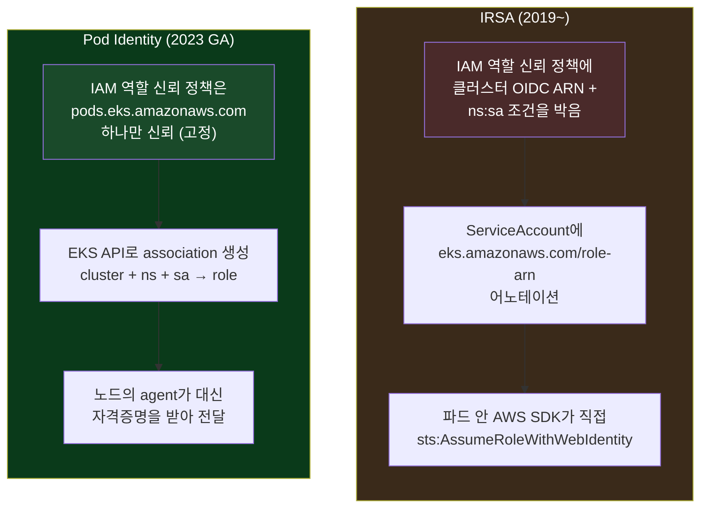
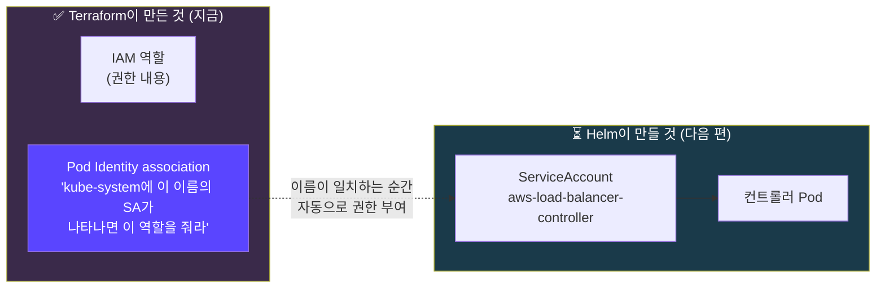
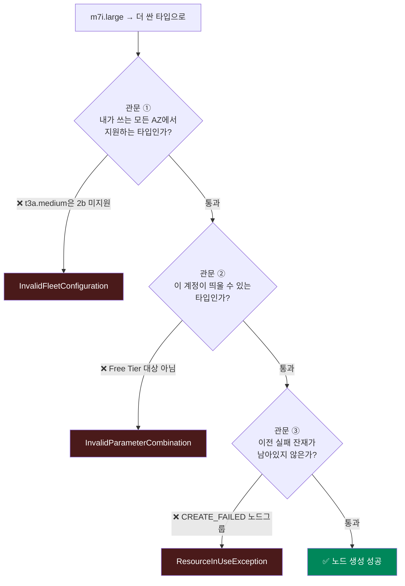

## 📚 들어가며

[2편](/posts/EKS-Rebuild-02-EKS-Module-v21-Upgrade-Troubleshooting/)에서 EKS 클러스터를 띄우는 데 성공했다. 이번 편은 그 직후부터다.

`kubectl get po -A`를 처음 쳐서 **기본으로 떠 있는 파드들의 정체를 파악하고** → 그 위에 올릴 컨트롤러들에게 **AWS 권한을 어떻게 줄지**(IRSA vs Pod Identity) 정하고 → 비용을 줄이려고 **인스턴스 타입을 바꾸다 3번 연속 실패한** 기록이다.

특히 마지막 인스턴스 타입 삽질이 이번 편의 알맹이다. "싼 걸로 바꾸면 되겠지"라고 시작했는데 **서로 완전히 다른 3가지 AWS 제약에 순서대로** 걸렸다.

> **이번 편 학습 지도**
>
> ```
> 클러스터 위 파드들        권한 부여 방식           비용 최적화 삽질
> ────────────────         ────────────           ────────────────
> aws-node / kube-proxy     왜 권한이 필요한가       ① AZ별 지원 타입
> pod-identity-agent        IRSA (2019~)           ② 계정 가드레일
> coredns                   Pod Identity (2023~)   ③ 실패 잔재 정리
> (DaemonSet vs Deployment) 전환 + use_name_prefix
> ```

---

## 1. 클러스터를 띄우면 기본으로 뜨는 파드들

`terraform apply`가 끝나고 처음 친 명령의 결과다.

```
NAMESPACE     NAME                           READY   STATUS    RESTARTS   AGE
kube-system   aws-node-9q9k4                 2/2     Running   0          5h59m
kube-system   aws-node-wnx27                 2/2     Running   0          135m
kube-system   coredns-546d5c6f5d-9lx89       1/1     Running   0          5h58m
kube-system   coredns-546d5c6f5d-fz4hc       1/1     Running   0          5h12m
kube-system   eks-pod-identity-agent-9rwbn   1/1     Running   0          135m
kube-system   eks-pod-identity-agent-bn8rf   1/1     Running   0          5h59m
kube-system   kube-proxy-vchjv               1/1     Running   0          135m
kube-system   kube-proxy-x24kl               1/1     Running   0          5h58m
```

전부 2개씩 있어서 "다 DaemonSet인가?" 싶은데 **하나는 아니다.**

| 파드 | 타입 | 역할 |
|---|---|---|
| **`aws-node`** | DaemonSet | **VPC CNI 플러그인.** 파드가 뜰 때마다 실제 VPC IP를 할당한다. 2편에서 `ENABLE_PREFIX_DELEGATION`을 넣었던 그 애드온. `2/2`인 건 컨테이너가 2개라서 — `aws-node`(IP 할당 본체) + `aws-eks-nodeagent`(NetworkPolicy 강제 적용) |
| **`kube-proxy`** | DaemonSet | 각 노드에서 Service 트래픽 라우팅 규칙(iptables/ipvs)을 관리 |
| **`eks-pod-identity-agent`** | DaemonSet | 2편에서 ref에는 없던 걸 추가한 애드온. 파드에 AWS 자격증명을 전달하는 최신 방식의 핵심 (2·3장에서 자세히) |
| **`coredns`** | **Deployment** | 클러스터 내부 DNS. **노드마다 하나씩이 아니라, 고가용성을 위해 replica 2개**로 뜬 것 (노드 수와 무관) |

**DaemonSet vs Deployment**: DaemonSet은 "노드 하나당 파드 하나"가 강제되는 방식이라 노드 2대면 정확히 2개다. Deployment는 "replica 몇 개"를 지정하는 일반적인 방식이다. 지금은 **우연히 둘 다 2개라** 구분이 안 갔던 것뿐이다.

> **곁다리 관찰**: `AGE` 컬럼을 보면 각 DaemonSet마다 하나는 `5h59m`, 다른 하나는 `135m`이다. **노드 2대 중 1대가 약 2시간 전에 교체됐다**는 뜻이다. 노드를 `capacity_type = "SPOT"`으로 띄웠으니, AWS가 스팟 인스턴스를 회수해가면서 노드가 교체되고 그 위의 DaemonSet 파드도 새로 뜬 것으로 보인다. **스팟을 쓰면 이런 일이 일상적으로 일어난다**는 걸 `AGE` 한 컬럼이 보여준다.

---

## 2. 그전에 — 파드가 AWS 자격증명으로 대체 뭘 하는데?

IRSA니 Pod Identity니 하기 전에, "자격증명"이 왜 필요한지부터 짚고 가야 이해가 된다. 결국 **파드 안에서 도는 프로그램이 AWS API를 호출할 때 쓰는 열쇠**다.

이 프로젝트에서 실제로 마주칠 예시들이다.

**① AWS Load Balancer Controller** — `Ingress` 리소스를 만드는 것 자체는 "이런 라우팅을 원해요"라는 **의도 표현**일 뿐이다. 실제로 AWS에 ALB를 만드는 건 클러스터 안에서 도는 컨트롤러 파드다.

```
Ingress 감지 → elasticloadbalancing:CreateLoadBalancer  (ALB 생성)
             → ec2:CreateSecurityGroup                  (보안그룹 생성)
             → ec2:DescribeSubnets                      (배치할 서브넷 조회)
```

자격증명이 없으면 아무리 Ingress를 만들어도 ALB는 **영원히 안 생긴다**(AccessDenied).

**② external-dns** — Ingress의 `external-dns.alpha.kubernetes.io/hostname` 어노테이션을 보고 `route53:ChangeResourceRecordSets`를 호출해 실제 DNS 레코드를 만든다.

**③ EBS CSI Driver** — PVC를 만들면 `ec2:CreateVolume` / `ec2:AttachVolume`을 호출해 실제 EBS 볼륨을 만들고 노드에 붙인다.

**④ Karpenter 컨트롤러** — "파드가 스케줄이 안 되네, 노드가 부족하구나" 판단하면 `ec2:RunInstances`로 실제 EC2를 띄운다.

**⑤ 애플리케이션 코드 자체** — 앱이 이미지를 S3에 올린다면 그 앱이 직접 `s3:PutObject`를 호출한다. (강의 레포의 Loki 설정도 실제로 이 방식이다 — 로그를 S3에 저장하도록 되어 있어 Loki 파드가 `s3:PutObject`를 직접 호출한다)

> **핵심**: 쿠버네티스 리소스를 만드는 것 자체는 AWS에 아무 영향이 없다. **그걸 보고 실제 AWS API를 호출하는 건 파드 안의 프로그램**이고, 그러려면 자격증명이 필요하다. IRSA와 Pod Identity는 **"그 자격증명을 어떻게 그 파드한테만 안전하게 주느냐"** 를 푸는 메커니즘이다.

---

## 3. IRSA vs EKS Pod Identity

### 3-1. 두 방식의 동작



**IRSA**는 클러스터마다 고유한 **OIDC 발급자 URL**을 축으로 돈다. IAM 역할의 신뢰 정책에 "이 클러스터의 OIDC를 신뢰하고, 그중 `kube-system:aws-load-balancer-controller` 서비스어카운트만 assume할 수 있다"는 조건을 박고, ServiceAccount에 어노테이션을 달아 연결한다. 파드가 뜨면 웹훅이 JWT를 마운트해주고 파드 안의 SDK가 직접 임시 자격증명을 받아온다.

**Pod Identity**는 그 OIDC 의존을 없앴다. `eks-pod-identity-agent` DaemonSet(1장에서 본 그 파드)이 설치돼 있고, IAM 역할은 **고정된 서비스 주체만 신뢰**한다. "어느 클러스터의 어느 SA가 이 역할을 쓰는가"는 **쿠버네티스 매니페스트가 아니라 EKS API 레벨의 association**으로 따로 관리된다. 어노테이션이 필요 없다.

### 3-2. 비교표

| | IRSA | Pod Identity |
|---|---|---|
| 신뢰 대상 | 클러스터별 **OIDC ARN** | 고정 서비스 주체 (`pods.eks.amazonaws.com`) |
| 클러스터 재생성 시 | 역할의 **신뢰 정책까지 다시 수정** | 역할은 그대로, **association만 재생성** |
| 연결 방법 | ServiceAccount 어노테이션 | EKS API 레벨 association |
| 필요 애드온 | 없음 | `eks-pod-identity-agent` |
| 멀티 클러스터 역할 재사용 | 어려움 | 쉬움 |
| 내부 호출 | 파드 안 SDK가 직접 `AssumeRoleWithWebIdentity` | 노드 에이전트가 대신 받아서 전달 |
| 생태계 지원 | 매우 넓음 (사실상 표준) | 넓어지는 중 |

**학습 환경에서 특히 체감되는 차이**가 있다. 이 프로젝트처럼 비용을 아끼려고 클러스터를 자주 destroy/재생성하면, **IRSA는 매번 OIDC ARN이 바뀌어서 역할 신뢰 정책을 손봐야 한다.** Pod Identity는 역할을 그대로 두고 association만 다시 맺으면 끝이다. 그래서 Pod Identity로 갔다.

---

## 4. `irsa-role.tf`를 Pod Identity로 전환하기

강의는 이 시점에 `irsa-role.tf`의 IRSA 블록 주석을 풀고 apply하라고 한다. 우리는 Pod Identity로 가기로 했으니 그대로 쓸 수 없다. 그럼 신뢰 정책을 손으로 직접 써야 할까?

### 4-1. 커뮤니티가 이미 공식 전환 경로를 제공하고 있었다

IRSA용 모듈(`terraform-aws-modules/iam/aws//modules/iam-role-for-service-accounts`)의 **README 맨 위**에 이렇게 적혀 있다.

> **[!TIP] Upgrade to use EKS Pod Identity instead of IRSA.**
> A similar module for EKS Pod Identity is available here.

즉 `terraform-aws-modules/eks-pod-identity/aws`라는 **전용 모듈**이 따로 있다. 열어보면 IRSA 모듈과 **동일한 `attach_*` 단축 변수**를 그대로 제공한다.

```
attach_aws_lb_controller_policy / attach_external_dns_policy / attach_aws_ebs_csi_policy ...
```

**IAM 정책 내용은 동일하고, 연결 방식만 바뀐다.** 손으로 신뢰 정책을 쓸 필요가 없었다.

### 4-2. 코드 상 변경점

```hcl
# Before — IRSA (강의 방식)
module "load_balancer_controller_irsa_role" {
  source = "terraform-aws-modules/iam/aws//modules/iam-role-for-service-accounts"

  name                                   = "load-balancer-controller-${local.name}"
  attach_load_balancer_controller_policy = true

  oidc_providers = {
    ex = {
      provider_arn               = module.eks.oidc_provider_arn
      namespace_service_accounts = ["kube-system:aws-load-balancer-controller"]
    }
  }
}
```

```hcl
# After — Pod Identity
module "load_balancer_controller_pod_identity" {
  source  = "terraform-aws-modules/eks-pod-identity/aws"
  version = "~> 2.9"

  name = "load-balancer-controller-${local.name}"

  attach_aws_lb_controller_policy = true

  associations = {
    main = {
      cluster_name    = module.eks.cluster_name
      namespace       = "kube-system"
      service_account = "aws-load-balancer-controller"
    }
  }

  tags = local.tags
}
```

매핑을 정리하면 이렇다.

| IRSA 모듈 | Pod Identity 모듈 |
|---|---|
| `oidc_providers.<key>.provider_arn` | (불필요 — OIDC 자체를 안 씀) |
| `namespace_service_accounts = ["ns:sa"]` | `associations.<key>.namespace` + `.service_account` |
| — | `associations.<key>.cluster_name` (어느 클러스터인지 명시) |

### 4-3. 만들어진 association 확인하는 3가지 방법

```bash
# 1) AWS CLI
aws eks list-pod-identity-associations --cluster-name mydev --region ap-northeast-2
aws eks describe-pod-identity-association --cluster-name mydev \
  --association-id <id> --region ap-northeast-2

# 2) Terraform state (우리가 만든 거니까)
terraform state show \
  'module.load_balancer_controller_pod_identity.aws_eks_pod_identity_association.this["main"]'
```

**3) AWS 콘솔**: EKS → Clusters → 클러스터 → `Access` 탭 → `Pod Identity associations` 섹션

1·3번은 "AWS 입장에서 진짜 존재하는지", 2번은 "Terraform이 뭘 기억하는지"를 보여준다. **2편에서 다룬 state vs 실제 AWS 개념이 여기서도 그대로 적용된다.**

### 4-4. 중요: association을 만들었다고 ServiceAccount가 생기는 건 아니다

apply 후 `kubectl get sa -n kube-system`에 `aws-load-balancer-controller`가 없어서 당황했는데, **이게 정상이다.**



Terraform이 만든 건 **IAM 역할**과 **association(미리 걸어둔 규칙)** 두 가지뿐이다. 실제 ServiceAccount와 컨트롤러 파드를 만드는 건 **Helm 설치**다. 아직 Helm으로 컨트롤러를 안 깔았으니 SA도 파드도 없는 게 당연하다.

나중에 Helm이 `serviceAccount.name: aws-load-balancer-controller`로 SA를 만드는 순간, 이름이 association과 일치해서 **자동으로** 권한을 받는다. IRSA였다면 여기에 **어노테이션까지 values에 넣어줘야** 했다 — Pod Identity가 더 간단해지는 지점이다.

---

## 5. 곁다리: Terraform의 이름들, 그리고 `use_name_prefix` 함정

이 시점에 헷갈리기 딱 좋은 기초 문법을 짚고 넘어갔다.

```hcl
module   "load_balancer_controller_pod_identity" { ... }   # 이름 1개
resource "aws_iam_policy" "node_additional"      { ... }   # 이름 2개
```

왜 `resource`만 이름이 두 개일까?

| | 첫 번째: `"aws_iam_policy"` | 두 번째: `"node_additional"` / `module`의 이름 |
|---|---|---|
| 정체 | **리소스 타입(Type)** | **로컬 이름(Local Name)** |
| 누가 정하나 | **provider가 미리 정해둠** (고정) | **내가 마음대로** |
| 지어낼 수 있나 | ❌ Registry 문서에 있는 타입만 | ✅ 자유 |
| 역할 | "AWS의 IAM Policy라는 종류를 만들겠다" | "코드 안에서 이걸 이렇게 부르겠다" |

로컬 이름은 참조할 때 쓰인다.

```hcl
aws_iam_policy.node_additional.arn
module.load_balancer_controller_pod_identity.iam_role_arn
```

### 그런데 이 로컬 이름은 AWS에 보이는 이름이 아니다

`node_additional`은 어디까지나 코드 안의 별명이고, AWS 콘솔에 뜨는 실제 이름은 블록 안의 `name` 인자로 따로 정해진다. 여기서 한 번 더 걸렸다.

```hcl
name = "load-balancer-controller-${local.name}"   # → "load-balancer-controller-mydev"
```

이렇게 썼는데 AWS에서 조회하니 **없다고 나왔다.**

```
$ aws iam get-role --role-name load-balancer-controller-mydev
NoSuchEntity: The role with name load-balancer-controller-mydev cannot be found.
```

state를 확인해보니 실제 이름은 이랬다.

```
load-balancer-controller-mydev-a1b2c3d4e5f6a7b8c9d0e1f2a3
```

> **💡 팁: `use_name_prefix` 기본값을 확인하라**
>
> 이 모듈은 `use_name_prefix`의 **기본값이 `true`**다. 이러면 내가 준 값을 정확한 이름이 아니라 **접두사**로 취급해서 AWS가 뒤에 랜덤 suffix를 자동으로 붙인다.
>
> ```hcl
> name_prefix = "load-balancer-controller-mydev-"   # AWS가 뒤에 랜덤 문자열 추가
> ```
>
> 2편에서 노드그룹 역할은 `iam_role_use_name_prefix = false`로 명시했기 때문에 정확히 `mydev-managed-node-group`으로 나온다. **모듈마다 이 기본값이 다르니 매번 확인이 필요하다.**

**흥미로운 트레이드오프**가 있다. 랜덤 suffix가 붙으면 콘솔에서 찾기는 불편하다. 하지만 2편에서 겪었던 **"IAM 리소스를 삭제한 직후 같은 이름으로 재생성하려다 `already exists` 충돌"**(IAM eventual consistency) 문제가 **애초에 안 생긴다.** 이름이 매번 달라지기 때문이다. destroy/재생성이 잦은 학습 환경에는 오히려 유리한 기본값이다.

---

## 6. 비용 줄이려다 3연속 실패 — 인스턴스 타입 삽질기

여기가 이번 편에서 제일 배울 게 많았던 부분이다. "인스턴스 타입만 싼 걸로 바꾸면 되겠지"라고 생각했는데, **AWS의 서로 다른 3가지 제약에 순서대로** 걸렸다.



### 6-0. 출발점: 감이 아니라 실제 스팟 단가부터 조회

```bash
aws ec2 describe-spot-price-history --instance-types t3.medium \
  --product-descriptions "Linux/UNIX" --region ap-northeast-2 --max-results 1 \
  --query 'SpotPriceHistory[0].SpotPrice' --output text
```

| 인스턴스 | 스팟 시간당 | 2대 기준 월 예상 |
|---|---|---|
| `m7i.large` (초기 설정) | ~$0.037 | ~$54 |
| `t3.medium` | ~$0.013 | ~$19 |
| `t3.small` | ~$0.0058 | ~$8.5 |
| `t3.micro` | ~$0.0025 | ~$3.7 |

*2026년 9월 초 서울 리전 조회 기준. 스팟 가격은 수시로 변하니 따라 할 때는 직접 조회하는 게 맞다.*

애플리케이션이 아직 없고 시스템 데몬셋 + (나중에) Karpenter 컨트롤러만 올라갈 예정이라 large급은 과하다고 판단, `t3.medium` / `t3a.medium`으로 바꿨다.

### 6-1. 실패 ① — AZ마다 지원하는 인스턴스 타입이 다르다

```
Error: waiting for EKS Node Group create: unexpected state 'CREATE_FAILED'
AsgInstanceLaunchFailures: Could not launch Spot Instances.
InvalidFleetConfiguration - Your requested instance type (t3a.medium) is not
supported in your requested Availability Zone (ap-northeast-2b).
```

**리전 안에서도 AZ별로 지원 인스턴스 타입이 다르다**는 걸 몰랐다. 확인해봤다.

```bash
aws ec2 describe-instance-type-offerings --location-type availability-zone \
  --filters "Name=instance-type,Values=t3a.medium" --region ap-northeast-2 \
  --query 'InstanceTypeOfferings[].Location' --output text
```

| 타입 | 지원 AZ |
|---|---|
| `t3a.medium` | 2a, 2c만 (**2b 없음**) |
| `t3.medium` | 2a, 2b, 2c, 2d (전부) |

클러스터는 private 서브넷을 2a/2b/2c 세 곳에 두었으므로, 후보 타입은 **그 세 AZ를 전부 지원해야 한다.** → `t3a.medium` 제거.

### 6-2. 실패 ② — 이 계정은 Free Tier 대상 인스턴스만 띄울 수 있다

```
Error: ... AsgInstanceLaunchFailures: Could not launch Spot Instances.
InvalidParameterCombination - The specified instance type is not eligible for
Free Tier. For a list of Free Tier instance types, run 'describe-instance-types'
with the filter 'free-tier-eligible=true'.
```

완전히 다른 종류의 벽이었다. 원인을 좁히려고 세 가지를 순서대로 확인했다.

```bash
# IAM 권한 문제인가? → 아님 (AdministratorAccess)
aws iam list-attached-user-policies --user-name devops
aws iam list-user-policies --user-name devops

# 조직(Organizations) SCP 제약인가? → 아님 (조직 미가입 계정)
aws organizations describe-organization
# → AWSOrganizationsNotInUseException
```

IAM도 SCP도 아닌데 막혔다는 건, **AWS가 계정 자체에 건 가드레일**(신규·과금 이력 없는 계정에 흔한 스펜드 보호 장치)로 추정된다. **IAM 정책으로는 우회할 수 없는 종류의 제한**이다.

그래서 이 계정이 띄울 수 있는 목록을 직접 조회했다.

```bash
aws ec2 describe-instance-types --region ap-northeast-2 \
  --filters "Name=free-tier-eligible,Values=true" \
  --query 'InstanceTypes[].InstanceType' --output text
# → t4g.small  c7i-flex.large  t3.micro  t4g.micro  m7i-flex.large  t3.small
```

여기서 **실패 ①의 교훈을 바로 적용**했다. 후보를 고르기 전에 AZ 지원 여부부터 확인한 것이다.

| 후보 | 조건 | 판정 |
|---|---|---|
| `t4g.small` / `t4g.micro` | ARM 계열 → `ami_type`을 `AL2023_ARM64_STANDARD`로 바꿔야 함 | 제외 (복잡도) |
| `c7i-flex.large` | **2b에서만 지원** | 제외 (실패 ①과 동일한 함정) |
| `m7i-flex.large` | 3개 AZ 지원 O | 가능하지만 과한 스펙 |
| **`t3.small`** | 3개 AZ 지원 O, 2GB | ✅ 메인 |
| **`t3.micro`** | 3개 AZ 지원 O, 1GB | ✅ 대체 후보 |

`t3.micro`(1GB)만 쓰기엔 데몬셋 + 추후 Karpenter 컨트롤러까지 감안하면 빠듯해서, **`t3.small`을 메인으로 두고 `t3.micro`를 스팟 확보 실패 시 대체 후보로** 넣었다.

```hcl
instance_types = ["t3.small", "t3.micro"]
```

> **참고**: `free-tier-eligible` 목록에 `m7i-flex.large` 같은 큰 인스턴스도 있는 걸 보면, 이건 "완전 무료"라기보다 **이 계정이 launch 가능한 화이트리스트**에 가깝다. 실제 비용은 스팟 단가로 청구된다.

### 6-3. 실패 ③ — `CREATE_FAILED` 노드그룹은 자동으로 안 치워진다

타입을 고치고 재시도했더니 이번엔 이거였다.

```
Error: creating EKS Node Group: ResourceInUseException:
NodeGroup already exists with name karpenter and cluster name mydev
```

**EKS는 생성에 실패한 노드그룹을 자동으로 삭제해주지 않는다.** `CREATE_FAILED` 상태의 껍데기가 그대로 남아 있고, Terraform은 그걸 "정상적으로 존재하는 리소스"로 인정하지 않아서 새로 만들려다 이름 충돌이 난다.

```bash
# 실제 AWS 상태 확인 → CREATE_FAILED
aws eks describe-nodegroup --cluster-name mydev --nodegroup-name karpenter \
  --region ap-northeast-2 --query 'nodegroup.{status:status,health:health}'
```

이 상황의 정리 패턴은 이렇다. 삽질하는 동안 여러 번 반복해서 쓰게 됐다.

```bash
# 1) AWS 쪽 실패 잔재 삭제
aws eks delete-nodegroup --cluster-name mydev --nodegroup-name karpenter \
  --region ap-northeast-2

# 2) 삭제 완료까지 대기 (비동기라 즉시 안 끝남 — ResourceNotFoundException이 나야 완료)
until ! aws eks describe-nodegroup --cluster-name mydev --nodegroup-name karpenter \
  --region ap-northeast-2 >/dev/null 2>&1; do sleep 5; done

# 3) Terraform state의 고아 기록도 제거 (안 하면 다음 apply에서 또 충돌)
terraform state rm \
  'module.eks.module.eks_managed_node_group["karpenter"].aws_eks_node_group.this[0]'
```

> **핵심 원칙**: AWS에서 리소스를 직접 지워도 **Terraform state는 자동으로 갱신되지 않는다.** 양쪽을 맞춰줘야 다음 apply가 깨끗하게 돈다. 2편의 "state vs 실제 AWS" 개념이 실전에서 계속 돌아오는 지점이다.

### 6-4. 이 3연속 실패에서 뽑은 교훈

1. **인스턴스 타입은 "리전에서 쓸 수 있다"가 아니라 "내가 쓰는 모든 AZ에서 쓸 수 있다"를 확인해야 한다** — `describe-instance-type-offerings`
2. **에러가 IAM/권한처럼 보여도 IAM이 아닐 수 있다** — IAM 정책 → 조직 SCP → 계정 가드레일 순으로 좁혀야 원인이 나온다
3. **실패한 AWS 리소스는 자동으로 청소되지 않는다** — 특히 EKS 노드그룹. Terraform state와의 정합성도 직접 맞춰야 한다
4. **한 번 배운 교훈을 다음 선택에 적용하기** — 실패 ② 때 후보를 고르며 AZ 확인을 먼저 한 것이 실패 ①의 반복을 막았다

---

## 📝 이번 편 요약

```
클러스터 기본 파드
├─ DaemonSet: aws-node · kube-proxy · eks-pod-identity-agent (노드당 1개)
└─ Deployment: coredns (replica 2개, 노드 수와 무관)

권한 부여 방식
├─ 왜 필요한가: 파드 안 프로그램이 AWS API를 직접 호출하니까
├─ IRSA (2019~): 클러스터 OIDC + SA 어노테이션
├─ Pod Identity (2023~): 고정 신뢰 주체 + EKS API association
│   └─ 클러스터 재생성 시 역할 재사용 가능 → 학습 환경에 유리
├─ 전환은 공식 경로 존재 (eks-pod-identity 전용 모듈, attach_* 동일)
└─ association ≠ ServiceAccount. SA는 나중에 Helm이 만든다

인스턴스 타입 3관문
├─ ① AZ별 지원 여부 (describe-instance-type-offerings)
├─ ② 계정 레벨 가드레일 (free-tier-eligible 화이트리스트)
└─ ③ CREATE_FAILED 잔재 + state 고아 기록 정리
```

| 개념 | 한 줄 정의 |
|---|---|
| **DaemonSet** | 노드 하나당 파드 하나가 강제되는 워크로드 (노드 2대 = 파드 2개) |
| **IRSA** | 클러스터 OIDC를 신뢰해 SA에 IAM 역할을 연결하는 2019년식 방식 |
| **Pod Identity** | 고정 서비스 주체를 신뢰하고 EKS API로 매핑하는 최신 방식 |
| **Association** | "이 클러스터의 이 ns/sa = 이 역할"이라는 **미리 걸어둔 규칙** |
| **로컬 이름** | `resource "타입" "라벨"`의 라벨. 코드 안 별명일 뿐 AWS 실제 이름과 무관 |
| **`use_name_prefix`** | 준 이름을 접두사로 취급해 랜덤 suffix를 붙이는 옵션. 모듈마다 기본값이 다름 |
| **`terraform state rm`** | AWS에서 이미 사라진 리소스의 고아 state 기록을 제거 |

---

## 💭 느낀 점

**1. `AGE` 컬럼 하나가 스팟의 성질을 다 말해줬다.**

`kubectl get po -A` 결과에서 같은 DaemonSet인데 AGE가 `5h59m`과 `135m`으로 갈린 걸 보고, 노드 한 대가 교체됐다는 걸 역산했다. 스팟을 쓴다는 게 어떤 의미인지 문서로 읽는 것과 **내 클러스터에서 실제로 일어난 흔적을 보는 것**은 체감이 달랐다.

**2. "공식 전환 경로가 있나?"를 먼저 찾아본 게 시간을 아꼈다.**

IRSA를 Pod Identity로 바꾸면서 처음엔 신뢰 정책을 직접 써야 하나 싶었다. 그런데 IRSA 모듈 README 맨 위에 후계 모듈 링크가 대놓고 붙어 있었다. **직접 만들기 전에 "이미 만들어둔 사람이 있나"를 확인하는 게 순서**라는 걸 다시 배웠다.

**3. 에러가 IAM처럼 보인다고 IAM이 아니다.**

실패 ②가 그랬다. "not eligible"이라는 문구를 보고 반사적으로 IAM 권한을 의심했는데, `AdministratorAccess`가 붙어 있었고 조직 SCP도 없었다. **IAM → SCP → 계정 가드레일**로 층을 하나씩 벗겨내고서야 "IAM으로는 못 푸는 문제"라는 결론에 닿았다. 원인을 못 찾았을 때 **의심할 계층의 목록을 갖고 있는 것** 자체가 실력이라는 생각이 들었다.

**4. 그리고 배운 걸 바로 다음 선택에 쓰는 것.**

실패 ② 이후 후보 타입을 고를 때, 무의식적으로 `describe-instance-type-offerings`부터 돌렸다. 덕분에 `c7i-flex.large`가 2b에서만 지원된다는 걸 **시도하기 전에** 걸러냈다. 실패 ①을 한 번 더 반복했으면 시간을 훨씬 더 썼을 거다. 삽질의 값어치는 **그 다음 판단이 달라질 때** 생기는 것 같다.

---

## 🔗 다음 편 예고

Terraform으로 인프라와 권한을 준비했으니, 이제 그 위에 실제 컨트롤러를 **Helm으로 설치**하는 단계다.

- 클러스터 재생성 후 `kubectl`이 연결 안 되는 문제 (stale kubeconfig)
- Helm의 네임스페이스 함정 — `install`뿐 아니라 `ls`, `get`까지 전부 `-n`이 필요한 이유
- AWS Load Balancer Controller가 `CrashLoopBackOff` 나는 문제 → **IMDS hop limit** 딥다이브
- Route53이 아니라 **Cloudflare**로 external-dns 붙이기
- **SealedSecrets**로 API 토큰을 git에 안전하게 커밋하기

---

## 📚 참고

- [terraform-aws-modules/terraform-aws-eks-pod-identity](https://github.com/terraform-aws-modules/terraform-aws-eks-pod-identity) — IRSA 모듈 README가 안내하는 공식 후계 모듈
- [EKS Pod Identity 공식 문서](https://docs.aws.amazon.com/eks/latest/userguide/pod-identities.html)
- `aws ec2 describe-instance-type-offerings` / `describe-spot-price-history` — 타입을 고르기 전에 돌려볼 두 명령

> 이 글의 계정 ID·클러스터명·IAM 역할 suffix는 예시 값으로 치환했다. 스팟 단가와 Free Tier 대상 목록은 2026년 9월 초 조회 기준이며, 계정 상태와 시점에 따라 달라진다.
