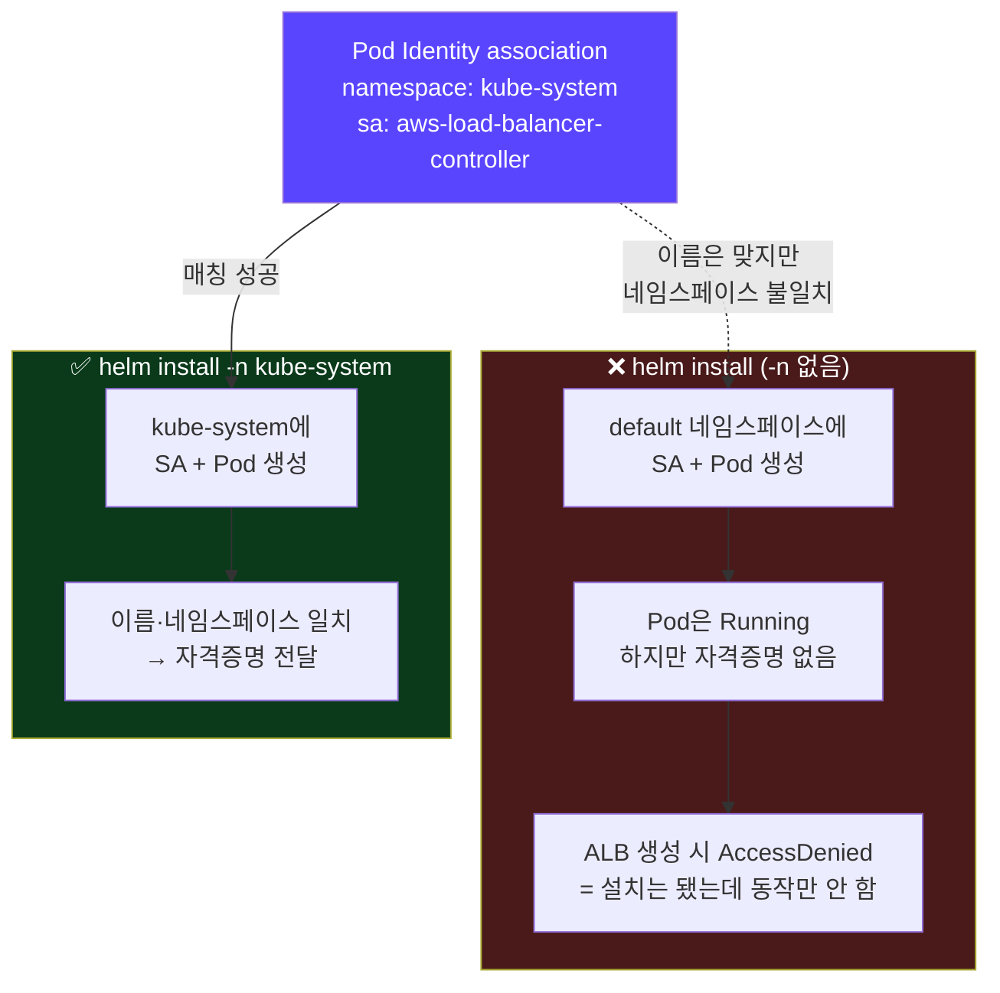
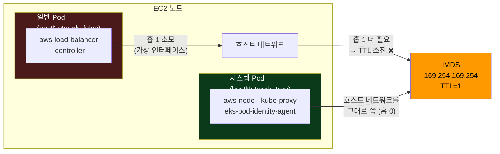
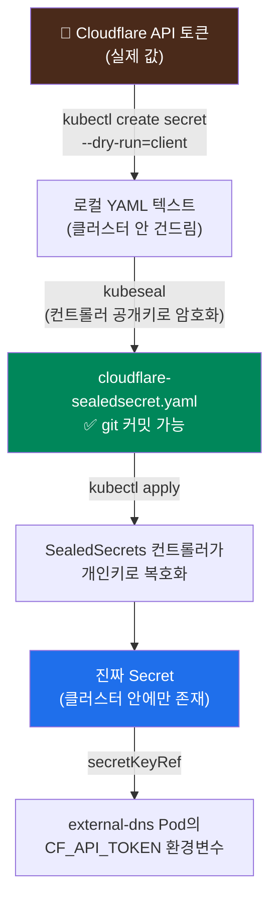

## 📚 들어가며

[3편](/posts/EKS-Rebuild-03-Pod-Identity-and-Instance-Type-Troubleshooting/)까지 해서 준비된 건 이렇다.

- EKS 클러스터(k8s 1.34) + 노드 2대(`t3.small` 스팟)
- `eks-pod-identity-agent` 애드온 설치됨
- AWS Load Balancer Controller용 **IAM 역할 + Pod Identity association**은 Terraform으로 이미 생성됨

이제 컨트롤러 **본체를 Helm으로 설치**할 차례다. 그런데 이번 편은 거의 전부가 **"설치했는데 안 돼서 원인 찾은 기록"** 이다. 개념 정리보다 트러블슈팅 케이스 모음에 가깝다.

특히 3장(IMDS hop limit)이 하이라이트다. **"에러 → 원인 → 왜 이런 설계인가 → 그럼 다른 파드는 왜 멀쩡한가"** 로 이어지는데, 파고들다 보니 3편에서 다룬 Pod Identity가 **왜 존재하는지**가 여기서 완성됐다.

> **이번 편 학습 지도**
>
> ```
> 함정 ①              함정 ②              함정 ③ 🔦           그 위에
> ──────              ──────              ──────────         ────────
> stale kubeconfig    Helm 네임스페이스     IMDS hop limit     external-dns
> (엔드포인트 재발급)  (-n 빠뜨리면 default) (= 보안 설계)      + Cloudflare
>                     ls/get도 스코프       hostNetwork 예외    SealedSecrets
> ```

참고로 `helm`은 이미 설치돼 있었다(`v4.2.2`, Homebrew).

---

## 1. 함정 ① — 클러스터를 재생성했더니 `kubectl`이 연결 안 됨

Helm은 내부적으로 `~/.kube/config`를 그대로 쓴다. 그래서 Helm을 쓰려면 `kubectl`이 먼저 클러스터에 붙어야 하는데, 이런 게 떴다.

```
Unable to connect to the server: dial tcp: lookup
A1B2C3D4E5F6A7B8C9D0E1F2A3B4C5D6.gr7.ap-northeast-2.eks.amazonaws.com: no such host
```

2편의 DNS 에러가 떠올라서 "또 네트워크가 불안정한가" 싶었다. 그런데 `nslookup`을 해보니 **NXDOMAIN**(그런 주소가 아예 없음)이었다. **일시적 장애라면 타임아웃이 나야지 NXDOMAIN이 나오진 않는다.** 여기서 방향을 틀었다.

```bash
# 실제 클러스터의 진짜 엔드포인트
aws eks describe-cluster --name mydev --region ap-northeast-2 \
  --query 'cluster.endpoint' --output text
# → https://F6E5D4C3B2A1908F7E6D5C4B3A291807.yl4.ap-northeast-2.eks.amazonaws.com

# kubeconfig에 저장된 엔드포인트
kubectl config view --minify --raw -o jsonpath='{.clusters[0].cluster.server}'
# → https://A1B2C3D4E5F6A7B8C9D0E1F2A3B4C5D6.gr7.ap-northeast-2.eks.amazonaws.com  ← 다름!
```

**원인**: 비용을 아끼려고 `terraform destroy` 했다가 다시 `apply`로 재생성했는데, **클러스터를 재생성하면 API 엔드포인트 주소 자체가 완전히 새로 발급된다.** 로컬 kubeconfig는 자동 갱신되지 않으니 이미 존재하지 않는 옛날 주소를 계속 찾고 있었던 것이다.

```bash
aws eks update-kubeconfig --region ap-northeast-2 --name mydev
```

2편에서 `outputs.tf`에 `configure_kubectl` output을 만들어둔 게 여기서 쓸모가 있었다.

```bash
terraform output -raw configure_kubectl
# → aws eks update-kubeconfig --region ap-northeast-2 --name mydev
```

**교훈**: 클러스터를 destroy/재생성할 때마다 이 명령을 다시 돌려야 한다. 학습 환경처럼 자주 지웠다 만들었다 하면 특히 자주 만난다.

---

## 2. 함정 ② — Helm의 네임스페이스는 `install`에서만 신경 쓰면 되는 게 아니다

### 2-1. `-n` 없이 설치하면 조용히 `default`로 들어간다

```bash
helm install aws-load-balancer-controller -f ci/mydev-values.yaml .
# NAMESPACE: default   ← 의도한 kube-system이 아님
```

에러도 경고도 없이 **성공했다고 나온다.** 문제는 이게 단순한 취향 문제가 아니라는 점이다.



3편에서 만든 Pod Identity association은 **정확히 `kube-system`의 그 이름을 가진 SA에게만** 권한을 준다.

```hcl
associations = {
  main = {
    namespace       = "kube-system"                   # ← 여기가 매칭 조건
    service_account = "aws-load-balancer-controller"
  }
}
```

`default`에 설치되면 파드는 뜨지만 **자격증명을 못 받아서 ALB를 만들 때 AccessDenied**가 난다. **"설치는 성공했는데 동작만 안 하는"** 가장 헷갈리는 상태다.

Helm 릴리스는 설치 시점의 네임스페이스에 고정된다. 옮기는 방법은 없고 지우고 다시 깔아야 한다.

```bash
helm uninstall aws-load-balancer-controller -n default
helm install aws-load-balancer-controller -f ci/mydev-values.yaml . -n kube-system
```

### 2-2. `helm ls` / `helm get`도 전부 네임스페이스 스코프다

재설치 후 확인하려는데 이번엔 이랬다.

```bash
helm get manifest aws-load-balancer-controller   # → not found
helm ls                                          # → 아무것도 없음
```

분명 설치됐는데 안 보인다. 원인은 같다. **Helm에서 릴리스 이름을 다루는 거의 모든 명령이 네임스페이스 스코프**이고, `-n`을 안 주면 현재 kubectl 컨텍스트의 기본 네임스페이스(보통 `default`)를 본다.

```bash
kubectl config view --minify --raw -o jsonpath='{.contexts[0].context.namespace}'
# → (비어있음 = default)

helm ls -n kube-system
# NAME                          NAMESPACE     STATUS     CHART
# aws-load-balancer-controller  kube-system   deployed   aws-load-balancer-controller-3.5.0
```

> **💡 "어디 설치했는지 기억 안 날 때"의 만능 명령**
>
> ```bash
> helm ls -A     # --all-namespaces, 클러스터 전체를 훑어서 보여줌
> ```

### 2-3. `kubens`와의 관계

`kubens`(krew로 설치하는 `k ns`)는 **kubeconfig 현재 컨텍스트의 기본 네임스페이스 값 자체를 바꾼다.**

```bash
k ns kube-system
# 내부적으로: kubectl config set-context --current --namespace=kube-system
```

Helm도 `kubectl`과 똑같이 이 값을 읽는다. 그러니 **`k ns kube-system`을 먼저 해뒀다면 `-n` 없이도 잘 동작했을 것**이다. 즉 "다른 도구"가 아니라 **같은 문제를 푸는 다른 방식**이다.

| | `-n kube-system` 매번 | `k ns kube-system` 전환 |
|---|---|---|
| 범위 | 명령어 한 번만 | 다시 바꾸기 전까지 유지 |
| 장점 | 명시적, 스크립트에 안전 | 반복 작업에 편함 |
| 단점 | 매번 타이핑 | **전환한 걸 잊으면** 엉뚱한 네임스페이스를 건드릴 위험 |

---

## 3. 🔦 함정 ③ — LB Controller CrashLoopBackOff와 IMDS hop limit

이번 편의 하이라이트다. 결론부터 말하면 **이건 버그가 아니라 AWS의 보안 설계가 의도대로 작동한 결과**였다.

### 3-1. 증상

설치는 됐는데 파드가 계속 죽었다.

```
aws-load-balancer-controller-687d8bcf9d-qndmz   0/1   CrashLoopBackOff   5 (78s ago)
```

로그는 이랬다.

```json
{"level":"error","logger":"setup","msg":"unable to initialize AWS cloud",
 "error":"failed to get VPC ID: failed to fetch VPC ID from instance metadata:
  error in fetching vpc id through ec2 metadata: get mac ..."}
```

### 3-2. 원인 추적

컨트롤러는 자기가 어느 VPC에 있는지 알아내려고 **EC2 Instance Metadata Service(IMDS, `169.254.169.254`)** 를 조회한다. 노드의 IMDS 설정을 확인해봤다.

```bash
NODE_ID=$(kubectl get nodes -o jsonpath='{.items[0].spec.providerID}' | awk -F/ '{print $NF}')
aws ec2 describe-instances --instance-ids "$NODE_ID" --region ap-northeast-2 \
  --query 'Reservations[0].Instances[0].MetadataOptions'
```

```json
{
  "HttpTokens": "required",
  "HttpPutResponseHopLimit": 1,      ← 범인
  "HttpEndpoint": "enabled"
}
```

### 3-3. hop limit이 뭐고, 왜 1이면 파드가 막히나

IMDS는 EC2 **호스트 자체의 네트워크**에서 응답하는 서비스다. 반면 일반 파드는 **자기만의 격리된 네트워크 네임스페이스**를 갖는다. 그래서 홉이 하나 더 필요하다.



`HttpPutResponseHopLimit: 1`은 **IMDS 응답 패킷의 TTL을 1로 설정**한다는 뜻이다. TTL은 패킷이 거칠 수 있는 홉 수인데, 1이면 **호스트 자체의 요청에는 충분하지만 파드까지 가는 데는 한 홉이 모자라서 패킷이 버려진다.** 그래서 "MAC 주소 조회 실패 → VPC ID 못 찾음 → 초기화 실패 → 크래시"가 된 것이다.

### 3-4. 그럼 모든 파드가 다 막혀야 하는 거 아닌가?

여기서 의문이 생겼다. 다른 파드들은 멀쩡히 돌고 있었기 때문이다. 확인해봤다.

```bash
kubectl get pods -n kube-system \
  -o custom-columns='NAME:.metadata.name,HOST_NETWORK:.spec.hostNetwork'
```

| 파드 | `hostNetwork` | IMDS 접근 |
|---|:---:|:---:|
| `aws-node` (VPC CNI) | **true** | ✅ |
| `kube-proxy` | **true** | ✅ |
| `eks-pod-identity-agent` | **true** | ✅ |
| `coredns` | false | (IMDS를 쓸 일이 없음) |
| `aws-load-balancer-controller` | **false** | ❌ ← 막힘 |

**답은 "맞다, 그리고 그게 정상이다"** 였다. `hostNetwork: true`인 파드는 자기만의 네트워크 네임스페이스를 안 만들고 **EC2 호스트의 네트워크를 그대로 빌려 쓴다.** 그래서 "한 홉 더 건너가는" 과정 자체가 없고 hop limit 1에 걸리지 않는다. `aws-node` / `kube-proxy` / `eks-pod-identity-agent`는 노드 네트워크를 직접 다뤄야 하는 시스템 컴포넌트라 이렇게 설계돼 있다.

정리하면 **hop limit 1은 "일반 파드는 전부 막혀야 정상"인 설정**이고, 내가 본 크래시는 그 보안장치가 **의도대로 작동한 결과**였다.

### 3-5. 왜 이런 기본값을 뒀을까 — 실수가 아니라 보안 설계

IMDS는 **EC2 인스턴스의 IAM 역할 자격증명을 그대로 내주는** 매우 민감한 서비스다. 과거 IMDSv1 시절엔 아무 보호 없이 요청만 하면 이걸 내줬고, 애플리케이션의 SSRF 취약점을 통해 인스턴스 자격증명이 탈취되는 대형 사고들이 있었다.

이후 AWS는 두 가지 방어를 도입했다.

1. **IMDSv2** — 토큰 기반(PUT으로 토큰 받고 GET으로 조회) 방식
2. **hop limit 축소** — **컨테이너·파드가 노드의 IAM 권한을 "빌려 쓰는" 경로를 원천 차단**

두 번째가 핵심이다. 노드의 IAM 역할은 그 노드의 **모든 파드가 공유하기엔 너무 넓은 권한**이다. 파드가 그걸 마음대로 쓰면 안 된다. **그래서 IMDS라는 뒷문을 막아두고, 대신 IRSA / Pod Identity라는 통제된 경로로만 파드에 권한을 주도록 설계한 것**이다.

> **3편의 Pod Identity가 여기서 완성된다.** 그리고 `eks-pod-identity-agent`가 `hostNetwork: true`인 이유도 이 그림에 정확히 들어맞는다 — 이 에이전트는 **hop limit의 영향을 안 받는 특권 위치(호스트 네트워크)에 있으면서, 자기가 대신 자격증명을 받아 일반 파드에게 안전하게 전달하는 중개자**다.

### 3-6. 해결

두 가지 방법이 있다.

**(A) 즉시 해결 — IMDS 조회 자체를 건너뛰게 한다** *(채택)*

컨트롤러에게 VPC ID를 직접 알려주면 IMDS를 볼 이유가 없어진다.

```yaml
# ci/mydev-values.yaml
vpcId: vpc-0a1b2c3d4e5f67890
region: ap-northeast-2
```

```bash
helm upgrade aws-load-balancer-controller -f ci/mydev-values.yaml . -n kube-system
```

→ 두 파드 모두 `1/1 Running`, 재시작 0회로 정상화.

**(B) 근본 해결 — 노드의 hop limit을 2로 올린다** *(보류)*

```hcl
# main.tf 의 노드 그룹
use_custom_launch_template = true     # 기본 LT 대신 자체 LT를 만들어야 설정 가능
metadata_options = {
  http_put_response_hop_limit = 2
}
```

이러면 이 노드의 **모든** 파드가 IMDS를 쓸 수 있게 되어, 나중에 IMDS가 필요한 다른 컴포넌트를 올려도 같은 문제를 안 겪는다. 다만 launch template이 바뀌므로 **노드가 교체**되고, 보안적으로는 3-5에서 설명한 방어막을 **한 겹 여는 셈**이라 트레이드오프가 있다.

### 3-7. 덤으로 발견한 것 — 남아있던 IRSA 어노테이션

values 파일을 열어보니 강의 자료에서 딸려온 IRSA 흔적이 남아 있었다.

```yaml
serviceAccount:
  annotations:
    eks.amazonaws.com/role-arn: arn:aws:iam::123456789012:role/load-balancer-controller-...
```

우리는 Pod Identity를 쓰기로 했으니 **이 어노테이션은 불필요**하다. 게다가 남겨두면 EKS의 IRSA 웹훅이 `AWS_ROLE_ARN` / `AWS_WEB_IDENTITY_TOKEN_FILE` 환경변수를 주입하는데, **이 역할의 신뢰 정책은 OIDC가 아니라 `pods.eks.amazonaws.com`만 신뢰**하도록 만들어져 있어서 IRSA 방식 인증은 애초에 실패한다. AWS SDK가 두 자격증명 경로 사이에서 혼란을 겪을 수 있어 제거했다.

**교훈**: 강의 자료를 복사할 때 **"우리가 선택한 방식과 다른 방식의 잔재"** 가 딸려오는지 확인해야 한다.

---

## 4. 곁가지 — Helm 차트를 git에 커밋하는 게 맞나?

`helm pull --untar`로 받은 차트 폴더를 레포에 커밋할지 고민이 생겼다. 강의 레포는 `argo-cd-5.53.3/`, `kube-prometheus-stack-56.9.0/` 등 **차트 소스를 통째로 커밋**해두었다.

**실무에서 더 흔한 방식은 vendoring이 아니다.** 보통은 repo URL + 차트명 + 버전만 참조한다.

```yaml
# ArgoCD Application 예시
source:
  repoURL: https://aws.github.io/eks-charts
  chart: aws-load-balancer-controller
  targetRevision: 3.5.0
```

이러면 배포 시점에 알아서 받아오고, 업그레이드도 버전 숫자만 바꾸면 되며, repo 용량도 안 늘어난다.

**그럼에도 vendoring이 합리적인 경우**가 있다.

| 상황 | 이유 |
|---|---|
| 학습용 | `templates/` 내부를 바로 열어볼 수 있어 이해에 도움 |
| 정확한 재현 보장 | upstream이 해당 버전을 내려도 안전 |
| 에어갭 환경 / 직접 패치 | 애초에 외부에서 받아올 수 없거나, 차트에 손을 대야 하는 경우 |

**단점**은 repo 용량 증가(특히 `kube-prometheus-stack`처럼 서브차트·CRD가 많은 차트)와, 업그레이드가 "숫자 하나 바꾸기"가 아니라 **"재pull → diff → 재커밋"** 이 된다는 점이다.

**이번 판단**: AWS Load Balancer Controller 차트는 **384K로 작아서** vendoring 단점이 거의 없고, values 파일을 차트와 같은 자리에 묶어두는 강의 관례를 따르는 게 진도 맞추기에도 편해서 그대로 커밋했다. **ArgoCD 단계로 넘어갈 때 "repo + 버전 참조" 방식으로 바꿀지는 그때 다시 판단**하기로 했다.

---

## 5. external-dns를 Route53이 아니라 Cloudflare에 붙이기

강의는 Route53을 쓰지만 내 도메인은 Cloudflare에서 관리 중이다. external-dns는 Route53 전용이 아니라 **수십 개 DNS 공급자를 지원**하고 Cloudflare도 그중 하나다.

### 5-1. 인증 방식이 완전히 다르다

| | Route53 (강의) | Cloudflare (내 경우) |
|---|---|---|
| 인증 | AWS IAM (IRSA/Pod Identity) | **Cloudflare API 토큰** |
| 필요한 Terraform 작업 | IAM 역할 + association | **없음** (AWS 서비스가 아니므로) |
| 자격증명 전달 | 파드에 IAM 역할 연결 | Kubernetes Secret → 환경변수 |

3편에서 `irsa-role.tf`에 주석으로 남겨둔 `external_dns_pod_identity` 블록은 **Route53 전용이라 이번엔 쓸 일이 없다.**

### 5-2. 차트 구조가 바뀌어 있었다 (1.13.1 → 1.21.1)

강의 버전(1.13.1)엔 `ci/` 폴더가 있어서 거기 values 파일을 넣었는데, 최신 버전(1.21.1)엔 `ci/`가 없고 `crds/`가 있었다.

- **`ci/`** — 애초에 **Helm이 요구하는 폴더가 아니다.** 차트 관리자가 자기네 CI 테스트용 values를 모아둔 **관례적 위치**였고, 강의는 그걸 배포 설정 위치로 재활용한 것뿐이다. 없어졌어도 **우리가 직접 만들면 그만**이다(`mkdir ci`)
- **`crds/`** — Helm이 `templates/`보다 **먼저 자동으로** 적용하는 CRD 정의 폴더. `values.yaml`로 조작하지 않고, 있으면 알아서 설치된다 (이 버전은 `DNSEndpoint` CRD 기반 소스도 지원한다는 의미)

### 5-3. values 오버라이드 레이어

기본 `values.yaml`에 `provider.name: aws`가 박혀 있는데, 이걸 직접 수정해야 하나? **아니다.**

```bash
helm install external-dns -f ci/mydev-values.yaml . -n kube-system
```

Helm은 **차트의 기본 `values.yaml` 위에 `-f`로 준 파일을 덮어쓴다.** 내가 지정한 키만 오버라이드되고 나머지는 기본값이 그대로 쓰인다.

> **원칙**: 벤더링해온 차트의 `values.yaml`(원본 기본값)은 **절대 직접 수정하지 않는다.** 항상 별도 파일에서만 오버라이드해야, 나중에 차트 버전을 올릴 때 **"내가 뭘 바꿨는지"** 가 명확히 남는다.

### 5-4. 최종 values

```yaml
provider:
  name: cloudflare

# 토큰 "값"이 아니라 "어디에 있는지"만 적는다 — 이 파일은 git에 커밋해도 안전
env:
  - name: CF_API_TOKEN
    valueFrom:
      secretKeyRef:
        name: cloudflare-api-token
        key: apiKey

sources:
  - ingress

# 여러 클러스터가 같은 zone을 공유할 때 레코드 소유권을 TXT로 표시
txtOwnerId: mydev

# sync: Ingress가 삭제되면 DNS 레코드도 함께 삭제 (upsert-only면 삭제 안 함)
policy: sync
```

설치 전에 `helm template`으로 렌더링 결과를 미리 검증했다. **클러스터에 아무것도 안 만든다.**

```bash
helm template external-dns -f ci/mydev-values.yaml . -n kube-system \
  | grep -A5 'cloudflare\|CF_API_TOKEN'
```

```
env:
  - name: CF_API_TOKEN
    valueFrom:
      secretKeyRef: {key: apiKey, name: cloudflare-api-token}
args:
  - --provider=cloudflare
  - --txt-owner-id=mydev
```

의도한 대로 렌더링되는 걸 확인하고 설치했다. **`helm template`은 설치 전 검증 도구로 매우 유용하다.**

---

## 6. SealedSecrets — API 토큰을 git에 안전하게 커밋하기

Cloudflare API 토큰을 평문 Secret으로 git에 올릴 순 없다. 강의 레포에 이미 `sealed-secrets`가 있고 실제로 쓰고 있으니 같은 패턴을 따랐다.

### 6-1. 순서가 생각과 달랐다

처음엔 "kubeseal CLI 설치하고 시크릿 만들면 되겠지"라고 생각했다. 확인해보니 **컨트롤러가 클러스터에 먼저 있어야 한다.**

```bash
kubectl get pods -A -l app.kubernetes.io/name=sealed-secrets   # → No resources found
which kubeseal                                                  # → 없음
```

`kubeseal`은 **컨트롤러가 가진 공개키로 암호화**하는 도구다. 컨트롤러가 없으면 **암호화할 대상 자체가 없고**, 설령 SealedSecret을 만들어도 **복호화해서 진짜 Secret으로 바꿔줄 주체가 없다.**

| 순서 | 무엇을 | 어디에 |
|:---:|---|---|
| 1 | `sealed-secrets` **컨트롤러** 설치 (Helm) | 클러스터 |
| 2 | `kubeseal` **CLI** 설치 | 로컬 |
| 3 | SealedSecret 파일 생성 | 로컬 |
| 4 | `kubectl apply` → 컨트롤러가 복호화 | 클러스터 |

### 6-2. 여기서도 URL이 바뀌어 있었다

```bash
curl -sI https://bitnami-labs.github.io/sealed-secrets/index.yaml   # → 404
```

**Bitnami가 GitHub organization 이름을 `bitnami-labs` → `bitnami`로 변경**해서 예전 Helm 저장소 URL이 죽어 있었다.

| | 강의(ref) | 현재 |
|---|---|---|
| Helm repo | `bitnami-labs.github.io/sealed-secrets` (**404**) | `bitnami.github.io/sealed-secrets` |
| 차트 버전 | 2.15.0 | **2.19.3** |
| 컨트롤러 | 0.26.0 | **0.39.1** |

```bash
helm repo add sealed-secrets https://bitnami.github.io/sealed-secrets
helm repo update
helm pull sealed-secrets/sealed-secrets --version 2.19.3 --untar
```

values는 한 줄이면 된다.

```yaml
# kubeseal CLI는 기본적으로 "kube-system의 sealed-secrets-controller"를 찾는다.
# 이 이름을 맞춰두지 않으면 매번 --controller-name/--controller-namespace를
# 옵션으로 넘겨야 해서 번거로워진다.
fullnameOverride: "sealed-secrets-controller"
```

```bash
helm install sealed-secrets -f ci/mydev-values.yaml . -n kube-system
brew install kubeseal   # 0.39.1 — 컨트롤러와 버전 일치
```

### 6-3. 핵심: "클러스터에 시크릿을 만든다"가 아니다



```bash
kubectl create secret generic cloudflare-api-token \
  --namespace kube-system \
  --from-literal=apiKey=<토큰> \
  --dry-run=client -o yaml \
| kubeseal \
  --controller-name=sealed-secrets-controller \
  --controller-namespace=kube-system \
  --format yaml \
> sealedSecret/cloudflare-sealedsecret.yaml
```

여기서 `kubectl create secret`은 **`--dry-run=client` 때문에 클러스터를 건드리지 않는다.** 로컬에서 YAML 텍스트만 뽑아내고, 그걸 `kubeseal`이 암호화해서 파일로 저장한다. **평문 Secret이 클러스터에 직접 만들어지는 순간이 없다** — 이게 SealedSecrets를 쓰는 이유다.

### 6-4. 놓치기 쉬운 보안 디테일 — 쉘 히스토리

git에 안 남기려고 이 고생을 하는데, 정작 **터미널에 토큰을 그대로 타이핑하면 `~/.zsh_history`에 평문으로 남는다.**

```bash
read -s CF_TOKEN     # 입력이 화면에도 안 보이고, 히스토리에 값도 안 남음
kubectl create secret generic cloudflare-api-token \
  --namespace kube-system --from-literal=apiKey="$CF_TOKEN" \
  --dry-run=client -o yaml \
| kubeseal --controller-name=sealed-secrets-controller \
           --controller-namespace=kube-system --format yaml \
> sealedSecret/cloudflare-sealedsecret.yaml
unset CF_TOKEN
```

apply 후 확인하면 컨트롤러가 복호화해서 진짜 Secret을 만들어둔 걸 볼 수 있다.

```bash
kubectl get secret cloudflare-api-token -n kube-system
# NAME                   TYPE     DATA   AGE
# cloudflare-api-token   Opaque   1      79s
```

---

## 📝 이번 편 요약

```
Helm 설치 함정
├─ ① stale kubeconfig
│    클러스터 재생성 = 엔드포인트 재발급. NXDOMAIN이면 네트워크가 아니라 주소 문제
├─ ② 네임스페이스
│    install / ls / get / uninstall 전부 -n 스코프
│    association의 매칭 조건이라 "설치는 됐는데 권한만 없는" 상태가 됨
└─ ③ IMDS hop limit 🔦
     hop limit 1 = 일반 파드는 막히는 게 정상 (보안 설계)
     hostNetwork: true 시스템 파드만 통과
     → 그래서 IRSA/Pod Identity가 존재한다

그 위에 올린 것
├─ Helm 차트 vendoring — 실무 표준은 repo+버전 참조. 학습용이라 커밋 유지
├─ external-dns + Cloudflare — AWS IAM 대신 API 토큰, Terraform 작업 불필요
│    차트 기본 values.yaml은 절대 직접 수정하지 않는다 (-f 로 오버라이드)
└─ SealedSecrets — 컨트롤러(클러스터) → CLI(로컬) 순서
     --dry-run=client 로 평문이 클러스터에 안 들어감 + read -s 로 히스토리도 방어
```

| 개념 | 한 줄 정의 |
|---|---|
| **IMDS** | `169.254.169.254`에서 EC2 인스턴스 메타데이터·IAM 자격증명을 내주는 서비스 |
| **hop limit** | IMDS 응답 패킷의 TTL. 1이면 파드까지 도달 못 함 (= 의도된 차단) |
| **`hostNetwork: true`** | 파드가 자기 네트워크 네임스페이스 없이 호스트 네트워크를 그대로 쓰는 설정 |
| **`helm ls -A`** | 네임스페이스 상관없이 클러스터 전체 릴리스를 조회 |
| **`helm template`** | 클러스터를 건드리지 않고 렌더링 결과만 출력하는 사전 검증 도구 |
| **vendoring** | 외부 차트 소스를 내 레포에 통째로 커밋해두는 방식 |
| **`--dry-run=client`** | 서버에 요청하지 않고 로컬에서 매니페스트만 생성 |
| **SealedSecret** | 컨트롤러 공개키로 암호화되어 git에 커밋 가능한 Secret 형식 |

---

## 💭 느낀 점

**1. NXDOMAIN과 타임아웃을 구분한 게 시간을 아꼈다.**

함정 ①에서 2편의 DNS 에러가 떠올라 "또 네트워크겠지" 하고 재시도만 반복할 뻔했다. 그런데 **NXDOMAIN은 "주소가 없다"이지 "응답이 안 온다"가 아니다.** 에러 메시지의 종류를 구분한 덕에 방향을 바로 틀 수 있었다. 2편에서 "에러 메시지가 가리키는 계층을 먼저 보라"고 정리했던 게 여기서 한 번 더 쓰였다.

**2. "설치는 성공했는데 동작만 안 하는" 상태가 제일 무섭다.**

함정 ②가 딱 그랬다. `helm install`이 초록색으로 성공을 찍고, 파드도 `Running`이고, 로그도 조용하다. 그런데 정작 ALB는 안 생긴다. **에러가 나는 게 차라리 낫다**는 걸 처음 체감했다. 이후로는 설치 직후 `helm ls -A`로 네임스페이스부터 확인하는 습관이 생겼다.

**3. 에러를 "고쳐야 할 것"이 아니라 "왜 이렇게 설계됐나"로 본 게 제일 남았다.**

IMDS hop limit이 그랬다. 처음엔 그냥 "2로 올리면 되는 값"으로 보였는데, 왜 기본이 1인지 파고들다 보니 **IMDSv1 자격증명 탈취 사고 → hop limit 축소 → 그래서 IRSA/Pod Identity가 필요해졌다**는 인과가 통째로 이어졌다. 3편에서 "Pod Identity가 IRSA보다 편하다"는 정도로만 이해했던 게, **"애초에 왜 이런 메커니즘이 필요한가"** 로 한 단계 내려갔다. 그리고 그 답이 `eks-pod-identity-agent`가 `hostNetwork: true`인 이유와도 정확히 맞아떨어질 때가 제일 재밌었다.

**4. 강의 자료를 복사할 때 딸려오는 "다른 방식의 잔재".**

values 파일에 남아 있던 IRSA 어노테이션이 대표적이다. 2편의 `.terraform.lock.hcl`도 같은 종류의 문제였다. **복사한 파일에 "내가 택하지 않은 방식의 설정"이 섞여 있는지** 확인하는 게 이 시리즈 내내 반복되는 체크포인트가 되고 있다.

**5. 버전이 아니라 URL이 죽는 경우도 있다.**

SealedSecrets의 Helm repo가 404였던 건 예상 못 한 종류의 노후화였다. 버전 숫자만 최신으로 챙기면 되는 줄 알았는데, **organization 이름 자체가 바뀌면 주소가 통째로 죽는다.** 2년 전 자료를 따라갈 때 의심해야 할 목록이 하나 늘었다.

---

## 🔗 다음 편 예고

- 실제 Ingress를 만들어 **ALB 자동 생성 + Cloudflare DNS 레코드 자동 등록**이 end-to-end로 동작하는지 검증
- **Karpenter** — 3편에서 `karpenter.sh/discovery` 태그를 미리 달아둔 이유가 여기서 드러난다. 강의(v0.33, `v1beta1` API)와 현재(`v1` API, `WhenEmptyOrUnderutilized`)의 차이
- 그다음 **ArgoCD로 GitOps 전환** — 이때 4장에서 미뤄둔 **"차트 vendoring vs repo 참조"** 결정을 다시 마주하게 된다

---

## 📚 참고

- [EC2 인스턴스 메타데이터 서비스(IMDS) 문서](https://docs.aws.amazon.com/AWSEC2/latest/UserGuide/configuring-instance-metadata-service.html) — hop limit과 IMDSv2
- [AWS Load Balancer Controller Helm 차트](https://github.com/aws/eks-charts)
- [external-dns — Cloudflare 튜토리얼](https://kubernetes-sigs.github.io/external-dns/latest/docs/tutorials/cloudflare/)
- [bitnami/sealed-secrets](https://github.com/bitnami/sealed-secrets) — organization이 `bitnami-labs`에서 이전됨

> 이 글의 계정 ID·클러스터명·VPC ID·EKS 엔드포인트 해시는 예시 값으로 치환했다. 차트 버전(LBC 3.5.0 / external-dns 1.21.1 / sealed-secrets 2.19.3, 컨트롤러 0.39.1)은 2026년 9월 초 기준으로 확인한 값이다.
