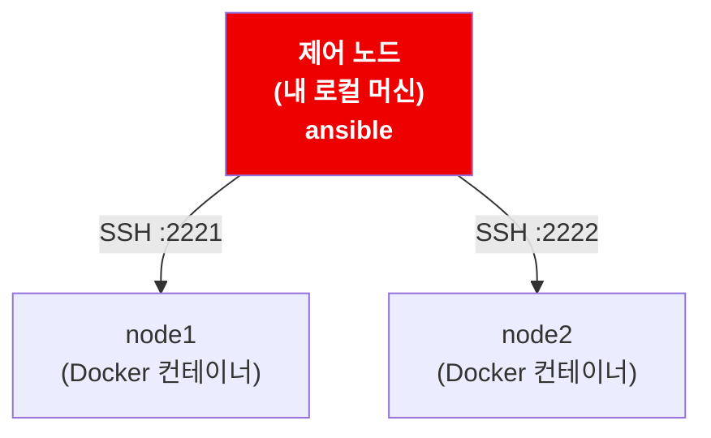
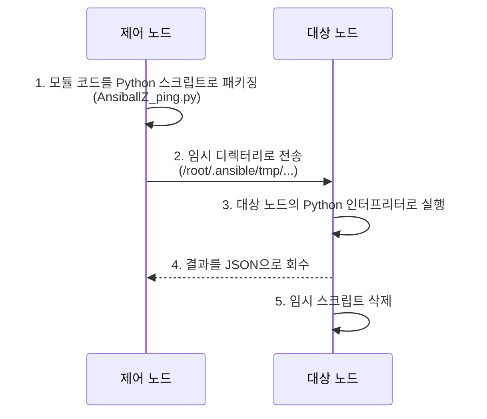
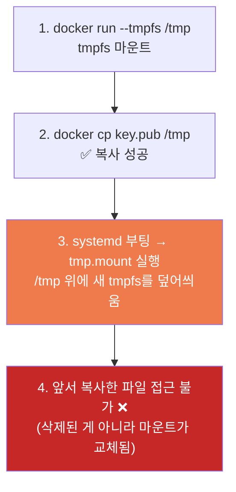
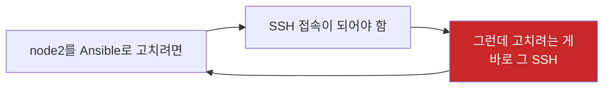
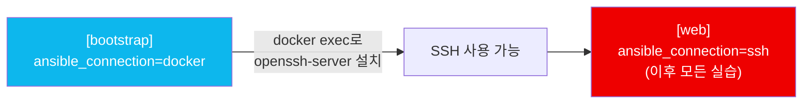

## 📚 들어가며

Ansible을 한 번도 안 써봤다. 그런데 실습하려니 관리 대상 서버가 필요했다. VM을 여러 대 띄우기는 부담스러워서, **Docker 컨테이너를 "관리 대상 노드"로 삼는** 방식으로 실습 환경을 만들어봤다.

결과적으로 **환경 세팅에서만 다섯 번을 막혔다.** 그런데 이게 오히려 좋았다. 각각의 에러가 Ansible이 실제로 어떻게 동작하는지를 하나씩 알려줬기 때문이다. "agentless"라는 말의 실체, connection plugin이라는 추상화 계층 같은 것들은 매끄럽게 성공했다면 몰랐을 것들이다.

> **Ansible이란?** 제어 노드(Control Node)에서 관리 대상 노드(Managed Node)로 **SSH를 통해 명령을 보내 인프라를 자동화**하는 도구. 대상 노드에 별도 에이전트를 설치하지 않는 **agentless** 구조가 특징이다.

---

## 1. 목표 구성

제어 노드는 내 로컬 머신, 관리 대상 노드는 Docker 컨테이너 2개다.



Ansible은 agentless라서 대상 노드에 에이전트를 깔 필요가 없다. **제어 노드에서 SSH로 접속만 되면 된다.** 그러니 SSH 서버가 떠 있는 컨테이너 2개면 실습 환경으로 충분하다.

| 역할 | 대상 | 필요한 것 |
|------|------|------|
| **제어 노드** | 로컬 머신 | `ansible` 패키지 |
| **관리 대상 노드** | Docker 컨테이너 × 2 | **sshd** + **Python 3.7+** |

> 💡 표에서 "Python 3.7+"가 왜 필요한지가 이 글의 첫 번째 삽질 주제다. agentless인데 왜 대상 노드에 Python이 필요할까?

---

## 2. Ansible 설치

제어 노드에만 설치하면 된다.

```bash
pip install ansible --break-system-packages
# 또는
brew install ansible
```

---

## 3. 1차 시도 실패 — 오래된 Python

처음에는 예제로 흔히 쓰이는 `rastasheep/ubuntu-sshd` 이미지를 골랐다.

```bash
docker run -d --name node1 -p 2221:22 rastasheep/ubuntu-sshd
docker run -d --name node2 -p 2222:22 rastasheep/ubuntu-sshd
```

inventory를 작성하고 연결 테스트(`-m ping`)를 하니 이런 에러가 났다.

```
node1 | FAILED! => {
    "module_stdout": "  File \"/root/.ansible/tmp/.../AnsiballZ_ping.py\", line 3
    from __future__ import annotations
    ^
SyntaxError: future feature annotations is not defined",
    "msg": "Module result deserialization failed: No start of json char found",
}
```

### 원인

`from __future__ import annotations` 구문은 **Python 3.7 이상**에서만 지원된다.

| 항목 | 값 |
|------|------|
| 이미지 베이스 | Ubuntu 14.04 |
| 대상 노드 Python | **3.4 수준** |
| 최신 Ansible이 요구하는 문법 | **3.7+** |
| 결과 | 모듈 코드가 **파싱조차 되지 않음** |

### 여기서 배운 Ansible 동작 원리

에러 메시지에 `AnsiballZ_ping.py`라는 **파일 경로**가 찍힌 게 핵심 힌트였다. Ansible은 대상 노드에서 명령어를 직접 실행하는 게 아니다.



즉 **대상 노드에 적절한 버전의 Python이 반드시 있어야 한다.**

> 💡 **이게 agentless의 실체다.** 상주하는 에이전트 프로세스는 없지만, **Python 의존성은 존재한다.** "아무것도 설치할 필요 없다"가 아니라 "전용 에이전트를 설치·관리할 필요가 없다"가 정확한 표현이다.

### 인터프리터 자동 탐색

실행 로그에는 아래 경고도 함께 떴다.

```
[WARNING]: Host 'node1' is using the discovered Python interpreter at '/usr/bin/python3'
```

Ansible은 대상 노드의 Python 경로를 **자동 탐색(interpreter discovery)** 한다. 자동 탐색에 의존하지 않고 명시하고 싶다면 inventory에 지정하면 된다.

```ini
node1 ansible_python_interpreter=/usr/bin/python3
```

> ⚠️ 자동 탐색은 편하지만, 노드마다 Python 경로가 다르거나 venv를 쓰는 환경에서는 예상 밖의 인터프리터를 잡을 수 있다. **운영 환경이라면 `ansible_python_interpreter`를 명시**하는 편이 안전하다.

---

## 4. 2차 시도 — systemd 컨테이너와 cgroup

Ansible 테스트용으로 잘 알려진 **geerlingguy** 이미지로 교체했다. Ubuntu 22.04 기반(Python 3.10)이고 systemd가 살아 있어서 `service`/`systemd` 모듈 실습까지 가능하다.

```bash
docker rm -f node1 node2

docker run -d --name node1 --privileged -p 2221:22 \
  geerlingguy/docker-ubuntu2204-ansible:latest
```

그런데 컨테이너가 바로 죽었다.

```
48e6063602ea  geerlingguy/docker-ubuntu2204-ansible:latest  "/lib/systemd/systemd"  Exited (255)
```

### 원인: cgroup 마운트

systemd를 컨테이너 안에서 **PID 1**로 띄우려면 cgroup 파일시스템에 접근할 수 있어야 한다. `--privileged`만으로는 부족하고, cgroup을 명시적으로 마운트해줘야 한다.

```bash
docker run -d --name node1 --privileged \
  --cgroupns=host \
  -v /sys/fs/cgroup:/sys/fs/cgroup:rw \
  --tmpfs /run \
  --tmpfs /run/lock \
  -p 2221:22 \
  geerlingguy/docker-ubuntu2204-ansible:latest
```

| 옵션 | 역할 |
|------|------|
| `--privileged` | 컨테이너에 확장 권한 부여 |
| `--cgroupns=host` | 호스트의 cgroup 네임스페이스 사용 |
| `-v /sys/fs/cgroup:...:rw` | systemd가 cgroup을 **쓰기 가능**하게 마운트 |
| `--tmpfs /run`, `/run/lock` | systemd가 런타임 상태를 기록할 공간 |

> 💡 컨테이너가 즉시 종료될 때는 `docker logs node1`로 **systemd 부팅 로그**를 확인하면 원인이 바로 보인다. `Exited (255)`만 보고 추측하지 말고 로그부터 볼 것.

---

## 5. 3차 문제 — `docker cp` 한 파일이 사라짐

SSH 키 인증을 위해 공개키를 컨테이너에 넣으려 했다.

```bash
docker cp ~/.ssh/ansible_test.pub node1:/tmp/key.pub
# Successfully copied 120B to node1:/tmp/key.pub
```

복사는 성공했다는데, 정작 컨테이너 안에는 파일이 없었다.

```bash
docker exec node1 bash -c "ls -al /tmp"   # 아무것도 없음
```

### 원인: systemd의 `tmp.mount`

컨테이너 실행 시 `--tmpfs /tmp` 옵션을 줬는데, systemd에는 기본적으로 **`tmp.mount` 유닛**이 있어서 부팅 과정에서 `/tmp`에 **새로운 tmpfs를 다시 마운트**한다.



파일이 **삭제된 게 아니라, 그 파일이 있던 마운트 자체가 가려진 것**이다.

### 해결

`/tmp` 대신 systemd가 관여하지 않는 경로를 쓰면 된다.

```bash
docker cp ~/.ssh/ansible_test.pub node1:/root/key.pub
docker exec node1 bash -c "mkdir -p /root/.ssh && cat /root/key.pub >> /root/.ssh/authorized_keys"
docker exec node1 bash -c "chmod 700 /root/.ssh && chmod 600 /root/.ssh/authorized_keys"
```

애초에 `--tmpfs /tmp` 옵션 자체를 빼는 것도 방법이다. cgroup 문제 해결에는 `--tmpfs /run`, `--tmpfs /run/lock`만 있으면 충분하다.

> ⚠️ **권한을 빼먹지 말 것.** SSH는 `.ssh` 디렉터리나 `authorized_keys`의 권한이 너무 열려 있으면 **인증 자체를 거부**한다. `chmod 700 ~/.ssh`, `chmod 600 authorized_keys`는 필수다.

| 경로 | 권한 |
|------|:---:|
| `/root/.ssh` | `700` |
| `/root/.ssh/authorized_keys` | `600` |

---

## 6. 4차 문제 — `kex_exchange_identification`

```
node1 | UNREACHABLE! => {
    "msg": "Failed to connect to the host via ssh:
     kex_exchange_identification: read: Connection reset by peer
     Connection reset by 127.0.0.1 port 2221",
    "unreachable": true
}
```

### 이 에러의 의미

`kex_exchange_identification`은 SSH의 **키 교환(key exchange)** 단계에서 발생한 에러다. 즉 **TCP 연결 자체는 성공했지만, SSH 프로토콜 배너를 주고받기 전에 연결이 끊겼다**는 뜻이다.


포트 매핑은 정상인데 **그 포트 뒤의 sshd가 제대로 응답하지 않는 상태**다. 인증 문제라면 이 단계까지 오지도 않고 다른 메시지가 나온다.

| 에러 위치 | 대표 메시지 | 의심 지점 |
|------|------|------|
| TCP 연결 | `Connection refused` | 포트 매핑 / 컨테이너 다운 |
| **배너 교환** | **`kex_exchange_identification`** | **sshd 미실행 / 즉시 종료** |
| 인증 | `Permission denied (publickey)` | 키·권한·계정 |

### 진단 순서

```bash
docker ps                              # 컨테이너가 계속 Up 상태인지 (재시작 루프인지)
docker port node1                      # 포트 매핑 확인
nc -zv 127.0.0.1 2221                  # TCP 연결 자체가 되는지
docker exec node1 ps aux | grep sshd   # sshd 프로세스가 떠 있는지
```

> 💡 `nc`로 **연결이 즉시 리셋되면 sshd 문제**, **아예 연결이 안 되면 포트/네트워크 문제**로 나눠 볼 수 있다. 에러 메시지를 "어느 단계에서 끊겼는가"로 해석하는 습관이 트러블슈팅 속도를 크게 좌우한다.

---

## 7. 5차 문제 — `sshd.service not found`

sshd를 띄우려고 했더니:

```bash
docker exec node1 systemctl start sshd
# Failed to start sshd.service: Unit sshd.service not found.
```

### 원인: 배포판마다 서비스 이름이 다르다

| 배포판 계열 | 패키지 이름 | systemd 유닛 이름 |
|------|:---:|:---:|
| RHEL / CentOS / Rocky | `openssh-server` | **`sshd.service`** |
| Ubuntu / Debian | `openssh-server` | **`ssh.service`** |

패키지 이름은 양쪽 모두 `openssh-server`인데, **systemd 유닛 이름만 다르다.** Ubuntu 계열에서는 `ssh`로 접근해야 한다.

```bash
docker exec node1 systemctl status ssh
docker exec node1 journalctl -u ssh --no-pager | tail -50
```

패키지가 아예 없다면 설치한다.

```bash
docker exec node1 apt update
docker exec node1 apt install -y openssh-server
docker exec node1 systemctl daemon-reload
docker exec node1 systemctl enable --now ssh
```

### 이게 Ansible에서 중요한 이유

playbook에서 서비스를 다룰 때 이 차이가 **그대로 문제가 된다.** 그래서 실무에서는 facts를 이용해 조건 분기를 하거나 변수로 추상화한다.

```yaml
- name: Ensure SSH is running
  systemd:
    name: "{{ 'sshd' if ansible_facts['os_family'] == 'RedHat' else 'ssh' }}"
    state: started
    enabled: true
```

> 💡 **"멀티 배포판 대응"이 Ansible role을 작성할 때 늘 고민하는 지점**이라는 걸 몸으로 배웠다. 내 환경에서만 도는 playbook과, 어디서든 도는 role의 차이가 바로 이 지점에서 갈린다.

---

## 8. 닭이 먼저냐 달걀이 먼저냐 — connection plugin

node1을 고쳤으니 node2도 똑같이 해야 하는데, 여기서 자연스럽게 이런 생각이 들었다.

> "이 반복 작업이야말로 Ansible로 한 번에 처리하면 되는 거 아닌가?"

맞는 발상이지만 문제가 있다. **Ansible의 기본 연결 방식은 SSH인데, 지금 고치려는 대상이 바로 그 SSH다.**



### 해결: `ansible_connection=docker`

Ansible은 SSH만 쓰는 게 아니다. **connection plugin**이라는 추상화 계층이 있어서 접속 방식을 갈아 끼울 수 있다.

| connection | 동작 방식 |
|:---:|------|
| **`ssh`** | 기본값. SSH로 접속 |
| `local` | 제어 노드 자기 자신에서 실행 |
| **`docker`** | **`docker exec`로 컨테이너에 직접 진입** |
| `winrm` | Windows 대상 |
| `paramiko` | Python SSH 라이브러리 사용 |

`docker` 커넥션을 쓰면 SSH를 아예 거치지 않고 `docker exec`로 명령을 실행하므로, **SSH가 없는 상태에서도 부트스트랩이 가능하다.**

**inventory에 부트스트랩용 그룹 추가**

```ini
[bootstrap]
node1 ansible_connection=docker
node2 ansible_connection=docker
```

> ⚠️ 여기서 `node1`, `node2`는 **Docker 컨테이너 이름**(`docker ps`의 NAMES 컬럼)과 정확히 일치해야 한다. SSH 그룹에서는 `ansible_host`로 주소를 지정하지만, docker 커넥션에서는 **호스트명 자체가 컨테이너 이름**으로 쓰인다.

**bootstrap.yml**

```yaml
---
- name: Bootstrap SSH on nodes
  hosts: bootstrap
  gather_facts: false
  tasks:
    - name: Update apt cache
      apt:
        update_cache: yes

    - name: Install openssh-server
      apt:
        name: openssh-server
        state: present

    - name: Enable and start ssh
      systemd:
        name: ssh
        enabled: true
        state: started
```

```bash
ansible-playbook -i inventory.ini bootstrap.yml
```

두 노드에 동시에 적용된다. 이후에는 SSH 기반의 `[web]` 그룹으로 정상 작업이 가능하다.



> 💡 `gather_facts: false`를 준 이유는, facts 수집 자체가 대상 노드에서 모듈을 실행하는 작업이라 부트스트랩 단계에서는 불필요한 오버헤드이기 때문이다. 최소한의 작업만으로 SSH를 살리는 게 목적이다.

---

## 9. 최종 inventory

```ini
# SSH로 접속하는 실제 작업용 그룹
[web]
node1 ansible_host=127.0.0.1 ansible_port=2221 ansible_user=root ansible_ssh_private_key_file=~/.ssh/ansible_test
node2 ansible_host=127.0.0.1 ansible_port=2222 ansible_user=root ansible_ssh_private_key_file=~/.ssh/ansible_test

[web:vars]
ansible_ssh_common_args='-o StrictHostKeyChecking=no'

# SSH 없이 docker exec로 접속하는 부트스트랩용 그룹
[bootstrap]
node1 ansible_connection=docker
node2 ansible_connection=docker
```

연결 확인:

```bash
ansible web -i inventory.ini -m ping
```

| 변수 | 역할 |
|------|------|
| `ansible_host` / `ansible_port` | 접속 주소·포트 (컨테이너 포트 매핑) |
| `ansible_user` | 접속 계정 |
| `ansible_ssh_private_key_file` | 인증에 사용할 개인키 |
| `ansible_ssh_common_args` | SSH 추가 옵션 (호스트 키 검증 생략) |

> ⚠️ `StrictHostKeyChecking=no`는 **실습 환경이라 붙인 옵션**이다. 컨테이너를 재생성할 때마다 호스트 키가 바뀌어 매번 확인 프롬프트가 뜨기 때문인데, 운영 환경에서는 중간자 공격에 노출될 수 있으므로 쓰지 않는 게 좋다.

---

## 10. systemd 없이 더 간단하게 가는 방법

`service`/`systemd` 모듈 실습이 굳이 필요 없다면, **systemd 없는 순수 이미지**가 훨씬 편하다.

```bash
docker run -d --name node1 -p 2221:22 --cap-add=SYS_PTRACE \
  ubuntu:22.04 sh -c "apt update && apt install -y openssh-server python3 sudo && mkdir -p /run/sshd && /usr/sbin/sshd -D"
```

| 방식 | 장점 | 단점 |
|------|------|------|
| **systemd 이미지** | `service`/`systemd` 모듈 실습 가능, 실제 서버에 가까움 | cgroup·`tmp.mount`·유닛 이름 문제 |
| **순수 sshd 이미지** | 세팅이 단순, 문제 거의 없음 | 서비스 관리 모듈 실습 불가 |
| **Vagrant + VirtualBox** | 진짜 VM, 가장 실제에 가까움 | 무겁고 느림 |

순수 이미지로 가면 cgroup 문제도, `tmp.mount` 문제도, systemd 유닛 이름 문제도 **전부 사라진다.** `apt`, `copy`, `template`, `shell`, `user` 등 대부분의 핵심 모듈 실습에는 전혀 지장이 없다.

> 💡 실제 서버 환경에 더 가깝게 하고 싶다면 **Vagrant + VirtualBox**로 진짜 VM을 띄우는 방법도 있다. 목적에 따라 고르면 된다 — "모듈 문법을 익히는 게 목적"이면 순수 이미지, "서비스 관리까지 다뤄보고 싶다"면 systemd 이미지다.

---

## 📝 정리

```
Docker로 Ansible 실습 환경 만들기
├─ 구성    제어 노드(로컬) ──SSH──> node1/node2(컨테이너)
├─ 필수    대상 노드에 sshd + Python 3.7+
├─ 삽질 1  오래된 Python      → AnsiballZ 전송·실행 구조 이해
├─ 삽질 2  systemd 즉시 종료   → cgroup 마운트 필요
├─ 삽질 3  /tmp 파일 소실      → systemd tmp.mount가 덮어씀
├─ 삽질 4  kex_exchange...     → SSH 단계별 에러 구분
├─ 삽질 5  sshd vs ssh         → 배포판별 유닛 이름 차이
└─ 해결    ansible_connection=docker로 SSH 부트스트랩
```

| 겪은 문제 | 배운 것 |
|------|------|
| **Python SyntaxError** | Ansible은 모듈을 **대상 노드의 Python으로 실행**한다 (agentless ≠ 무의존성) |
| **interpreter discovery 경고** | `ansible_python_interpreter`로 명시 가능 |
| **systemd 컨테이너 즉시 종료** | 대상 **환경 자체를 이해해야** 자동화도 가능하다 |
| **`/tmp` 파일 소실** | 마운트·부팅 **순서**에 대한 이해 |
| **`kex_exchange_identification`** | SSH 연결 **단계별로 에러를 구분**해 진단하기 |
| **`sshd` vs `ssh`** | 배포판별 차이 → **facts 기반 조건 분기**의 필요성 |
| **SSH 부트스트랩 순환 문제** | **connection plugin**(docker/local/winrm)이라는 추상화 계층 |

| 핵심 개념 | 한 줄 정의 |
|------|------|
| **agentless** | 전용 에이전트는 없지만, 대상 노드의 **Python은 필요** |
| **AnsiballZ** | 모듈을 패키징해 대상 노드로 보내 실행하는 방식 |
| **connection plugin** | SSH·docker·local 등 **접속 방식을 갈아 끼우는 계층** |
| **interpreter discovery** | 대상 노드의 Python 경로 자동 탐색 |

환경 세팅에서만 다섯 번을 막혔지만, **각각의 에러가 Ansible의 핵심 동작을 하나씩 알려줬다.** 특히 "agentless인데 왜 Python이 필요한가"와 "SSH를 고치는 데 SSH가 필요한 순환 문제를 connection plugin으로 푼다"는 두 가지는, 순탄하게 성공했다면 결코 몰랐을 내용이다.

---

## 🔗 참고

- [Ansible Documentation — Connection plugins](https://docs.ansible.com/ansible/latest/plugins/connection.html)
- [Ansible Documentation — Interpreter Discovery](https://docs.ansible.com/ansible/latest/reference_appendices/interpreter_discovery.html)
- [geerlingguy/docker-ubuntu2204-ansible](https://hub.docker.com/r/geerlingguy/docker-ubuntu2204-ansible)

> **다음 편 예고**: 이렇게 만든 환경 위에서 **inventory 문법, ad-hoc 명령, playbook 구조** 같은 Ansible의 기본기를 정리한다.
