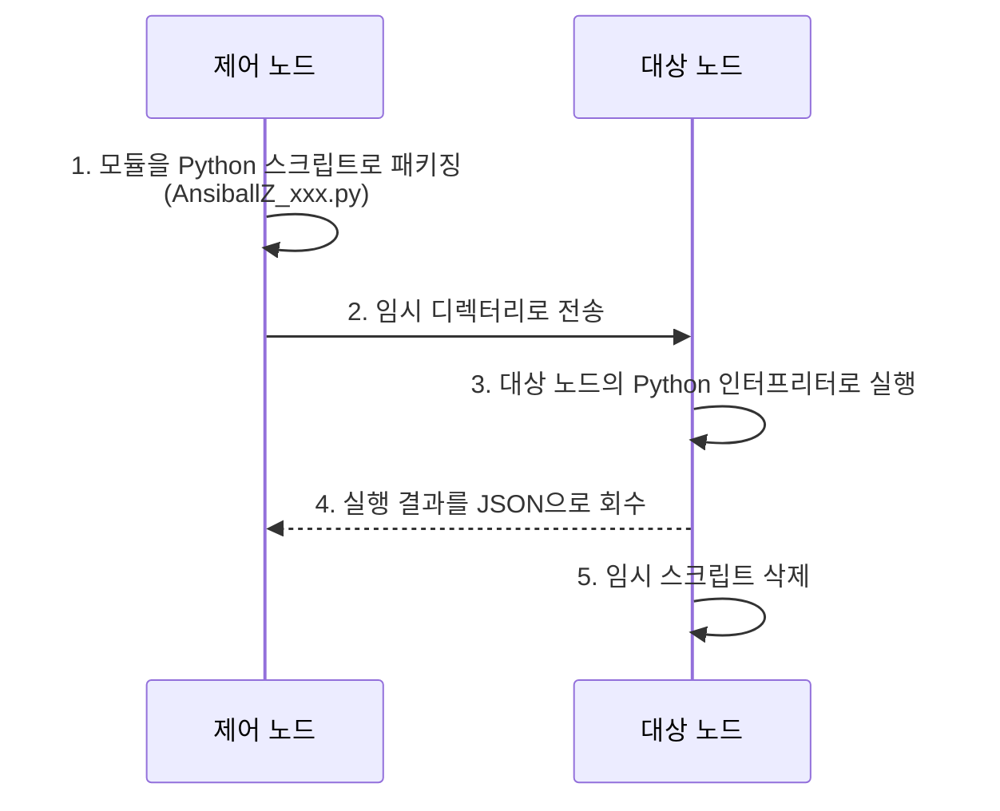
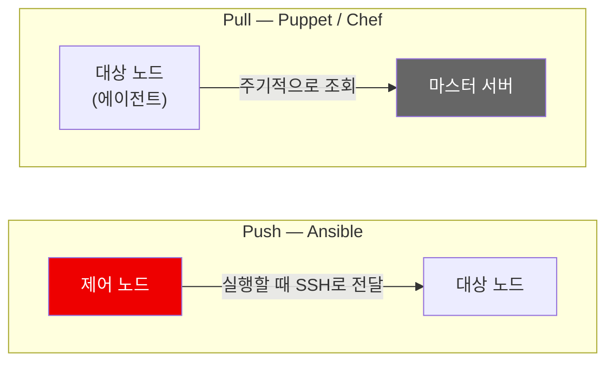
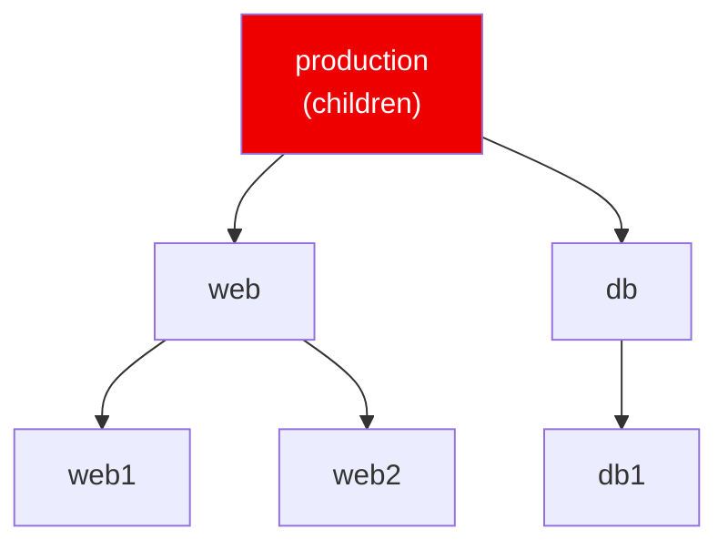
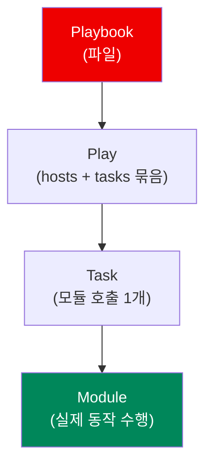

## 📚 들어가며

[1편](/posts/Ansible-01-Docker-Practice-Environment-Troubleshooting/)에서 Docker로 실습 환경을 만들었다. 다섯 번의 삽질 끝에 `ansible web -m ping`이 드디어 초록색으로 떴다.

이번 편에서는 그 위에서 **Ansible이 실제로 어떻게 동작하는지**와, **inventory / ad-hoc 명령 / playbook**의 기본 문법을 하나씩 뜯어본다. 1편이 "환경을 만드는 과정에서 원리를 얻어걸린" 이야기였다면, 이번 편은 그 원리를 정면으로 정리하는 편이다.

> **이번 편의 목표** — "대상을 어떻게 정의하고(inventory), 무엇을 실행하며(module/task), 어떻게 묶어서 재사용하는가(playbook)"라는 Ansible의 3대 축을 잡는 것.


---

## 1. Ansible의 동작 원리

### 1-1. Agentless 구조

Chef나 Puppet과 달리 **대상 노드에 별도의 에이전트를 설치할 필요가 없다.** 제어 노드가 **필요한 시점에** SSH(리눅스) 또는 WinRM(윈도우)으로 접속해서 작업한다.

실제 실행 과정은 다음과 같다.



> ⚠️ **agentless ≠ 무의존성.** 상주하는 에이전트는 없지만, **대상 노드에는 Python이 반드시 있어야 한다.** 1편에서 Ubuntu 14.04 이미지의 Python 3.4 때문에 `ping`조차 실패했던 이유가 정확히 이것이다.

| 구분 | 필요한 것 | 필요 없는 것 |
|------|------|------|
| **제어 노드** | `ansible` 패키지, SSH 클라이언트 | — |
| **대상 노드** | **sshd**, **Python 3.7+** | **전용 에이전트, 상주 데몬** |

### 1-2. Push 방식

| 항목 | **Ansible** | Puppet / Chef |
|------|------|------|
| **방향** | **Push** (제어 노드가 밀어넣음) | **Pull** (에이전트가 주기적으로 가져감) |
| **에이전트** | 불필요 | 필요 |
| **실행 시점** | 사용자가 실행할 때 | 주기적 자동 실행 |
| **중앙 서버** | 불필요 | 마스터 서버 필요 |



> 💡 면접에서 자주 나오는 비교 포인트다. Push 방식의 장점은 **실행 시점을 내가 통제**한다는 것이고, 단점은 **제어 노드에서 대상 노드로의 접근 경로가 열려 있어야 한다**는 것이다.

### 1-3. 선언적(Declarative) 방식과 멱등성

Playbook은 "어떻게 할지(**How**)"가 아니라 **"어떤 상태여야 하는지(What)"**를 기술한다.

```yaml
- name: Install nginx
  apt:
    name: nginx
    state: present     # "설치해라"가 아니라 "설치된 상태여야 한다"
```

| 대상 노드 상태 | Ansible의 행동 | 반환 상태 |
|------|------|:---:|
| 이미 nginx가 설치됨 | 아무것도 하지 않음 | **`ok`** |
| nginx가 없음 | 설치 수행 | **`changed`** |

이 성질이 바로 **멱등성(idempotency)** 이며, Ansible 설계 철학의 핵심이다.

> 💡 **멱등성이 왜 중요한가** — 스크립트(`apt install nginx`)는 몇 번 실행했는지에 따라 결과가 달라질 수 있지만, 선언적 정의는 **몇 번을 돌려도 최종 상태가 같다.** 그래서 "지금 서버가 어떤 상태인지 몰라도" 그냥 playbook을 돌리면 원하는 상태로 수렴한다.

---

## 2. Inventory — 관리 대상 정의하기

Ansible이 "어떤 서버들을 관리할지" 정의하는 파일이다. **ini 형식과 yaml 형식** 모두 지원한다.

### 2-1. ini 형식

```ini
[web]
node1 ansible_host=127.0.0.1 ansible_port=2221 ansible_user=root ansible_ssh_private_key_file=~/.ssh/ansible_test
node2 ansible_host=127.0.0.1 ansible_port=2222 ansible_user=root ansible_ssh_private_key_file=~/.ssh/ansible_test

[web:vars]
ansible_ssh_common_args='-o StrictHostKeyChecking=no'
```

한 줄씩 해석하면:

| 항목 | 의미 |
|------|------|
| `[web]` | **그룹 이름**. 대괄호로 그룹을 선언한다. 나중에 `ansible web -m ping` 할 때 이 이름을 가리킨다 |
| `node1` | 호스트의 **별칭(alias)**. 실제 호스트명이 아니어도 되며, Ansible 내부에서 이 이름으로 서버를 지칭한다 |
| `ansible_host` | 별칭이 실제로 가리키는 IP/도메인 |
| `ansible_port` | SSH 포트 (기본 22). Docker 포트 매핑 때문에 `2221`로 지정 |
| `ansible_user` | SSH 접속 계정 |
| `ansible_ssh_private_key_file` | 비밀번호 대신 사용할 개인키 경로 |
| `[web:vars]` | `web` 그룹의 **모든 호스트에 공통 적용되는 변수** 섹션. `그룹이름:vars` 문법 |
| `ansible_ssh_common_args` | SSH 접속 시 추가 옵션. `StrictHostKeyChecking=no`는 `known_hosts` 확인 프롬프트를 건너뛴다 |

> ⚠️ `StrictHostKeyChecking=no`는 **컨테이너를 자주 재생성하는 로컬 실습 환경**이라 켠 편의 설정이다. 실제 운영 환경에서는 **중간자(MITM) 공격에 노출**될 수 있으므로 이렇게 끄면 안 된다.

### 2-2. connection variables

`ansible_host`, `ansible_user`, `ansible_port`, `ansible_connection` 같은 **`ansible_` 접두사 변수**들을 **connection variables**라고 부른다. "이 호스트에 어떻게 접속할지"를 정의하는 **예약된 변수명**이다.

```ini
ansible_connection=ssh|local|docker|winrm    # 접속 방식 (connection plugin)
ansible_python_interpreter=/usr/bin/python3  # 대상 노드의 Python 경로 명시
ansible_become=true                          # 권한 상승 여부
ansible_become_method=sudo                   # 권한 상승 방식
```

| 변수 | 언제 쓰나 |
|------|------|
| `ansible_connection` | SSH 없이 붙어야 할 때 (1편의 `docker` 부트스트랩) |
| `ansible_python_interpreter` | 자동 탐색이 엉뚱한 Python을 잡을 때 |
| `ansible_become` / `_method` | root 권한이 필요한 작업을 일괄 지정할 때 |

### 2-3. yaml 형식

같은 내용을 yaml로 쓰면 이렇게 된다. **구조가 복잡해지면 이 형식이 더 읽기 좋다.**

```yaml
all:
  children:
    web:
      hosts:
        node1:
          ansible_host: 127.0.0.1
          ansible_port: 2221
        node2:
          ansible_host: 127.0.0.1
          ansible_port: 2222
      vars:
        ansible_user: root
```

| 형식 | 장점 | 적합한 상황 |
|:---:|------|------|
| **ini** | 짧고 한눈에 들어옴 | 호스트 수가 적고 구조가 단순할 때 |
| **yaml** | 중첩 구조·복잡한 변수 표현에 강함 | 그룹이 계층적이고 변수가 많을 때 |

### 2-4. 그룹 활용

```ini
[web]
web1
web2

[db]
db1

[production:children]    # 그룹의 그룹
web
db
```



`ansible production -m ping` 하면 **web + db 전체**가 대상이 된다.

> 💡 `그룹이름:children` 문법으로 **그룹을 계층화**할 수 있다. 실무에서는 `[production:children]`, `[staging:children]`처럼 환경 단위로 묶고, 그 아래에 역할(web/db/cache) 그룹을 두는 구성이 흔하다.

---

## 3. Ad-hoc 명령 — 단발성 실행

playbook 없이 **명령 한 줄로 즉시 실행**하는 방식이다.

### 3-1. 기본 구조

```
ansible <대상> -i <inventory파일> -m <모듈이름> -a "<모듈 인자>"
```

| 옵션 | 의미 |
|:---:|------|
| `<대상>` | inventory에 정의된 그룹명 또는 호스트명. `all`이면 전체 |
| `-i` | 사용할 inventory 파일 지정 |
| `-m` | 실행할 **모듈 이름** |
| `-a` | 모듈에 전달할 **인자** (`key=value` 형식) |
| `--become` | sudo 권한 상승 |

### 3-2. 예시

```bash
# 연결 확인
ansible web -i inventory.ini -m ping

# 임의 셸 명령 실행
ansible web -i inventory.ini -m shell -a "uptime"

# 패키지 설치
ansible web -i inventory.ini -m apt -a "name=nginx state=present" --become
```

> ⚠️ **`ping` 모듈은 네트워크 ICMP ping이 아니다.** "SSH 접속이 되는가 **+** 대상 노드의 Python이 정상 동작하는가"를 확인하는 **헬스체크 모듈**이다. 그래서 1편에서 Python 버전이 안 맞았을 때 `ping`이 실패했던 것이다.

### 3-3. 언제 ad-hoc을 쓰나

| 상황 | 예시 |
|------|------|
| 전체 서버 상태를 빠르게 확인 | `uptime`, `df -h` |
| 일회성 작업 | 재부팅, 로그 수집 |
| playbook 작성 전 모듈 동작 테스트 | `-m apt -a "name=nginx state=present"` |

> 💡 **반복적이고 재사용할 작업은 playbook으로 작성한다.** ad-hoc은 "지금 한 번만 확인하고 싶다"는 용도이지, 자동화의 결과물이 아니다. ad-hoc으로 검증한 모듈 호출을 그대로 playbook의 task로 옮기는 흐름이 자연스럽다.

---

## 4. Playbook — YAML로 작업 정의하기

여러 task를 **순서대로 묶어 재사용 가능하게** 만든 파일이다.

```yaml
---
- name: Install and start nginx
  hosts: web
  become: true
  tasks:
    - name: Install nginx
      apt:
        name: nginx
        state: present
        update_cache: yes

    - name: Ensure nginx is running
      service:
        name: nginx
        state: started
        enabled: true

    - name: Copy custom index page
      copy:
        content: "Hello from Ansible!"
        dest: /var/www/html/index.html
```

### 4-1. 구조 해부

| 항목 | 의미 |
|------|------|
| `---` | YAML 문서 시작 구분자 (관습적으로 붙인다) |
| `- name: Install and start nginx` | `-`로 시작하는 이것 하나가 **Play**. 한 playbook에 여러 Play를 넣을 수 있다 |
| `hosts: web` | 이 Play를 적용할 inventory 그룹/호스트 |
| `become: true` | 이 Play **전체**에 권한 상승 적용 |
| `gather_facts: false` | 대상 노드 정보 자동 수집을 끈다 (기본값 `true`) |
| `tasks:` | 실행할 task 목록 |
| `- name: Install nginx` | task 하나. `name`은 실행 시 화면에 표시되는 **라벨** (기능적 의미는 없지만 반드시 쓰는 게 좋다) |
| `apt:` | 이 task가 사용할 **모듈 이름**. 아래 들여쓰기된 것들이 모듈 파라미터 |

### 4-2. 계층 구조



```
Playbook (파일)
 └── Play (hosts + tasks 묶음)
      └── Task (모듈 호출 1개)
           └── Module (실제 동작 수행)
```

### 4-3. YAML 문법 주의사항

| 규칙 | 설명 |
|------|------|
| **들여쓰기 = 계층 구조** | **탭(tab) 금지, 스페이스만 사용** |
| **콜론 뒤 공백** | `key: value` — `key:value`는 파싱 실패 |
| **리스트는 `-`** | `- name: ...` |
| **`{{ }}`는 따옴표로** | `name: "{{ item }}"` — 따옴표 없으면 YAML이 딕셔너리로 오해 |

> ⚠️ 초보자가 가장 많이 겪는 에러가 **탭 문자**와 **콜론 뒤 공백 누락**이다. 에디터에서 탭을 스페이스로 변환하는 설정을 켜두면 절반은 예방된다.

### 4-4. 실행

```bash
ansible-playbook -i inventory.ini site.yml
```

> ⚠️ **`ansible`(ad-hoc용)과 `ansible-playbook`(파일 실행용)은 서로 다른 명령어다.** 처음에 가장 헷갈리기 쉬운 부분이다.

| 명령어 | 용도 | 입력 |
|:---:|------|------|
| `ansible` | 단발성 모듈 실행 | `-m 모듈 -a 인자` |
| `ansible-playbook` | playbook 파일 실행 | `site.yml` 같은 YAML 파일 |

### 4-5. 실행 결과 읽기

```
TASK [Install nginx] ***********************
changed: [node1]
ok: [node2]
```

| 상태 | 의미 |
|:---:|------|
| **`ok`** | 이미 원하는 상태였음 → 아무것도 하지 않음 |
| **`changed`** | 상태를 **변경**했음 |
| `failed` | 실패 |
| `skipped` | `when` 조건에 걸려 건너뜀 |

> 💡 **같은 playbook을 두 번 실행했을 때 두 번째는 전부 `ok`로 나와야 정상이다.** 이게 멱등성이 잘 지켜지고 있다는 증거다. 매번 `changed`가 뜬다면 그 task는 멱등적이지 않게 작성된 것이다.


> ⚠️ **`shell`이나 `command` 모듈은 본질적으로 멱등하지 않다.** 가능하면 전용 모듈(`apt`, `copy`, `file` 등)을 쓰고, 불가피하게 셸을 써야 한다면 **`creates`나 `when`으로 조건을 걸어** 멱등성을 확보한다.

---

## 5. 꼭 알아야 할 핵심 용어

| 개념 | 설명 |
|------|------|
| **Inventory** | 관리 대상 호스트 목록. **static**(파일) 또는 **dynamic**(클라우드 API 조회) |
| **Module** | 실제 작업을 수행하는 단위 (`apt`, `copy`, `service`, `template` 등). 수천 개가 제공된다 |
| **Task** | 모듈 호출 하나 |
| **Play** | 특정 호스트 그룹에 대해 실행되는 task 집합 |
| **Playbook** | Play들을 담은 YAML 파일 |
| **Role** | playbook을 **재사용 가능하게 구조화**한 단위 |
| **Idempotency** | 여러 번 실행해도 결과가 동일한 성질. Ansible의 핵심 철학 |
| **Handler** | **변경이 감지됐을 때만** 실행되는 특수한 task |
| **Facts** | 대상 노드에서 자동 수집한 시스템 정보 (`ansible_facts`) |
| **Template** | **Jinja2**로 변수를 치환해 설정 파일을 동적 생성 |
| **Vault** | 민감 정보를 **암호화 저장** |
| **Connection plugin** | 접속 방식 추상화 (`ssh` / `local` / `docker` / `winrm`) |

### Facts 확인해보기

```bash
ansible node1 -i inventory.ini -m setup
```

OS 종류, IP, 메모리, CPU, 디스크 등 **방대한 정보가 JSON으로** 나온다. playbook에서 `ansible_facts['os_family']`처럼 조건 분기에 활용한다.

특정 값만 보고 싶다면:

```bash
ansible node1 -i inventory.ini -m setup -a "filter=ansible_os_family"
```

| `gather_facts` | 결과 |
|:---:|------|
| `true` (기본값) | facts 수집 → **조건 분기 가능**, 대신 실행이 느려짐 |
| `false` | 수집 생략 → **빠름**, 대신 facts 기반 조건문 사용 불가 |

> 💡 1편에서 부트스트랩 playbook에 `gather_facts: false`를 줬던 이유가 이것이다. **SSH를 살리는 최소 작업**만 하면 되는 단계라 facts 수집은 불필요한 오버헤드였다. 반대로 `sshd` vs `ssh`처럼 배포판별 분기가 필요한 playbook에서는 facts가 필수다.

---

## 📝 정리

전체 작업 흐름을 한 문장으로 요약하면:

> **inventory로 대상을 정의하고 → ad-hoc으로 단발 테스트를 하고 → playbook으로 재사용 가능하게 묶고 → connection plugin으로 접속 방식을 유연하게 전환한다.**

```
Ansible 기본기
├─ 동작 원리
│   ├─ agentless   에이전트 불필요, 단 대상 노드 Python은 필수
│   ├─ Push        제어 노드가 실행 시점에 밀어넣음 (↔ Puppet/Chef의 Pull)
│   └─ 선언적       "어떤 상태여야 하는가" → 멱등성
├─ Inventory
│   ├─ 형식        ini / yaml
│   ├─ 그룹        [web] / [web:vars] / [production:children]
│   └─ 접속 변수    ansible_host·port·user·connection·python_interpreter
├─ Ad-hoc        ansible <대상> -i <inv> -m <모듈> -a "<인자>"
├─ Playbook      Playbook > Play > Task > Module
│   └─ 결과       ok / changed / failed / skipped
└─ Facts         -m setup 으로 확인, 조건 분기에 활용
```

| 핵심 개념 | 한 줄 정의 |
|------|------|
| **Agentless** | 전용 에이전트는 없지만 대상 노드 **Python은 필요** |
| **Push 방식** | 제어 노드가 **실행 시점에** 대상으로 밀어넣음 |
| **멱등성** | 몇 번 실행해도 최종 상태가 동일 → 2회차는 전부 `ok` |
| **Inventory** | "누구를" 관리할지 정의 |
| **Module / Task** | "무엇을" 실행할지의 최소 단위 |
| **Playbook** | Play들의 묶음 = 재사용 가능한 자동화 정의 |
| **Facts** | 대상 노드 시스템 정보 → 배포판별 조건 분기의 근거 |

정리하면서 가장 크게 잡힌 감각은 **"Ansible은 명령을 실행하는 도구가 아니라 상태를 선언하는 도구"**라는 점이다. `apt install`이 아니라 `state: present`라고 쓰는 순간, "지금 서버가 어떤 상태인지"를 내가 몰라도 되게 만드는 게 이 도구의 본질이다.

---

## 🔗 참고

- [Ansible Documentation — How to build your inventory](https://docs.ansible.com/ansible/latest/inventory_guide/intro_inventory.html)
- [Ansible Documentation — Introduction to ad hoc commands](https://docs.ansible.com/ansible/latest/command_guide/intro_adhoc.html)
- [Ansible Documentation — Ansible playbooks](https://docs.ansible.com/ansible/latest/playbook_guide/playbooks_intro.html)
- [Ansible Documentation — Discovering variables: facts](https://docs.ansible.com/ansible/latest/playbook_guide/playbooks_vars_facts.html)

> **다음 편 예고**: 실무에서 실제로 쓰이는 심화 기능들 — **변수 우선순위, Jinja2 템플릿, handler, role 구조, vault, dynamic inventory**를 정리한다.
