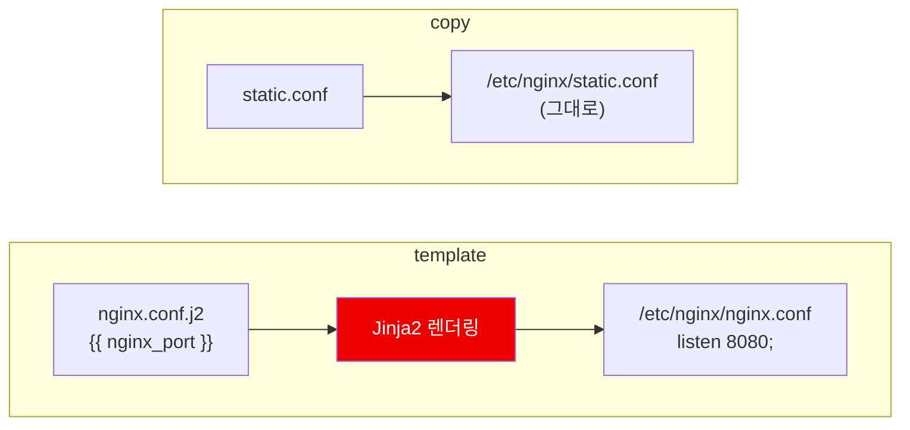
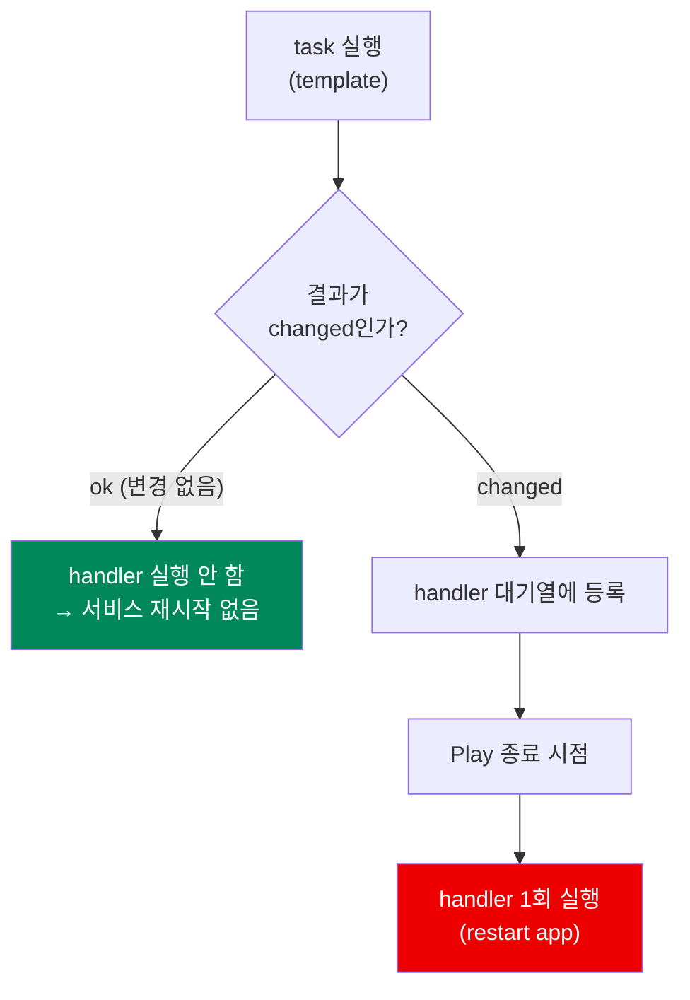
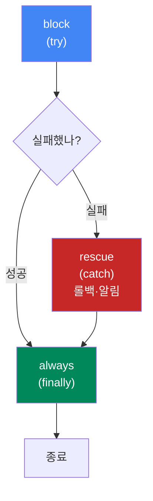
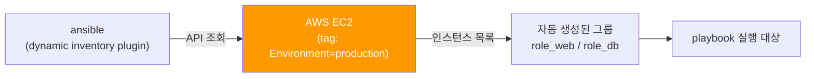
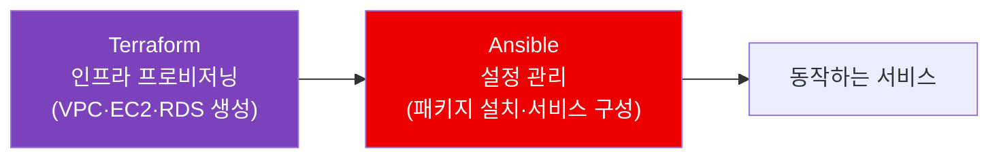

## 📚 들어가며

[1편](/posts/Ansible-01-Docker-Practice-Environment-Troubleshooting/)에서 Docker로 실습 환경을 만들고, [2편](/posts/Ansible-02-How-It-Works-and-Basic-Syntax/)에서 inventory·ad-hoc·playbook의 기본 문법을 봤다.

이번 편은 **실제 운영 환경에서 Ansible을 쓸 때 반드시 마주치게 되는 기능들**을 정리한다. 기본 문법만으로도 서버 한두 대는 다룰 수 있지만, "서버가 수백 대라면", "비밀번호는 어떻게 저장하나", "배포가 실패하면 롤백은" 같은 질문 앞에서는 심화 기능이 필요해진다.

> **이번 편의 구성** — 변수·템플릿(1~2) → 실행 제어(3~4) → 구조화(5) → 보안(6) → 안전장치(7~8) → 확장(9~12) 순으로, 실무에서 마주치는 순서에 가깝게 배치했다.

---

## 1. 변수 우선순위 (Variable Precedence)

Ansible에서 변수를 정의할 수 있는 곳은 **매우 많다.** 같은 이름의 변수가 여러 곳에 있으면 우선순위에 따라 하나가 선택된다.

```
낮은 순위
    role defaults (defaults/main.yml)
      ↓
    inventory vars
      ↓
    inventory group_vars
      ↓
    inventory host_vars
      ↓
    playbook vars
      ↓
    role vars (vars/main.yml)
      ↓
    task vars
      ↓
    extra vars (-e)   ← 항상 최우선
높은 순위
```

핵심만 기억하면 세 가지다.

| 위치 | 우선순위 | 용도 |
|------|:---:|------|
| **`defaults/main.yml`** | **가장 약함** | role **사용자가 쉽게 덮어쓰라고** 만든 기본값 |
| **`vars/main.yml`** | 강함 | role 내부에서 **고정하고 싶은** 값 |
| **`-e` (extra vars)** | **무조건 이김** | CLI에서 **강제 주입** |

```bash
ansible-playbook site.yml -e "nginx_port=8080"
```

> 💡 **role을 만들 때의 기준** — "사용자가 바꿀 수 있어야 하는 값"은 `defaults/`에, "바꾸면 안 되는 값"은 `vars/`에 넣는다. 이 구분만 지켜도 role의 재사용성이 크게 달라진다.

> ⚠️ 반대로 말하면, `vars/`에 넣은 값은 role을 쓰는 쪽에서 웬만해선 못 바꾼다. 유연해야 할 값을 `vars/`에 넣어두면 "왜 안 먹히지?" 하는 디버깅 시간이 길어진다.

---

## 2. Jinja2 템플릿

설정 파일을 **변수 기반으로 동적 생성**할 때 쓴다. `.j2` 확장자를 관습적으로 붙인다.

**templates/nginx.conf.j2**

```jinja
server {
    listen {{ nginx_port }};
    server_name {{ ansible_facts['hostname'] }};

    
    ssl_certificate {{ ssl_cert_path }};
    

    
    upstream_server {{ backend }};
    
}
```

**playbook**

```yaml
- name: Deploy nginx config
  template:
    src: nginx.conf.j2
    dest: /etc/nginx/nginx.conf
    owner: root
    mode: '0644'
  notify: restart nginx
```

### 2-1. copy vs template

| 모듈 | 동작 | 언제 |
|:---:|------|------|
| **`copy`** | 파일을 **그대로** 복사 | 정적 파일 |
| **`template`** | **Jinja2로 변수를 치환한 뒤** 복사 | 변수가 들어가는 설정 파일 |



> 💡 **변수가 들어가면 `template`, 정적 파일이면 `copy`.** 기본 중의 기본인데, 처음엔 `copy`로 만들어두고 나중에 변수를 넣으면서 모듈 교체를 잊는 실수가 흔하다.

### 2-2. Jinja2 문법 요약

| 문법 | 용도 |
|------|------|
| `{{ 변수 }}` | 값 출력 |
| ` ... ` | 조건문 |
| ` ... ` | 반복문 |
| `{# 주석 #}` | 주석 |
| `{{ var \| default('값') }}` | 기본값 지정 (filter) |
| `{{ var \| upper }}` | 문자열 변환 등 filter |

> 💡 `default()` 필터는 변수가 정의되지 않았을 때 playbook 전체를 실패시키지 않게 해주는 **방어 장치**다. 옵셔널한 변수에는 습관적으로 붙여두면 좋다.

---

## 3. Handler와 notify

**변경이 발생했을 때만** 실행되는 특수한 task다.

```yaml
tasks:
  - name: Update app config
    template:
      src: app.conf.j2
      dest: /etc/app/app.conf
    notify: restart app

handlers:
  - name: restart app
    service:
      name: app
      state: restarted
```

### 3-1. 동작 규칙



| # | 규칙 | 효과 |
|:---:|------|------|
| 1 | `notify`한 task가 **실제로 `changed`일 때만** 트리거 | 설정 파일이 그대로면 **서비스 재시작도 안 함** |
| 2 | handler는 **Play가 끝날 때 한 번만** 실행 | 여러 task가 같은 handler를 notify해도 **중복 실행 없음** |
| 3 | handler 이름은 `notify` 문자열과 **정확히 일치** | 오타 시 조용히 실행되지 않음 |

> 💡 이 구조 덕분에 **"불필요한 서비스 재시작"을 자연스럽게 방지**할 수 있다. 2편에서 본 멱등성 철학이 실제 기능으로 구현된 대표적인 예다.

> ⚠️ handler 이름 오타는 **에러가 아니라 침묵**으로 나타난다. "설정은 바뀌었는데 서비스가 반영이 안 된다" 싶으면 `notify` 문자열부터 확인할 것.

### 3-2. 즉시 실행이 필요할 때

```yaml
- meta: flush_handlers
```

Play 중간에 이 task를 넣으면 **대기 중인 handler를 강제로 실행**시킬 수 있다. "설정 반영 후 다음 task가 그 서비스에 의존하는" 경우에 쓴다.

---

## 4. Loop와 Conditional

### 4-1. loop

```yaml
- name: Install multiple packages
  apt:
    name: "{{ item }}"
    state: present
  loop:
    - nginx
    - git
    - curl
```

딕셔너리 리스트도 가능하다.

```yaml
- name: Create users
  user:
    name: "{{ item.name }}"
    groups: "{{ item.group }}"
  loop:
    - { name: 'alice', group: 'admin' }
    - { name: 'bob', group: 'dev' }
```

> ⚠️ **`with_items`는 구버전 문법이다.** 현재는 `loop` 사용이 권장된다. 오래된 블로그 글을 참고하다 보면 `with_*` 계열이 자주 보이는데, 새로 작성하는 코드는 `loop`로 통일하는 게 좋다.

### 4-2. when (조건부 실행)

```yaml
- name: Install on Debian only
  apt:
    name: nginx
  when: ansible_facts['os_family'] == "Debian"

- name: Install on RedHat only
  yum:
    name: nginx
  when: ansible_facts['os_family'] == "RedHat"
```

**1편에서 겪었던 `sshd` vs `ssh` 같은 배포판 차이를 처리하는 방법이 바로 이것이다.**

```yaml
- name: Ensure SSH is running
  systemd:
    name: "{{ 'sshd' if ansible_facts['os_family'] == 'RedHat' else 'ssh' }}"
    state: started
```

| 방식 | 특징 |
|------|------|
| **task를 나누고 `when`** | 배포판별 모듈 자체가 다를 때 (`apt` vs `yum`) |
| **인라인 삼항 연산** | 값만 다를 때 (유닛 이름 `sshd` vs `ssh`) |

> 💡 2편에서 "facts가 왜 필요한가"의 답이 여기 있다. `gather_facts: true`로 수집한 `ansible_facts['os_family']`가 있어야 이런 분기가 가능하다.

### 4-3. register

task 실행 결과를 변수에 저장해서 **다음 task에서 활용**한다.

```yaml
- name: Check if file exists
  stat:
    path: /etc/app/config.yml
  register: config_file

- name: Create config if missing
  template:
    src: config.yml.j2
    dest: /etc/app/config.yml
  when: not config_file.stat.exists
```


---

## 5. Role — 재사용 가능한 구조화

**실무에서는 거의 항상 role 단위로 구성한다.**

```bash
ansible-galaxy init nginx
```

### 5-1. 표준 디렉터리 구조

```
roles/
  nginx/
    tasks/main.yml       # 실행할 task들
    handlers/main.yml    # handler 정의
    templates/           # .j2 템플릿 파일
    files/               # 정적 파일
    vars/main.yml        # role 전용 변수 (우선순위 높음)
    defaults/main.yml    # 기본값 (우선순위 낮음, 덮어쓰기 쉬움)
    meta/main.yml        # 의존성, 메타정보
```

| 디렉터리 | 역할 | 대응 모듈/개념 |
|:---:|------|------|
| `tasks/` | 실행할 task 목록 | playbook의 `tasks:` |
| `handlers/` | handler 정의 | `notify` 대상 |
| `templates/` | Jinja2 템플릿 | `template` 모듈 |
| `files/` | 정적 파일 | `copy` 모듈 |
| **`defaults/`** | **덮어쓰기 쉬운 기본값** | 우선순위 **최하** |
| **`vars/`** | **고정하고 싶은 값** | 우선순위 **높음** |
| `meta/` | 의존성·메타정보 | 다른 role 의존 선언 |

### 5-2. 사용하는 쪽

```yaml
---
- name: Configure web servers
  hosts: web
  roles:
    - nginx
    - { role: app, app_version: "1.2.0" }
```

Role을 쓰면 **playbook이 짧아지고, 같은 role을 여러 프로젝트에서 재사용**할 수 있다. `ansible-galaxy`를 통해 커뮤니티가 만든 role을 가져다 쓸 수도 있다.

> 💡 1편에서 썼던 geerlingguy 이미지의 그 **geerlingguy**가 Ansible Galaxy에서 가장 유명한 role 제작자 중 한 명이다. 잘 만든 role이 어떤 구조인지 보고 싶다면 좋은 참고 자료가 된다.

---

## 6. Ansible Vault — 민감 정보 암호화

DB 비밀번호, API 키 등을 **평문으로 저장소에 올릴 수는 없다.**

```bash
ansible-vault create secrets.yml          # 암호화된 파일 새로 생성
ansible-vault edit secrets.yml            # 편집 (자동 복호화 → 저장 시 재암호화)
ansible-vault encrypt existing.yml        # 기존 파일 암호화
ansible-vault decrypt secrets.yml         # 복호화
ansible-vault view secrets.yml            # 보기만
```

**실행 시 복호화**

```bash
ansible-playbook site.yml --ask-vault-pass
ansible-playbook site.yml --vault-password-file ~/.vault_pass
```

| 상황 | 방식 |
|------|------|
| 로컬에서 직접 실행 | `--ask-vault-pass` (대화형 입력) |
| **CI/CD 파이프라인** | `--vault-password-file` 또는 **외부 secret manager 연계** |

> ⚠️ CI/CD 파이프라인에서는 **대화형 입력이 불가능하다.** `--vault-password-file`을 쓰거나, vault 비밀번호 자체를 **AWS Secrets Manager, HashiCorp Vault** 같은 외부 secret manager에서 가져오는 방식을 사용한다. 비밀번호 파일 자체를 저장소에 커밋하는 실수는 절대 금물이다.

특정 **변수 값만** 암호화하는 것도 가능하다.

```bash
ansible-vault encrypt_string 'mypassword' --name 'db_password'
```

> 💡 파일 전체를 암호화하면 diff가 통째로 깨져서 코드 리뷰가 어려워진다. **비밀 값만 `encrypt_string`으로 암호화**해 일반 변수 파일에 섞어두면, 나머지 설정은 평문으로 리뷰할 수 있다.

---

## 7. Check Mode — dry run

```bash
ansible-playbook site.yml --check
ansible-playbook site.yml --check --diff
```

실제 변경을 적용하지 않고 **"이 playbook을 돌리면 무엇이 바뀔지"만 시뮬레이션**한다.

| 옵션 | 결과 |
|:---:|------|
| `--check` | 변경 없이 `changed` 여부만 보여줌 |
| `--check --diff` | **파일 내용의 변경 사항까지 diff 형태로** 표시 |

운영 환경 배포 전 안전장치로 **실무에서 매우 자주 쓴다.**

> ⚠️ `shell`/`command` 모듈처럼 **check mode를 지원하지 않는 모듈은 정확한 결과를 보여주지 못한다.** 이런 task에는 `check_mode: false`를 명시해 제외할 수 있다.

---

## 8. 에러 핸들링 — block / rescue / always

```yaml
tasks:
  - block:
      - name: Try risky deployment
        command: /opt/deploy.sh
    rescue:
      - name: Rollback on failure
        command: /opt/rollback.sh
      - name: Notify failure
        debug:
          msg: "배포 실패, 롤백 수행함"
    always:
      - name: Cleanup temp files
        file:
          path: /tmp/deploy
          state: absent
```

**try / catch / finally와 동일한 구조**다.



### 관련 옵션들

```yaml
- name: 실패해도 계속 진행
  command: /bin/false
  ignore_errors: true

- name: 특정 조건일 때만 실패로 처리
  command: /opt/check.sh
  register: result
  failed_when: result.rc != 0 and 'warning' not in result.stdout

- name: changed 판정 커스터마이징
  shell: /opt/script.sh
  register: out
  changed_when: "'updated' in out.stdout"
```

| 옵션 | 역할 |
|------|------|
| `ignore_errors` | 실패해도 playbook을 계속 진행 |
| `failed_when` | **무엇을 실패로 볼지** 직접 정의 |
| **`changed_when`** | **무엇을 변경으로 볼지** 직접 정의 |

> 💡 **`changed_when`은 `shell`/`command` 모듈의 멱등성 문제를 해결하는 실용적인 방법이다.** 2편에서 "셸 모듈은 본질적으로 멱등하지 않다"고 했는데, 스크립트 출력에 `updated`가 있을 때만 `changed`로 판정하게 만들면 멱등성을 흉내 낼 수 있다.

---

## 9. Dynamic Inventory

클라우드 환경에서는 인스턴스가 **수시로 생성/삭제**되므로 static inventory 파일을 손으로 관리할 수 없다. 클라우드 API를 조회해 inventory를 자동 생성하는 **dynamic inventory plugin**을 쓴다.



**inventory_aws_ec2.yml**

```yaml
plugin: aws_ec2
regions:
  - ap-northeast-2
filters:
  tag:Environment: production
  instance-state-name: running
keyed_groups:
  - key: tags.Role
    prefix: role
```

```bash
ansible-inventory -i inventory_aws_ec2.yml --graph   # 결과 확인
ansible-playbook -i inventory_aws_ec2.yml site.yml
```

**태그 기반으로 그룹이 자동 생성**되므로, `role_web` 같은 그룹을 playbook에서 바로 쓸 수 있다.

| 플러그인 | 대상 |
|:---:|------|
| `aws_ec2` | AWS EC2 |
| `azure_rm` | Azure |
| `gcp_compute` | GCP |
| `kubernetes` | K8s 리소스 |

> 💡 static inventory가 "내가 관리하는 서버 목록을 내가 적는 것"이라면, dynamic inventory는 **"클라우드에 실제로 떠 있는 것이 곧 진실"**이다. 오토스케일링 환경에서는 후자가 아니면 관리가 불가능하다.

---

## 10. ansible.cfg — 설정과 성능

프로젝트 루트에 두면 **매번 옵션을 넣지 않아도 된다.**

```ini
[defaults]
inventory = ./inventory.ini
remote_user = root
host_key_checking = False
forks = 20
gathering = smart
stdout_callback = yaml

[ssh_connection]
pipelining = True
ssh_args = -o ControlMaster=auto -o ControlPersist=60s
```

| 옵션 | 의미 |
|------|------|
| **`forks`** | 동시에 처리할 호스트 수 (**기본 5**). 서버가 수백 대면 이 값이 곧 속도다 |
| **`gathering = smart`** | facts를 **캐싱**해 중복 수집을 피한다 |
| **`pipelining = True`** | **SSH 왕복 횟수를 줄여** 실행 속도를 크게 개선 |
| `ControlPersist` | SSH 연결을 **재사용**해 접속 오버헤드 감소 |

> 💡 대규모 인프라에서 **"Ansible이 느린데 어떻게 개선하나요?"**라는 질문이 나오면 **`forks`, `pipelining`, `gathering`, `async`** 이 네 가지를 얘기하면 된다.

> ⚠️ `host_key_checking = False`는 1편의 `StrictHostKeyChecking=no`와 같은 성격의 설정이다. 실습 환경에서는 편하지만 **운영 환경에서는 켜두는 게 원칙**이다.

---

## 11. Collections

Ansible **2.10부터** 모듈들이 core에서 분리되어 **collection 단위**로 배포된다.

```bash
ansible-galaxy collection install amazon.aws
ansible-galaxy collection install community.general
```

```yaml
- name: Create EC2 instance
  amazon.aws.ec2_instance:
    name: web-server
    instance_type: t3.micro
```

| Collection | 용도 |
|:---:|------|
| **`ansible.builtin`** | 기본 내장 모듈 (`apt`, `copy`, `file` 등) |
| `amazon.aws` | AWS 리소스 관리 |
| `community.general` | 커뮤니티 범용 모듈 |
| `ansible.posix` | POSIX 관련 (`sysctl`, `mount` 등) |
| `kubernetes.core` | K8s 리소스 관리 |

> 💡 **FQCN**(Fully Qualified Collection Name, `amazon.aws.ec2_instance`)으로 쓰는 것이 권장된다. 짧은 이름(`ec2_instance`)은 collection 간 이름 충돌 가능성이 있고, 어떤 collection의 모듈인지 코드만 봐서는 알 수 없다.

---

## 12. Terraform과의 관계

DevOps 포지션에서 **자주 묻는 비교**다.

| 항목 | **Terraform** | **Ansible** |
|------|------|------|
| **주 용도** | 인프라 **프로비저닝** | 설정 **관리** |
| **상태 관리** | **state 파일**로 관리 | 상태 파일 없음 |
| **방식** | 선언적 | 선언적 (절차적 요소도 있음) |
| **대상** | 클라우드 리소스 (VPC, EC2, RDS) | OS 내부 설정, 패키지, 서비스 |

실무에서는 **둘 다 함께 쓰는 경우가 많다.**



> 💡 **Terraform으로 인프라를 프로비저닝 → Ansible로 그 위에 소프트웨어 설치 및 설정.** 이 조합을 설명할 수 있으면 실무 이해도가 잘 드러난다. "빈 서버를 만드는 도구"와 "서버 안을 채우는 도구"로 구분하면 기억하기 쉽다.

---

## 🎯 면접 대비 핵심 포인트

### 반드시 알아야 할 것

| # | 주제 | 핵심 |
|:---:|------|------|
| 1 | **멱등성(Idempotency)** | 무엇이고 **어떻게 보장되는가** |
| 2 | **Agentless / Push 방식** | Puppet, Chef와의 차이 |
| 3 | **Handler와 notify** | **왜 이 구조가 필요한가** |
| 4 | **Role 구조** | `vars`와 `defaults`의 차이 포함 |
| 5 | **Vault** | 민감 정보 관리 방법 |
| 6 | **Dynamic Inventory** | 클라우드 환경에서 **왜 필요한가** |

### 알면 플러스

- 변수 우선순위 (`-e`가 최우선)
- `--check --diff`로 dry run
- `block` / `rescue` / `always` 에러 핸들링
- `forks`, `pipelining`으로 성능 튜닝
- Terraform과의 역할 분담
- Collections와 FQCN

### 예상 질문 정리

| 질문 | 답변 방향 |
|------|------|
| Ansible과 **Terraform**의 차이는? | 프로비저닝 vs 설정 관리, state 유무, 실무에선 **병행 사용** |
| Ansible과 **Puppet/Chef**의 차이는? | **agentless vs agent**, **push vs pull** |
| **멱등성**은 어떻게 보장되나? | 모듈이 상태 기반(`state: present`)으로 설계됨. `shell`은 예외이므로 `creates`/`changed_when` 활용 |
| **Handler**와 일반 task의 차이는? | **`changed`일 때만** 실행, **Play 종료 시 1회만** 실행 |
| **`copy`와 `template`**의 차이는? | **Jinja2 변수 치환 여부** |
| 대상 서버가 **수천 대**라면? | `forks` 조정, `pipelining`, facts 캐싱, `async`/`serial` 활용 |
| **비밀번호**는 어떻게 관리하나? | Ansible Vault, CI/CD에선 외부 secret manager 연계 |
| Agentless인데 **정말 아무 의존성도 없나?** | **대상 노드에 Python 필요**, `raw` 모듈로 부트스트랩 가능 |

---

## 📝 정리

```
Ansible 실무 심화
├─ 변수      defaults(약) < inventory < playbook < vars(강) < -e(최강)
├─ 템플릿    copy(정적) vs template(Jinja2 치환)
├─ Handler   changed일 때만 + Play 종료 시 1회 → 불필요한 재시작 방지
├─ 제어      loop / when(facts 분기) / register
├─ Role      tasks·handlers·templates·files·vars·defaults·meta
├─ Vault     create/edit/encrypt_string + CI에선 secret manager 연계
├─ 안전장치  --check --diff (dry run) / block·rescue·always
├─ 확장      dynamic inventory(aws_ec2) / collections(FQCN)
├─ 성능      forks · pipelining · gathering · async
└─ 조합      Terraform(프로비저닝) → Ansible(설정 관리)
```

| 핵심 개념 | 한 줄 정의 |
|------|------|
| **변수 우선순위** | `-e`가 항상 최우선, `defaults/`가 가장 약함 |
| **template** | Jinja2로 변수를 치환해 설정 파일을 동적 생성 |
| **Handler** | `changed`일 때만, Play 끝에 한 번 실행 |
| **Role** | 재사용 가능하게 구조화한 playbook 단위 |
| **Vault** | 민감 정보를 암호화해 저장소에 보관 |
| **Check Mode** | 실제 변경 없이 결과만 시뮬레이션 |
| **Dynamic Inventory** | 클라우드 API를 조회해 대상 목록을 자동 생성 |
| **pipelining / forks** | SSH 왕복 감소 / 동시 처리 호스트 수 |

---

## 💭 마무리

3편에 걸쳐 **Ansible 실습 환경 구축부터 실무 기능까지** 정리했다.

개념을 글로만 읽었을 때보다, **직접 컨테이너를 띄우고 다섯 번쯤 막히면서 배운 게 훨씬 오래 남았다.** 특히 아래 두 질문은 문서만 읽어서는 나오기 어려운 것들이었다.

- "agentless인데 **왜 Python 버전 때문에 실패**하는가"
- "SSH를 고치는 데 SSH가 필요한 **순환 문제를 어떻게 푸는가**"

Ansible을 처음 접한다면 시간이 짧더라도 **컨테이너 2개를 띄워놓고 `ping` → ad-hoc → playbook → role 순서로 한 번씩 손으로 돌려보길** 권한다. 막히는 지점 하나하나가 곧 이 도구의 설계를 이해하는 입구가 된다.


---

## 🔗 참고

- [Ansible Documentation — Using Variables (Variable precedence)](https://docs.ansible.com/ansible/latest/playbook_guide/playbooks_variables.html)
- [Ansible Documentation — Templating (Jinja2)](https://docs.ansible.com/ansible/latest/playbook_guide/playbooks_templating.html)
- [Ansible Documentation — Roles](https://docs.ansible.com/ansible/latest/playbook_guide/playbooks_reuse_roles.html)
- [Ansible Documentation — Encrypting content with Ansible Vault](https://docs.ansible.com/ansible/latest/vault_guide/index.html)
- [Ansible Documentation — Working with dynamic inventory](https://docs.ansible.com/ansible/latest/inventory_guide/intro_dynamic_inventory.html)
