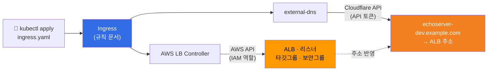
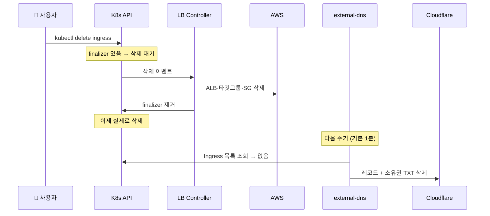
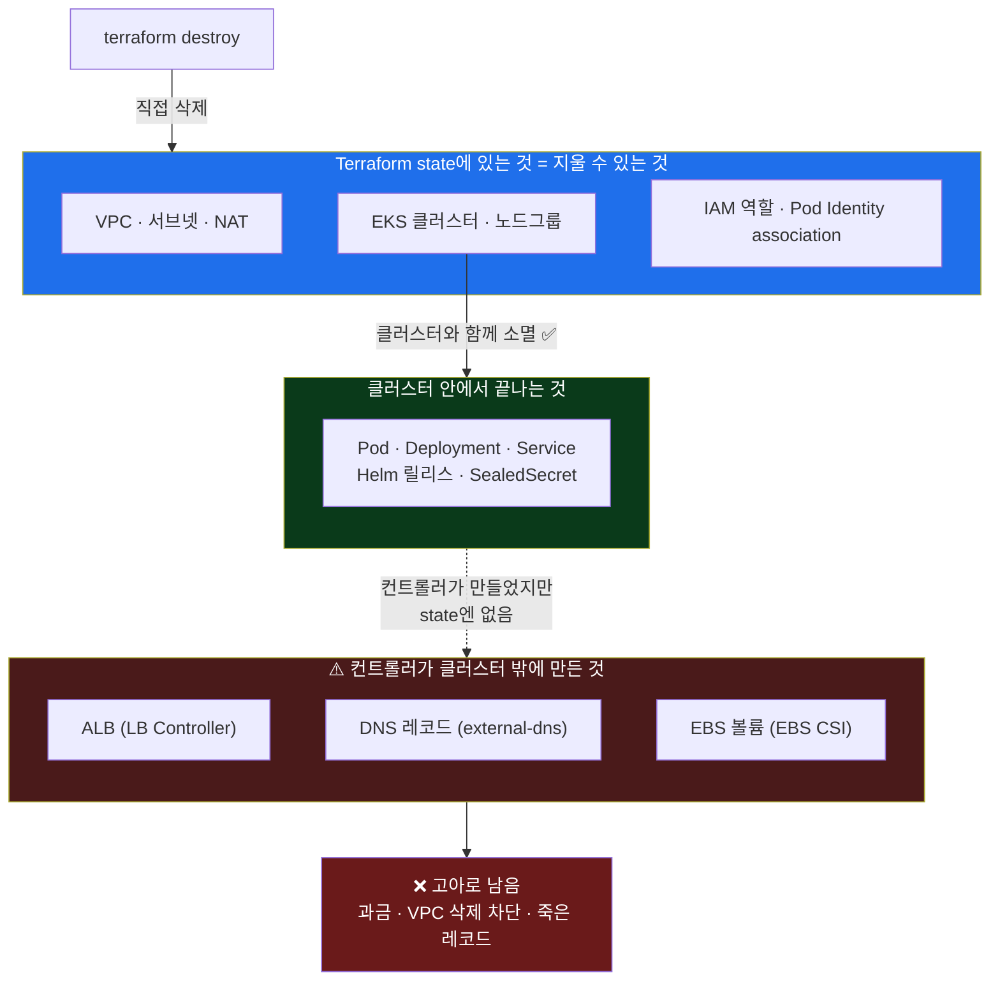
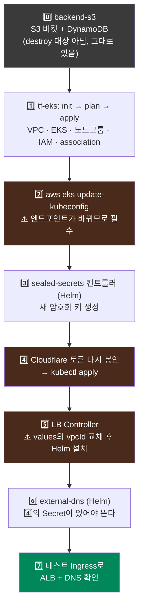

## 📚 들어가며

[4편](/posts/EKS-Rebuild-04-Helm-IMDS-Cloudflare-SealedSecrets/)에서 컨트롤러 세 개를 Helm으로 깔았다. 이번 편은 그 셋이 **실제로 맞물려 돌아가는지 확인**하는 데서 시작한다.

| 구성요소 | 역할 | 권한 |
|---|---|---|
| AWS Load Balancer Controller | Ingress를 보고 **AWS ALB**를 만든다 | IAM 역할 (Pod Identity) |
| external-dns | Ingress의 호스트명을 보고 **Cloudflare DNS 레코드**를 만든다 | Cloudflare API 토큰 (SealedSecret) |
| SealedSecrets | 위 Cloudflare 토큰을 암호화해서 git에 보관 | — |

테스트 Ingress 하나로 ALB와 DNS가 자동으로 생기는 걸 확인한 뒤, 자연스럽게 질문이 이어졌다. **지우면 같이 지워지나? `terraform destroy` 하면 다 없어지나?** 그리고 비용 때문에 클러스터를 지웠다가 **한참 뒤 다시 만들면서** 챙겨야 할 것들을 정리했다.

이번 편부터는 처음 보는 사람도 읽을 수 있게, Ingress·ALB·ACM 같은 개념이 처음 나올 때 짧게 설명을 붙였다.

> **이번 편 학습 지도**
>
> ```
> 검증                    Q&A                          재구축
> ──────                  ──────                       ──────
> Ingress 개념            Q1. 지우면 같이 지워지나?      재설치 순서
> 어노테이션 = ALB 설정    Q2. external-dns IAM은?       vpcId가 매번 바뀜
> ALB + DNS 자동 생성      Q3. destroy면 다 없어지나? 🔦   Helm release name
> ```

---

## 1. 테스트용 Ingress로 end-to-end 검증

### 1-1. 개념 먼저: Service, Ingress, IngressClass, ALB

- **Service (ClusterIP)** — 클러스터 **안**에서만 접근 가능한 고정 주소. 파드 여러 개 앞에 서서 트래픽을 나눠준다.
- **Ingress** — "외부에서 들어오는 HTTP(S) 요청을 **어떤 호스트/경로**면 **어느 Service**로 보낼지"를 적은 **규칙 문서**다. Ingress 자체는 아무 트래픽도 처리하지 않는다. 그 규칙을 읽어서 실제 로드밸런서를 만드는 건 **Ingress Controller**의 몫이다.
- **IngressClass** (`ingressClassName: alb`) — 클러스터에 Ingress Controller가 여러 개 있을 수 있으니 "이 Ingress는 누가 처리할지"를 지정한다. `alb`는 AWS Load Balancer Controller를 뜻한다.
- **ALB (Application Load Balancer)** — AWS의 L7(HTTP) 로드밸런서. 호스트·경로 기반 라우팅과 HTTPS 종료를 해준다.

### 1-2. 테스트 매니페스트

echoserver(요청 정보를 그대로 돌려주는 테스트용 서버)를 Deployment + Service + Ingress로 띄웠다. Ingress만 보면 이렇다.

```yaml
apiVersion: networking.k8s.io/v1
kind: Ingress
metadata:
  name: echoserver
  namespace: default
  annotations:
    alb.ingress.kubernetes.io/scheme: internet-facing
    alb.ingress.kubernetes.io/target-type: ip
    alb.ingress.kubernetes.io/group.name: sg-external
    alb.ingress.kubernetes.io/listen-ports: '[{"HTTP": 80}, {"HTTPS":443}]'
    alb.ingress.kubernetes.io/ssl-redirect: "443"
    alb.ingress.kubernetes.io/certificate-arn: arn:aws:acm:ap-northeast-2:123456789012:certificate/<CERT_ID>
    external-dns.alpha.kubernetes.io/hostname: echoserver-dev.example.com
spec:
  ingressClassName: alb
  rules:
  - host: echoserver-dev.example.com
    http:
      paths:
      - path: /echo-server
        pathType: Prefix
        backend:
          service:
            name: echoserver
            port:
              number: 80
```

### 1-3. 어노테이션 하나씩 — 각각이 ALB의 어떤 설정이 되는가

Ingress의 `spec`은 라우팅 규칙이고, **ALB를 어떻게 만들지는 거의 전부 어노테이션**으로 정한다. 레퍼런스로 쓸 만해서 표로 정리했다.

| 어노테이션 | 의미 |
|---|---|
| `scheme: internet-facing` | 인터넷에서 접근 가능한 ALB를 **public 서브넷**에 만든다 (`internal`이면 VPC 안에서만 접근). 2편에서 public 서브넷에 `kubernetes.io/role/elb=1` 태그를 달아둔 게 여기서 쓰인다 — 컨트롤러는 이 태그로 배치할 서브넷을 찾는다 |
| `target-type: ip` | ALB가 트래픽을 **파드 IP로 직접** 보낸다. EKS의 VPC CNI 덕분에 파드가 실제 VPC IP를 갖고 있어서 가능하다 (`instance`면 노드의 NodePort를 거쳐 한 단계 더 돈다) |
| `group.name: sg-external` | **같은 group 이름을 가진 Ingress들이 ALB 하나를 공유**한다. 서비스마다 ALB를 따로 만들면 ALB 개수만큼 비용이 나온다 |
| `listen-ports` | ALB가 80, 443 포트를 연다 |
| `ssl-redirect: "443"` | HTTP(80)로 들어온 요청을 HTTPS(443)로 리다이렉트 |
| `certificate-arn` | HTTPS에 쓸 **ACM 인증서**. ACM(AWS Certificate Manager)은 AWS가 발급·자동 갱신해주는 무료 TLS 인증서 서비스이고, ALB에는 ACM 인증서를 붙인다 |
| `external-dns.alpha.kubernetes.io/hostname` | external-dns에게 "이 이름으로 DNS 레코드를 만들어라"라고 알려준다 |

> **💡 따라 하기 전에: ACM 인증서는 미리 발급받아둬야 한다**
>
> `certificate-arn`에 넣을 인증서는 Ingress를 만들기 **전에** ACM에서 발급이 끝나 있어야 한다. 발급 요청 시 **DNS 검증**을 고르면 ACM이 CNAME 레코드 하나를 알려주는데, 그걸 도메인의 DNS(내 경우 Cloudflare)에 추가해야 "이 도메인의 주인이 맞다"는 검증이 통과된다. 그리고 인증서는 **ALB와 같은 리전**(여기선 `ap-northeast-2`)에서 발급해야 붙일 수 있다.

`group.name`의 효과는 실제로 확인할 수 있었다. echoserver(`default` 네임스페이스)와 별도로 띄운 `nginx-hello`(`nginx` 네임스페이스)에 **같은 `group.name: sg-external`** 을 줬더니, 네임스페이스가 달라도 **ALB는 하나만** 생기고 그 안에 두 호스트의 규칙이 같이 들어갔다.

### 1-4. 결과: 콘솔을 한 번도 안 열었다

`kubectl apply` 후 몇 분 안에 **ALB 생성 + Cloudflare 레코드 생성**까지 자동으로 끝났다. **사람이 AWS 콘솔이나 Cloudflare 대시보드를 한 번도 열지 않았다**는 게 이 구성의 핵심이다.



---

## 2. Q. Ingress를 지우면 ALB와 DNS 레코드도 같이 지워지나?

> **A. 둘 다 지워진다. 단, 각자 이유가 다르다.**

### 2-1. ALB — 컨트롤러가 finalizer로 붙잡고 정리한다

LB Controller는 자기가 ALB를 만든 Ingress에 **finalizer**를 단다. finalizer는 쿠버네티스 오브젝트에 붙는 "이걸 지우기 전에 내가 정리할 게 있으니 기다려"라는 표시다. 그룹을 쓰는 경우 `group.ingress.k8s.aws/<그룹명>` 형태로 붙는다.

```bash
kubectl get ingress echoserver -o jsonpath='{.metadata.finalizers}'
```

Ingress를 `kubectl delete`하면 쿠버네티스는 **바로 지우지 않고 삭제 대기 상태**로 둔다. 컨트롤러가 ALB·타깃그룹·보안그룹을 다 지운 뒤 finalizer를 떼면, 그때서야 Ingress가 사라진다.



**`group.name`을 쓸 때 주의**: ALB를 여러 Ingress가 공유하니까, **그룹의 마지막 Ingress가 지워질 때** ALB가 지워진다. 그 전까지는 해당 Ingress의 규칙만 ALB에서 빠진다.

### 2-2. DNS 레코드 — `policy: sync` 덕분에 지워진다

4편에서 external-dns를 설치할 때 이렇게 설정했었다.

```yaml
policy: sync   # Ingress가 사라지면 레코드도 삭제
```

`upsert-only`였다면 생성·수정만 하고 **삭제는 하지 않는다.** 실제로 테스트 Ingress를 지운 뒤 로그에서 삭제가 확인됐다.

```
level=info msg="Changing record." action=DELETE record=cname-hello.example.com type=TXT zone=<ZONE_ID>
level=info msg="All records are already up to date"
```

external-dns는 기본 1분 간격(`--interval=1m`)으로 상태를 맞추기 때문에, 지운 **직후가 아니라 다음 주기에** 반영된다.

### 2-3. 그럼 Cloudflare에서 레코드를 손으로 지워도 되나?

> **된다. 단, 짝지어 지워야 한다.**

위 로그에서 지워진 게 `TXT` 타입인 걸 볼 수 있다. external-dns는 레코드 하나를 만들 때마다 **소유권 표시용 TXT 레코드**를 같이 만든다.

```
hello.example.com         CNAME   → ALB 주소
cname-hello.example.com   TXT     "heritage=external-dns,external-dns/owner=mydev,..."
```

이 TXT가 "이 레코드는 `mydev` 클러스터의 external-dns가 관리한다"는 **증표**다. 4편의 `txtOwnerId: mydev`가 여기 들어간다. 그래서 어느 쪽을 지우느냐에 따라 결과가 갈린다.

| 손으로 지운 것 | 결과 |
|---|---|
| CNAME만 지움, TXT는 남음 | external-dns가 "내 레코드가 없네" 하고 **다시 만든다** (Ingress가 살아있다면) |
| **TXT만 지움, CNAME은 남음** | external-dns가 "내가 만든 게 아니네" 하고 **영원히 안 건드린다** → 수동 관리해야 하는 **고아 레코드** |
| 둘 다 지움 | 깔끔 |

**또 하나의 함정**: Ingress가 **아직 살아있는 상태**에서 레코드를 손으로 지우면, 1분 뒤 external-dns가 **그대로 다시 만든다.** 손으로 지우는 건 Ingress를 지운 뒤에도 레코드가 남았을 때만 의미가 있고, 그럴 땐 먼저 로그로 원인부터 보는 게 순서다.

```bash
kubectl logs -n kube-system -l app.kubernetes.io/name=external-dns
```

### 2-4. 덤: Cloudflare 프록시(주황 구름)를 켤까 말까

지금 설정은 **DNS-only(회색 구름)** 가 기본이다.

| 모드 | 동작 |
|---|---|
| DNS-only (현재) | 방문자가 **ALB로 바로** 접속. ALB 주소가 그대로 드러남 |
| Proxied (주황 구름) | 방문자가 **Cloudflare를 거쳐** 접속. ALB 주소가 숨겨지고 CDN 캐시·WAF·DDoS 방어가 붙음 |

켜는 방법은 전역(`extraArgs: {cloudflare-proxied: "true"}`)과 Ingress별 어노테이션 두 가지다. 켜면 앱이 방문자의 실제 IP를 알기 위해 **`CF-Connecting-IP` 헤더**를 봐야 한다는 점만 기억하면 된다. 실제 앱을 올릴 때 결정하기로 했다.

---

## 3. Q. external-dns는 IAM 역할을 안 만들었는데 어떻게 동작했지?

`irsa-role.tf`에서 LB Controller용 Pod Identity 블록은 주석을 풀었지만, external-dns용 블록은 **주석 상태 그대로**였다. 그런데 레코드는 잘 만들어졌다. 확인해봤다.

```bash
# external-dns 파드의 환경변수
kubectl get pod -n kube-system -l app.kubernetes.io/name=external-dns \
  -o jsonpath='{.items[0].spec.containers[0].env[*].name}'
# → CF_API_TOKEN          (AWS 자격증명 관련 변수는 없음)

# Pod Identity association이 걸린 서비스어카운트
aws eks list-pod-identity-associations --cluster-name mydev \
  --query 'associations[].serviceAccount' --output text
# → aws-load-balancer-controller   (external-dns는 없음)
```

> **A. 호출하는 API가 다르다.**

| | 호출하는 API | 인증 |
|---|---|---|
| LB Controller | **AWS** (`CreateLoadBalancer` 등) | IAM 역할 |
| external-dns | **Cloudflare** (DNS 레코드 생성/삭제) | Cloudflare API 토큰 |

AWS 권한은 **AWS API를 호출할 때만** 필요하다. external-dns는 AWS를 한 번도 부르지 않으니 IAM 역할이 있어도 쓸 데가 없다. 주석으로 남아있는 `external_dns_pod_identity` 블록은 이름 그대로 `attach_external_dns_policy`, 즉 **Route53용 정책**이라 강의처럼 Route53을 쓸 때만 필요하다.

3편에서 정리한 "파드가 AWS 자격증명으로 대체 뭘 하는데?"의 답이 여기서 반대 방향으로 확인된 셈이다. **AWS API를 안 부르면 AWS 자격증명도 필요 없다.**

---

## 4. 🔦 Q. Helm으로 깐 건 클러스터 안에 있으니, `terraform destroy` 하면 다 같이 없어지지?

이번 편의 핵심 질문이다.

> **A. 반만 맞다.** 기준은 **"그게 어디에 존재하느냐"** 다.



| 종류 | 예 | destroy 하면 |
|---|---|---|
| **클러스터 안에서 끝나는 것** | Pod, Deployment, Service, Helm 릴리스, SealedSecret 컨트롤러 | 클러스터와 함께 사라진다 ✅ |
| **컨트롤러가 클러스터 밖에 만든 것** | ALB(LB Controller), DNS 레코드(external-dns), EBS 볼륨(EBS CSI) | **Terraform이 존재 자체를 모른다** → 고아로 남는다 ❌ |

Terraform은 **자기가 state에 기록한 것만** 지운다. ALB는 Terraform이 아니라 LB Controller가 AWS API로 만든 것이라 state에 없다. 그리고 destroy로 클러스터가 사라지면 **ALB를 지워줄 컨트롤러도 같이 사라진다.** 그러면 이렇게 된다.

- ALB가 고아로 남아 **계속 과금**되고
- ALB의 네트워크 인터페이스(ENI)가 서브넷에 붙어 있어서 **VPC 삭제가 `DependencyViolation`으로 막히고**
- Cloudflare 레코드는 **존재하지 않는 주소를 가리키는 죽은 레코드**로 남는다

### 4-1. 실제로 겪은 일

사실 이 질문의 답을 확인하기 **전에** 이미 `terraform destroy`를 실행해버렸다. 그래서 바로 점검했다.

```bash
terraform state list                                       # → 비어 있음 (destroy 정상 완료)
aws eks list-clusters --region ap-northeast-2              # → []
aws elbv2 describe-load-balancers --region ap-northeast-2  # → 없음
aws ec2 describe-vpcs --filters "Name=tag:Name,Values=mydev"   # → 없음
```

결과는 깨끗했다. 이유는 그 시점에 **컨트롤러만 설치했고 Ingress는 하나도 없었기 때문**이다. 컨트롤러는 Ingress가 있어야 ALB를 만드니, 지울 ALB 자체가 없었다. **운이 좋았다기보다 그 시점엔 원래 안전했던 것**이다. Ingress를 띄운 뒤였다면 얘기가 달랐다.

### 4-2. destroy 전 체크리스트

```bash
# 1) 클러스터 밖에 리소스를 만드는 오브젝트가 남았는지
kubectl get ingress -A
kubectl get svc -A --field-selector spec.type=LoadBalancer
kubectl get pvc -A                     # EBS 볼륨 (다음 편)

# 2) 있으면 먼저 kubectl delete → 컨트롤러가 스스로 정리하게 둔 다음
#    AWS 쪽에서 정말 사라졌는지 확인
aws elbv2 describe-load-balancers --region ap-northeast-2
aws ec2 describe-security-groups --filters "Name=tag-key,Values=elbv2.k8s.aws/cluster"

# 3) 그다음에 destroy (tf-eks/ 에서만! backend-s3/ 는 건드리지 않는다)
terraform destroy
```

> **순서의 핵심**: 클러스터가 **살아있을 때** 오브젝트를 지워야 컨트롤러가 정리해준다. 클러스터를 먼저 날리면 **정리해줄 주체가 없다.**

### 4-3. SealedSecret은 재생성하면 못 쓴다

SealedSecrets 컨트롤러는 설치될 때 **암호화 키 쌍을 새로 만든다.** 클러스터를 지웠다 다시 만들면 새 컨트롤러가 새 키를 갖게 되고, git에 커밋해둔 `cloudflare-sealedsecret.yaml`은 **옛날 공개키로 암호화된 파일이라 더 이상 복호화할 수 없다.**

그래서 원본 값(Cloudflare 토큰)을 안전한 곳에 따로 보관해둬야 하고, **재생성할 때마다 다시 봉인(seal)** 해야 한다.

> 이걸 피하려면 컨트롤러의 키(`kube-system`의 `sealed-secrets-key*` Secret)를 백업해뒀다가 **새 클러스터에 컨트롤러보다 먼저 복원**하는 방법이 있다. 학습 환경에선 매번 다시 봉인하는 쪽이 단순해서 그렇게 했다.

---

## 5. 시간이 지나 다시 만들 때 — 재설치 순서

한참 뒤에 다시 만들려니 순서가 기억나지 않았다. 지금까지의 의존 관계를 따라 정리하면 이렇다.



주황색으로 칠한 세 단계(2·4·5)가 **"재생성하면 값이 바뀌어서"** 다시 해야 하는 것들이다.

| 재생성하면 바뀌는 것 | 왜 | 대응 |
|---|---|---|
| EKS API 엔드포인트 | 클러스터마다 새로 발급 (4편 함정 ①) | `update-kubeconfig` |
| SealedSecrets 키 쌍 | 컨트롤러 설치 시 새로 생성 | 토큰 다시 봉인 |
| VPC ID | VPC도 새로 만들어짐 | values의 `vpcId` 교체 |

### 5-1. 놓치기 쉬운 것: `vpcId`가 매번 바뀐다

4편에서 IMDS hop limit 문제를 피하려고 LB Controller values에 VPC ID를 직접 넣었다.

```yaml
vpcId: vpc-xxxxxxxxxxxxxxxxx
```

그런데 **VPC도 destroy/apply로 새로 만들어지면서 ID가 바뀐다.** 옛날 값을 그대로 두면 컨트롤러가 존재하지 않는 VPC를 찾는다. apply 후에 새 값을 확인해서 바꿔야 한다.

```bash
aws eks describe-cluster --name mydev \
  --query 'cluster.resourcesVpcConfig.vpcId' --output text
```

실제로 git 기록을 보면 재생성할 때마다 이 줄을 고친 커밋이 쌓여 있다.

```
6499bf7 fix: 클러스터 재생성을 위한 load-balancer-controller helm 차트 vpcId 수정 ...
75bbfc7 fix: load-balancer-controller helm 차트 vpcId 수정 ...
59fac10 fix: aws load balancer controller 수정 vpcId, region 추가(hop limit1 때문) ...
```

**하드코딩한 값의 대가**다. 근본 해결은 둘 중 하나다.

- 4편에서 미뤄둔 **노드 hop limit을 2로 올리기** — 컨트롤러가 IMDS로 VPC ID를 스스로 알아낸다
- **Terraform output을 values에 자동으로 넣기** — 사람이 옮겨 적는 단계를 없앤다

### 5-2. Helm 기초 다시 보기: release name은 내가 짓는 이름이다

```bash
helm install aws-load-balancer-controller -f ci/mydev-values.yaml . -n kube-system
#            ^^^^^^^^^^^^^^^^^^^^^^^^^^^^    ^^^^^^^^^^^^^^^^^^^^^ ^
#            release name (내가 지음)          values 오버라이드      설치할 차트 (현재 디렉토리)
```

- **`.`(차트)** — **무엇을** 설치할지. 그 디렉토리의 `Chart.yaml`이 정의한다 (`name: aws-load-balancer-controller`)
- **release name** — 그 설치본에 내가 붙이는 **별명**. 차트 이름과 같을 필요가 없다. `helm install my-lb ...`도 똑같이 동작하고, 그러면 이후 `helm upgrade my-lb`, `helm uninstall my-lb`로 다뤄야 한다. 관례상 차트 이름과 똑같이 지을 뿐이다

3편에서 본 Terraform의 `module "내가_짓는_이름" { source = "무엇을" }`과 같은 구조다. **"무엇을 설치하나"와 "그걸 뭐라고 부르나"가 분리**되어 있다.

설치된 릴리스 목록은 4편에서 정리한 대로 `-A`로 본다.

```bash
helm ls -A
```

```
NAME                          NAMESPACE    REVISION  STATUS    CHART
aws-load-balancer-controller  kube-system  1         deployed  aws-load-balancer-controller-3.5.0
external-dns                  kube-system  1         deployed  external-dns-1.21.1
sealed-secrets                kube-system  1         deployed  sealed-secrets-2.19.3
```

---

## 📝 이번 편 요약

```
Ingress → ALB + DNS
├─ Ingress는 규칙 문서. ALB는 LB Controller가, DNS는 external-dns가 만든다
├─ 어노테이션 하나하나가 ALB 설정 (ACM 인증서는 미리 발급 + 같은 리전)
└─ group.name 이 같으면 네임스페이스가 달라도 ALB 하나를 공유

Q1. Ingress를 지우면?
├─ ALB  → finalizer 덕분에 지워짐 (그룹이면 마지막 Ingress가 지워질 때)
├─ DNS  → policy: sync 덕분에 지워짐 (다음 주기, 기본 1분)
└─ 손으로 지울 땐 레코드 + 소유권 TXT를 짝지어 지운다

Q2. external-dns는 IAM 없이 어떻게?
└─ Cloudflare API만 부르니까. AWS API를 안 부르면 AWS 자격증명도 불필요

Q3. terraform destroy면 다 없어지나? 🔦
├─ state에 있는 것 + 클러스터 안 것 → 사라짐
├─ 컨트롤러가 클러스터 밖에 만든 것 (ALB · DNS · EBS) → 고아로 남음
└─ 클러스터가 살아있을 때 오브젝트부터 지운다

재구축
├─ 바뀌는 것 3가지: 엔드포인트 · SealedSecrets 키 · VPC ID
└─ Helm release name은 내가 짓는 별명
```

| 개념 | 한 줄 정의 |
|---|---|
| **Ingress** | 외부 HTTP(S) 요청을 어느 Service로 보낼지 적은 규칙 문서. 스스로는 트래픽을 처리하지 않음 |
| **IngressClass** | 이 Ingress를 어느 Controller가 처리할지 지정 (`alb` = LB Controller) |
| **`target-type: ip`** | ALB가 NodePort를 거치지 않고 파드 IP로 직접 보내는 방식 |
| **IngressGroup** (`group.name`) | 같은 그룹명의 Ingress들이 ALB 하나를 공유 |
| **ACM** | AWS가 발급·자동 갱신하는 무료 TLS 인증서. ALB와 같은 리전에서 발급 |
| **finalizer** | "지우기 전에 정리할 게 있으니 기다려"라는 표시. 컨트롤러가 정리 후 제거 |
| **소유권 TXT** | external-dns가 "내가 관리하는 레코드"임을 표시하는 짝 레코드 |
| **`policy: sync`** | 소스가 사라지면 DNS 레코드도 삭제 (`upsert-only`는 삭제 안 함) |
| **release name** | Helm 설치본에 붙이는 별명. 차트 이름과 별개 |

---

## 💭 느낀 점

**1. "콘솔을 한 번도 안 열었다"는 게 생각보다 크게 다가왔다.**

YAML 한 장을 apply했을 뿐인데 몇 분 뒤 브라우저로 `echoserver-dev` 주소에 HTTPS로 접속이 됐다. 그 사이 AWS에는 ALB·리스너·타깃그룹·보안그룹이, Cloudflare에는 레코드 두 개가 생겼다. 4편까지 컨트롤러를 하나씩 붙이면서 고생한 게 **이 한 번의 apply를 위한 준비**였다는 걸 실감했다.

**2. "지우면 같이 지워지나?"의 답이 "예"인데 이유가 둘 다 다르다는 게 재밌었다.**

ALB는 finalizer라는 쿠버네티스 메커니즘 덕분이고, DNS는 external-dns의 `policy: sync` 설정 덕분이다. 같은 결과를 **전혀 다른 장치**가 만들고 있었다. 4편에서 별생각 없이 넣었던 `policy: sync` 한 줄이 여기서 의미를 가졌다.

**3. `terraform destroy`를 너무 믿고 있었다.**

솔직히 질문을 하기 전에 이미 destroy를 눌렀다. 결과가 깨끗했던 건 실력이 아니라 **그 시점에 Ingress가 없었기 때문**이었다. "Terraform이 만든 클러스터 안에서 생긴 거니까 Terraform이 지우겠지"라는 막연한 믿음이 있었는데, **Terraform은 state에 적힌 것만 안다.** 컨트롤러라는 중간 주체가 끼는 순간, 누가 만들고 누가 지우는지의 책임 경계가 갈린다. 다음 편 EBS 볼륨부터는 이 체크리스트가 실제로 필요해진다.

**4. 하드코딩의 대가는 git 로그에 고스란히 남는다.**

4편에서 IMDS 문제를 피하려고 넣은 `vpcId` 한 줄이, 재생성할 때마다 커밋을 하나씩 만들어내고 있었다. 그때는 "빠르고 안전한 해결"이었는데 **반복되는 수작업이라는 비용**이 뒤늦게 청구된 셈이다. 4편에서 보류한 hop limit 2가 다시 후보로 올라왔다.

---

## 🔗 다음 편 예고

6편은 **쿠버네티스 스토리지**다.

- 파드가 재시작되면 데이터가 **왜 사라지는지**부터
- PV / PVC / StorageClass 개념
- EBS CSI 드라이버를 **Pod Identity로** 붙이는 방법
- **EBS 볼륨이 가용영역(AZ)에 묶여 있어서** 생기는 스케줄링 문제

이번 편 4장의 체크리스트에 `kubectl get pvc -A`가 들어간 이유가 다음 편에서 드러난다.

---

## 📚 참고

- [AWS Load Balancer Controller — Ingress 어노테이션](https://kubernetes-sigs.github.io/aws-load-balancer-controller/latest/guide/ingress/annotations/) — 1-3 표의 원본 레퍼런스
- [AWS Load Balancer Controller — IngressGroup](https://kubernetes-sigs.github.io/aws-load-balancer-controller/latest/guide/ingress/spec/)
- [external-dns — TXT Registry](https://kubernetes-sigs.github.io/external-dns/latest/docs/registry/txt/) — 소유권 TXT 레코드의 동작
- [ACM — DNS 검증](https://docs.aws.amazon.com/acm/latest/userguide/dns-validation.html)

> 이 글의 계정 ID·인증서 ID·도메인·VPC ID·Cloudflare zone ID·클러스터명은 예시 값으로 치환했다.
