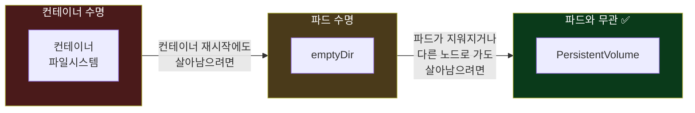
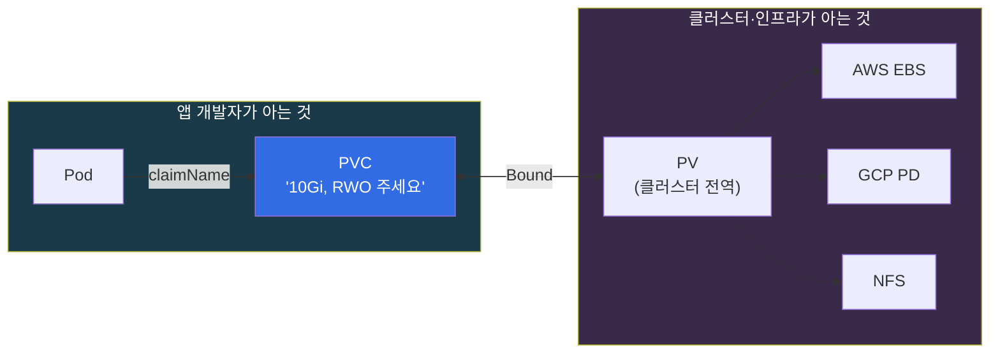
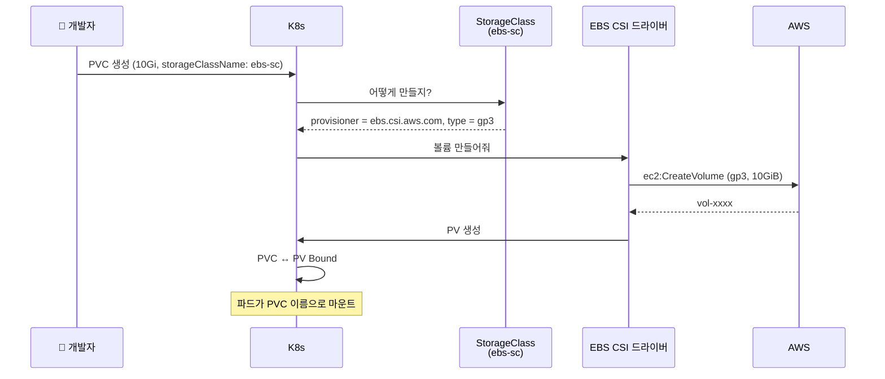
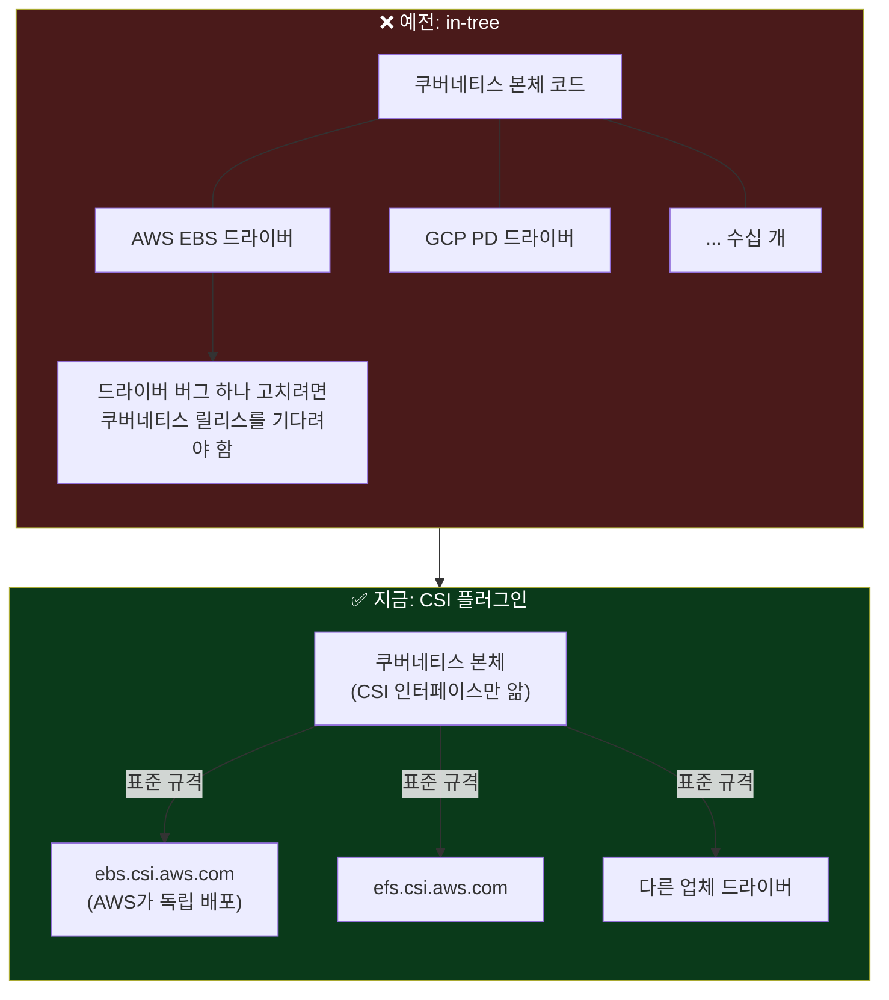
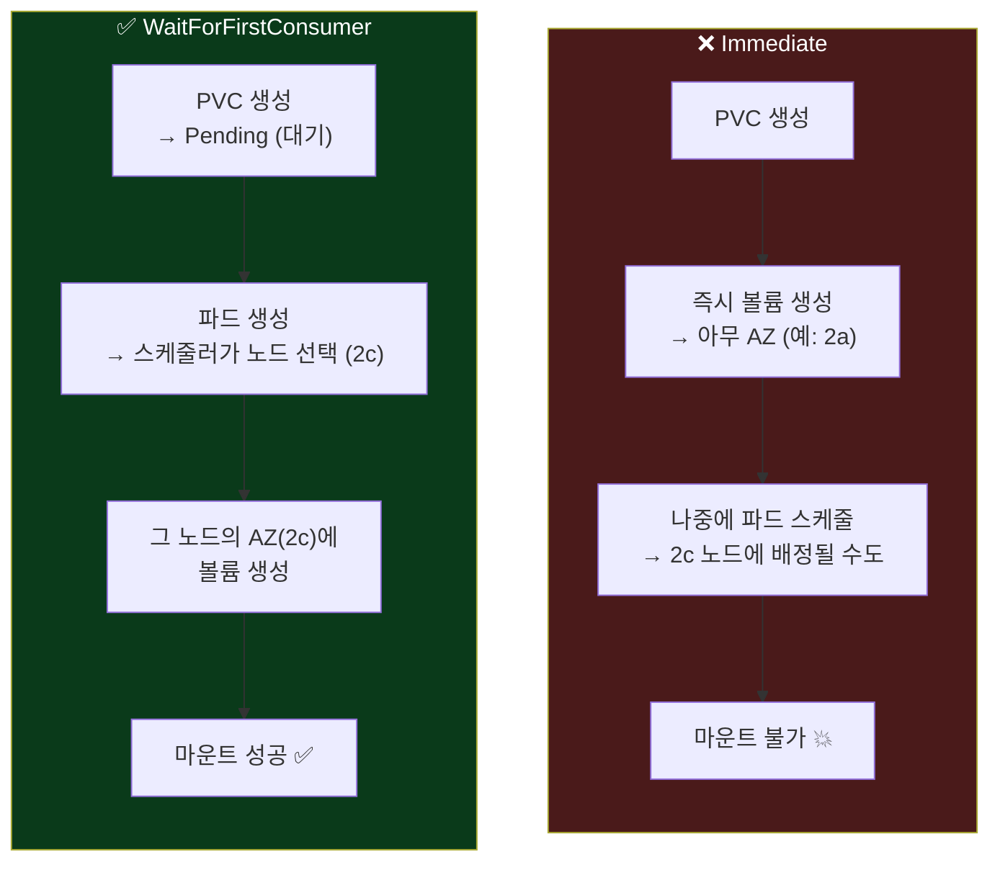

## 📚 들어가며

[5편](/posts/EKS-Rebuild-05-Ingress-ALB-DNS-Lifecycle-and-Cluster-Rebuild/)에서 Ingress 하나로 ALB와 DNS가 생기고 사라지는 걸 확인했다. 이번 편은 **스토리지**다.

파드는 언제든 죽고 다시 뜬다. 그런데 DB나 업로드 파일처럼 **파드가 바뀌어도 남아 있어야 하는 데이터**는 어디에 둬야 할까? 쿠버네티스는 이 문제를 PV, PVC, StorageClass, CSI라는 꽤 여러 겹의 개념으로 푼다. 처음 보면 왜 이렇게 복잡한지 이해가 안 가는데, 하나씩 **"왜 필요한가"** 를 따라가면 각 층이 하는 일이 분명하다.

이번 편의 구성은 이렇다.

- **1장(개념)** — 쿠버네티스 스토리지의 큰 그림. 이것만 읽어도 PV/PVC/StorageClass/CSI가 왜 있는지 잡히도록 썼다. **이미 아는 사람은 2장부터** 읽으면 된다
- **2~3장(실습)** — EBS CSI 드라이버를 EKS 애드온 + Pod Identity로 붙이고, PVC로 볼륨을 만들어 마운트
- **4장(함정)** — EBS 볼륨이 **가용영역(AZ)에 묶여 있어서** 생기는 스케줄링 문제
- **5장(정리)** — destroy 전에 PVC를 먼저 지워야 하는 이유 (5편의 연장)

> **이번 편 학습 지도**
>
> ```
> 개념 (1장)                실습 (2~3장)               함정 (4~5장)
> ──────────                ────────────               ────────────
> 컨테이너 파일은 휘발       EBS CSI = EKS 애드온        EBS는 AZ에 묶임
> Volume · emptyDir         + Pod Identity             WaitForFirstConsumer
> PV / PVC 분리              association 충돌           volume node affinity
> StorageClass · 동적 생성   SA 이름은 애드온이 고정     destroy 전 PVC 삭제
> CSI (in-tree → 플러그인)   PVC → 마운트 → 데이터 유지
> ```

---

## 1. 개념 — 쿠버네티스는 왜 스토리지를 이렇게 복잡하게 다룰까

### 1-1. 출발점: 컨테이너의 파일은 기본적으로 휘발된다

컨테이너 안에서 파일을 쓰면 그건 **컨테이너의 쓰기 가능 레이어**에 저장된다. 이 레이어는 컨테이너가 재시작되거나 파드가 삭제되면 **같이 사라진다.**

실습 파일 `ephemeral-pod.yaml`이 이걸 보여준다. 볼륨 없이 컨테이너 루트(`/pod-out.txt`)에 5초마다 날짜를 쓴다.

```yaml
apiVersion: v1
kind: Pod
metadata:
  name: ephemeral-pod
spec:
  containers:
  - name: date
    image: busybox
    command: ["/bin/sh", "-c", "while true; do date >> /pod-out.txt; sleep 5; done"]
```

이 파드를 지웠다 다시 만들면 파일은 **처음부터 다시** 쌓인다. 웹 서버처럼 상태가 없는 앱은 괜찮지만, DB나 업로드 파일을 저장하는 앱(이미지 서버, MySQL, Kafka 등)은 이러면 안 된다.

### 1-2. Volume과 emptyDir — 그리고 그 한계

**Volume**은 파드 정의에 붙여서 컨테이너의 특정 경로에 마운트하는 저장 공간이다. 종류가 많은데, 가장 단순한 게 **emptyDir**다. 세 가지를 수명 기준으로 비교하면 이렇다.

| | 컨테이너 파일시스템 | emptyDir | PersistentVolume |
|---|:---:|:---:|:---:|
| 컨테이너 재시작 | 사라짐 | **유지** | 유지 |
| 파드 삭제·재스케줄 | 사라짐 | **사라짐** | **유지** |
| 용도 | 임시 파일 | 같은 파드 안 컨테이너끼리 공유, 캐시 | DB, 업로드 파일 등 **영구 데이터** |



emptyDir는 **"파드의 수명"만큼** 산다. 파드가 다른 노드로 옮겨지면 데이터는 없다. 파드의 수명과 **무관하게** 남는 저장소가 필요해서 PV가 있다.

### 1-3. PV와 PVC — "저장소 그 자체"와 "저장소 요청서"의 분리

- **PV (PersistentVolume)** — 클러스터에 존재하는 **실제 저장소 한 덩어리**. EKS에서는 EBS 볼륨 하나가 PV 하나에 대응한다. 네임스페이스에 속하지 않는 **클러스터 전역** 리소스다.
- **PVC (PersistentVolumeClaim)** — 앱이 내는 **요청서**. "10Gi짜리, 한 노드에서 읽기/쓰기 가능한 저장소 주세요." **네임스페이스에 속한다.**
- 쿠버네티스가 PVC에 맞는 PV를 찾아 둘을 **바인딩(Bound)** 한다. 파드는 PV를 직접 쓰지 않고 **PVC 이름으로** 마운트한다.



**왜 둘로 나눴을까?** 앱 개발자는 **"얼마나, 어떤 성격의 저장소가 필요한지"만** 말하고, 그게 실제로 EBS인지 NFS인지는 몰라도 되게 하려는 것이다. 덕분에 같은 앱 매니페스트를 AWS에서도, GCP에서도 쓸 수 있다. 요청(PVC)과 실체(PV)를 떼어놓은 게 이식성의 핵심이다.

### 1-4. StorageClass와 동적 프로비저닝

옛날에는 관리자가 PV를 **미리 손으로** 만들어두고, PVC가 그중 하나를 골라 가져갔다. 이걸 **정적 프로비저닝**이라고 한다. 이러면 관리자가 "10Gi짜리 몇 개, 50Gi짜리 몇 개"를 미리 예측해야 한다.

**StorageClass**는 "이런 종류의 저장소가 필요하면 이렇게 만들어라"라는 **템플릿**이다. PVC가 StorageClass를 지정하면, 맞는 PV가 없어도 **그 자리에서 새로 만들어준다.** 이게 **동적 프로비저닝**이다.



> 실제로는 `WaitForFirstConsumer` 설정 때문에 **"파드가 노드에 배정된 뒤"** 에 이 흐름이 시작된다. 왜 그런지는 4장에서 다룬다.

### 1-5. CSI (Container Storage Interface) — 드라이버를 쿠버네티스 밖으로

StorageClass의 `provisioner`에 적힌 게 **실제로 저장소를 만드는 주체**다. 그 표준 규격이 **CSI**다.



- 예전에는 AWS EBS, GCP PD 같은 저장소 드라이버 코드가 **쿠버네티스 본체 안에 들어 있었다(in-tree).** 저장소 업체가 기능을 고치려면 쿠버네티스 릴리스를 기다려야 했다.
- CSI는 "저장소 드라이버는 이 인터페이스만 맞춰서 **바깥에서 플러그인으로** 붙여라"라는 표준이다. 이제 각 업체가 자기 드라이버를 독립적으로 배포한다.
- EBS용 CSI 드라이버 이름이 **`ebs.csi.aws.com`** 이다.

실제 클러스터에서 확인해보면 그 전환의 흔적이 남아 있다.

```
$ kubectl get sc
NAME               PROVISIONER             RECLAIMPOLICY   VOLUMEBINDINGMODE      ALLOWVOLUMEEXPANSION
ebs-sc (default)   ebs.csi.aws.com         Delete          WaitForFirstConsumer   true
gp2                kubernetes.io/aws-ebs   Delete          WaitForFirstConsumer   false
```

`gp2`의 provisioner `kubernetes.io/aws-ebs`가 **옛날 in-tree 드라이버 이름**이다. 지금은 이 이름으로 요청이 와도 내부적으로 CSI 드라이버로 넘겨서 처리한다(CSI migration). 그래서 **EBS CSI 드라이버가 설치돼 있지 않으면 `gp2` 클래스로도 볼륨이 만들어지지 않는다.** 우리가 만든 `ebs-sc`는 처음부터 CSI 드라이버를 직접 가리킨다.

**CSI 드라이버는 보통 두 부분으로 나뉜다.**

```
$ kubectl get deploy,ds -n kube-system | grep ebs
deployment.apps/ebs-csi-controller   2/2     ← 컨트롤러
daemonset.apps/ebs-csi-node          2       ← 노드 플러그인
```

| | 하는 일 | AWS API 호출? |
|---|---|:---:|
| **컨트롤러** (Deployment) | `ec2:CreateVolume`, `ec2:AttachVolume` 등으로 볼륨 생성·삭제·연결 | ✅ → **AWS 권한 필요** (2장) |
| **노드 플러그인** (DaemonSet) | 노드마다 하나. 이미 붙은 디스크를 노드 OS에서 포맷·마운트 | ❌ |

3편의 "파드가 AWS 자격증명으로 대체 뭘 하는데?"와 5편의 "AWS API를 안 부르면 AWS 자격증명도 필요 없다"가 여기서도 그대로 적용된다. **같은 드라이버 안에서도 AWS API를 부르는 쪽만 권한이 필요하다.**

### 1-6. StorageClass 설정 항목 하나씩

실습한 StorageClass다.

```yaml
apiVersion: storage.k8s.io/v1
kind: StorageClass
metadata:
  name: ebs-sc
  annotations:
    storageclass.kubernetes.io/is-default-class: "true"
allowVolumeExpansion: true
provisioner: ebs.csi.aws.com
volumeBindingMode: WaitForFirstConsumer
parameters:
  type: gp3
```

| 항목 | 의미 |
|---|---|
| `is-default-class: "true"` | PVC가 `storageClassName`을 안 적으면 이 클래스를 쓴다. 기본 클래스는 **하나만** 두는 게 원칙 |
| `provisioner: ebs.csi.aws.com` | EBS CSI 드라이버가 볼륨을 만든다 |
| `parameters.type: gp3` | EBS 볼륨 타입. gp3는 gp2보다 **저렴하고**, 용량과 무관하게 기본 3000 IOPS를 준다(gp2는 용량에 비례). 지금 새로 만든다면 gp3가 정답 |
| `allowVolumeExpansion: true` | PVC의 `storage` 값을 늘리면 볼륨이 **온라인으로 확장**된다 (줄이는 건 안 됨) |
| `volumeBindingMode: WaitForFirstConsumer` | **PVC를 만들어도 바로 볼륨을 만들지 않고, 그 PVC를 쓰는 파드가 스케줄될 때까지 기다린다.** 이유는 4장에서 |
| `reclaimPolicy` (기본 `Delete`) | PVC를 지우면 PV와 **실제 EBS 볼륨까지 삭제**. `Retain`이면 EBS를 남겨둔다 (실수로 지워도 데이터 보존, 대신 수동 정리 필요) |

> **💡 강의와 달라진 점: gp2의 default 해제가 더 이상 필요 없다**
>
> 강의 자료에는 `ebs-sc`를 기본으로 만들면서 기존 `gp2`의 default를 해제하는 명령이 들어 있다.
>
> ```bash
> kubectl patch storageclass gp2 -p '{"metadata":{"annotations":{"storageclass.kubernetes.io/is-default-class":"false"}}}'
> ```
>
> 강의 당시(k8s 1.28)에는 EKS가 `gp2`를 default로 만들어줬기 때문에 필요했다. 그런데 **EKS 1.30부터는 새로 만든 클러스터의 `gp2`에 default 어노테이션을 붙이지 않는다.** 내 클러스터(1.34)의 `gp2`를 확인해보니 실제로 annotations가 비어 있었고, 위 `kubectl get sc` 출력에서도 `(default)`는 `ebs-sc`에만 붙어 있다. 즉 1.30+ 새 클러스터라면 이 명령은 할 일이 없다.
>
> 반대로 말하면, **1.30+ 클러스터는 StorageClass를 직접 만들기 전까지 기본 클래스가 아예 없다.** `storageClassName` 없이 PVC를 만드는 Helm 차트는 설치는 성공하는데 PVC가 영원히 `Pending`에 머문다. 기본 클래스를 꼭 만들어두자.

### 1-7. accessModes — EBS는 왜 RWX가 안 될까

```yaml
accessModes:
- ReadWriteOnce
# - ReadWriteMany
```

| 모드 | 의미 | EBS 지원 |
|---|---|:---:|
| `ReadWriteOnce` (RWO) | **노드 하나**에서만 읽기/쓰기로 마운트 | ✅ |
| `ReadWriteMany` (RWX) | **여러 노드**에서 동시에 읽기/쓰기 | ❌ |

EBS는 **EC2 한 대에 붙이는 블록 디스크**다. 구조적으로 RWO만 된다. 여러 노드에서 같은 파일을 공유해야 하면 **EFS**(NFS 기반, `efs.csi.aws.com`)를 쓴다. 실습 파일에 `ReadWriteMany`가 주석으로 남아 있는 이유가 이것이다.

참고로 RWO는 "**노드** 하나"라는 뜻이지 "파드 하나"가 아니다. 같은 노드 위의 파드 여러 개는 같은 RWO 볼륨을 함께 마운트할 수 있다. 3-3과 4-3에서 실제로 이 동작을 보게 된다.

---

## 2. EBS CSI 드라이버를 EKS 애드온 + Pod Identity로 설치

### 2-1. 강의 방식과 다른 점

강의는 EBS CSI용 IAM 역할을 **IRSA**로 만들고, `aws_eks_addon` 리소스를 따로 선언했다. 이 프로젝트는 3편에서 정한 대로 **Pod Identity**로 가고, 애드온은 2편에서 정리한 대로 EKS 모듈의 `addons` 블록 안에 넣었다.

### 2-2. 최종 코드

**`irsa-role.tf` — IAM 역할만 만든다**

```hcl
module "ebs_csi_pod_identity" {
  source  = "terraform-aws-modules/eks-pod-identity/aws"
  version = "~> 2.9"

  name = "ebs-csi-${local.name}"

  attach_aws_ebs_csi_policy = true   # CreateVolume, AttachVolume 등에 필요한 정책

  # associations는 비워둔다 — 아래 애드온 쪽에서 연결하므로

  tags = local.tags
}
```

**`main.tf` — 애드온에서 association을 연결한다**

```hcl
addons = {
  # ...coredns, kube-proxy, vpc-cni, eks-pod-identity-agent...

  aws-ebs-csi-driver = {
    pod_identity_association = [{
      role_arn        = module.ebs_csi_pod_identity.iam_role_arn
      service_account = "ebs-csi-controller-sa"
    }]
  }

  # VolumeSnapshot(볼륨 스냅샷) 기능에 필요
  snapshot-controller = {}
}
```

### 2-3. 함정 ① — association을 두 군데서 만들면 충돌한다

처음엔 3편의 LB Controller처럼 Pod Identity 모듈의 `associations`도 살려두고, 애드온의 `pod_identity_association`도 넣었다. 그런데 둘 다 **같은 (클러스터, 네임스페이스, 서비스어카운트)** 조합에 association을 만든다. **EKS는 이 조합당 association을 하나만 허용**하기 때문에 apply 시 충돌한다.

모듈 소스를 확인해보니 `associations`의 기본값이 `{}`이고, association 리소스는 `for_each = var.associations`로 만들어진다. 그래서 모듈 쪽 `associations`를 지우면 **역할만** 만들어진다.

**그럼 LB Controller 때(3편)와 왜 다르게 하나?** 설치 방식이 달라서다.

| | LB Controller | EBS CSI |
|---|---|---|
| 설치 방식 | **Helm 차트** | **EKS 애드온** |
| association 위치 | 독립 리소스 (Pod Identity 모듈의 `associations`) | 애드온 리소스 안 (`pod_identity_association`) |
| namespace 지정 | **직접 지정** (EKS는 Helm이 어디 설치할지 모름) | **지정 불가·불필요** (애드온의 네임스페이스를 자동으로 따름) |

애드온의 `pod_identity_association`은 EKS 모듈 소스상 `role_arn`과 `service_account` **두 필드만** 받는다. namespace를 넣으면 스키마에 없는 속성이라 에러가 난다. 애드온은 자기가 설치되는 네임스페이스(`kube-system`)를 이미 알고 있기 때문이다. **애드온과 association의 생명주기가 함께 간다**는 것도 장점이다 — 애드온을 지우면 association도 같이 정리된다.

### 2-4. 함정 ② — `ebs-csi-controller-sa`는 어디서 정해진 이름인가?

Terraform 어디에도 이 서비스어카운트를 만드는 코드는 없다. **애드온이 정해둔 고정 이름**이다.

```bash
# 1) 실제로 존재하고
kubectl get sa -n kube-system | grep ebs
# ebs-csi-controller-sa
# ebs-csi-node-sa

# 2) 만든 주체가 EKS 애드온이다
kubectl get sa ebs-csi-controller-sa -n kube-system -o jsonpath='{.metadata.labels}'
# {"app.kubernetes.io/managed-by":"EKS","app.kubernetes.io/name":"aws-ebs-csi-driver",...}

# 3) 애드온 설정으로 이름을 바꿀 수도 없다
aws eks describe-addon-configuration --addon-name aws-ebs-csi-driver \
  --addon-version v1.66.0-eksbuild.1 --query configurationSchema --output text
# controller.serviceAccount 아래 설정 가능한 키: automountServiceAccountToken 뿐 (name 없음)
```

> **💡 팁: 애드온의 SA 이름은 "정하는" 게 아니라 "맞추는" 것이다**
>
> Terraform의 `service_account = "ebs-csi-controller-sa"`는 이름을 **정의하는 게 아니라, 애드온이 쓰는 이름에 맞춰 적는 것**이다. **오타가 나면 에러 없이 조용히 권한이 안 붙고**, 나중에 PVC를 만들 때 볼륨 생성이 AccessDenied로 실패한다. apply 시점이 아니라 한참 뒤에 엉뚱한 곳에서 터지는, 원인 찾기 어려운 종류의 버그다.
>
> | | SA 이름의 출처 |
> |---|---|
> | LB Controller (Helm) | **내가 정함** (values의 `serviceAccount.name`) → association에 맞춤 |
> | EBS CSI (애드온) | **애드온이 고정** → association을 거기에 맞춤 |
>
> 새 애드온을 붙일 때 이름을 알아내는 가장 확실한 방법은 공식 문서의 Pod Identity 항목을 보거나, 일단 설치하고 `kubectl get sa -n kube-system`으로 직접 확인하는 것이다.

4편 함정 ②(Helm을 `default`에 설치하면 권한을 못 받음)와 같은 계열이다. **Pod Identity는 "이름이 정확히 일치할 때만" 권한을 주는 구조**라, 이름이 어긋나면 에러가 아니라 침묵으로 실패한다.

### 2-5. Terraform 운영 메모

- 새 `module` 블록을 추가했으니 **`terraform init`이 먼저** 필요하다. 안 하면 `validate`에서 `Error: Module not installed`가 난다 (2편에서 정리한 "init이 필요한 경우" 그대로).
- 애드온의 `role_arn`이 모듈 output을 참조하므로, Terraform이 **역할 → 애드온** 순서를 알아서 맞춘다.
- `snapshot-controller`는 `VolumeSnapshot` 같은 스냅샷 CRD를 처리하는 컨트롤러다. **EBS CSI 자체만으로는 스냅샷 기능이 동작하지 않는다.**

---

## 3. 실습 — PVC를 만들고 파드에 마운트하기

### 3-1. PVC

```yaml
apiVersion: v1
kind: PersistentVolumeClaim
metadata:
  name: date-pvc
  namespace: default
spec:
  accessModes:
  - ReadWriteOnce
  resources:
    requests:
      storage: 10Gi
  storageClassName: "ebs-sc"
```

PVC만 만들면 상태가 **`Pending`** 에 머문다.

```
$ kubectl get pvc date-pvc
NAME       STATUS    VOLUME   CAPACITY   ACCESS MODES   STORAGECLASS   AGE
date-pvc   Pending                                      ebs-sc         6s

$ kubectl describe pvc date-pvc
Events:
  Type    Reason                Age   From                         Message
  ----    ------                ----  ----                         -------
  Normal  WaitForFirstConsumer  6s    persistentvolume-controller  waiting for first consumer to be created before binding
```

고장이 아니라 `WaitForFirstConsumer` 때문이다. 이벤트 메시지가 그대로 말해준다 — **"첫 번째 사용자(파드)가 생길 때까지 바인딩을 기다리는 중."** 아직 이 PVC를 쓰는 파드가 없으니 볼륨을 만들지 않는다. 처음 보면 고장으로 오해하기 쉬운 부분이다.

### 3-2. PVC를 쓰는 Deployment

1장의 `ephemeral-pod`와 거의 같은데, 쓰는 위치가 `/data`이고 그 경로에 PVC를 붙였다.

```yaml
spec:
  template:
    spec:
      containers:
      - name: date-pod
        image: busybox
        command: ["/bin/sh", "-c", "while true; do date >> /data/pod-out.txt; sleep 10; done"]
        volumeMounts:
        - name: date-vol
          mountPath: /data          # 컨테이너 안 경로
      volumes:
      - name: date-vol
        persistentVolumeClaim:
          claimName: date-pvc       # PVC 이름으로 연결
```

파드가 노드에 배정되는 순간 이런 순서로 일이 일어난다.

1. EBS CSI 컨트롤러가 **그 노드와 같은 AZ**에 10GiB gp3 EBS 볼륨을 만든다
2. PV가 생기고 PVC와 `Bound`
3. 볼륨이 노드에 attach되고, 노드 플러그인이 포맷·마운트
4. 컨테이너의 `/data`에 붙는다

Deployment를 띄우자 파드가 **2a 노드**에 배정됐고, 몇 초 뒤 PVC가 `Bound`로 바뀌었다.

```
$ kubectl get pod -l app=date -o wide
NAME                           READY   STATUS    NODE
date-deploy-85b68f5694-zg6ld   1/1     Running   ip-10-120-5-12.ap-northeast-2.compute.internal   ← 2a 노드

$ kubectl get pvc,pv
NAME                             STATUS   VOLUME                CAPACITY   ACCESS MODES   STORAGECLASS
persistentvolumeclaim/date-pvc   Bound    pvc-5e6f7a8b-...      10Gi       RWO            ebs-sc

NAME                                   CAPACITY   ACCESS MODES   RECLAIM POLICY   STATUS   CLAIM
persistentvolume/pvc-5e6f7a8b-...      10Gi       RWO            Delete           Bound    default/date-pvc
```

PVC의 이벤트를 보면 1-4의 동적 프로비저닝 흐름이 **순서 그대로** 찍혀 있다.

```
Events:
  Reason                 From                         Message
  ------                 ----                         -------
  WaitForFirstConsumer   persistentvolume-controller  waiting for first consumer to be created before binding
  ExternalProvisioning   persistentvolume-controller  Waiting for a volume to be created either by the external provisioner 'ebs.csi.aws.com' ...
  Provisioning           ebs.csi.aws.com_...          External provisioner is provisioning volume for claim "default/date-pvc"
  ProvisioningSucceeded  ebs.csi.aws.com_...          Successfully provisioned volume pvc-5e6f7a8b-...
```

대기(`WaitForFirstConsumer`) → 외부 프로비저너에게 위임(`ExternalProvisioning`) → CSI 드라이버가 생성(`Provisioning`) → 완료. 그리고 AWS 쪽에서 보면 볼륨이 **파드가 배정된 노드와 같은 2a**에 만들어져 있다. PV의 `spec.csi.volumeHandle`이 실제 EBS 볼륨 ID다.

```bash
$ VOL=$(kubectl get pv <PV이름> -o jsonpath='{.spec.csi.volumeHandle}')
$ aws ec2 describe-volumes --region ap-northeast-2 --volume-ids "$VOL" \
    --query 'Volumes[].[VolumeId,State,AvailabilityZone,VolumeType,Size]' --output text
vol-0fedcba9876543210   in-use   ap-northeast-2a   gp3   10
```

### 3-3. 데이터가 정말 남는지 확인

1장의 `ephemeral-pod`와 비교하면 차이가 드러난다. 파드를 강제로 지우고, Deployment가 새로 만든 파드에서 **이전 파드가 쓴 기록**이 보이는지 확인했다.

```
$ kubectl exec deploy/date-deploy -- tail -3 /data/pod-out.txt     # [삭제 전] 파드 ...-zg6ld
Thu Oct  8 06:48:49 UTC 2026
Thu Oct  8 06:48:59 UTC 2026
Thu Oct  8 06:49:09 UTC 2026

$ kubectl delete pod -l app=date
pod "date-deploy-85b68f5694-zg6ld" deleted

$ kubectl exec deploy/date-deploy -- head -3 /data/pod-out.txt     # [삭제 후] 새 파드 ...-f8kz5
Thu Oct  8 06:48:49 UTC 2026        ← 이전 파드가 쓴 첫 줄이 그대로 있다
Thu Oct  8 06:48:59 UTC 2026
Thu Oct  8 06:49:09 UTC 2026
```

파드 이름은 바뀌었지만(`zg6ld` → `f8kz5`) 파일의 첫 줄은 **이전 파드가 쓴 06:48:49** 그대로다. 같은 PVC(= 같은 EBS 볼륨)를 다시 마운트했으니 데이터가 이어진 것이다. 볼륨을 쓰지 않은 `ephemeral-pod`였다면 첫 줄이 새 파드가 뜬 시각부터 시작했을 것이다.

### 3-4. 덤으로 발견한 것 — 두 파드가 같은 파일에 동시에 썼다

그런데 파일 전체를 열어보니 간격이 이상했다. 10초마다 한 줄씩 써야 하는데 4~6초 간격인 구간이 있었다.

```
$ kubectl exec deploy/date-deploy -- cat /data/pod-out.txt
Thu Oct  8 06:48:49 UTC 2026   ← 이전 파드
Thu Oct  8 06:48:59 UTC 2026   ← 이전 파드
Thu Oct  8 06:49:09 UTC 2026   ← 이전 파드
Thu Oct  8 06:49:13 UTC 2026   ← 새 파드 (06:49:11 시작)
Thu Oct  8 06:49:19 UTC 2026   ← 이전 파드
Thu Oct  8 06:49:23 UTC 2026   ← 새 파드
Thu Oct  8 06:49:29 UTC 2026   ← 이전 파드
Thu Oct  8 06:49:33 UTC 2026   ← 새 파드
Thu Oct  8 06:49:39 UTC 2026   ← 이전 파드 (마지막)
Thu Oct  8 06:49:43 UTC 2026   ← 새 파드
Thu Oct  8 06:49:53 UTC 2026   ← 새 파드 (이후 10초 간격으로 정상화)
```

**약 30초 동안 이전 파드와 새 파드가 같은 파일에 번갈아 쓰고 있었다.** 이유는 두 가지가 겹친 것이다.

1. **이전 파드가 바로 죽지 않았다.** busybox의 `sh`는 SIGTERM을 받아도 루프를 멈추지 않는다. 그래서 `terminationGracePeriodSeconds`(기본 30초)를 꽉 채운 뒤에야 강제 종료됐다.
2. **Deployment는 기다려주지 않는다.** 파드가 `Terminating`에 들어가는 순간 ReplicaSet은 "레플리카가 모자라다"고 보고 **새 파드를 바로** 만든다.

그리고 두 파드가 **같은 노드**에 떴기 때문에 RWO 볼륨을 둘 다 마운트할 수 있었다. 1-7에서 "RWO는 노드 하나이지 파드 하나가 아니다"라고 썼는데, 그게 실제로 이렇게 보인다.

> **💡 DB라면 이건 사고다**
>
> 날짜를 한 줄씩 쓰는 실습이라 문제가 없었지만, MySQL 같은 DB 두 프로세스가 같은 데이터 디렉터리를 동시에 열면 데이터가 깨질 수 있다. 그래서 DB 같은 상태 저장 워크로드는 Deployment가 아니라 **StatefulSet**으로 띄운다. StatefulSet은 같은 이름(identity)의 파드를 **이전 파드가 완전히 종료된 뒤에** 다시 만든다. 볼륨이 "남는다"는 것만큼 **"한 번에 하나만 쓴다"** 도 중요하다.

---

## 4. 🔦 가용영역(AZ)의 함정 — EBS 볼륨은 한 AZ에 묶여 있다

### 4-1. 왜 문제가 되나

**EBS 볼륨은 특정 AZ 안에서만 존재하고, 같은 AZ의 EC2에만 붙일 수 있다.** 그런데 이 클러스터의 노드는 2개 AZ에 흩어져 있다.

```
$ kubectl get nodes -L topology.kubernetes.io/zone
NAME                                              ZONE
ip-10-120-5-12.ap-northeast-2.compute.internal    ap-northeast-2a
ip-10-120-40-25.ap-northeast-2.compute.internal   ap-northeast-2c
```

볼륨이 `2a`에 만들어졌는데 파드가 `2c` 노드에 배정되면, 볼륨을 붙일 방법이 없다. 그래서 동적으로 만들어진 PV에는 **"이 AZ의 노드에서만 쓸 수 있다"는 `nodeAffinity`** 가 자동으로 기록된다.

```
$ kubectl get pv pvc-5e6f7a8b-... -o jsonpath='{.spec.nodeAffinity}'
{"required":{"nodeSelectorTerms":[{"matchExpressions":[
  {"key":"topology.kubernetes.io/zone","operator":"In","values":["ap-northeast-2a"]}
]}]}}
```

`topology.kubernetes.io/zone`이 `ap-northeast-2a`인 노드에서만 쓸 수 있다는 조건이다. 사람이 적은 게 아니라 **CSI 드라이버가 볼륨을 만들면서 자동으로 기록**한 것이다.

### 4-2. `WaitForFirstConsumer`가 이 문제를 푼다



`volumeBindingMode`가 `Immediate`라면 PVC를 만드는 순간 **아무 AZ에나** 볼륨이 생긴다. 그 뒤에 파드가 다른 AZ 노드에 배정되면 영원히 마운트할 수 없다.

`WaitForFirstConsumer`는 순서를 뒤집는다. **파드가 먼저 노드를 정하고, 그 노드의 AZ에 볼륨을 만든다.** 3-1에서 PVC가 `Pending`에 머물렀던 게 바로 이 대기다. 여러 AZ에 노드를 둔 클러스터라면 EBS StorageClass는 사실상 이 모드가 정답이다.

### 4-3. 실습: 파드를 다른 AZ 노드에 강제로 보내면?

`WaitForFirstConsumer`가 지켜주는 건 **처음 볼륨을 만들 때**까지다. 볼륨이 한번 만들어진 뒤에 파드를 **다른 AZ로 강제로 보내면** 어떻게 될까?

`date-pvc-nodeSelector-deploy.yaml`은 같은 PVC를 쓰면서 `nodeSelector`로 **특정 노드를 강제 지정**한다.

```yaml
spec:
  template:
    spec:
      volumes:
      - name: date-vol
        persistentVolumeClaim:
          claimName: date-pvc
      nodeSelector:
        kubernetes.io/hostname: ip-10-120-5-12.ap-northeast-2.compute.internal   # 2a 노드
```

3-2에서 볼륨이 **2a**에 만들어졌으니, 노드를 바꿔가며 두 번 돌려봤다.

| 볼륨 위치 | 파드를 보낸 노드 | 결과 |
|---|---|---|
| 2a | 2a 노드 (원본 파일 그대로) | ✅ 정상적으로 뜬다 |
| 2a | **2c 노드** (hostname만 바꾼 사본) | ❌ `Pending` |

**① 같은 AZ(2a) 노드로 보냈을 때** — 정상적으로 뜬다. 기존 `date-deploy` 파드와 **같은 노드**라서, 3-4처럼 RWO 볼륨을 두 파드가 함께 마운트했다.

```
$ kubectl get pod -l app=date -o wide
NAME                                        READY   STATUS    NODE
date-deploy-85b68f5694-f8kz5                1/1     Running   ip-10-120-5-12.ap-northeast-2.compute.internal
nodeselector-date-deploy-5dd68dc5dc-7npgs   1/1     Running   ip-10-120-5-12.ap-northeast-2.compute.internal
```

**② 다른 AZ(2c) 노드로 보냈을 때** — 파드가 어느 노드에도 배정되지 못하고 `Pending`에 머문다.

```
$ kubectl get pod nodeselector-date-deploy-6b745f65f9-2lslc -o wide
NAME                                        READY   STATUS    NODE
nodeselector-date-deploy-6b745f65f9-2lslc   0/1     Pending   <none>

$ kubectl describe pod nodeselector-date-deploy-6b745f65f9-2lslc
Events:
  Type     Reason            From               Message
  ----     ------            ----               -------
  Warning  FailedScheduling  default-scheduler  0/2 nodes are available:
           1 node(s) didn't match PersistentVolume's node affinity,
           1 node(s) didn't match Pod's node affinity/selector.
           no new claims to deallocate, preemption: 0/2 nodes are available:
           2 Preemption is not helpful for scheduling.
```

메시지를 풀어 읽으면 **노드 2대가 각자 다른 이유로 탈락했다**는 뜻이다.

| 노드 | 탈락 이유 |
|---|---|
| 2a 노드 | 볼륨은 붙일 수 있지만, **파드의 nodeSelector**(2c 노드 지정)와 안 맞음 → `didn't match Pod's node affinity/selector` |
| 2c 노드 | nodeSelector는 맞지만, **PV의 nodeAffinity**(2a만 허용)와 안 맞음 → `didn't match PersistentVolume's node affinity` |

두 조건을 **동시에** 만족하는 노드가 0대라서 스케줄링이 불가능한 것이다. `Preemption is not helpful`은 "다른 파드를 쫓아내도 해결 안 된다"는 뜻이다 — 자원이 모자란 게 아니라 조건이 모순이니까.

> **📝 메시지가 자료마다 다르다**
>
> 많은 자료(그리고 처음 정리한 내 노트)에는 이 상황의 이벤트가 **`volume node affinity conflict`** 로 적혀 있다. 그런데 실제로 돌려본 k8s 1.34에서는 위처럼 **노드별 탈락 사유를 나열하는 형식**으로 찍혔다. 버전에 따라 스케줄러의 메시지가 달라지므로, 검색할 때는 `didn't match PersistentVolume's node affinity`로도 찾아보는 게 좋다.

**실무 시사점**

- 노드가 **스팟으로 교체**되거나 Karpenter가 노드를 정리할 때, **볼륨이 있는 AZ에 노드가 하나도 없으면 그 파드는 뜰 곳이 없다.** 볼륨을 쓰는 워크로드는 그 AZ에 노드가 항상 있도록 설계해야 한다. Karpenter NodePool의 AZ 설정, 노드 그룹의 서브넷 구성 등에서 다시 등장할 문제다.
- `nodeSelector`로 특정 **노드 이름**을 박아두는 건 실습용이다. 노드는 언제든 교체될 수 있어서(3편에서 스팟 노드가 실제로 교체된 걸 봤다) 실제 서비스에선 쓰면 안 된다.
- 여러 AZ에서 접근해야 하는 데이터라면 EBS가 아니라 **EFS**(여러 AZ에서 동시에 마운트 가능)를 검토한다.

---

## 5. 정리할 때 — PVC를 먼저 지워야 하는 이유

5편에서 "컨트롤러가 클러스터 밖에 만든 리소스는 Terraform이 모른다"는 얘기를 했다. **EBS 볼륨이 정확히 그 경우다.** CSI 컨트롤러가 AWS API로 만든 것이라 Terraform state에 없다.

실제로 destroy 직전에 점검해보니 PVC 하나와 그 뒤의 EBS 볼륨이 남아 있었다.

```
NAMESPACE  NAME      STATUS  VOLUME             CAPACITY  STORAGECLASS
default    date-pvc  Bound   pvc-1a2b3c4d-...   10Gi      ebs-sc

vol-0123456789abcdef0    in-use
```

이 상태로 `terraform destroy`를 하면 **볼륨을 지워줄 CSI 컨트롤러가 클러스터와 함께 사라지고**, 노드가 종료되면서 볼륨은 detach만 된 채 `available` 상태의 **고아 볼륨**으로 남아 계속 과금된다. 5편의 ALB와 똑같은 구조다.

`reclaimPolicy: Delete`를 이용해 **클러스터가 살아있을 때** PVC를 지우면 CSI가 EBS까지 지워준다.

```bash
# 0) 지우기 전에 PV가 가리키는 실제 EBS 볼륨 ID를 적어둔다
VOL=$(kubectl get pv $(kubectl get pvc date-pvc -o jsonpath='{.spec.volumeName}') \
      -o jsonpath='{.spec.csi.volumeHandle}')

# 1) 워크로드 → PVC 순서 (파드가 쓰고 있으면 PVC가 Terminating에서 멈춘다)
kubectl delete -f pvc/date-pvc-deploy.yaml
kubectl wait --for=delete pod -l app=date --timeout=120s
kubectl delete -f pvc/date-pvc.yaml

# 2) AWS에서 그 볼륨이 정말 사라질 때까지 대기 (비동기라 조금 걸림)
aws ec2 wait volume-deleted --region ap-northeast-2 --volume-ids "$VOL" && echo "$VOL 삭제 완료"

# 3) 그다음 terraform destroy
```

실습을 마치고 이 순서로 정리했더니 이렇게 끝났다.

```
deployment.apps "nodeselector-date-deploy" deleted
deployment.apps "date-deploy" deleted
pod/date-deploy-85b68f5694-f8kz5 condition met
persistentvolumeclaim "date-pvc" deleted
vol-0fedcba9876543210 삭제 완료
```

> **💡 태그 필터보다 볼륨 ID로 기다리자**
>
> `aws ec2 describe-volumes --filters "Name=tag-key,Values=kubernetes.io/created-for/pvc/name"`로 "아무것도 안 나오면 완료"를 판단할 수도 있다. 그런데 이 필터는 **CSI가 만든 볼륨 전부**를 보여주기 때문에, 이전 실습에서 남은 볼륨이 하나라도 있으면 영원히 "완료"가 안 된다. 지울 볼륨의 ID를 먼저 적어두고 `aws ec2 wait volume-deleted`로 **그 볼륨만** 기다리는 게 정확하다. 반대로 정리가 끝난 뒤 태그 필터를 한 번 돌려보는 건, **놓친 고아 볼륨이 없는지** 점검하는 용도로 좋다.

**PVC가 `Terminating`에서 안 넘어간다면** 그 PVC를 쓰는 파드가 아직 있는 경우가 대부분이다. PVC에는 `kubernetes.io/pvc-protection` finalizer가 붙어 있어서, 사용 중인 파드가 있으면 삭제를 미룬다. **5편의 Ingress finalizer와 같은 원리**다 — "지우기 전에 정리할 게 있으니 기다려."

5편의 destroy 전 체크리스트에 `kubectl get pvc -A`를 넣어둔 이유가 이것이다.

---

## 📝 이번 편 요약

```
개념
├─ 컨테이너 파일시스템 · emptyDir → 파드와 함께 사라짐
├─ PV = 실제 저장소 (클러스터 전역) / PVC = 요청서 (네임스페이스)
│    └─ 앱은 PVC만 안다 → 저장소 종류와 무관한 이식성
├─ StorageClass + CSI 프로비저너 = 동적 프로비저닝 (PVC 만들면 볼륨 자동 생성)
├─ CSI = 드라이버를 쿠버네티스 밖 플러그인으로 (in-tree 탈출)
│    └─ 컨트롤러만 AWS API 호출 → 컨트롤러만 AWS 권한 필요
└─ EKS 1.30+ 새 클러스터는 gp2가 default 아님 → 기본 클래스를 직접 만들어야 함

EBS CSI 설치 (애드온 + Pod Identity)
├─ association은 애드온 안에서만 (모듈 쪽 associations 비우기, 중복 시 충돌)
└─ ebs-csi-controller-sa = 애드온이 고정한 이름. 틀리면 조용히 실패

AZ 함정 🔦
├─ EBS는 한 AZ에 묶임 → PV에 nodeAffinity 자동 기록
├─ WaitForFirstConsumer: 파드가 노드를 먼저 정하고 그 AZ에 볼륨 생성
├─ 다른 AZ로 강제 배치 → FailedScheduling
│    "didn't match PersistentVolume's node affinity" (자료에 따라 volume node affinity conflict)
└─ RWO는 노드 단위 → 같은 노드의 두 파드가 동시에 쓸 수 있음 (DB는 StatefulSet)

정리
└─ EBS도 Terraform이 모름 → destroy 전에 워크로드 → PVC 순서로 삭제
```

| 개념 | 한 줄 정의 |
|---|---|
| **emptyDir** | 파드 수명만큼 사는 볼륨. 컨테이너 재시작엔 살아남고 파드 삭제엔 사라짐 |
| **PV** | 클러스터에 존재하는 실제 저장소 한 덩어리 (EKS에선 EBS 볼륨 하나) |
| **PVC** | 앱이 내는 저장소 요청서. 파드는 PVC 이름으로 마운트 |
| **StorageClass** | 저장소를 어떻게 만들지 정한 템플릿. 동적 프로비저닝의 기준 |
| **CSI** | 저장소 드라이버를 쿠버네티스 밖에서 붙이는 표준 인터페이스 |
| **`WaitForFirstConsumer`** | 파드가 노드에 배정될 때까지 볼륨 생성을 미루는 모드 |
| **`reclaimPolicy`** | PVC 삭제 시 실제 볼륨까지 지울지(`Delete`) 남길지(`Retain`) |
| **RWO / RWX** | 한 노드에서만 / 여러 노드에서 동시에 읽기·쓰기. EBS는 RWO만 |
| **PV nodeAffinity** | CSI가 볼륨을 만들며 자동 기록하는 "이 AZ의 노드에서만 사용 가능" 조건 |
| **`didn't match PersistentVolume's node affinity`** | 파드가 원하는 노드와 볼륨이 붙을 수 있는 노드가 안 겹칠 때의 스케줄링 실패 메시지 (k8s 1.34 기준) |

---

## 💭 느낀 점

**1. 복잡해 보이던 층들이 전부 "누가 무엇을 몰라도 되게 하려는가"였다.**

PV와 PVC를 왜 나눴는지, StorageClass는 왜 있는지, CSI는 왜 바깥으로 빠졌는지. 하나씩 따라가 보니 전부 같은 방향이었다. **앱 개발자는 저장소 종류를 몰라도 되고, 관리자는 수요를 미리 예측하지 않아도 되고, 저장소 업체는 쿠버네티스 릴리스를 기다리지 않아도 되게.** 층이 많은 이유가 "각자가 자기 관심사만 알면 되도록 경계를 그은 것"이라는 게 보이니까 복잡함이 납득이 됐다.

**2. `Pending`이 고장이 아닐 때도 있다.**

PVC를 만들자마자 `Pending`이 떠서 처음엔 뭔가 잘못된 줄 알았다. 그게 `WaitForFirstConsumer`의 의도된 대기였고, 그 대기가 바로 AZ 문제를 막는 장치였다. **상태 값 하나에도 설계 의도가 들어 있다**는 걸, 4편의 IMDS hop limit에 이어 또 한 번 느꼈다.

**3. 같은 Pod Identity인데 연결하는 자리가 다르다.**

LB Controller(3편)와 EBS CSI는 둘 다 Pod Identity인데, association을 거는 위치도, namespace를 적는지도, SA 이름을 누가 정하는지도 달랐다. 처음엔 "왜 일관성이 없지?" 싶었는데, **설치 주체가 Helm이냐 EKS 애드온이냐**로 갈린다는 걸 알고 나니 오히려 일관됐다. EKS가 설치 위치를 아는 쪽은 EKS에 맡기고, 모르는 쪽은 내가 알려주는 것이다.

**4. 강의 자료의 명령어도 시간이 지나면 할 일이 없어진다.**

`gp2` default 해제 명령이 그랬다. 실행하면 에러는 안 나지만 **바꿀 게 없는** 명령이었다. 1·2편에서 "강의 자료의 시점을 의심하라"고 썼는데, 이번엔 **명령이 틀린 게 아니라 쓸모가 없어진** 경우였다. 확인해보지 않았으면 그냥 의식처럼 계속 쳤을 것 같다.

**5. "Terraform이 모르는 것" 목록이 하나 늘었다.**

5편의 ALB·DNS 레코드에 이어 EBS 볼륨이다. 컨트롤러가 붙을 때마다 **"이 컨트롤러는 클러스터 밖에 뭘 만드나?"** 를 먼저 묻는 습관이 생겼다. 다음 편 Karpenter는 EC2 인스턴스 자체를 만드는 컨트롤러라, 이 질문이 더 중요해질 것 같다.

**6. 직접 돌려봐야 보이는 것들이 있었다.**

처음 정리할 땐 3-3·4-3을 "확인 방법"으로만 적어뒀다. 실제로 돌려보니 두 가지가 문서와 달랐다. 스케줄러 메시지는 `volume node affinity conflict`가 아니었고, 파드를 지웠더니 **두 파드가 30초 동안 같은 파일에 동시에 쓰는** 장면이 찍혔다. 후자는 "RWO는 노드 단위"라는 문장을 읽었을 때는 그냥 넘어갔던 내용인데, 로그로 보니까 **DB였다면 사고**라는 게 바로 와닿았다. 개념 정리와 실행 결과 사이에는 생각보다 틈이 있다.

---

## 🔗 다음 편 예고

- **VolumeSnapshot**으로 EBS 스냅샷을 만들고, 그걸로 새 PVC를 복원하기 (이번에 설치한 `snapshot-controller`를 실제로 쓰는 단계)
- **Karpenter** — 4장에서 본 "볼륨이 있는 AZ에 노드가 있어야 한다"는 제약이 노드 오토스케일링과 어떻게 얽히는지

---

## 📚 참고

- [Kubernetes — Persistent Volumes](https://kubernetes.io/docs/concepts/storage/persistent-volumes/)
- [Kubernetes — Storage Classes (Volume Binding Mode)](https://kubernetes.io/docs/concepts/storage/storage-classes/#volume-binding-mode)
- [Amazon EBS CSI 드라이버 (EKS 사용 설명서)](https://docs.aws.amazon.com/eks/latest/userguide/ebs-csi.html)
- [EKS 버전별 릴리스 노트](https://docs.aws.amazon.com/eks/latest/userguide/kubernetes-versions-extended.html) — 1.30부터 gp2 default 어노테이션 미적용

> 이 글의 노드 호스트명·볼륨 ID·PV 이름은 예시 값으로 치환했다. 3·4·5장의 실행 결과는 2026년 10월 8일 EKS 1.34 클러스터에서 캡처했고(파드 IP 등 일부 컬럼은 생략), 애드온 버전(`v1.66.0-eksbuild.1`)과 StorageClass 목록도 같은 시점 기준이다.
